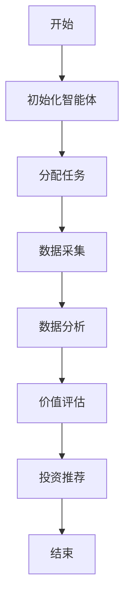
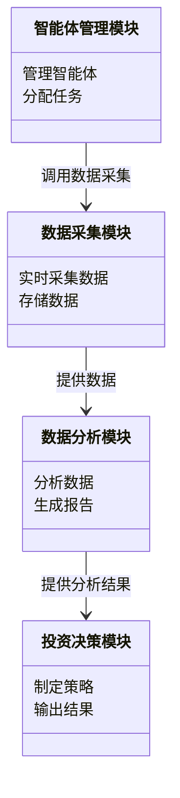
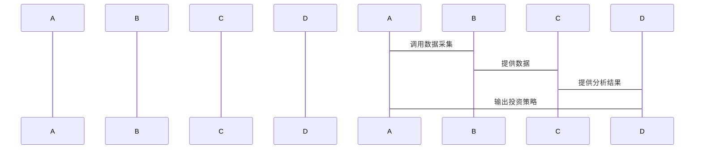

                 


```markdown
# 多智能体系统在跨境价值比较中的应用：发现全球投资机会

> 关键词：多智能体系统、跨境价值比较、全球投资机会、分布式计算、智能体协同

> 摘要：本文探讨多智能体系统在跨境价值比较中的应用，通过分析多智能体系统的原理、算法和架构设计，结合实际案例，揭示如何利用多智能体系统在全球范围内发现投资机会。文章详细介绍了多智能体系统的背景、核心概念、算法实现、系统架构以及项目实战，为读者提供全面的视角和深入的见解。

---

# 第1章 多智能体系统与跨境投资概述

## 1.1 多智能体系统的定义与特点
### 1.1.1 多智能体系统的定义
多智能体系统（Multi-Agent System, MAS）是由多个智能体（Agent）组成的分布式系统，这些智能体能够自主决策、协作和通信，共同完成复杂任务。

### 1.1.2 多智能体系统的核心特点
- **自主性**：每个智能体都能独立决策。
- **反应性**：能够感知环境并实时响应。
- **分布式**：智能体之间通过通信协同工作。
- **协作性**：多个智能体通过协作实现共同目标。

### 1.1.3 多智能体系统与传统单智能体系统的区别
- **单智能体系统**：单个智能体完成任务，依赖中央控制。
- **多智能体系统**：多个智能体协作，任务分解更细，系统更灵活。

## 1.2 跨境价值比较的重要性
### 1.2.1 跨境投资的背景与现状
- 全球化背景下，投资者寻求多元化资产配置。
- 不同国家的经济、政策差异为投资带来机会。

### 1.2.2 跨境价值比较的定义与意义
- **定义**：对不同国家或地区的资产进行价值评估和比较。
- **意义**：帮助投资者发现高收益、低风险的投资机会。

### 1.2.3 跨境投资中的挑战与机遇
- **挑战**：汇率波动、政策风险、市场信息不对称。
- **机遇**：利用多智能体系统提高分析效率和准确性。

## 1.3 多智能体系统在跨境投资中的应用前景
### 1.3.1 多智能体系统在金融领域的潜力
- 提高数据处理和分析效率。
- 实现跨市场的实时监控和协同决策。

### 1.3.2 跨境投资中多智能体系统的具体应用场景
- **市场分析**：实时分析多个市场的数据，发现投资机会。
- **风险评估**：通过多智能体协同，评估不同市场的风险因素。
- **投资决策**：基于多智能体的分析结果，制定投资策略。

### 1.3.3 多智能体系统在跨境投资中的优势
- **高效性**：分布式计算提高处理速度。
- **准确性**：多智能体协同分析，降低信息不对称。
- **灵活性**：适应不同市场环境的变化。

## 1.4 本章小结
本章介绍了多智能体系统的定义、特点及其在跨境投资中的重要性，探讨了其在跨境价值比较中的应用前景和优势。

---

# 第2章 多智能体系统的核心概念与联系

## 2.1 多智能体系统的原理
### 2.1.1 多智能体系统的组成结构
- **智能体**：具有自主性、反应性、目标导向的实体。
- **环境**：智能体所处的外部世界，包括物理环境和信息环境。

### 2.1.2 多智能体系统的通信机制
- **通信协议**：智能体之间通过消息传递进行通信。
- **通信模型**：基于角色的通信模型，明确通信规则。

### 2.1.3 多智能体系统的协同算法
- **分布式计算**：任务分解到多个智能体，协同完成。
- **协商与协调**：智能体通过协商分配任务和资源。

## 2.2 跨境价值比较的核心要素
### 2.2.1 跨境投资的核心要素分析
- **市场数据**：包括股票价格、汇率、经济指标等。
- **风险因素**：政策风险、市场风险、流动性风险等。

### 2.2.2 多智能体系统在价值比较中的角色
- **数据采集智能体**：负责收集多市场数据。
- **分析智能体**：对数据进行分析和评估。
- **决策智能体**：根据分析结果制定投资策略。

### 2.2.3 跨境价值比较的数学模型与公式
- **加权平均模型**：$$V = \sum_{i=1}^{n} w_i x_i$$
  其中，$w_i$ 是权重，$x_i$ 是各市场的数据。

## 2.3 多智能体系统与跨境价值比较的ER实体关系图
```mermaid
er
  %%{init: { 'skinparam': { 
    'arrow': 'true', 
    'textJustify': 'left' 
  }, 
  'title': '多智能体系统与跨境价值比较的ER实体关系图'
}
%%

agent {
  name: 智能体
  id: 智能体ID
  role: 角色
}

market {
  name: 市场
  id: 市场ID
  country: 国家
}

investment {
  id: 投资ID
  value: 投资价值
  risk: 风险评估
}

agent -[1,n]-> market: 监控市场
agent -[1,n]-> investment: 制定投资策略
market -[1,n]-> investment: 影响投资价值
```

## 2.4 本章小结
本章详细介绍了多智能体系统的原理及其在跨境价值比较中的核心概念和联系，分析了各智能体的角色和关系。

---

# 第3章 多智能体系统的算法原理

## 3.1 多智能体系统的算法概述
### 3.1.1 分布式计算算法
- **任务分解**：将复杂任务分解为多个子任务，分配给不同的智能体。
- **分布式计算**：通过通信机制协同完成任务。

### 3.1.2 协调与协商算法
- **协商机制**：智能体之间通过协商分配任务和资源。
- **冲突解决**：通过协商解决资源分配冲突。

### 3.1.3 联合推理与决策算法
- **联合推理**：智能体协同推理，共同得出结论。
- **集体决策**：基于智能体的决策结果，制定最终策略。

## 3.2 跨境价值比较中的算法实现
### 3.2.1 跨境数据采集与预处理算法
- **数据源选择**：选择可靠的市场数据源。
- **数据清洗**：去除无效数据，处理异常值。

### 3.2.2 跨境价值评估算法
- **数据分析**：使用统计方法分析市场数据。
- **价值评估**：基于分析结果评估投资价值。

### 3.2.3 跨境投资机会推荐算法
- **推荐策略**：根据评估结果推荐投资机会。
- **动态调整**：实时更新推荐结果，适应市场变化。

## 3.3 算法实现的数学模型
### 3.3.1 分布式计算的数学模型
$$T = T_1 \cup T_2 \cup \dots \cup T_n$$
其中，$T_i$ 是分配给智能体$i$的任务。

### 3.3.2 协商算法的数学模型
$$C = \arg \max_i \sum_{j=1}^{n} w_j x_j$$
其中，$w_j$ 是权重，$x_j$ 是各市场的数据。

## 3.4 算法流程图


## 3.5 本章小结
本章介绍了多智能体系统的算法原理及其在跨境价值比较中的实现，详细讲解了算法的数学模型和流程图。

---

# 第4章 系统架构设计与实现

## 4.1 系统架构设计
### 4.1.1 系统功能设计
- **数据采集模块**：实时采集多市场数据。
- **数据分析模块**：对数据进行分析和评估。
- **投资决策模块**：基于分析结果制定投资策略。

### 4.1.2 系统架构图


### 4.1.3 系统接口设计
- **智能体接口**：定义智能体之间的通信接口。
- **数据接口**：定义数据采集和存储的接口。

### 4.1.4 系统交互流程图


## 4.2 系统实现
### 4.2.1 环境安装
- **编程语言**：Python 3.8+
- **库依赖**：numpy、pandas、matplotlib
- **框架**：Flask或Django用于Web接口

### 4.2.2 核心代码实现
```python
# 智能体管理模块
class AgentManager:
    def __init__(self):
        self.agents = []
    
    def add_agent(self, agent):
        self.agents.append(agent)
    
    def assign_task(self, task):
        for agent in self.agents:
            agent.receive_task(task)

# 数据采集模块
class DataCollector:
    def collect_data(self):
        # 实际实现中从数据库或API获取数据
        pass

# 数据分析模块
class DataAnalyzer:
    def analyze(self, data):
        # 数据分析逻辑
        pass

# 投资决策模块
class InvestmentDecider:
    def decide(self, analysis_result):
        # 投资决策逻辑
        pass
```

## 4.3 本章小结
本章详细介绍了系统的架构设计与实现，包括功能设计、架构图、接口设计和交互流程图，展示了多智能体系统在跨境价值比较中的实际应用。

---

# 第5章 项目实战与案例分析

## 5.1 项目背景
- **项目目标**：利用多智能体系统分析多个市场的投资价值。
- **数据来源**：包括股票市场、外汇市场等。

## 5.2 项目实现
### 5.2.1 数据采集
- 从Yahoo Finance获取股票数据。
- 从央行网站获取外汇数据。

### 5.2.2 数据分析
- 使用机器学习模型预测市场趋势。
- 通过多智能体协同分析，评估投资价值。

### 5.2.3 投资决策
- 根据分析结果，制定投资策略。
- 实时监控市场变化，动态调整投资组合。

## 5.3 案例分析
### 5.3.1 案例背景
- 分析两个市场的投资价值。
- 比较不同投资策略的效果。

### 5.3.2 分析过程
- 数据采集：获取市场数据。
- 数据分析：评估投资价值。
- 投资决策：制定投资策略。

### 5.3.3 结果展示
- 投资价值比较图表。
- 投资策略推荐结果。

## 5.4 本章小结
本章通过实际项目展示了多智能体系统在跨境价值比较中的应用，详细讲解了项目的实现过程和案例分析。

---

# 第6章 总结与展望

## 6.1 本章总结
- 多智能体系统在跨境价值比较中的优势。
- 本文的主要内容和结论。

## 6.2 未来展望
- 多智能体系统在金融领域的进一步应用。
- 技术的改进与优化方向。

## 6.3 最佳实践 Tips
- 选择合适的智能体协同算法。
- 确保系统的安全性和稳定性。
- 定期更新系统和模型，适应市场变化。

## 6.4 本章小结
总结全文，展望未来发展方向，并给出实际应用中的注意事项和建议。

---

# 作者：AI天才研究院/AI Genius Institute & 禅与计算机程序设计艺术 /Zen And The Art of Computer Programming
```

