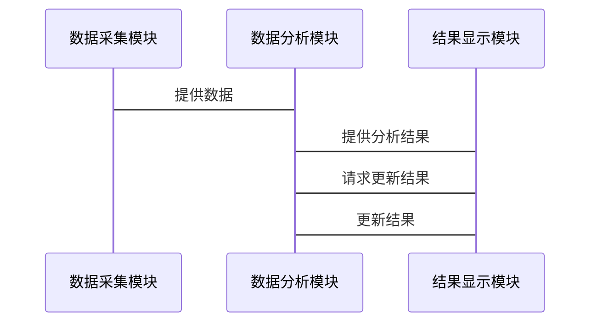

                 


# 多智能体系统在跨市场相关性分析中的应用

> 关键词：多智能体系统、跨市场相关性分析、协同过滤、聚类分析、时间序列分析

> 摘要：本文探讨了多智能体系统在跨市场相关性分析中的应用，通过详细分析多智能体系统的原理和跨市场相关性分析的方法，结合具体算法和案例，展示了如何利用多智能体系统来提升跨市场相关性分析的效率和准确性。文章从背景介绍、核心概念、算法原理、系统设计到项目实战，全面阐述了多智能体系统在跨市场相关性分析中的应用，为相关领域的研究和实践提供了理论支持和实践指导。

---

# 第一部分: 多智能体系统与跨市场相关性分析基础

## 第1章: 多智能体系统概述

### 1.1 多智能体系统的基本概念

#### 1.1.1 多智能体系统的定义
多智能体系统（Multi-Agent System, MAS）是由多个智能体组成的分布式系统，这些智能体能够通过协同工作完成复杂任务。每个智能体都具有一定的自主性、反应性和社会能力。

#### 1.1.2 多智能体系统的特点
- **自主性**：每个智能体都能独立决策。
- **反应性**：智能体能够感知环境并做出实时响应。
- **协作性**：智能体之间可以通过通信和协作完成共同目标。
- **分布式性**：智能体分布在不同的空间或计算节点上。

#### 1.1.3 多智能体系统与传统单智能体系统的对比
| 对比维度 | 多智能体系统 | 单智能体系统 |
|----------|--------------|--------------|
| 系统结构 | 分布式、协作 | 集中式、单一 |
| 可扩展性 | 高 | 低 |
| 故障容错 | 高 | 低 |

### 1.2 跨市場相關性分析的基本概念

#### 1.2.1 跨市場相關性分析的定义
跨市场相关性分析是指研究不同市场之间资产价格波动的相关性，以帮助投资者理解市场之间的相互影响和风险传导机制。

#### 1.2.2 跨市場相關性分析的意义
- **风险分散**：通过识别相关性较低的资产，投资者可以构建更稳健的投资组合。
- **市场预测**：相关性分析有助于预测不同市场的联动效应。
- **策略优化**：根据市场相关性调整投资策略。

#### 1.2.3 跨市場相關性分析的方法
- **统计方法**：如协方差、相关系数等。
- **机器学习方法**：如协同过滤、聚类分析等。

### 1.3 多智能体系统在跨市場相關性分析中的应用前景

#### 1.3.1 多智能体系统的优势
- **分布式计算能力**：能够处理海量数据。
- **实时性**：智能体可以实时感知市场变化并做出反应。
- **协作能力**：多个智能体可以协同完成复杂的分析任务。

#### 1.3.2 跨市場相關性分析的挑战
- **数据复杂性**：跨市场数据来源多样，处理难度大。
- **实时性要求高**：需要快速响应市场变化。
- **模型选择**：如何选择合适的算法和模型是关键。

#### 1.3.3 多智能体系统在跨市場相關性分析中的潜力
多智能体系统能够通过分布式计算和协作能力，显著提高跨市场相关性分析的效率和准确性。例如，多个智能体可以分别负责不同市场的数据收集和分析，然后通过协作得出整体相关性分析结果。

---

## 第2章: 多智能体系统的核心概念与联系

### 2.1 多智能体系统的原理

#### 2.1.1 多智能体系统的组成
- **智能体**：具有自主性、反应性和协作能力的个体。
- **通信机制**：智能体之间通过消息传递进行通信。
- **协调机制**：通过协商和协作完成任务。

#### 2.1.2 多智能体系统的通信机制
智能体之间的通信可以通过多种方式实现，如基于消息的通信或基于共享数据库的通信。消息传递机制通常更灵活，适合分布式环境。

#### 2.1.3 多智能体系统的协调与协作
协调机制包括任务分配、冲突解决和协作规划。通过这些机制，智能体可以协同工作，完成复杂任务。

### 2.2 跨市場相關性分析的核心概念

#### 2.2.1 跨市場相關性分析的数学模型
跨市场相关性分析通常使用协方差矩阵来表示不同资产之间的相关性。协方差矩阵可以帮助我们理解资产之间的波动关系。

#### 2.2.2 跨市場相關性分析的算法选择
选择合适的算法是关键。常见的算法包括协同过滤、聚类分析和时间序列分析。

#### 2.2.3 跨市場相關性分析的指标体系
- **相关系数**：衡量两个变量之间的线性关系。
- **协方差**：衡量两个变量的变化方向。
- **波动率**：衡量资产价格的波动程度。

### 2.3 多智能体系统与跨市場相關性分析的联系

#### 2.3.1 多智能体系统如何支持跨市場相關性分析
通过分布式计算和协作能力，多智能体系统可以高效地处理海量数据，提供实时的分析结果。

#### 2.3.2 跨市場相關性分析如何推动多智能体系统的优化
跨市场相关性分析需要处理复杂的数据关系，这促使多智能体系统在通信和协作机制上不断优化。

#### 2.3.3 多智能体系统与跨市場相關性分析的协同效应
通过协同效应，多智能体系统可以显著提高跨市场相关性分析的效率和准确性，同时也能通过相关性分析结果优化多智能体系统的决策过程。

---

## 第3章: 跨市場相關性分析的算法原理

### 3.1 协同过滤算法

#### 3.1.1 协同过滤的基本原理
协同过滤是一种基于用户相似性或物品相似性的推荐算法。在跨市场相关性分析中，可以用于识别相关资产。

#### 3.1.2 基于用户的协同过滤
基于用户相似性的推荐算法。例如，如果用户A和用户B的交易行为相似，则可以推荐给用户B与用户A相关的资产。

#### 3.1.3 基于物品的协同过滤
基于物品相似性的推荐算法。例如，如果资产A和资产B在某些市场中表现相似，则可以将资产A的相关性推荐给资产B的投资者。

### 3.2 聚类分析算法

#### 3.2.1 聚类分析的基本原理
聚类分析是将数据点分成若干组的过程，每组内的数据点具有较高的相似性。

#### 3.2.2 K-means算法
K-means算法是一种常用的聚类算法，通过迭代优化将数据点分成K个簇。

#### 3.2.3 层次聚类算法
层次聚类算法通过构建树状结构将数据点逐步聚类。

### 3.3 时间序列分析算法

#### 3.3.1 时间序列分析的基本原理
时间序列分析是研究数据随时间变化的模式和趋势。

#### 3.3.2 ARIMA模型
ARIMA模型是一种广泛用于时间序列预测的模型，适用于具有趋势和季节性的数据。

#### 3.3.3 LSTM网络
LSTM（长短期记忆网络）是一种深度学习模型，适用于处理时间序列数据中的长距离依赖关系。

---

## 第4章: 跨市場相關性分析的数学模型与公式

### 4.1 协同过滤的数学模型

#### 4.1.1 基于用户的协同过滤公式
$$sim(i,j) = \frac{\sum_{k \in N(i) \cap N(j)} (r_{ik} - \bar{r}_i)(r_{jk} - \bar{r}_j)}{\sqrt{\sum_{k \in N(i) \cap N(j)} (r_{ik} - \bar{r}_i)^2} \sqrt{\sum_{k \in N(i) \cap N(j)} (r_{jk} - \bar{r}_j)^2}}$$

其中，$sim(i,j)$ 表示用户 $i$ 和 $j$ 之间的相似性，$N(i)$ 表示用户 $i$ 的邻居集合，$\bar{r}_i$ 表示用户 $i$ 的平均评分。

#### 4.1.2 基于物品的协同过滤公式
$$sim(i,j) = \frac{\sum_{u \in N(i) \cap N(j)} (r_{ui} - \bar{r}_i)(r_{uj} - \bar{r}_j)}{\sqrt{\sum_{u \in N(i) \cap N(j)} (r_{ui} - \bar{r}_i)^2} \sqrt{\sum_{u \in N(i) \cap N(j)} (r_{uj} - \bar{r}_j)^2}}$$

---

## 第5章: 系统分析与架构设计

### 5.1 问题场景介绍
跨市场相关性分析需要处理来自多个市场的海量数据，实时性要求高，且需要复杂的算法支持。

### 5.2 系统功能设计
- **数据采集模块**：从不同市场获取实时数据。
- **数据分析模块**：使用协同过滤、聚类分析和时间序列分析等算法进行相关性分析。
- **结果显示模块**：以可视化方式展示分析结果。

### 5.3 系统架构设计
使用分层架构，包括数据采集层、数据处理层和结果展示层。

### 5.4 系统接口设计
- **数据接口**：与数据源对接，获取实时数据。
- **算法接口**：调用协同过滤、聚类分析等算法。
- **结果显示接口**：将分析结果展示给用户。

### 5.5 系统交互设计
使用Mermaid序列图展示系统交互过程：



---

## 第6章: 项目实战

### 6.1 环境安装
安装必要的库，如Python的scikit-learn、pandas和numpy。

### 6.2 核心代码实现

#### 6.2.1 协同过滤算法实现
```python
from sklearn.metrics.pairwise import cosine_similarity

# 示例数据
users = ['A', 'B', 'C']
items = ['X', 'Y', 'Z']
rating_matrix = {
    'A': {'X': 5, 'Y': 4, 'Z': 3},
    'B': {'X': 4, 'Y': 5, 'Z': 2},
    'C': {'X': 3, 'Y': 2, 'Z': 5}
}

# 计算相似性矩阵
def calculate_similarity(rating_matrix):
    item_features = {}
    for user in rating_matrix:
        for item in rating_matrix[user]:
            if item not in item_features:
                item_features[item] = []
            item_features[item].append(rating_matrix[user][item])
    
    # 转换为二维数组
    item_list = list(item_features.keys())
    data = []
    for item in item_list:
        data.append(item_features[item])
    
    # 计算余弦相似性
    similarity_matrix = cosine_similarity(data)
    return similarity_matrix

similarity_matrix = calculate_similarity(rating_matrix)
print(similarity_matrix)
```

#### 6.2.2 聚类分析实现
```python
from sklearn.cluster import KMeans

# 示例数据
import numpy as np
X = np.array([[1, 2], [3, 4], [5, 6], [7, 8], [9, 10]])

# 使用K-means算法进行聚类
kmeans = KMeans(n_clusters=2)
kmeans.fit(X)
print(kmeans.labels_)
```

### 6.3 案例分析与详细讲解
通过具体案例，展示如何使用多智能体系统进行跨市场相关性分析，包括数据采集、算法选择和结果解读。

---

## 第7章: 最佳实践与总结

### 7.1 最佳实践 tips
- 确保数据的实时性和准确性。
- 选择合适的算法和模型。
- 定期优化系统架构。

### 7.2 小结
多智能体系统在跨市场相关性分析中的应用前景广阔，能够显著提升分析效率和准确性。

### 7.3 注意事项
- 注意数据隐私和安全问题。
- 确保系统的可扩展性和容错性。

### 7.4 拓展阅读
推荐阅读相关领域的书籍和论文，深入理解多智能体系统和跨市场相关性分析的最新研究进展。

---

作者：AI天才研究院 & 禅与计算机程序设计艺术

