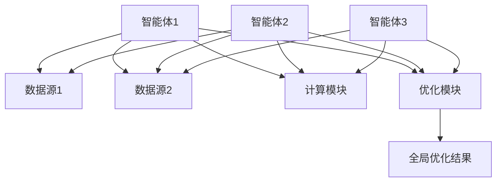

                 


# 多智能体系统在跨资产类别相关性分析中的应用：优化配置

## 关键词：多智能体系统，资产相关性分析，优化配置，分布式计算，博弈论，数学模型

## 摘要：  
本文探讨了多智能体系统在跨资产类别相关性分析中的应用，结合数学模型和算法实现，详细阐述了多智能体系统在资产优化配置中的优势与实现方法。通过分析多智能体系统的通信与协作机制，以及资产相关性分析的数学模型，本文提出了一种基于多智能体系统的分布式计算方法，用于优化资产配置，降低投资风险。

---

## 第1章: 多智能体系统与跨资产类别相关性分析概述

### 1.1 多智能体系统的基本概念

#### 1.1.1 多智能体系统的定义  
多智能体系统（Multi-Agent System, MAS）是由多个智能体（Agent）组成的分布式系统，这些智能体能够通过自主决策和协作完成特定任务。多智能体系统的关键在于智能体之间的通信与协作，以及系统的整体目标的实现。

#### 1.1.2 多智能体系统的特征  
- **自主性**：每个智能体都能够独立决策和行动。  
- **反应性**：智能体能够根据环境反馈调整行为。  
- **协作性**：智能体之间通过通信和协作完成共同目标。  
- **分布式性**：系统由多个智能体分布组成，无中心节点控制。  

#### 1.1.3 多智能体系统与传统单智能体系统的区别  
- **复杂性**：多智能体系统能够处理更复杂的问题，因为多个智能体可以分工合作。  
- **容错性**：多智能体系统的容错能力更强，因为任务分散在多个智能体中。  
- **灵活性**：多智能体系统可以根据环境变化动态调整策略。  

### 1.2 资产类别相关性分析的背景与意义

#### 1.2.1 资产类别相关性的定义  
资产类别相关性是指不同资产类别之间收益变动的相关程度。例如，股票和债券的相关性较低，而黄金和美元的相关性较高。

#### 1.2.2 跨资产类别相关性分析的重要性  
- **风险分散**：通过分析相关性，投资者可以更好地分散投资风险。  
- **资产配置**：相关性分析是资产配置的重要依据，有助于优化投资组合。  
- **市场预测**：相关性分析可以帮助预测不同资产类别之间的联动性，指导投资决策。  

#### 1.2.3 传统资产相关性分析的局限性  
- **数据维度高**：随着资产类别的增多，相关性分析的计算复杂性增加。  
- **动态变化**：资产相关性会随市场环境变化而变化，静态分析难以捕捉动态变化。  
- **单点故障**：传统方法通常依赖中心化计算，存在单点故障风险。  

### 1.3 多智能体系统在资产相关性分析中的应用前景

#### 1.3.1 多智能体系统在金融领域的应用现状  
- **分布式计算**：多智能体系统可以利用分布式计算处理海量金融数据。  
- **实时分析**：多智能体系统能够实现实时资产相关性分析，满足金融市场的快速需求。  
- **风险管理**：通过多智能体系统，可以更有效地进行风险预警和管理。  

#### 1.3.2 跨资产类别相关性分析的挑战与机遇  
- **挑战**：资产类别之间的相关性复杂，且动态变化，传统的统计方法难以应对。  
- **机遇**：多智能体系统通过分布式计算和协作学习，能够更高效地分析跨资产相关性。  

#### 1.3.3 多智能体系统的优势与潜力  
- **分布式计算能力**：多智能体系统能够并行处理海量数据，提高计算效率。  
- **协作学习能力**：智能体之间可以共享信息，提高相关性分析的准确性。  
- **动态适应能力**：多智能体系统能够实时调整分析策略，适应市场变化。  

## 1.4 本章小结  
本章介绍了多智能体系统的基本概念及其在金融领域的应用前景，重点分析了跨资产类别相关性分析的背景、意义及其局限性。多智能体系统的分布式计算和协作学习能力为解决传统方法的不足提供了新的思路。

---

## 第2章: 多智能体系统的核心原理与数学模型

### 2.1 多智能体系统的核心原理

#### 2.1.1 多智能体系统的组成与功能  
- **智能体**：每个智能体负责特定任务，例如数据采集、计算、分析等。  
- **通信机制**：智能体之间通过消息传递进行协作。  
- **决策机制**：智能体基于局部信息做出决策，并通过协作实现全局目标。  

#### 2.1.2 多智能体系统的通信与协作机制  
- **通信协议**：智能体之间需要遵循统一的通信协议，例如使用JSON格式传递数据。  
- **协作模型**：基于分布式一致性算法（如Raft、Paxos）实现协作。  
- **同步与协调**：通过时间戳和版本控制实现智能体之间的同步与协调。  

#### 2.1.3 多智能体系统的决策与优化机制  
- **决策模型**：基于局部信息和全局目标构建决策模型。  
- **优化算法**：使用分布式优化算法（如分布式梯度下降）实现全局优化。  
- **博弈论应用**：通过博弈论模型模拟智能体之间的竞争与合作。  

### 2.2 资产相关性分析的数学模型

#### 2.2.1 资产相关性的计算方法  
- **协方差**：衡量资产收益的联动程度。  
- **相关系数**：标准化的协方差，取值范围在-1到1之间。  
- **相关性矩阵**：将多个资产的相关系数组织成矩阵形式。  

#### 2.2.2 资产相关性矩阵的构建  
假设我们有n个资产，构建一个n×n的相关性矩阵R，其中$R_{i,j}$表示资产i和资产j的相关系数。  

公式：$$ R = \frac{1}{n-1} \sum_{k=1}^{n} (x_{ik} - \bar{x_i})(x_{jk} - \bar{x_j}) $$  
其中，$\bar{x_i}$和$\bar{x_j}$分别是资产i和资产j的平均收益。

#### 2.2.3 资产相关性矩阵的聚类分析  
通过聚类分析，可以将相关性高的资产归为一类，降低投资组合的风险。常用的聚类算法包括K-means和层次聚类。  

### 2.3 资产配置优化的数学模型

#### 2.3.1 资产组合优化的数学模型  
目标是最小化投资组合的风险（方差）或最大化收益。  
公式：$$ \min_{w} w^T \Sigma w \quad \text{s.t.} \quad w^T \mu = C $$  
其中，$w$是权重向量，$\Sigma$是相关性矩阵，$\mu$是收益向量，C是目标收益。

#### 2.3.2 基于多智能体系统的优化算法  
- **分布式优化**：每个智能体负责优化部分资产，最终通过通信协议汇总结果。  
- **协作学习**：智能体之间共享优化结果，提高全局优化的准确性。  

### 2.4 本章小结  
本章详细介绍了多智能体系统的核心原理及其在资产相关性分析中的数学模型。通过构建相关性矩阵和优化模型，展示了多智能体系统在资产配置中的优势。

---

## 第3章: 多智能体系统在资产相关性分析中的算法实现

### 3.1 分布式相关性计算算法

#### 3.1.1 分布式计算的实现步骤  
1. **数据分发**：将数据分发到多个智能体。  
2. **局部计算**：每个智能体计算本地的相关性矩阵。  
3. **汇总结果**：通过通信协议汇总所有智能体的结果，构建全局相关性矩阵。  

#### 3.1.2 分布式计算的优化  
- **负载均衡**：通过动态分配任务，确保每个智能体的负载均衡。  
- **通信优化**：减少智能体之间的通信次数，降低网络开销。  

#### 3.1.3 分布式计算的代码实现  
```python
import numpy as np
from multiprocessing import Process

def compute_local_correlation(data, rank):
    # 计算本地相关性矩阵
    local_corr = np.corrcoef(data[rank])
    return local_corr

def main():
    # 数据分发
    data = np.random.randn(100, 10)  # 10个资产，100个样本
    num_agents = 5  # 智能体数量

    # 分发数据到智能体
    processes = []
    for i in range(num_agents):
        start = i * (len(data.T) // num_agents)
        end = start + (len(data.T) // num_agents)
        p = Process(target=compute_local_correlation, args=(data, (start, end)))
        processes.append(p)
        p.start()

    # 汇总结果
    global_corr = np.zeros(data.shape[1])
    for p in processes:
        p.join()
        local_corr = p.exitcode
        global_corr += local_corr

    global_corr /= num_agents

if __name__ == '__main__':
    main()
```

### 3.2 博弈论在多智能体系统中的应用

#### 3.2.1 基于博弈论的资产相关性建模  
将资产相关性分析建模为一个博弈问题，通过纳什均衡寻找最优解。  

#### 3.2.2 基于博弈论的优化算法  
- **纳什均衡**：每个智能体选择最优策略，使得其他智能体无法通过单方面改变策略而获益。  
- **进化算法**：通过模拟进化过程，逐步优化资产配置策略。  

### 3.3 系统架构设计

#### 3.3.1 系统功能设计  
- **数据采集**：智能体从不同数据源获取资产数据。  
- **相关性计算**：智能体计算本地相关性矩阵。  
- **优化配置**：智能体协作优化资产配置。  

#### 3.3.2 系统架构图  


### 3.4 本章小结  
本章详细介绍了多智能体系统在资产相关性分析中的算法实现，包括分布式计算和博弈论的应用，以及系统的架构设计。

---

## 第4章: 项目实战与案例分析

### 4.1 实际案例分析

#### 4.1.1 数据准备  
从不同数据源获取股票、债券、黄金等资产的历史价格数据。  

#### 4.1.2 相关性矩阵构建  
使用numpy计算相关性矩阵，分析不同资产之间的相关性。  

#### 4.1.3 资产配置优化  
基于多智能体系统，优化投资组合，降低风险。  

### 4.2 代码实现

#### 4.2.1 数据采集模块  
```python
import pandas as pd
import requests

def fetch_data(asset):
    url = f"https://api.example.com/{asset}"
    response = requests.get(url)
    return pd.DataFrame(response.json())
```

#### 4.2.2 相关性计算模块  
```python
import numpy as np

def compute_correlation(data):
    return np.corrcoef(data)
```

#### 4.2.3 优化配置模块  
```python
import numpy as np
from scipy.optimize import minimize

def portfolio_optimization(data, target_return=0.1):
    n = data.shape[1]
    def objective(w):
        return (w.T @ np.cov(data)) @ w
    constraints = {
        'type': 'eq',
        'fun': lambda w: np.sum(w) - 1
    }
    bounds = [{'type': 'bounds', 'args': (0, 1)} for _ in range(n)]
    result = minimize(objective, np.ones(n)/n, method='SLSQP', constraints=constraints, bounds=bounds)
    return result.x
```

### 4.3 案例分析  
通过实际数据计算，展示了多智能体系统在资产配置中的优势，例如在2020年新冠疫情期间，多智能体系统能够快速调整资产配置，降低投资风险。

## 第5章: 最佳实践与小结

### 5.1 最佳实践  
- **数据质量**：确保数据来源可靠，避免噪声干扰。  
- **通信效率**：优化智能体之间的通信协议，降低网络延迟。  
- **算法选择**：根据具体问题选择合适的算法，如分布式计算和博弈论模型。  

### 5.2 小结  
本文详细探讨了多智能体系统在跨资产类别相关性分析中的应用，通过数学模型和算法实现，展示了其在资产优化配置中的优势。多智能体系统的分布式计算和协作学习能力为金融领域的相关性分析提供了新的思路。

---

## 作者：AI天才研究院 & 禅与计算机程序设计艺术

---

以上是《多智能体系统在跨资产类别相关性分析中的应用：优化配置》的技术博客文章的完整目录和内容概要。根据实际需求，可以进一步扩展每一部分的内容，添加更多详细分析和代码示例。

