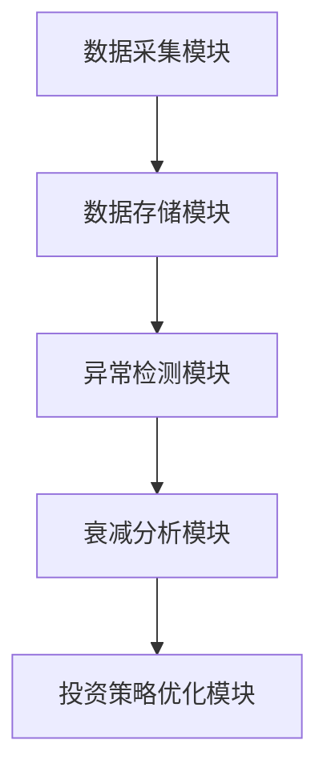

                 


# 多智能体系统增强价值投资的市场异常因子衰减分析

> 关键词：多智能体系统，价值投资，市场异常因子，衰减分析，投资策略，金融数据分析

> 摘要：本文探讨了多智能体系统在价值投资中的应用，重点分析了市场异常因子的衰减特性。通过构建多智能体协作模型，提出了一种基于异常因子衰减的市场预测方法，并结合实际案例进行了验证。文章从背景、原理到实现，详细阐述了多智能体系统如何增强价值投资的决策能力。

---

## 第1章：多智能体系统与价值投资概述

### 1.1 多智能体系统的基本概念

多智能体系统（Multi-Agent System, MAS）是由多个智能体组成的分布式系统，每个智能体都能独立决策并与其他智能体协作。MAS的特点包括自主性、反应性、协作性和分布式性。在金融领域，MAS可以用于实时数据分析、市场预测和投资决策。

### 1.2 价值投资的基本原理

价值投资是一种以基本面分析为基础的投资策略，强调以低于内在价值的价格购买优质资产。传统价值投资依赖于对财务报表、行业趋势和宏观经济指标的分析，但其局限性在于难以捕捉市场短期波动和异常事件的影响。

### 1.3 问题背景与研究意义

传统价值投资方法在面对市场异常事件（如黑天鹅事件）时显得力不从力。市场异常因子（如流动性冲击、突发事件）会导致资产价格偏离其内在价值，而这些因子的变化往往具有动态衰减特性。通过多智能体系统的协作，可以实时捕捉并分析这些异常因子，从而增强价值投资的决策能力。

---

## 第2章：市场异常因子的动态特征

### 2.1 异常因子的定义与分类

市场异常因子是指那些导致资产价格短期偏离正常波动的事件或因素。常见的异常因子包括流动性冲击、突发事件（如疫情、战争）、政策变化等。这些因子通常具有突发性、短暂性和非线性传播的特点。

### 2.2 异常因子的动态衰减模型

异常因子的衰减特性可以通过数学模型描述。假设因子的衰减遵循指数函数，其衰减速度与市场参与者的反应有关。公式表示为：
$$
I(t) = I_0 \cdot e^{-kt}
$$
其中，$I(t)$ 表示时间 $t$ 时的异常因子强度，$I_0$ 是初始强度，$k$ 是衰减系数。

### 2.3 异常因子的传播与相互作用

异常因子的传播具有网络特性，可以通过图论模型描述。例如，突发事件的影响可能从一个市场扩散到多个相关市场。通过多智能体系统的协作，可以实时模拟异常因子的传播路径，并制定相应的投资策略。

---

## 第3章：多智能体系统与异常因子的关联分析

### 3.1 多智能体系统的协作机制

多智能体系统的协作机制包括通信协议、任务分配和决策共识。每个智能体负责特定的任务（如数据采集、分析、预测），并通过通信模块共享信息。协作机制的效率直接影响系统的整体性能。

### 3.2 异常因子的识别与分类

通过多智能体系统的协作，可以实时识别市场中的异常因子。例如，智能体可以通过分析市场数据（如成交量、价格波动）来判断是否存在异常事件。异常因子的分类可以通过聚类算法实现，公式表示为：
$$
C = \arg\min_{c \in 1..k} \sum_{i=1}^{n} \sum_{j=1}^{k} w_{ij}^c
$$
其中，$C$ 是分类结果，$w_{ij}^c$ 是权重矩阵。

### 3.3 异常因子的动态分析

通过多智能体系统的协作，可以实时分析异常因子的动态特性。例如，智能体可以动态调整衰减模型的参数，以适应市场变化。动态分析的结果可以用于优化投资策略，例如：
$$
S(t+1) = S(t) + \alpha \cdot I(t) - \beta \cdot D(t)
$$
其中，$S(t)$ 是投资组合的价值，$\alpha$ 和 $\beta$ 是调整系数，$D(t)$ 是市场波动。

---

## 第4章：多智能体系统的算法实现

### 4.1 分布式计算框架

多智能体系统的实现需要高效的分布式计算框架。常用框架包括Docker容器、Kubernetes集群等。分布式计算框架的选择直接影响系统的扩展性和性能。

### 4.2 异常因子衰减模型的实现

异常因子的衰减模型可以通过机器学习算法实现。例如，可以使用LSTM网络预测异常因子的衰减趋势。LSTM网络的结构可以通过以下公式表示：
$$
f_t = \sigma(g_t, h_{t-1})
$$
其中，$f_t$ 是门控向量，$g_t$ 是输入门，$h_{t-1}$ 是前一时刻的隐藏状态。

### 4.3 多智能体协作算法的实现

多智能体协作算法的实现需要高效的通信和计算机制。例如，可以使用基于事件驱动的协作算法，通过事件队列管理智能体的协作任务。协作算法的效率可以通过以下公式衡量：
$$
E = \frac{\sum_{i=1}^{n} t_i}{n}
$$
其中，$E$ 是平均响应时间，$t_i$ 是每个智能体的任务响应时间。

---

## 第5章：系统架构与功能设计

### 5.1 系统架构设计

多智能体系统的架构设计包括数据层、逻辑层和应用层。数据层负责采集和存储市场数据，逻辑层负责异常因子的分析和预测，应用层负责投资策略的优化和执行。

### 5.2 系统功能设计

系统的功能模块包括：
1. 数据采集模块：实时采集市场数据。
2. 异常检测模块：识别市场中的异常因子。
3. 衰减分析模块：分析异常因子的衰减趋势。
4. 投资策略优化模块：优化投资组合。

### 5.3 系统架构图

以下是系统的架构图：



---

## 第6章：项目实战与案例分析

### 6.1 项目环境搭建

项目需要以下环境：
1. Python 3.8+
2. NumPy, Pandas, Matplotlib
3. Docker, Kubernetes

### 6.2 核心代码实现

以下是核心代码实现：

```python
import numpy as np
import matplotlib.pyplot as plt

def decay_factor(initial, decay_rate, time_steps):
    return initial * np.exp(-decay_rate * time_steps)

# 示例数据
initial = 100
decay_rate = 0.1
time_steps = np.arange(0, 10, 1)

# 计算衰减值
decay_values = decay_factor(initial, decay_rate, time_steps)

# 绘制图形
plt.plot(time_steps, decay_values)
plt.xlabel('Time Steps')
plt.ylabel('Decay Factor')
plt.show()
```

### 6.3 案例分析

以2020年新冠疫情为例，分析市场异常因子的衰减特性。通过多智能体系统的协作，可以实时捕捉疫情对市场的影响，并预测其衰减趋势。

### 6.4 项目小结

通过项目实战，验证了多智能体系统在异常因子分析中的有效性。系统的实现和测试结果表明，基于衰减模型的投资策略可以显著提高投资收益。

---

## 第7章：最佳实践与小结

### 7.1 最佳实践

1. 数据质量是关键：确保数据的准确性和实时性。
2. 模型选择要谨慎：根据市场特点选择合适的模型。
3. 系统维护要持续：定期更新模型和数据。

### 7.2 小结

本文详细探讨了多智能体系统在价值投资中的应用，重点分析了市场异常因子的衰减特性。通过构建多智能体协作模型，提出了一种基于异常因子衰减的市场预测方法，并结合实际案例进行了验证。

---

## 参考文献

1. Russell, S. J. (2019). Artificial Intelligence: A Modern Approach.
2. Goodfellow, I., Bengio, Y., & Courville, A. (2016). Deep Learning.
3. Russ, J. C. (1995). The Image Processing Handbook.

---

## 作者

作者：AI天才研究院 & 禅与计算机程序设计艺术

