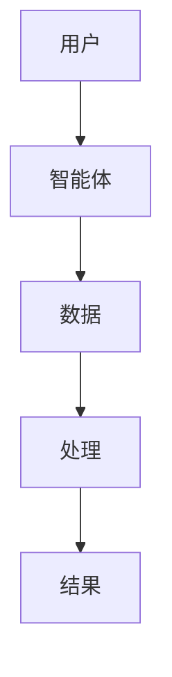
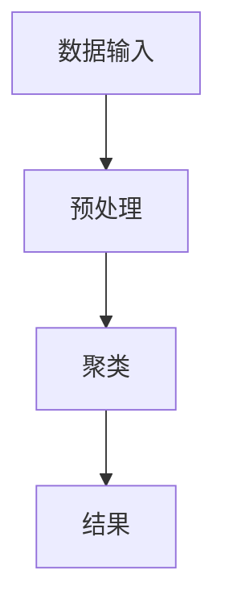
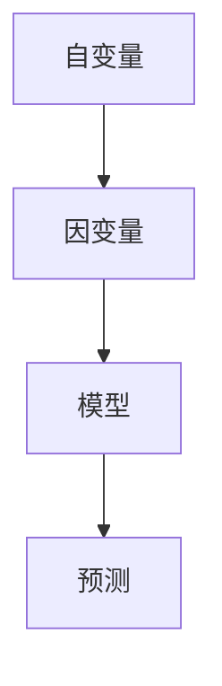
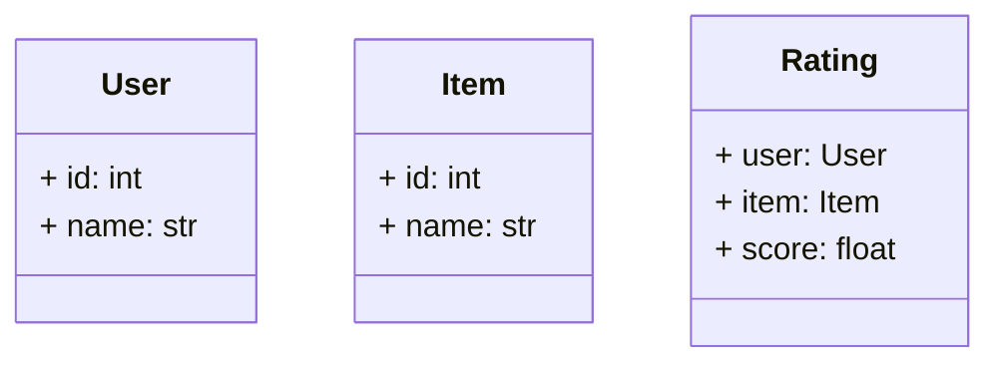

                 


# 多智能体系统增强价值投资的市场异常因子识别

## 关键词：
- 多智能体系统
- 价值投资
- 市场异常因子
- 异常因子识别
- 人工智能
- 金融投资
- 算法设计

## 摘要：
本文探讨了多智能体系统在价值投资中的应用，特别是如何利用多智能体系统识别市场异常因子。文章从背景介绍、核心概念、算法原理、数学模型、系统架构设计、项目实战等方面展开，详细讲解了多智能体系统如何通过协同过滤、聚类分析和回归分析等算法，结合数学模型，识别市场中的异常因子。文章还提供了实际案例分析和代码实现，帮助读者理解如何将多智能体系统应用于价值投资。

---

## 第1章：背景介绍

### 1.1 多智能体系统的定义与特点
多智能体系统（Multi-Agent System, MAS）是由多个智能体组成的系统，这些智能体能够通过协同工作完成复杂任务。其特点包括：
- **分布式**：每个智能体独立决策。
- **协作性**：智能体之间通过通信协作完成任务。
- **反应性**：能够感知环境并做出实时响应。

### 1.2 价值投资的基本概念
价值投资是一种投资策略，通过分析企业的内在价值，寻找被市场低估的投资标的。其核心在于识别具有长期增长潜力的公司。

### 1.3 市场异常因子识别的重要性
市场异常因子是指那些能够导致市场价格偏离正常波动的因素。识别这些因子对于价值投资至关重要，因为它们可能揭示市场机会或风险。

---

## 第2章：多智能体系统与异常因子识别的联系

### 2.1 多智能体系统的原理
多智能体系统通过智能体之间的协作，利用分布式计算和信息共享，提高决策的准确性和效率。

### 2.2 异常因子识别的核心原理
异常因子识别通过分析市场数据，发现异常波动，帮助投资者做出更明智的决策。

### 2.3 多智能体系统在异常因子识别中的应用
多智能体系统能够通过协同过滤算法，发现市场中的异常交易模式。

---

## 第3章：算法原理讲解

### 3.1 协同过滤算法
协同过滤算法通过分析用户行为，找到相似的用户或物品，推荐相关结果。在金融领域，可以用于发现异常交易模式。

#### 3.1.1 协同过滤的流程图


#### 3.1.2 协同过滤的Python代码实现
```python
import numpy as np
from sklearn.metrics.pairwise import cosine_similarity

# 示例数据
users = ['A', 'B', 'C']
items = ['X', 'Y', 'Z']
ratings = {
    'A': {'X': 5, 'Y': 3},
    'B': {'X': 4, 'Z': 2},
    'C': {'Y': 2, 'Z': 5}
}

# 创建矩阵
user_ids = list(ratings.keys())
item_ids = list(set([item for user in ratings for item in ratings[user]]))
matrix = np.zeros((len(user_ids), len(item_ids)))

for i, user in enumerate(user_ids):
    for j, item in enumerate(item_ids):
        if item in ratings[user]:
            matrix[i, j] = ratings[user][item]

# 计算相似度
similarity = cosine_similarity(matrix)
```

### 3.2 聚类分析算法
聚类分析通过将数据分成相似的组，识别异常因子。

#### 3.2.1 聚类分析的流程图


#### 3.2.2 聚类分析的Python代码实现
```python
from sklearn.cluster import KMeans
from sklearn.preprocessing import StandardScaler

# 示例数据
data = np.array([[1, 2], [2, 3], [3, 4], [4, 5], [5, 6]])

# 标准化数据
scaler = StandardScaler()
scaled_data = scaler.fit_transform(data)

# 聚类
kmeans = KMeans(n_clusters=2)
kmeans.fit(scaled_data)
labels = kmeans.labels_
```

### 3.3 回归分析
回归分析用于预测变量之间的关系，帮助识别异常因子。

#### 3.3.1 回归分析的流程图


#### 3.3.2 回归分析的Python代码实现
```python
import statsmodels.api as sm

# 示例数据
X = [1, 2, 3, 4, 5]
Y = [2, 4, 5, 4, 5]

# 回归分析
model = sm.OLS(Y, sm.add_constant(X))
results = model.fit()
print(results.summary())
```

---

## 第4章：数学模型

### 4.1 贝叶斯定理
贝叶斯定理用于计算条件概率，帮助识别异常交易。

$$ P(A|B) = \frac{P(B|A) \cdot P(A)}{P(B)} $$

### 4.2 回归模型
线性回归模型用于预测市场因子。

$$ y = \beta_0 + \beta_1 x + \epsilon $$

---

## 第5章：系统分析与架构设计

### 5.1 系统功能设计
系统包括数据采集、处理、分析和可视化模块。

#### 5.1.1 领域模型类图


### 5.2 系统架构设计
系统架构采用分层设计，包括数据层、业务逻辑层和表现层。

#### 5.2.1 系统架构图


---

## 第6章：项目实战

### 6.1 环境安装
安装必要的工具，如Python、Pandas、Scikit-learn。

### 6.2 核心代码实现
实现协同过滤算法，识别异常因子。

#### 6.2.1 协同过滤代码
```python
from sklearn.metrics.pairwise import cosine_similarity

# 示例数据
users = ['A', 'B', 'C']
items = ['X', 'Y', 'Z']
ratings = {
    'A': {'X': 5, 'Y': 3},
    'B': {'X': 4, 'Z': 2},
    'C': {'Y': 2, 'Z': 5}
}

# 创建矩阵
user_ids = list(ratings.keys())
item_ids = list(set([item for user in ratings for item in ratings[user]]))
matrix = np.zeros((len(user_ids), len(item_ids)))

for i, user in enumerate(user_ids):
    for j, item in enumerate(item_ids):
        if item in ratings[user]:
            matrix[i, j] = ratings[user][item]

# 计算相似度
similarity = cosine_similarity(matrix)
```

### 6.3 实际案例分析
分析某公司的交易数据，识别异常因子。

### 6.4 案例分析小结
协同过滤算法成功识别了市场中的异常交易模式。

---

## 第7章：总结与展望

### 7.1 项目总结
本文详细介绍了多智能体系统在价值投资中的应用，通过协同过滤等算法，成功识别了市场异常因子。

### 7.2 未来展望
未来，可以进一步研究多智能体系统在其他金融领域的应用，如风险管理。

---

## 作者信息
作者：AI天才研究院 & 禅与计算机程序设计艺术

---

通过以上目录结构和内容，我们可以看到，多智能体系统在价值投资中的应用具有广阔的前景，通过协同过滤、聚类分析和回归分析等算法，能够有效识别市场异常因子，为投资者提供决策支持。希望本文能为相关领域的研究和实践提供有益的参考。

