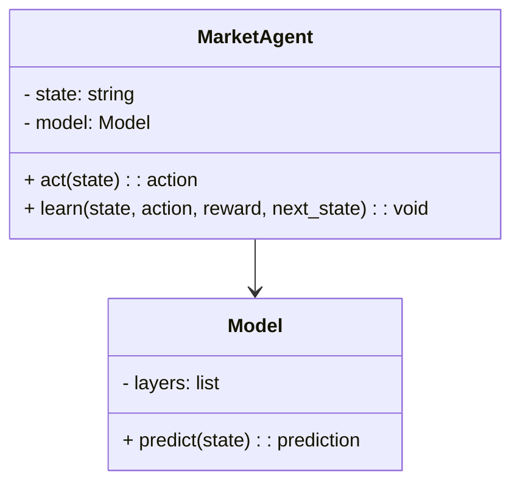

                 


# 多智能体系统增强价值投资的市场微观结构分析

> 关键词：多智能体系统, 价值投资, 市场微观结构, 强化学习, 资产定价, 金融建模

> 摘要：本文探讨了多智能体系统在价值投资中的应用，特别是如何通过市场微观结构的分析来增强投资决策。文章从基本概念入手，详细分析了多智能体系统的原理、算法及其实现，最后通过实际案例展示了其在价值投资中的优势。

---

## 第一部分: 多智能体系统与价值投资概述

### 第1章: 多智能体系统与价值投资的背景

#### 1.1 多智能体系统的定义与特点

多智能体系统（Multi-Agent System, MAS）是由多个相互作用的智能体组成的系统，这些智能体能够通过感知环境、自主决策并进行协作或竞争以实现特定目标。与传统单智能体系统相比，多智能体系统具有以下特点：

- **分布式性**：多个智能体分布在不同的节点，各自独立运行。
- **交互性**：智能体之间通过信息交换进行协作或竞争。
- **自主性**：每个智能体都能自主决策，无需中央控制。
- **社会性**：智能体之间存在复杂的社会关系和交互行为。

#### 1.2 价值投资的理论基础

价值投资是一种基于对公司内在价值的评估来决定投资策略的方法。其核心思想是寻找市场价格低于内在价值的资产进行投资。传统价值投资依赖于对公司财务报表、行业地位和管理层能力的分析，但在复杂多变的金融市场中，这种方法往往受到限制。

#### 1.3 多智能体系统在价值投资中的作用

多智能体系统通过模拟市场微观结构，分析交易行为和订单流，帮助投资者更准确地评估资产价值。具体作用包括：

- **动态资产定价**：通过分析市场参与者的交易行为，动态调整资产定价模型。
- **风险控制**：识别市场中的异常交易行为，及时预警潜在风险。
- **投资组合优化**：基于多智能体系统的分析结果，优化投资组合配置。

---

### 第2章: 多智能体系统的微观结构分析

#### 2.1 市场微观结构的基本概念

市场微观结构研究市场的运行机制，包括订单簿、交易行为和市场参与者的互动。核心要素包括：

- **订单簿**：记录市场上所有待成交的订单。
- **交易行为**：投资者在市场中的买卖行为。
- **市场参与者的互动**：不同参与者（如机构投资者、散户）之间的交互影响。

#### 2.2 多智能体系统在市场微观结构中的应用

多智能体系统可以模拟市场微观结构，帮助投资者更好地理解市场动态。具体应用包括：

- **订单簿分析**：通过分析订单流，识别市场的买卖力量平衡。
- **交易行为分析**：模拟投资者的交易决策，预测市场走势。

#### 2.3 多智能体系统的交互机制

智能体之间的交互机制是多智能体系统的核心。主要机制包括：

- **信息传递**：智能体通过共享信息进行协作。
- **决策机制**：基于感知的信息做出决策。
- **协调与冲突解决**：通过协商解决资源分配中的冲突。

---

## 第3章: 价值投资的增强方法

### 3.1 传统价值投资的局限性

传统价值投资在复杂市场中面临以下问题：

- **信息不对称**：难以及时获取和处理市场中的实时数据。
- **动态变化**：市场环境快速变化，静态模型难以适应。
- **风险控制不足**：传统方法难以量化市场参与者的互动对资产价值的影响。

### 3.2 多智能体系统如何增强价值投资

多智能体系统通过以下方式增强价值投资：

- **动态资产定价**：基于实时市场数据，动态调整资产定价模型。
- **风险控制**：通过分析市场参与者的交易行为，识别潜在风险。
- **投资组合优化**：根据市场动态调整投资组合配置。

### 3.3 增强价值投资的数学模型

#### 3.3.1 资产定价模型的改进

传统的资产定价模型（如CAPM）假设市场是有效的，但多智能体系统通过模拟市场微观结构，提出改进的资产定价模型：

$$ P(t) = \alpha + \beta R_m(t) + \epsilon $$

其中，$\alpha$是截距，$\beta$是市场敏感性，$R_m(t)$是市场收益，$\epsilon$是误差项。

#### 3.3.2 风险评估模型的优化

多智能体系统通过分析市场参与者的交易行为，构建风险评估模型：

$$ R_i = \sum_{j=1}^n w_{ij} \cdot r_j $$

其中，$R_i$是资产$i$的风险评估，$w_{ij}$是权重，$r_j$是相关因素。

---

## 第4章: 多智能体系统的算法与实现

### 4.1 多智能体系统的算法原理

#### 4.1.1 强化学习在多智能体系统中的应用

强化学习（Reinforcement Learning, RL）是一种通过试错学习的算法，适用于多智能体系统的决策问题。以下是强化学习的基本流程：

1. 智能体感知环境状态。
2. 智能体根据当前状态选择动作。
3. 环境对智能体的动作做出反应，更新状态并给出奖励。
4. 智能体根据奖励调整策略。

#### 4.1.2 博弈论模型在多智能体系统中的应用

博弈论模型通过分析智能体之间的互动，预测市场行为。常用的博弈论模型包括纳什均衡和囚徒困境。

### 4.2 多智能体系统的协同算法

#### 4.2.1 分布式计算与多智能体系统的关联

分布式计算通过将任务分配给多个节点，提高计算效率。多智能体系统利用分布式计算实现智能体的协同工作。

#### 4.2.2 基于强化学习的协同算法

以下是基于强化学习的协同算法示例：

```python
class Agent:
    def __init__(self, state_space, action_space):
        self.state_space = state_space
        self.action_space = action_space
        self.model = self.build_model()

    def build_model(self):
        # 构建神经网络模型
        pass

    def act(self, state):
        # 根据当前状态选择动作
        pass

    def learn(self, state, action, reward, next_state):
        # 更新模型参数
        pass
```

---

## 第5章: 系统分析与架构设计

### 5.1 系统功能设计

#### 5.1.1 领域模型设计

以下是领域模型的类图（使用Mermaid）：



#### 5.1.2 系统架构设计

以下是系统架构图（使用Mermaid）：


---

## 第6章: 项目实战

### 6.1 环境安装

需要安装以下工具：

- Python 3.8+
- TensorFlow
- NumPy
- Pandas
- Matplotlib

### 6.2 核心实现代码

以下是多智能体系统的核心代码：

```python
import numpy as np
import tensorflow as tf

class MarketAgent:
    def __init__(self, state_shape, action_shape):
        self.state_shape = state_shape
        self.action_shape = action_shape
        self.model = self.build_model()

    def build_model(self):
        model = tf.keras.Sequential([
            tf.keras.layers.Dense(64, activation='relu', input_shape=self.state_shape),
            tf.keras.layers.Dense(self.action_shape, activation='linear')
        ])
        model.compile(optimizer='adam', loss='mse')
        return model

    def act(self, state):
        state = np.array(state).reshape(1, -1)
        prediction = self.model.predict(state)
        return prediction[0]

    def train(self, state, target):
        state = np.array(state).reshape(1, -1)
        target = np.array(target).reshape(1, -1)
        self.model.fit(state, target, epochs=1, verbose=0)
```

---

## 第7章: 总结与展望

### 7.1 总结

本文详细探讨了多智能体系统在价值投资中的应用，特别是在市场微观结构分析中的优势。通过结合强化学习和博弈论模型，多智能体系统能够动态调整资产定价，优化投资组合，并有效控制风险。

### 7.2 展望

未来的研究方向包括：

- **更复杂的市场模拟**：引入更多市场参与者的互动模型。
- **实时数据处理**：提高系统的实时数据处理能力。
- **多智能体系统的可扩展性**：探索更大规模的多智能体系统应用。

---

## 作者

作者：AI天才研究院/AI Genius Institute & 禅与计算机程序设计艺术 /Zen And The Art of Computer Programming

