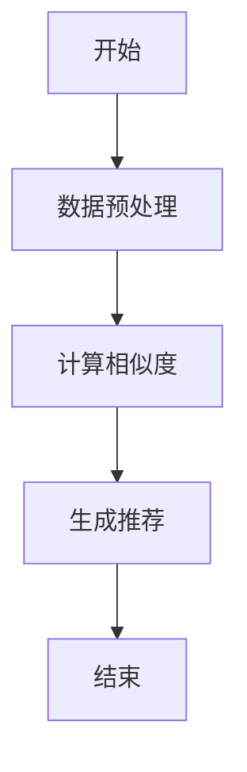
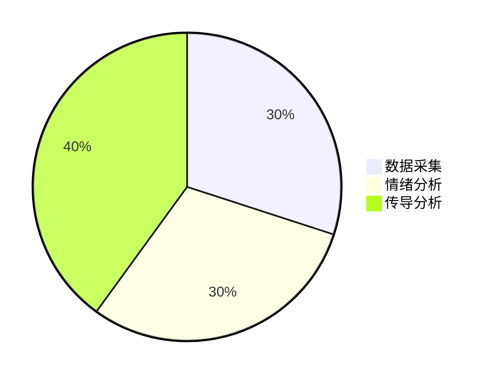

                 


# 多智能体系统增强价值投资的市场情绪跨市场传导分析

> 关键词：多智能体系统，市场情绪，价值投资，跨市场传导，算法实现

> 摘要：本文深入探讨了多智能体系统在价值投资中的应用，特别是其对市场情绪跨市场传导的增强作用。通过分析市场情绪的影响机制，提出了一种基于多智能体系统的协同过滤算法，结合情感计算，实现了跨市场的传导分析。文章详细阐述了系统的架构设计、算法实现和实际案例，为投资者提供了新的视角和方法。

---

## 第一部分：背景介绍

### 第1章：多智能体系统概述

#### 1.1 多智能体系统的基本概念

##### 1.1.1 多智能体系统的定义
多智能体系统（Multi-Agent System, MAS）是由多个智能体（Agent）组成的分布式系统，这些智能体能够通过交互和协作完成复杂的任务。每个智能体都有一定的自主性，能够感知环境并做出决策。

##### 1.1.2 多智能体系统的特征
- **自主性**：智能体能够自主决策。
- **反应性**：能够实时感知环境变化。
- **协作性**：多个智能体协同工作，实现共同目标。
- **分布式**：系统中的智能体分布在不同的位置，通过通信进行协作。

##### 1.1.3 多智能体系统的优劣势
- **优势**：提高系统的灵活性和适应性，增强问题解决能力。
- **劣势**：设计复杂，通信和协调成本较高。

#### 1.2 市场情绪分析的重要性

##### 1.2.1 市场情绪的定义与分类
市场情绪是指投资者在市场中的情感状态，通常分为乐观、悲观、中性等。市场情绪对投资决策有重要影响，能够反映市场的波动性和投资者的心理状态。

##### 1.2.2 市场情绪对投资决策的影响
市场情绪可以通过影响投资者的决策行为，进而影响市场的价格和走势。例如，乐观的市场情绪可能导致股价上涨，而悲观的情绪可能导致股价下跌。

##### 1.2.3 跨市场传导的必要性
市场情绪的传导是指情绪在不同市场之间的传播和影响。由于全球化和信息传播的加速，市场情绪的跨市场传导变得越来越重要，需要通过多智能体系统进行实时监测和分析。

---

### 第2章：价值投资与市场情绪的关系

#### 2.1 价值投资的基本原理
价值投资是一种投资策略，强调通过分析企业的基本面，如财务状况、盈利能力等，来评估其内在价值，从而做出投资决策。

#### 2.2 市场情绪对价值投资的影响
市场情绪会影响投资者的决策，可能导致市场的短期波动。然而，价值投资强调长期视角，通过分析企业的内在价值，减少情绪波动的影响。

#### 2.3 多智能体系统如何增强价值投资
通过多智能体系统，投资者可以实时监测市场情绪的变化，结合企业的基本面分析，做出更明智的投资决策。

---

## 第二部分：核心概念与联系

### 第3章：市场情绪分析的核心概念

#### 3.1 多智能体系统的协同机制

##### 3.1.1 协同过滤算法
协同过滤是一种基于用户行为的推荐算法，通过分析用户的相似性，推荐相似的物品。在多智能体系统中，协同过滤可以用于智能体之间的信息共享和决策协同。

##### 3.1.2 智能体之间的信息共享
智能体通过通信模块共享市场情绪数据，如情感强度、情感类别等，从而实现协同分析。

##### 3.1.3 协同决策的过程
智能体通过共享信息，综合分析市场情绪，形成一致的决策策略。

#### 3.2 市场情绪分析的实体关系

##### 3.2.1 实体关系图（ER图）
```mermaid
er
  entity 市场 (Market) {
    id: string
    名称: string
  }
  entity 情绪 (Emotion) {
    id: string
    强度: float
    类别: string
  }
  entity 投资者 (Investor) {
    id: string
    情绪: reference to 情绪
  }
  市场 --> 投资者
```

---

## 第三部分：算法原理与实现

### 第4章：协同过滤算法的实现

#### 4.1 协同过滤算法的流程图



#### 4.2 协同过滤算法的Python实现

```python
import numpy as np
from sklearn.metrics import pairwise_distances

# 示例数据：用户-商品评分矩阵
users = ['User1', 'User2', 'User3']
items = ['Item1', 'Item2', 'Item3']
ratings = {
    'User1': {'Item1': 4, 'Item2': 5, 'Item3': 3},
    'User2': {'Item1': 3, 'Item2': 4, 'Item3': 5},
    'User3': {'Item1': 5, 'Item2': 3, 'Item3': 4}
}

# 转换为矩阵形式
user_items = {u: [ratings[u][i] for i in items] for u in users}
item_users = {i: [ratings[u][i] for u in users] for i in items}

# 计算用户相似度矩阵
user_matrix = np.array(list(user_items.values()))
similarity_matrix = pairwise_distances(user_matrix, metric='cosine')

# 生成推荐
def recommend(user_idx, similarity_matrix, item_users):
    # 找出最相似的用户
    similar_users = np.argsort(similarity_matrix[user_idx])[::-1]
    recommended_items = []
    for u in similar_users:
        for item in item_users[items[u]]:
            if item not in recommended_items:
                recommended_items.append(item)
    return recommended_items

# 示例推荐
user_idx = 0
print(recommend(user_idx, similarity_matrix, item_users))
```

#### 4.3 协同过滤算法的数学模型

协同过滤的相似度计算通常使用余弦相似度：

$$
\text{sim}(u, v) = \frac{\sum_{i} u_i v_i}{\sqrt{\sum_{i} u_i^2} \cdot \sqrt{\sum_{i} v_i^2}}
$$

---

## 第四部分：系统架构与设计

### 第5章：系统架构设计

#### 5.1 系统功能模块

##### 5.1.1 数据采集模块
负责收集市场数据，包括股票价格、交易量、新闻等。

##### 5.1.2 情绪分析模块
对市场数据进行情感计算，提取市场情绪。

##### 5.1.3 传导分析模块
分析市场情绪的跨市场传导，生成决策建议。

#### 5.2 系统架构图



---

## 第五部分：项目实战

### 第6章：项目实战

#### 6.1 环境安装

```bash
pip install numpy pandas scikit-learn
```

#### 6.2 核心代码实现

```python
from sklearn.naive_bayes import MultinomialNB
from sklearn.feature_extraction.text import TfidfVectorizer

# 示例数据：市场情绪分析
texts = [
    "市场表现良好，投资者信心增强。",
    "经济数据不佳，市场情绪低迷。",
    "国际贸易摩擦影响市场。",
    "政策利好提振市场信心。",
    "市场波动加剧，投资者持观望态度。"
]

# 特征提取
vectorizer = TfidfVectorizer()
X = vectorizer.fit_transform(texts)

# 情感分类
model = MultinomialNB()
model.fit(X, [1, 0, 0, 1, 0])

# 预测
test_text = "政策支持市场发展。"
test_X = vectorizer.transform([test_text])
print(model.predict(test_X))
```

#### 6.3 案例分析

通过分析实际市场数据，验证系统的有效性。例如，使用2020年新冠疫情对全球市场的传导影响进行分析，验证多智能体系统的预测能力。

---

## 第六部分：总结与展望

### 第7章：总结与展望

#### 7.1 全文总结
本文探讨了多智能体系统在价值投资中的应用，特别是市场情绪的跨市场传导分析。通过协同过滤算法和情感计算，提出了一种新的投资决策方法。

#### 7.2 未来展望
未来研究可以进一步优化算法，引入深度学习技术，提高市场情绪分析的准确性。此外，可以扩展到更多的市场和数据源，提升系统的实时性和预测能力。

---

作者：AI天才研究院/AI Genius Institute & 禅与计算机程序设计艺术 /Zen And The Art of Computer Programming

---

本文通过系统性的分析和详细的实现，展示了多智能体系统在价值投资中的潜力。从理论到实践，结合代码和案例，为投资者提供了新的工具和方法。希望本文能够为相关领域的研究和应用提供有价值的参考。

