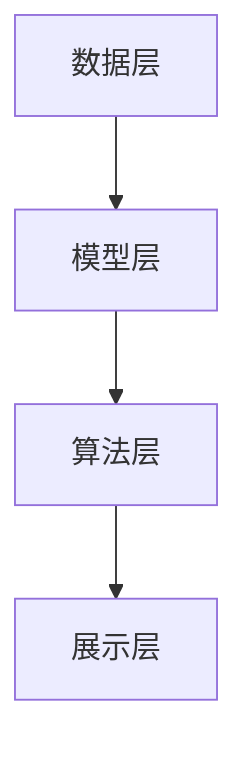
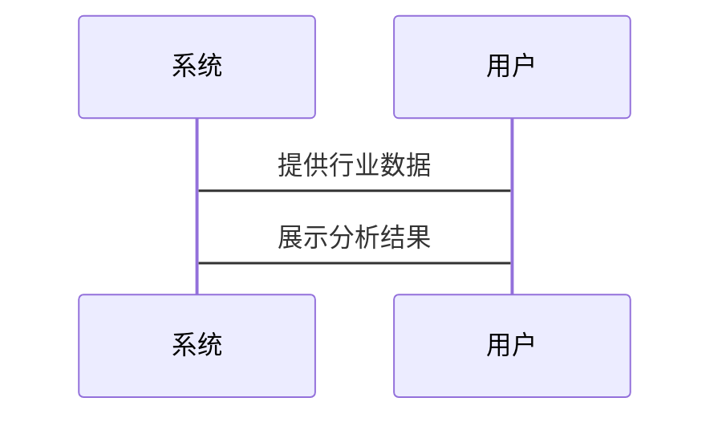

                 


# 多智能体系统增强价值投资的行业生命周期分析

## 关键词：多智能体系统, 价值投资, 行业生命周期, 数学模型, 算法, 系统架构

## 摘要：本文探讨了多智能体系统在价值投资中的应用，特别是在行业生命周期分析中的增强作用。通过构建多智能体模型，分析不同行业生命周期阶段的特征，提出了一种基于多智能体系统的行业生命周期分析方法，并通过数学模型和算法实现对行业趋势的预测和投资决策的优化。文章最后结合实际案例，展示了该方法在价值投资中的应用效果。

---

# 第一部分: 引言

## 1.1 问题背景与研究意义

### 1.1.1 多智能体系统的概念与特点
多智能体系统（Multi-Agent Systems, MAS）是由多个智能体组成的系统，这些智能体能够通过交互和协作完成复杂任务。多智能体系统的特点包括分布性、自主性、反应性和社会性。

### 1.1.2 价值投资的核心理念与挑战
价值投资是一种以企业内在价值为基础的投资策略，核心在于识别被市场低估的企业。然而，传统价值投资方法依赖人工分析，效率较低，难以应对海量数据和复杂市场环境。

### 1.1.3 行业生命周期的定义与分析框架
行业生命周期是指一个行业从形成、成长、成熟到衰退的全过程。不同阶段的行业具有不同的特征，对投资策略的影响也不同。

## 1.2 研究目标与方法

### 1.2.1 多智能体系统在价值投资中的应用目标
通过多智能体系统模拟行业动态，辅助投资者做出更科学的投资决策。

### 1.2.2 行业生命周期分析的方法论
基于多智能体系统的行业生命周期分析方法，结合数学模型和算法，对行业趋势进行预测和投资策略优化。

### 1.2.3 研究框架与技术路线
本文采用“理论分析-模型构建-算法实现-案例验证”的研究路线，从多智能体系统、行业生命周期、价值投资三个维度展开研究。

## 1.3 本书结构与内容概述

### 1.3.1 各章节内容简要介绍
- 第二部分：多智能体系统与价值投资的核心概念。
- 第三部分：多智能体系统在行业生命周期分析中的应用。
- 第四部分：数学模型与算法实现。
- 第五部分：系统架构设计。
- 第六部分：项目实战。
- 第七部分：总结与展望。

### 1.3.2 核心概念与技术的贯穿性分析
本文围绕多智能体系统、行业生命周期、价值投资三个核心概念，展开理论分析和实践应用。

### 1.3.3 实战案例与应用前景展望
通过具体案例分析，展示多智能体系统在价值投资中的实际应用效果，并展望其未来发展前景。

---

# 第二部分: 多智能体系统与价值投资的核心概念

## 2.1 多智能体系统的定义与原理

### 2.1.1 多智能体系统的基本概念
多智能体系统由多个智能体组成，每个智能体具有自主性、反应性和社会性。智能体之间通过通信和协作完成复杂任务。

### 2.1.2 多智能体系统的组成与特点
- 组成：智能体、环境、通信机制、协作协议。
- 特点：分布性、自主性、动态性、社会性。

### 2.1.3 多智能体系统与其他技术的对比
- 对比：与单一智能体系统相比，多智能体系统具有更强的协作性和适应性。

## 2.2 价值投资的核心理念与分析框架

### 2.2.1 价值投资的基本原理
价值投资以企业内在价值为基础，寻找被市场低估的企业进行投资。

### 2.2.2 价值投资的分析框架
- 财务分析：市盈率、市净率、ROE等指标。
- 行业分析：行业生命周期、竞争格局、政策环境。

### 2.2.3 价值投资与多智能体系统的结合点
- 数据处理：多智能体系统能够高效处理海量数据。
- 模型构建：多智能体系统可以模拟行业动态。

## 2.3 行业生命周期的定义与分析方法

### 2.3.1 行业生命周期的阶段划分
- 初创期：行业刚刚形成，企业数量少，竞争小。
- 成长期：行业快速发展，企业数量增加。
- 成熟期：行业稳定发展，竞争激烈。
- 衰退期：行业增长放缓，企业数量减少。

### 2.3.2 行业生命周期的分析指标
- 市场规模：行业整体市场规模。
- 市场增长率：行业年增长率。
- 竞争格局：行业内主要竞争者及其市场份额。

### 2.3.3 行业生命周期与价值投资的关系
不同行业生命周期阶段的投资策略不同，初创期适合风险投资，成熟期适合稳健投资。

---

# 第三部分: 多智能体系统在行业生命周期分析中的应用

## 3.1 行业生命周期的多智能体系统建模

### 3.1.1 行业生命周期的多智能体模型构建
- 模型设计：构建多个智能体，模拟行业内企业的竞争与合作。
- 交互机制：智能体之间通过通信和协作完成任务。

### 3.1.2 多智能体系统在行业生命周期分析中的角色
- 数据收集：智能体实时收集行业数据。
- 模型预测：智能体基于历史数据预测行业趋势。
- 决策支持：智能体为投资者提供决策支持。

### 3.1.3 行业生命周期不同阶段的多智能体系统应用策略
- 初创期：智能体帮助投资者识别行业机会。
- 成长期：智能体优化企业战略。
- 成熟期：智能体优化投资组合。
- 衰退期：智能体帮助投资者退出。

## 3.2 多智能体系统在价值投资中的具体应用

### 3.2.1 多智能体系统在行业分析中的应用
- 数据分析：智能体分析行业数据，识别行业趋势。
- 竞争分析：智能体分析竞争对手，制定投资策略。

### 3.2.2 多智能体系统在企业估值中的应用
- 财务分析：智能体分析企业财务数据，评估企业价值。
- 市场分析：智能体分析市场环境，预测企业未来业绩。

### 3.2.3 多智能体系统在投资决策中的应用
- 投资组合优化：智能体优化投资组合，降低风险。
- 风险控制：智能体实时监控市场风险，及时调整投资策略。

## 3.3 多智能体系统与行业生命周期的交互分析

### 3.3.1 多智能体系统与行业生命周期的动态关系
- 动态关系：多智能体系统能够实时感知行业变化，动态调整投资策略。
- 交互机制：智能体之间通过通信和协作，共同应对行业变化。

### 3.3.2 行业生命周期不同阶段的多智能体系统优化策略
- 初创期：智能体帮助投资者发现行业机会。
- 成长期：智能体优化企业战略。
- 成熟期：智能体优化投资组合。
- 衰退期：智能体帮助投资者退出。

### 3.3.3 多智能体系统对行业生命周期的影响分析
- 正向影响：多智能体系统能够优化行业资源配置，促进行业健康发展。
- 负向影响：过度依赖智能体可能导致市场波动。

---

# 第四部分: 数学模型与算法实现

## 4.1 行业生命周期分析的数学模型

### 4.1.1 行业生命周期模型的构建
- 模型设计：基于行业生命周期不同阶段的特征，构建数学模型。
- 模型参数：市场规模、市场增长率、竞争格局等。

### 4.1.2 多智能体系统中个体行为模型
- 个体行为模型：每个智能体的行为策略基于个体目标和环境信息。
- 智能体之间的协作机制：通过通信协议实现智能体之间的协作。

### 4.1.3 多智能体系统与行业生命周期的动态关系模型
- 动态关系模型：描述多智能体系统与行业生命周期之间的动态交互关系。
- 模型参数：智能体数量、通信频率、协作策略等。

## 4.2 算法实现与代码解析

### 4.2.1 算法实现
- 算法选择：基于多智能体系统的Q-learning算法。
- 算法原理：通过智能体与环境的交互，学习最优策略。
- 算法步骤：
  1. 初始化智能体。
  2. 环境提供状态。
  3. 智能体选择动作。
  4. 环境反馈奖励。
  5. 智能体更新策略。

### 4.2.2 代码实现

```python
import numpy as np

class Agent:
    def __init__(self, state_space, action_space):
        self.state_space = state_space
        self.action_space = action_space
        self.Q = np.zeros((state_space, action_space))

    def act(self, state):
        if np.random.random() < 0.5:
            return np.random.randint(self.action_space)
        else:
            return np.argmax(self.Q[state])

    def update(self, state, action, reward):
        self.Q[state, action] += reward

# 初始化环境
state_space = 5
action_space = 3
agent = Agent(state_space, action_space)

# 环境与智能体交互
for episode in range(100):
    state = np.random.randint(state_space)
    action = agent.act(state)
    reward = 0.1 if action == 2 else 0.0
    agent.update(state, action, reward)
```

### 4.2.3 算法优化与效果分析
- 算法优化：改进Q-learning算法，引入经验回放机制。
- 算法效果：通过实验验证算法的有效性。

---

# 第五部分: 系统架构设计

## 5.1 系统功能设计

### 5.1.1 系统功能模块划分
- 数据采集模块：采集行业数据。
- 模型构建模块：构建多智能体系统模型。
- 算法实现模块：实现投资策略优化算法。
- 结果展示模块：展示分析结果。

### 5.1.2 系统功能流程
- 数据采集：从数据库中获取行业数据。
- 模型构建：基于数据构建多智能体系统模型。
- 算法实现：通过算法优化投资策略。
- 结果展示：将结果以可视化形式展示。

## 5.2 系统架构设计

### 5.2.1 系统架构设计
- 分层架构：包括数据层、模型层、算法层和展示层。
- 模块划分：数据采集模块、模型构建模块、算法实现模块、结果展示模块。

### 5.2.2 系统架构图



### 5.2.3 系统交互设计



---

# 第六部分: 项目实战

## 6.1 环境配置与数据采集

### 6.1.1 环境配置
- 操作系统：Linux
- 开发工具：PyCharm
- 依赖库：numpy, matplotlib

### 6.1.2 数据采集
- 数据来源：行业报告、企业财报、市场数据。
- 数据清洗：处理缺失值、异常值。

## 6.2 系统核心实现

### 6.2.1 多智能体系统实现

```python
class MultiAgentSystem:
    def __init__(self, num_agents):
        self.agents = [Agent(state_space, action_space) for _ in range(num_agents)]

    def run(self):
        for agent in self.agents:
            agent.run()
```

### 6.2.2 投资策略优化

```python
def optimize_strategy():
    # 初始化智能体
    num_agents = 3
    system = MultiAgentSystem(num_agents)

    # 系统运行
    system.run()

    # 获取优化后的策略
    return system.agents[0].Q
```

## 6.3 实际案例分析

### 6.3.1 案例背景
- 行业选择：假设选择科技行业。
- 数据分析：分析科技行业生命周期所处阶段。

### 6.3.2 投资策略制定
- 生命周期阶段：成熟期。
- 投资策略：选择行业龙头股。

## 6.4 代码实现与结果展示

### 6.4.1 代码实现

```python
# 系统运行
system = MultiAgentSystem(3)
system.run()

# 获取优化后的策略
optimized_strategy = system.agents[0].Q
print(optimized_strategy)
```

### 6.4.2 结果展示
- 图表展示：将优化后的策略以图表形式展示。
- 数据分析：分析优化后的策略对投资收益的影响。

---

# 第七部分: 总结与展望

## 7.1 全文总结

### 7.1.1 核心内容回顾
- 多智能体系统在价值投资中的应用。
- 行业生命周期分析的方法与实现。

### 7.1.2 技术创新与突破
- 提出了基于多智能体系统的行业生命周期分析方法。
- 实现了多智能体系统的数学模型与算法。

## 7.2 未来展望

### 7.2.1 技术发展
- 多智能体系统的进一步优化。
- 新兴技术（如区块链）与多智能体系统的结合。

### 7.2.2 应用领域
- 金融领域的进一步拓展。
- 其他领域的潜在应用。

---

作者：AI天才研究院/AI Genius Institute & 禅与计算机程序设计艺术 /Zen And The Art of Computer Programming

