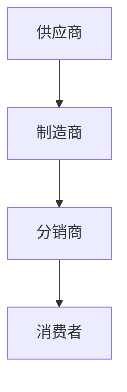
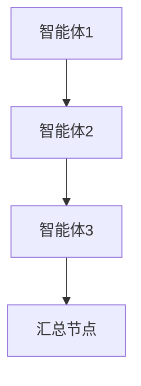
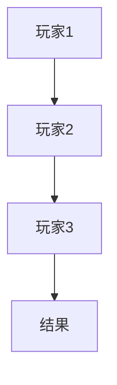

                 


# 多智能体系统如何实现全球产业链分析

## 关键词：多智能体系统，全球产业链，产业链分析，系统架构，协同优化，数学模型，博弈论

## 摘要：
本文详细探讨了多智能体系统在分析全球产业链中的应用。通过介绍多智能体系统的概念、算法和系统架构，展示了如何利用这些技术手段来优化全球产业链的分析过程。文章结合具体案例，详细讲解了分布式计算、博弈论模型的应用，并通过Mermaid流程图和Python代码示例，帮助读者理解多智能体系统如何实现全球产业链分析。

---

# 第一部分: 多智能体系统与全球产业链分析基础

## 第1章: 多智能体系统概述

### 1.1 多智能体系统的基本概念

#### 1.1.1 多智能体系统的定义
多智能体系统（Multi-Agent System, MAS）是由多个智能体组成的系统，每个智能体都是一个独立的实体，能够感知环境、自主决策并与其他智能体进行交互。

#### 1.1.2 多智能体系统的特征
- **自主性**：智能体能够自主决策。
- **反应性**：智能体能够实时响应环境变化。
- **社交性**：智能体之间可以进行通信和协作。
- **分布性**：智能体分布在网络的不同节点上，协同完成任务。

#### 1.1.3 多智能体系统与单智能体系统的区别
| 特性         | 多智能体系统             | 单智能体系统             |
|--------------|--------------------------|--------------------------|
| 系统结构     | 分布式                   | 集中式                   |
| 智能体数量   | 多个                     | 单个                     |
| 任务处理     | 协同完成复杂任务         | 单个智能体完成任务       |

### 1.2 全球产业链分析的背景与意义

#### 1.2.1 全球产业链的基本概念
全球产业链是指从原材料采购、生产制造、加工、分销到最终消费者的完整链条，涉及多个国家和地区的协同合作。

#### 1.2.2 全球产业链分析的重要性
分析全球产业链可以帮助企业优化供应链管理、降低生产成本、提高效率，并应对全球化带来的复杂挑战。

#### 1.2.3 多智能体系统在产业链分析中的应用前景
多智能体系统能够处理复杂的产业链数据，模拟不同决策对产业链的影响，优化资源配置，提高整体效率。

---

## 第2章: 多智能体系统的核心概念与联系

### 2.1 多智能体系统的实体关系分析

#### 2.1.1 实体关系图（ER图）分析
通过ER图展示产业链中的实体及其关系，例如供应商、制造商、分销商等。

#### 2.1.2 多智能体系统中的实体关系
Mermaid流程图展示：



#### 2.1.3 实体关系图的 Mermaid 流程图


### 2.2 多智能体系统在产业链分析中的算法原理

#### 2.2.1 分布式计算与协同优化
分布式计算通过将任务分配给多个智能体，实现数据的协同处理和优化。

#### 2.2.2 博弈论模型与纳什均衡
纳什均衡定义为：在其他智能体策略不变的情况下，每个智能体无法通过单方面改变策略而提高自身收益。

#### 2.2.3 分布式优化算法的数学模型
$$\text{目标函数} \quad \min_{x_i} \sum_{i=1}^n f_i(x_i, x_{-i})$$
其中，$x_i$ 表示第i个智能体的决策变量，$x_{-i}$ 表示其他智能体的决策变量。

---

## 第3章: 多智能体系统在产业链分析中的应用

### 3.1 产业链分析的复杂性

#### 3.1.1 产业链的多层次结构
全球产业链涉及原材料供应、生产制造、物流运输等多个环节。

#### 3.1.2 产业链中的协同与竞争关系
企业之间既有合作也有竞争，需平衡各方利益以实现整体优化。

#### 3.1.3 多智能体系统在产业链分析中的优势
多智能体系统能够模拟复杂环境，分析不同决策对整体产业链的影响。

### 3.2 多智能体系统与产业链分析的结合

#### 3.2.1 多智能体系统在产业链数据采集中的应用
通过分布式数据采集，实时获取全球供应链的数据。

#### 3.2.2 多智能体系统在产业链协同优化中的应用
利用博弈论模型模拟企业之间的竞争与合作，优化资源配置。

#### 3.2.3 多智能体系统在产业链风险评估中的应用
通过模拟不同风险情景，制定应对策略，降低风险影响。

---

# 第二部分: 多智能体系统算法与数学模型

## 第4章: 多智能体系统的核心算法

### 4.1 分布式计算算法

#### 4.1.1 分布式计算的基本原理
数据被分发到多个节点，每个节点进行局部计算，最终汇总结果。

#### 4.1.2 分布式计算的数学模型
$$\text{总和} = \sum_{i=1}^n x_i$$

#### 4.1.3 分布式计算的 Mermaid 流程图


#### 4.1.4 分布式计算的Python代码示例
```python
import sys
from datetime import datetime

def main():
    start_time = datetime.now()
    # 分布式计算部分
    # (实际实现需根据具体任务调整)
    print(f"完成时间：{(datetime.now() - start_time).total_seconds()}秒")

if __name__ == "__main__":
    main()
```

### 4.2 博弈论模型与算法

#### 4.2.1 博弈论的基本概念
博弈论研究决策主体之间的策略选择及其结果。

#### 4.2.2 纳什均衡的数学定义
$$\text{纳什均衡定义为策略组合} (s_1, s_2, ..., s_n) \text{，其中每个玩家在其他策略不变时，无法通过单方面改变策略而提高收益}$$

#### 4.2.3 博弈论模型的 Mermaid 流程图


#### 4.2.4 博弈论模型的Python代码示例
```python
def nash_equilibrium(game_matrix):
    # 简单的纳什均衡检查
    n = len(game_matrix)
    strategies = range(n)
    for i in strategies:
        for j in strategies:
            if all(game_matrix[k][j] <= game_matrix[i][j] for k in strategies):
                return (i, j)
    return None
```

---

## 结论

多智能体系统通过分布式计算和博弈论模型，能够有效分析和优化全球产业链。本文详细介绍了多智能体系统的概念、算法和应用，并通过具体案例展示了其在产业链分析中的优势。未来，随着技术的发展，多智能体系统将在全球产业链分析中发挥更大的作用。

---

## 作者

作者：AI天才研究院/AI Genius Institute & 禅与计算机程序设计艺术 /Zen And The Art of Computer Programming

---

希望这篇博客文章能够为读者提供关于多智能体系统在产业链分析中的深入理解，并激发更多的研究和应用。

