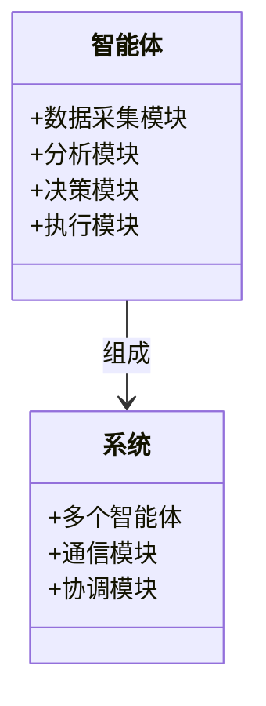
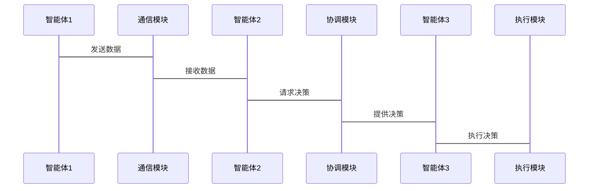

                 


```markdown
# 多智能体系统如何实现动态行业轮动

> 关键词：多智能体系统，动态行业轮动，协作机制，算法实现，系统架构

> 摘要：本文详细探讨了多智能体系统在动态行业轮动中的实现方法。通过分析多智能体系统的协作机制、算法原理和系统架构，结合实际案例，展示了如何利用多智能体系统实现动态行业轮动的高效管理和优化。本文内容涵盖背景介绍、核心概念、算法实现、系统设计和项目实战，为读者提供了全面的技术指导。

---

## 第1章: 多智能体系统与动态行业轮动概述

### 1.1 多智能体系统的基本概念

#### 1.1.1 智能体的定义
智能体（Agent）是指能够感知环境、做出决策并采取行动的实体。智能体可以是软件程序、机器人或其他具有自主行为的实体。

#### 1.1.2 多智能体系统的特征
多智能体系统（Multi-Agent System, MAS）由多个智能体组成，这些智能体通过协作完成复杂的任务。其主要特征包括：
- 分布式：智能体之间没有集中控制。
- 协作性：智能体通过协作完成共同目标。
- 动态性：系统能够适应环境的变化。

#### 1.1.3 多智能体系统与单智能体系统的区别
| 特性         | 单智能体系统           | 多智能体系统           |
|--------------|-----------------------|-----------------------|
| 控制方式     | 集中控制               | 分布式控制             |
| 协作能力     | 单个智能体完成任务       | 多个智能体协作完成任务   |
| 灵活性       | 较低                   | 较高                   |

### 1.2 动态行业轮动的背景与意义

#### 1.2.1 行业轮动的概念
行业轮动是指在市场中，不同行业由于经济周期、政策变化等因素的影响，出现投资机会的轮换现象。

#### 1.2.2 动态行业轮动的挑战
- 市场环境复杂多变。
- 行业间的相互影响。
- 如何高效捕捉投资机会。

#### 1.2.3 多智能体系统在动态行业轮动中的作用
多智能体系统能够通过协作和信息共享，快速适应市场变化，优化投资策略。

### 1.3 多智能体系统的核心要素

#### 1.3.1 智能体的协作机制
智能体之间的协作机制包括：
- 信息共享
- 任务分配
- 决策协调

#### 1.3.2 动态环境下的适应性
多智能体系统需要具备快速调整的能力，以应对环境的变化。

#### 1.3.3 行业轮动中的信息共享
智能体之间通过共享市场数据、行业趋势等信息，提高决策的准确性。

---

## 第2章: 多智能体系统与动态行业轮动的关系

### 2.1 行业轮动的动态特性

#### 2.1.1 行业轮动的周期性
行业轮动通常具有一定的周期性，多智能体系统需要能够识别这些周期。

#### 2.1.2 动态行业轮动的驱动因素
- 经济周期
- 政策变化
- 市场情绪

#### 2.1.3 多智能体系统在动态环境中的优势
- 高度的并行性
- 强大的协作能力
- 快速的响应能力

### 2.2 多智能体系统在行业轮动中的应用

#### 2.2.1 行业轮动中的信息处理
智能体通过处理大量数据，识别行业趋势。

#### 2.2.2 多智能体系统的协作模式
- 分工协作
- 信息共享
- 决策优化

#### 2.2.3 动态行业轮动中的决策机制
智能体通过协商和协作，制定最优的投资策略。

### 2.3 多智能体系统与动态行业轮动的结合

#### 2.3.1 多智能体系统的动态适应性
智能体能够根据环境变化调整自己的行为。

#### 2.3.2 行业轮动中的智能体协作
智能体通过协作，提高市场分析的准确性和效率。

#### 2.3.3 动态环境下的系统优化
通过优化协作机制，提升系统的整体性能。

---

## 第3章: 多智能体系统的协作机制

### 3.1 分布式计算与多智能体协作

#### 3.1.1 分布式计算的基本概念
分布式计算是指在多个计算节点上进行计算的一种方式。

#### 3.1.2 多智能体系统中的分布式计算
智能体通过分布式计算，提高处理能力。

#### 3.1.3 分布式计算在动态行业轮动中的应用
- 数据处理
- 任务分配
- 结果汇总

### 3.2 共识算法与多智能体协作

#### 3.2.1 共识算法的定义与特点
共识算法是一种通过分布式系统中达成一致的算法。

#### 3.2.2 多智能体系统中的共识机制
智能体通过共识算法，确保决策的一致性。

#### 3.2.3 共识算法在动态行业轮动中的应用
- 投资决策
- 风险控制
- 系统优化

### 3.3 强化学习与多智能体协作

#### 3.3.1 强化学习的基本概念
强化学习是一种通过试错的方式，学习最优策略的算法。

#### 3.3.2 多智能体系统中的强化学习
智能体通过强化学习，提高协作效率。

#### 3.3.3 强化学习在动态行业轮动中的应用
- 策略优化
- 行为决策
- 系统适应

---

## 第4章: 动态行业轮动中的算法实现

### 4.1 动态环境下的算法适应性

#### 4.1.1 动态环境对算法的要求
- 灵活性
- 实时性
- 可扩展性

#### 4.1.2 多智能体系统中的算法优化
- 动态调整参数
- 实时更新模型
- 分布式优化

### 4.2 多智能体系统中的算法实现

#### 4.2.1 分布式计算算法
- 分布式计算的具体实现
- 算法的优缺点

#### 4.2.2 共识算法的实现
- 共识算法的具体步骤
- 算法的复杂度分析

#### 4.2.3 强化学习算法的实现
- 强化学习算法的具体实现
- 算法的收敛性分析

### 4.3 动态行业轮动中的算法优化

#### 4.3.1 算法优化的目标
- 提高效率
- 降低复杂度
- 提升准确率

#### 4.3.2 算法优化的策略
- 参数调整
- 模型更新
- 分布式优化

---

## 第5章: 多智能体系统的系统架构设计

### 5.1 问题场景介绍

#### 5.1.1 系统目标
- 实现多智能体协作
- 支持动态行业轮动
- 提供高效的决策支持

#### 5.1.2 系统需求
- 分布式计算能力
- 共识机制
- 强化学习能力

### 5.2 系统功能设计

#### 5.2.1 功能模块划分
- 数据采集模块
- 分析模块
- 决策模块
- 执行模块

#### 5.2.2 领域模型设计


#### 5.2.3 系统架构设计


### 5.3 系统接口设计

#### 5.3.1 系统接口
- 数据接口
- 通信接口
- 协调接口

#### 5.3.2 系统交互


---

## 第6章: 多智能体系统的项目实战

### 6.1 环境安装

#### 6.1.1 系统环境
- 操作系统：Linux/Windows
- 开发工具：Python, PyTorch, TensorFlow

#### 6.1.2 依赖安装
```bash
pip install numpy matplotlib scikit-learn
```

### 6.2 核心代码实现

#### 6.2.1 分布式计算实现
```python
import numpy as np

def distributed_computation(data):
    # 分割数据
    n = len(data)
    chunk_size = n // 4
    chunks = [data[i:i+chunk_size] for i in range(0, n, chunk_size)]
    
    # 分布式计算
    results = []
    for chunk in chunks:
        result = np.mean(chunk)
        results.append(result)
    
    return results
```

#### 6.2.2 共识算法实现
```python
def consensus_algorithm(nodes, values):
    # 计算平均值
    avg = sum(values) / len(values)
    
    # 更新节点值
    for i in range(len(nodes)):
        nodes[i] = avg
    return nodes
```

#### 6.2.3 强化学习实现
```python
import torch
import torch.nn as nn

class DQN(nn.Module):
    def __init__(self, input_dim, output_dim):
        super(DQN, self).__init__()
        self.fc = nn.Linear(input_dim, output_dim)
    
    def forward(self, x):
        return self.fc(x)
```

### 6.3 代码解读与分析

#### 6.3.1 分布式计算代码解读
- 将数据分割成多个块
- 分别计算每个块的均值
- 返回所有块的均值结果

#### 6.3.2 共识算法代码解读
- 计算所有节点值的平均值
- 更新所有节点的值为平均值
- 返回更新后的节点值

#### 6.3.3 强化学习代码解读
- 定义深度神经网络模型
- 前向传播计算输出

### 6.4 实际案例分析

#### 6.4.1 案例背景
假设我们有一个投资组合，需要根据市场变化动态调整投资策略。

#### 6.4.2 案例实现
```python
# 初始化智能体
agents = [Agent() for _ in range(4)]

# 初始化数据
market_data = generate_data()

# 分布式计算
results = distributed_computation(market_data)

# 共识算法
consensus_values = consensus_algorithm(agents, results)

# 强化学习
policy = DQN(len(consensus_values), 1)
train(policy, consensus_values)
```

#### 6.4.3 案例分析
- 分布式计算提高了数据处理效率
- 共识算法确保了决策的一致性
- 强化学习优化了投资策略

### 6.5 项目小结

#### 6.5.1 项目总结
- 成功实现了多智能体系统的协作
- 提高了动态行业轮动的决策效率
- 验证了算法的有效性

#### 6.5.2 项目优化
- 进一步优化算法性能
- 提高系统的可扩展性
- 改善系统的实时性

---

## 第7章: 总结与展望

### 7.1 全文总结
本文详细探讨了多智能体系统在动态行业轮动中的实现方法，从背景介绍、核心概念、算法实现到系统设计和项目实战，为读者提供了全面的技术指导。

### 7.2 关键点回顾
- 多智能体系统的协作机制
- 动态行业轮动的算法实现
- 系统架构设计

### 7.3 展望
- 研究更高效的算法
- 提高系统的实时性和可扩展性
- 推动多智能体系统在更多领域的应用

---

## 作者信息

作者：AI天才研究院/AI Genius Institute & 禅与计算机程序设计艺术 /Zen And The Art of Computer Programming
```

