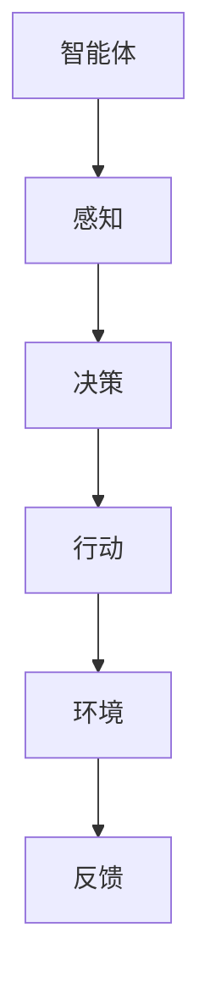
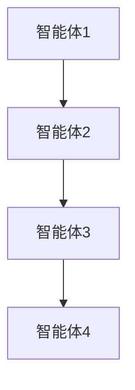
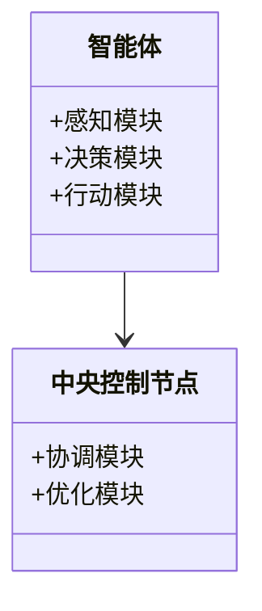
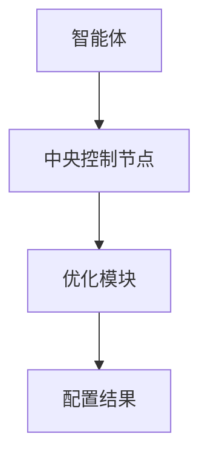
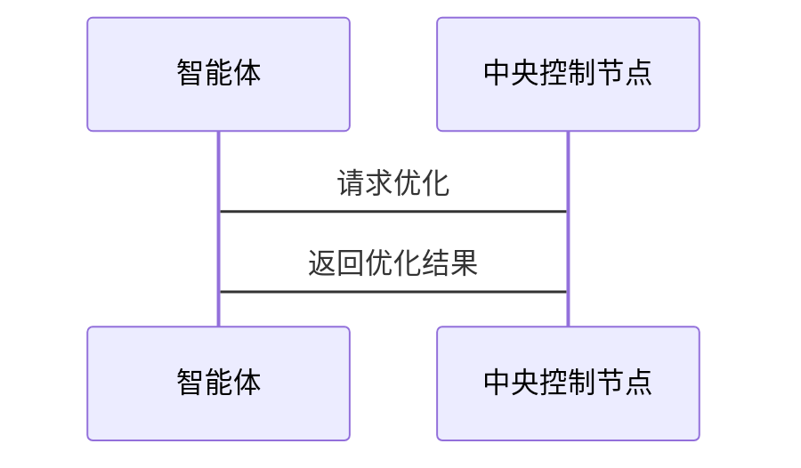

                 


# 多智能体系统如何实现动态资产配置

> 关键词：多智能体系统，动态资产配置，多智能体协调算法，动态资产优化，金融投资

> 摘要：本文将深入探讨多智能体系统如何实现动态资产配置，从背景介绍、核心概念、算法原理、系统架构到项目实战，全面解析多智能体系统在动态资产配置中的应用与实现。通过详细分析多智能体系统的原理、动态资产配置的数学模型、优化算法的设计与实现，结合实际案例，帮助读者理解如何利用多智能体系统实现高效的动态资产配置。

---

## 第一部分: 多智能体系统与动态资产配置概述

### 第1章: 多智能体系统与动态资产配置的背景介绍

#### 1.1 多智能体系统的定义与特点

##### 1.1.1 多智能体系统的定义
多智能体系统（Multi-Agent Systems, MAS）是由多个智能体组成的系统，这些智能体能够通过协作和交互完成复杂的任务。智能体是具有感知、决策、推理和行动能力的实体。



##### 1.1.2 多智能体系统的属性特征对比

| 属性 | 特征 |
|------|------|
| 分布性 | 分布式计算与协作 |
| 协作性 | 智能体之间通过协作完成任务 |
| 反应性 | 能够实时感知环境并做出反应 |
| 灵活性 | 系统能够适应环境变化 |

##### 1.1.3 多智能体系统的ER实体关系图

```mermaid
erd
    客户
    组织
    智能体
    任务
    交互
    感知
    决策
    行动
```

#### 1.2 动态资产配置的背景与意义

##### 1.2.1 资产配置的基本概念
资产配置是将资金分配到不同的资产类别（如股票、债券、房地产等）以实现投资目标的过程。

##### 1.2.2 动态资产配置的定义
动态资产配置是一种根据市场环境变化动态调整资产分配比例的策略，旨在最大化投资收益或最小化风险。

##### 1.2.3 动态资产配置的必要性与挑战
- **必要性**：市场环境变化（如经济波动、政策变化）需要动态调整。
- **挑战**：资产类别多样、市场波动频繁、信息更新速度快。

#### 1.3 多智能体系统在动态资产配置中的应用

##### 1.3.1 多智能体系统与动态资产配置的结合
通过多智能体系统实现资产的动态分配，每个智能体负责特定的资产类别或市场分析。

##### 1.3.2 多智能体系统在金融领域的优势
- 分布式决策：每个智能体独立决策，降低集中风险。
- 协作优化：通过协作实现全局最优配置。

##### 1.3.3 动态资产配置的核心问题与边界
- **核心问题**：如何动态调整资产配置以应对市场变化。
- **边界**：资产配置的范围、调整的频率、系统的实时性要求。

---

### 第2章: 多智能体系统与动态资产配置的核心概念

#### 2.1 多智能体系统的原理与机制

##### 2.1.1 多智能体系统的通信机制
智能体之间通过消息传递进行通信，可以使用基于图的通信模型。



##### 2.1.2 多智能体系统的协作机制
通过任务分配、协调和同步实现协作。

##### 2.1.3 多智能体系统的决策机制
基于感知信息和目标函数做出决策。

#### 2.2 动态资产配置的数学模型与优化目标

##### 2.2.1 资产配置的数学模型
$$ \text{目标函数} = \sum_{i=1}^{n} w_i r_i $$
其中，\( w_i \) 是资产 \( i \) 的权重，\( r_i \) 是资产 \( i \) 的预期收益。

##### 2.2.2 动态资产配置的优化目标
最大化收益或最小化风险。

##### 2.2.3 动态资产配置的约束条件
$$ \sum_{i=1}^{n} w_i = 1 $$

#### 2.3 多智能体系统与动态资产配置的关联

##### 2.3.1 多智能体系统在资产配置中的角色
- **信息收集**：智能体实时收集市场数据。
- **决策制定**：基于数据进行资产配置决策。

##### 2.3.2 动态资产配置的多智能体实现
通过多个智能体分别负责不同资产类别的配置。

##### 2.3.3 多智能体系统对动态资产配置的优化作用
- 提高决策效率。
- 实现分布式优化。

---

### 第3章: 多智能体系统与动态资产配置的算法原理

#### 3.1 多智能体系统的协调算法

##### 3.1.1 分布式协调算法
通过局部信息交换实现全局协调。

##### 3.1.2 集中式协调算法
由中央控制节点协调所有智能体的行动。

##### 3.1.3 基于博弈论的协调算法
通过博弈论模型实现智能体之间的协调。

#### 3.2 动态资产配置的优化算法

##### 3.2.1 基于动态规划的优化算法
通过动态规划方法优化资产配置。

##### 3.2.2 基于强化学习的优化算法
通过强化学习算法实现动态调整。

##### 3.2.3 基于遗传算法的优化算法
通过遗传算法优化资产配置比例。

#### 3.3 多智能体系统与动态资产配置的联合算法

##### 3.3.1 联合优化算法的框架
1. 智能体感知市场信息。
2. 智能体协作制定配置策略。
3. 执行配置并反馈结果。

##### 3.3.2 联合优化算法的实现步骤
- 数据收集：智能体收集市场数据。
- 模型建立：建立动态资产配置模型。
- 优化求解：求解优化问题。
- 反馈调整：根据结果调整配置。

##### 3.3.3 联合优化算法的数学模型
$$ \text{目标函数} = \sum_{i=1}^{n} w_i r_i $$
$$ \text{约束条件} = \sum_{i=1}^{n} w_i = 1 $$

---

### 第4章: 多智能体系统与动态资产配置的系统分析与架构设计

#### 4.1 系统分析与需求分析

##### 4.1.1 问题场景介绍
动态资产配置需要实时调整资产比例，应对市场波动。

##### 4.1.2 系统功能需求
- 数据采集：实时采集市场数据。
- 模型构建：建立动态资产配置模型。
- 优化求解：求解优化问题。
- 结果反馈：输出配置结果。

#### 4.2 系统架构设计

##### 4.2.1 系统功能设计


##### 4.2.2 系统架构图


#### 4.3 系统接口与交互设计

##### 4.3.1 系统接口设计
- 数据接口：智能体与数据源的接口。
- 控制接口：中央控制节点的控制接口。

##### 4.3.2 系统交互流程图


---

### 第5章: 多智能体系统与动态资产配置的项目实战

#### 5.1 项目环境安装与配置

##### 5.1.1 环境配置
- 安装Python、NumPy、Pandas、Scipy。
- 安装相关机器学习库（如TensorFlow、PyTorch）。

##### 5.1.2 项目代码结构
- 数据采集模块。
- 模型构建模块。
- 优化求解模块。
- 结果展示模块。

#### 5.2 系统核心代码实现

##### 5.2.1 智能体代码实现
```python
class Agent:
    def __init__(self, name):
        self.name = name
        self.sensors = []
        self.actuators = []
    
    def感知(self):
        # 获取市场数据
        pass
    
    def决策(self):
        # 计算配置比例
        pass
    
    def行动(self):
        # 执行配置
        pass
```

##### 5.2.2 优化算法实现
```python
import numpy as np

def动态资产配置优化(returns, weights):
    # 目标函数
    def目标函数(weights):
        return -np.dot(weights, returns)
    
    # 约束条件
    cons = ({
        'type': 'eq',
        'fun': lambda weights: np.sum(weights) - 1
    })
    
    # 求解优化问题
    res = optimize.minimize(目标函数, weights, constraints=cons, bounds=[(0,1)]*len(weights))
    return res.x
```

#### 5.3 项目案例分析与实现

##### 5.3.1 案例分析
假设市场有3种资产，预期收益率分别为0.1、0.15、0.2，求动态资产配置比例。

##### 5.3.2 实现与结果展示
通过优化算法求解，得到最优配置比例。

#### 5.4 项目小结

---

### 第6章: 多智能体系统与动态资产配置的最佳实践

#### 6.1 总结与反思

##### 6.1.1 总结
多智能体系统能够有效实现动态资产配置，提高投资效率。

##### 6.1.2 反思
需要解决的问题：数据实时性、智能体协作效率、系统可扩展性。

#### 6.2 小结与注意事项

##### 6.2.1 小结
多智能体系统与动态资产配置的结合能够有效应对市场变化。

##### 6.2.2 注意事项
- 确保数据实时性。
- 优化协作机制。
- 提高系统的可扩展性。

#### 6.3 拓展阅读建议

##### 6.3.1 推荐书籍
- 《Multi-Agent Systems》
- 《Dynamic Asset Allocation》

##### 6.3.2 推荐论文
- "Multi-Agent Systems in Financial Markets"
- "Dynamic Asset Allocation with Machine Learning"

---

## 作者：AI天才研究院/AI Genius Institute & 禅与计算机程序设计艺术 /Zen And The Art of Computer Programming

