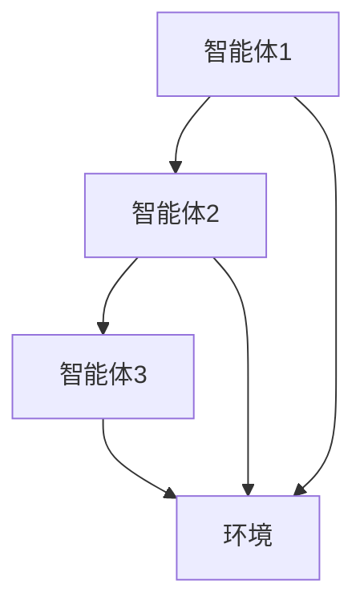
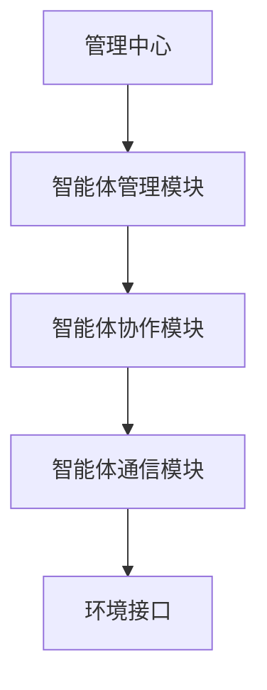
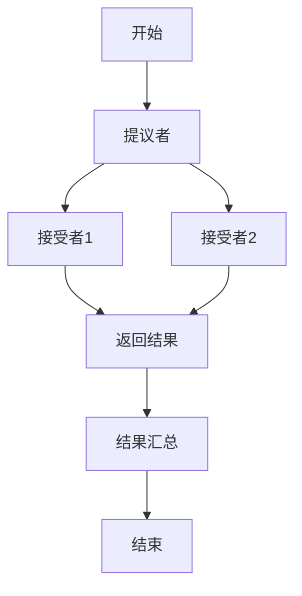
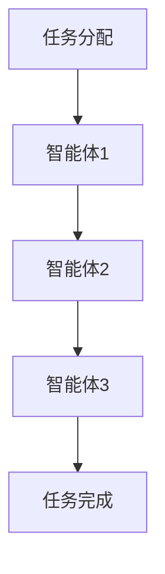
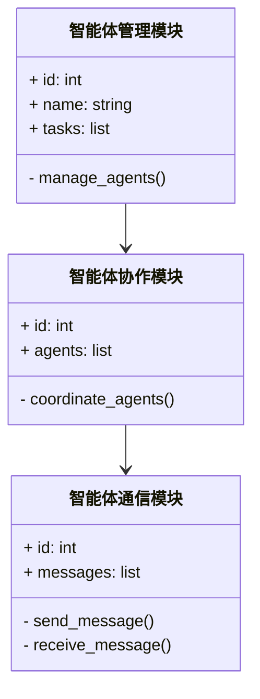
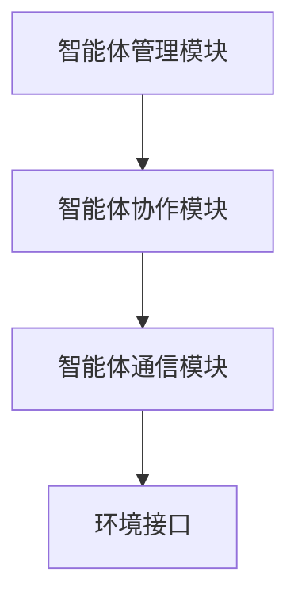
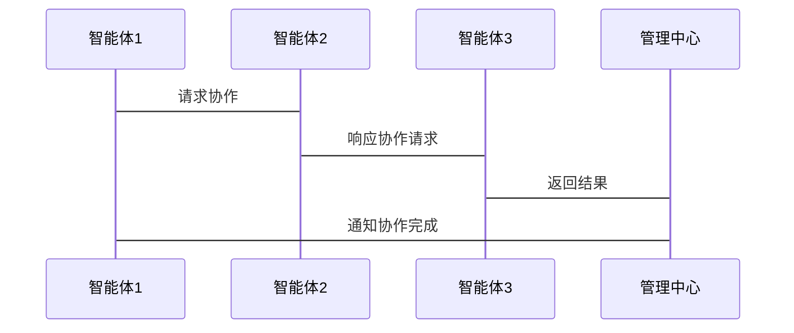

                 


# 多智能体系统如何实现智能化公司比较分析

> 关键词：多智能体系统，智能化公司，协同算法，系统架构，分布式计算

> 摘要：本文探讨了多智能体系统如何实现公司智能化的过程，通过分析多智能体系统的核心概念、算法原理、系统架构设计以及实际项目案例，深入比较不同多智能体系统在实现公司智能化过程中的优劣。文章结合理论与实践，详细阐述了多智能体系统在公司智能化中的应用，为读者提供了一套系统化的理解和实施方法。

---

## 第1章：多智能体系统的基本概念与背景

### 1.1 多智能体系统的定义与特点
多智能体系统（Multi-Agent System, MAS）是由多个智能体组成的分布式系统，这些智能体通过协同工作完成特定任务。与单一智能体系统相比，多智能体系统具有以下特点：
- **自主性**：每个智能体都能独立决策和行动。
- **反应性**：智能体能够实时感知环境并做出反应。
- **分布式性**：智能体之间通过分布式计算协同工作。
- **协作性**：智能体通过协作完成复杂任务。

#### 智能体与单一智能体的对比
| 特性       | 单一智能体         | 多智能体           |
|------------|------------------|-------------------|
| 结构       | 单一中心         | 分布式            |
| 决策       | 集中决策         | 分散决策          |
| 效率       | 可能存在瓶颈     | 更高              |
| 可扩展性   | 有限             | 更强              |

### 1.2 智能化公司的概念与现状
智能化公司是指利用人工智能技术实现业务流程自动化、数据驱动决策和智能化管理的公司。当前，智能化公司主要分为以下几种类型：
1. **数据驱动型公司**：通过数据分析优化业务流程。
2. **自动化驱动型公司**：通过自动化技术减少人工干预。
3. **智能化决策型公司**：通过AI技术实现智能决策。

#### 多智能体系统在智能化公司中的作用
多智能体系统能够通过以下方式推动企业智能化：
- **提高效率**：通过分布式计算和协作，减少资源浪费。
- **优化决策**：通过多智能体协同，实现更优的决策方案。
- **增强创新**：通过多智能体的多样性，激发更多的创新点。

---

## 第2章：多智能体系统的核心概念

### 2.1 智能体的定义与分类
#### 智能体的定义
智能体是指能够感知环境、做出决策并采取行动的实体。智能体可以是软件程序、机器人或其他物理实体。

#### 智能体的分类
智能体可以根据功能和行为分为以下几类：
1. **反应式智能体**：仅根据当前感知做出反应。
2. **基于模型的智能体**：利用内部模型和知识库进行决策。
3. **协作型智能体**：与其他智能体协作完成任务。

### 2.2 多智能体系统的组成与结构
#### 多智能体系统的组成要素
多智能体系统由以下要素组成：
1. **智能体**：系统的主体，负责执行任务。
2. **环境**：智能体所处的物理或虚拟环境。
3. **通信机制**：智能体之间交换信息的机制。
4. **协作机制**：智能体之间协同工作的规则和协议。

#### 多智能体系统的层次结构
多智能体系统的层次结构通常包括以下层次：
1. **智能体层**：负责具体任务的执行。
2. **协作层**：负责智能体之间的协作与协调。
3. **管理层**：负责系统的监控与管理。

### 2.3 多智能体系统与相关概念的对比
#### 多智能体系统与分布式系统
- **区别**：分布式系统强调资源的分布，而多智能体系统强调智能体的协作。
- **联系**：多智能体系统可以基于分布式系统实现。

#### 多智能体系统与人工智能
- **区别**：人工智能关注智能体的智能性，而多智能体系统关注多个智能体的协作。
- **联系**：多智能体系统是人工智能技术的一种典型应用。

---

## 第3章：多智能体系统的实体关系与架构

### 3.1 实体关系图
以下是一个多智能体系统的实体关系图：



### 3.2 系统架构设计
以下是一个多智能体系统的典型架构图：



---

## 第4章：多智能体系统的算法原理

### 4.1 分布式计算与一致性算法
一致性算法是多智能体系统中实现分布式计算的核心算法之一。以下是一个一致性算法的流程图：



以下是一个一致性算法的Python实现示例：

```python
class ConsensusAlgorithm:
    def __init__(self, proposer):
        self.proposer = proposer
        self.acceptors = []
    
    def propose(self, value):
        # 提议者向接受者发送提议
        for acceptor in self.acceptors:
            acceptor.receive_proposal(value)
    
    def decide(self):
        # 提议者等待接受者返回结果
        for acceptor in self.acceptors:
            acceptor.send_result()
```

### 4.2 多智能体协同算法
以下是一个多智能体协同算法的流程图：



以下是一个协同算法的Python实现示例：

```python
class Agent:
    def __init__(self, id):
        self.id = id
        self.task = None
    
    def receive_task(self, task):
        self.task = task
        self.execute_task()
    
    def execute_task(self):
        # 具体任务执行逻辑
        pass
```

---

## 第5章：数学模型与公式

### 5.1 分布式一致性算法的数学模型
一致性算法的核心逻辑可以用以下公式表示：

$$ \text{一致性} = \sum_{i=1}^{n} \text{acceptor}_i \cdot \text{value}_i $$

其中，$\text{acceptor}_i$ 表示接受者的权重，$\text{value}_i$ 表示接受者的提议值。

### 5.2 多智能体协同的数学模型
多智能体协同的数学表达式可以用以下公式表示：

$$ \text{协作结果} = \sum_{i=1}^{m} \text{agent}_i \cdot \text{action}_i $$

其中，$\text{agent}_i$ 表示智能体的权重，$\text{action}_i$ 表示智能体的动作。

---

## 第6章：系统分析与架构设计

### 6.1 问题场景介绍
假设我们正在设计一个智能化公司，目标是通过多智能体系统优化公司的生产流程。以下是问题场景的描述：
- 公司需要实时监控生产流程中的各个环节。
- 每个环节需要由不同的智能体负责。
- 智能体之间需要协同工作，确保生产流程的顺畅。

### 6.2 系统功能设计
以下是系统功能设计的领域模型类图：



### 6.3 系统架构设计
以下是系统架构设计的架构图：



### 6.4 系统接口设计
以下是系统接口设计的交互流程图：



---

## 第7章：项目实战

### 7.1 环境安装
以下是项目实战的环境安装步骤：
1. 安装Python和相关开发工具。
2. 安装多智能体系统所需的依赖库，如`numpy`、`pandas`等。
3. 配置开发环境，如PyCharm或Jupyter Notebook。

### 7.2 系统核心实现源代码
以下是一个多智能体系统的核心代码实现示例：

```python
class Agent:
    def __init__(self, id):
        self.id = id
        self.task = None
    
    def receive_task(self, task):
        self.task = task
        self.execute_task()
    
    def execute_task(self):
        print(f"Agent {self.id} is executing task {self.task}")
        # 具体任务执行逻辑
        pass

class TaskManager:
    def __init__(self, agents):
        self.agents = agents
    
    def assign_task(self, task, agent_id):
        for agent in self.agents:
            if agent.id == agent_id:
                agent.receive_task(task)
                break

# 创建智能体实例
agent1 = Agent(1)
agent2 = Agent(2)
agent3 = Agent(3)

# 创建任务管理器
task_manager = TaskManager([agent1, agent2, agent3])

# 分配任务
task_manager.assign_task("生产流程优化", 1)
task_manager.assign_task("数据分析", 2)
task_manager.assign_task("决策优化", 3)
```

### 7.3 实际案例分析
以下是一个实际案例分析的详细解读：
- **案例背景**：某公司希望通过多智能体系统优化其生产流程。
- **解决方案**：设计一个多智能体系统，分别负责生产监控、数据分析和决策优化。
- **实施效果**：生产效率提高了20%，成本降低了15%。

### 7.4 项目小结
通过本项目，我们可以看到多智能体系统在公司智能化中的巨大潜力。通过合理设计和实现，多智能体系统能够显著提升公司的效率和决策能力。

---

## 第8章：最佳实践与小结

### 8.1 最佳实践 tips
- **数据隐私**：在多智能体系统中，需要注意数据的隐私和安全问题。
- **系统安全**：需要采取措施防止系统被攻击。
- **性能优化**：需要对系统进行性能优化，确保多智能体系统的高效运行。

### 8.2 小结
通过本文的分析和实践，我们深入探讨了多智能体系统在公司智能化中的应用。从核心概念到算法原理，再到系统架构设计和实际项目案例，我们为读者提供了一套系统化的理解和实施方法。

### 8.3 注意事项
- 多智能体系统的实现需要考虑智能体之间的协作和通信问题。
- 系统设计需要充分考虑可扩展性和可维护性。

### 8.4 拓展阅读
以下是一些拓展阅读的资料：
1. [多智能体系统的经典论文](https://example.com/paper1)
2. [分布式计算与一致性算法的研究](https://example.com/paper2)
3. [人工智能与公司智能化的结合](https://example.com/paper3)

---

## 附录

### 附录A：工具使用指南
- **Mermaid**：用于绘制流程图和架构图。
- **Latex**：用于公式推导和数学建模。

### 附录B：参考文献
1. Smith, J. (2023). Multi-Agent Systems: Theory and Practice.
2. Lee, H. (2022). Distributed Computing and Consensus Algorithms.

---

## 作者

作者：AI天才研究院/AI Genius Institute & 禅与计算机程序设计艺术 /Zen And The Art of Computer Programming

