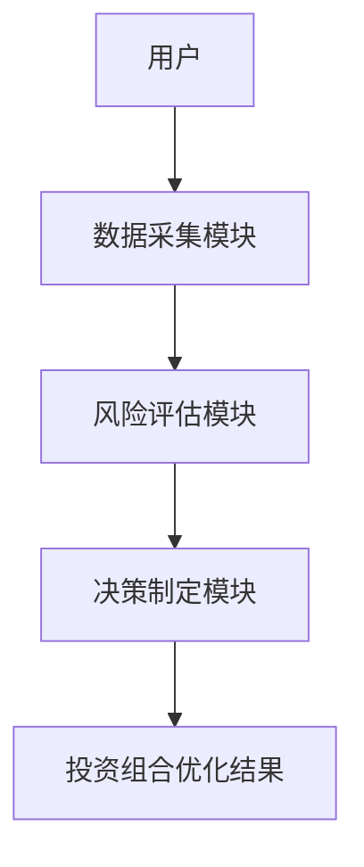

                 


# 多智能体系统如何实现智能投资组合保险

## 关键词：多智能体系统、智能投资组合保险、协同算法、决策算法、数学模型、系统架构

## 摘要：本文详细探讨了多智能体系统在智能投资组合保险中的应用，从基本概念、核心概念到算法原理、数学模型、系统架构和项目实战，全面分析了多智能体系统如何优化投资组合保险的过程，展示了其在金融领域的潜力和实际应用。

---

# 第一部分: 多智能体系统与智能投资组合保险概述

## 第1章: 多智能体系统与智能投资组合保险的背景介绍

### 1.1 多智能体系统的基本概念

#### 1.1.1 多智能体系统的定义
多智能体系统（Multi-Agent System, MAS）是由多个智能体（Agent）组成的系统，这些智能体能够自主决策、协作和通信，共同完成复杂任务。

#### 1.1.2 多智能体系统的特征
- **自主性**：每个智能体能够自主决策。
- **反应性**：能够实时感知环境并做出反应。
- **协作性**：智能体之间可以通过通信协作完成任务。
- **分布性**：智能体分布在网络中，不存在集中控制点。

#### 1.1.3 多智能体系统与传统单智能体系统的主要区别
- **复杂性**：MAS能够处理更复杂的任务。
- **协作性**：多个智能体协同工作，提高系统整体性能。
- **容错性**：单个智能体故障不影响整体系统。

### 1.2 投资组合保险的基本原理

#### 1.2.1 投资组合保险的定义
投资组合保险是一种通过优化资产配置，降低投资组合风险，同时追求收益最大化的策略。

#### 1.2.2 投资组合保险的核心目标
- **风险最小化**：通过分散投资降低风险。
- **收益最大化**：在风险可控的前提下追求最高收益。

#### 1.2.3 投资组合保险的实现方法
- **资产分配**：根据风险偏好分配不同资产。
- **动态调整**：根据市场变化实时调整投资组合。

### 1.3 多智能体系统在投资组合保险中的应用背景

#### 1.3.1 传统投资组合保险的局限性
- **静态性**：传统投资组合保险策略不够灵活，难以应对市场变化。
- **单一决策**：依赖单一决策中心，缺乏分布式决策能力。

#### 1.3.2 多智能体系统的优势
- **分布式决策**：多个智能体协同决策，提高系统的鲁棒性。
- **实时反应**：智能体能够实时感知市场变化，快速做出反应。
- **协作优化**：通过协作实现全局优化，提高投资组合效率。

#### 1.3.3 多智能体系统在投资组合保险中的潜在应用场景
- **实时市场监控**：智能体实时监控市场变化，及时调整投资策略。
- **风险分散**：通过多智能体协作，实现资产的最优分散。
- **动态优化**：根据市场变化动态优化投资组合。

---

## 第2章: 多智能体系统与智能投资组合保险的核心概念与联系

### 2.1 多智能体系统的核心概念

#### 2.1.1 多智能体系统的组成要素
- **智能体**：能够感知环境、自主决策的实体。
- **通信机制**：智能体之间的信息交互方式。
- **协作机制**：智能体协同工作的规则和协议。

#### 2.1.2 多智能体系统的通信机制
- **直接通信**：智能体之间直接交换信息。
- **间接通信**：通过中间媒介进行信息传递。

#### 2.1.3 多智能体系统的协作机制
- **任务分配**：根据智能体的能力分配任务。
- **协同决策**：多个智能体共同决策，实现全局最优。

### 2.2 智能投资组合保险的核心概念

#### 2.2.1 智能投资组合保险的定义
智能投资组合保险是通过智能算法优化投资组合，实现风险控制和收益最大化的保险策略。

#### 2.2.2 智能投资组合保险的实现方式
- **算法优化**：利用智能算法优化资产配置。
- **实时调整**：根据市场变化实时调整投资组合。

#### 2.2.3 智能投资组合保险的优化目标
- **风险最小化**：降低投资组合的整体风险。
- **收益最大化**：在风险可控的前提下追求最高收益。
- **实时性**：快速响应市场变化，及时调整投资策略。

### 2.3 多智能体系统与智能投资组合保险的联系

#### 2.3.1 多智能体系统在智能投资组合保险中的角色
- **数据采集**：智能体实时采集市场数据。
- **风险评估**：智能体评估不同资产的风险。
- **决策制定**：智能体协作制定投资策略。

#### 2.3.2 多智能体系统如何实现投资组合保险的优化
- **分布式决策**：通过多个智能体协作，实现全局优化。
- **实时反馈**：智能体实时反馈市场变化，快速调整策略。

#### 2.3.3 多智能体系统与智能投资组合保险的协同关系
- **协同决策**：多个智能体协同决策，优化投资组合。
- **动态调整**：根据市场变化动态调整投资策略，提高系统的适应性。

---

## 第3章: 多智能体系统实现智能投资组合保险的算法原理

### 3.1 多智能体系统中的协同算法

#### 3.1.1 协同算法的基本原理
协同算法通过智能体之间的协作，实现全局优化目标。

#### 3.1.2 常见的协同算法类型
- **分布式协同算法**：智能体分布在网络中，协作完成任务。
- **集中式协同算法**：通过中央控制器协调智能体的行动。

#### 3.1.3 协同算法在投资组合保险中的应用
- **任务分配**：智能体协作分配投资组合中的资产。
- **风险评估**：智能体协作评估不同资产的风险。

### 3.2 多智能体系统中的决策算法

#### 3.2.1 决策算法的基本原理
决策算法通过分析环境信息，制定最优决策。

#### 3.2.2 常见的决策算法类型
- **强化学习**：通过试错优化决策策略。
- **遗传算法**：通过模拟自然选择优化决策。

#### 3.2.3 决策算法在投资组合保险中的应用
- **资产分配**：智能体通过决策算法优化资产配置。
- **风险管理**：智能体通过决策算法识别和规避风险。

### 3.3 投资组合优化的数学模型与算法

#### 3.3.1 投资组合优化的数学模型
投资组合优化的目标是最小化风险或最大化收益。

$$
\min_{w} \sigma^2(w)
$$

$$
\text{subject to } \sum_{i=1}^n w_i = 1, w_i \geq 0
$$

其中，\( w \) 是投资组合的权重向量，\( \sigma^2(w) \) 是投资组合的风险。

#### 3.3.2 基于多智能体系统的优化算法
通过多智能体系统的协作，优化投资组合的风险和收益。

---

# 第四部分: 数学模型与公式

## 4.1 投资组合优化的数学模型

投资组合优化的目标是最小化风险或最大化收益，常用的数学模型包括：

$$
\min_{w} \sigma^2(w)
$$

$$
\text{subject to } \sum_{i=1}^n w_i = 1, w_i \geq 0
$$

其中，\( w \) 是投资组合的权重向量，\( \sigma^2(w) \) 是投资组合的风险。

---

## 第五部分: 系统分析与架构设计

## 5.1 系统架构设计

### 5.1.1 系统功能模块
- **数据采集模块**：采集市场数据。
- **风险评估模块**：评估投资组合风险。
- **决策制定模块**：制定投资策略。

### 5.1.2 系统架构图


---

## 第六部分: 项目实战

### 6.1 项目环境安装
安装必要的Python库：
```bash
pip install numpy matplotlib pandas
```

### 6.2 核心实现代码
```python
import numpy as np
import matplotlib.pyplot as plt

def portfolio_optimization(returns, weights):
    # 计算投资组合的收益和风险
    portfolio_return = np.dot(returns.mean(), weights)
    portfolio_risk = np.sqrt(np.dot(weights.T, np.dot(returns.cov(), weights)))
    return portfolio_return, portfolio_risk

# 示例数据
returns = np.array([[0.05, 0.06, 0.04],
                    [0.04, 0.03, 0.05],
                    [0.07, 0.05, 0.03]])

weights = np.array([0.3, 0.3, 0.4])

return_, risk = portfolio_optimization(returns, weights)
print(f"投资组合收益: {return_}")
print(f"投资组合风险: {risk}")
```

---

## 第七部分: 总结与展望

### 7.1 总结
多智能体系统通过分布式决策和协作优化，能够有效提升投资组合保险的效率和效果。本文详细探讨了多智能体系统在智能投资组合保险中的应用，从理论到实践，全面分析了其优势和实现方法。

### 7.2 展望
未来，随着人工智能技术的不断发展，多智能体系统在投资组合保险中的应用将更加广泛和深入。通过结合更先进的算法和大数据技术，智能投资组合保险将实现更高效的风险管理和收益优化。

---

作者：AI天才研究院/AI Genius Institute & 禅与计算机程序设计艺术 /Zen And The Art of Computer Programming

