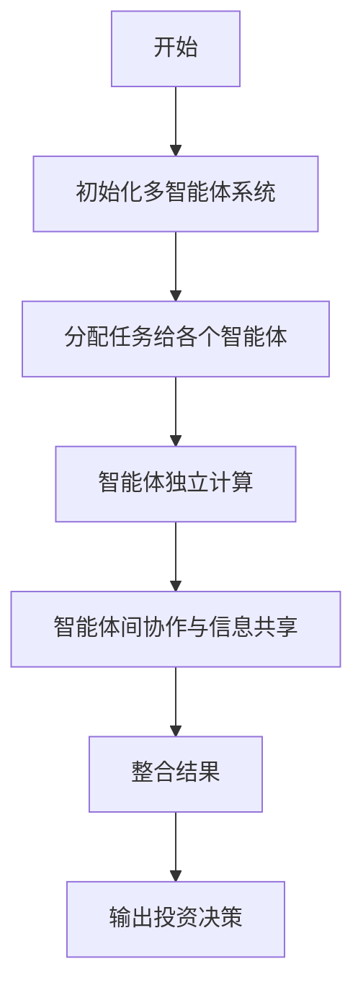
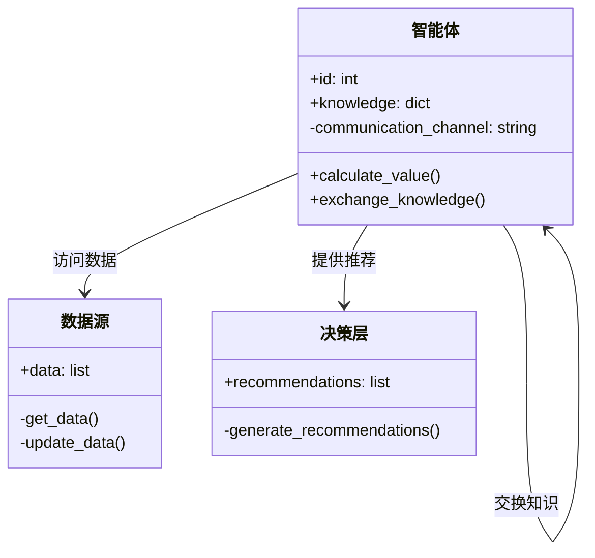
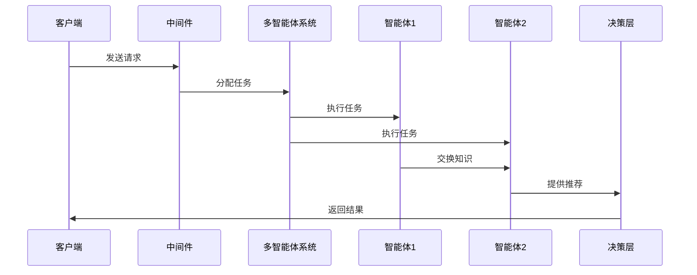

                 


# 多智能体系统如何改进传统价值投资模型

> 关键词：多智能体系统，价值投资模型，分布式计算，协作学习，金融数据分析

> 摘要：本文探讨了多智能体系统如何通过分布式计算和协作学习优化传统价值投资模型，分析其在金融数据分析中的优势，并通过实际案例展示其应用。

---

# 第1章 多智能体系统与价值投资模型的背景介绍

## 1.1 多智能体系统的基本概念

### 1.1.1 多智能体系统的定义
多智能体系统（Multi-Agent System, MAS）由多个智能体组成，每个智能体能够独立决策，通过协作完成复杂任务。

### 1.1.2 多智能体系统的核心特征
| 特征 | 描述 |
|------|------|
| 分布式 | 各智能体独立计算 |
| 协作性 | 智能体间共享信息 |
| 反应性 | 能感知环境变化 |

### 1.1.3 多智能体系统在金融领域的应用潜力
- 数据分析
- 风险管理
- 自动化交易

## 1.2 传统价值投资模型的概述

### 1.2.1 价值投资模型的基本原理
基于基本面分析，寻找被低估的股票。

### 1.2.2 传统价值投资模型的优势与局限性
| 优势 | 局限性 |
|------|------|
| 长期稳定 | 计算效率低 |
| 低风险 | 数据量不足 |

### 1.2.3 价值投资模型在现代金融中的地位
传统模型仍占主导，但需优化以应对复杂市场。

## 1.3 多智能体系统与价值投资模型的结合意义

### 1.3.1 为什么需要将多智能体系统引入价值投资模型
- 提高计算效率
- 增强分析深度

### 1.3.2 多智能体系统如何优化传统价值投资模型
通过协作学习和分布式计算，提升数据处理能力。

### 1.3.3 结合后的潜在应用场景
- 多市场分析
- 风险分散投资
- 自动化决策支持

---

# 第2章 多智能体系统与价值投资模型的核心概念与联系

## 2.1 多智能体系统的原理

### 2.1.1 分布式计算与协作学习
- 分布式计算：任务分解，独立处理。
- 协作学习：信息共享，模型优化。

### 2.1.2 多智能体系统中的通信机制
- 消息传递协议
- 信息共享机制

### 2.1.3 多智能体系统的任务分配与协调
- 分层架构：协调器分配任务。
- 自适应调整：动态优化任务分配。

## 2.2 价值投资模型的数学基础

### 2.2.1 价值投资模型的数学公式
$$ V = \frac{E}{k} $$  
其中，V为内在价值，E为预期收益，k为折现率。

### 2.2.2 价值投资模型的输入与输出
- 输入：公司财务数据、行业分析。
- 输出：股票估值、投资建议。

### 2.2.3 价值投资模型的关键参数分析
| 参数 | 描述 |
|------|------|
| E | 预期收益 |
| k | 折现率 |

## 2.3 多智能体系统与价值投资模型的联系

### 2.3.1 多智能体系统如何增强价值投资模型的计算能力
- 分布式计算：提升数据处理速度。
- 协作学习：优化模型精度。

### 2.3.2 多智能体系统如何提高价值投资模型的决策效率
- 并行处理：减少计算时间。
- 协作优化：提高决策准确性。

### 2.3.3 多智能体系统如何优化价值投资模型的风险评估
- 多角度分析：降低模型偏差。
- 实时更新：提高风险预警能力。

---

# 第3章 多智能体系统改进价值投资模型的算法原理

## 3.1 分布式计算算法

### 3.1.1 分布式计算的基本原理
- 任务分解：将大任务拆分为小任务。
- 并行处理：各节点独立计算。
- 结果汇总：整合各节点结果。

### 3.1.2 分布式计算在多智能体系统中的应用
- 数据采集：各智能体收集不同数据源。
- 数据处理：并行分析数据。

### 3.1.3 分布式计算算法的优缺点分析
| 优点 | 缺点 |
|------|------|
| 高效 | 需要协调机制 |
| 并行处理能力强 | 故障容错性低 |

## 3.2 协作学习算法

### 3.2.1 协作学习的基本概念
- 多智能体通过协作提高模型准确性。
- 每个智能体学习部分数据，然后共享结果。

### 3.2.2 协作学习在多智能体系统中的实现
- 信息共享协议
- 模型融合策略

### 3.2.3 协作学习算法的数学模型
$$ f_i = \sum_{j=1}^{n} w_{ij}x_j $$
其中，$f_i$是第i个智能体的模型，$w_{ij}$是权重，$x_j$是输入。

## 3.3 多智能体系统改进价值投资模型的算法流程

### 3.3.1 算法流程图（使用 Mermaid）


## 3.4 价值投资模型的改进实现

### 3.4.1 改进后的数学模型
$$ V' = \sum_{i=1}^{m} f_i(V_i) $$
其中，$f_i$是第i个智能体的模型，$V_i$是部分数据。

---

# 第4章 多智能体系统与价值投资模型的系统分析与架构设计

## 4.1 问题场景介绍
- 多市场数据源需要分析。
- 高效计算和决策需求。

## 4.2 项目介绍
- 项目目标：优化价值投资模型。
- 项目范围：设计并实现多智能体系统。

## 4.3 系统功能设计（领域模型Mermaid类图）



## 4.4 系统架构设计（Mermaid架构图）


## 4.5 系统接口设计
- 智能体间接口：通信协议。
- 决策层接口：接收推荐。

## 4.6 系统交互（Mermaid序列图）



---

# 第5章 多智能体系统改进价值投资模型的项目实战

## 5.1 环境配置
- 安装Python和相关库。
- 配置分布式计算框架。

## 5.2 核心代码实现

### 5.2.1 智能体类
```python
class Agent:
    def __init__(self, id):
        self.id = id
        self.knowledge = {}
        
    def calculate_value(self, data):
        # 具体计算逻辑
        pass
        
    def exchange_knowledge(self, agent):
        # 信息共享
        pass
```

### 5.2.2 协作学习算法
```python
def collaborative_learning_agents(agents, data):
    for agent in agents:
        agent.calculate_value(data[agent.id])
    for agent in agents:
        agent.exchange_knowledge(agents[0])
    return agents[0].knowledge
```

## 5.3 案例分析
- 数据来源：多个市场指标。
- 分析结果：优化后的股票估值。

## 5.4 项目总结
- 成功实现了多智能体系统。
- 提高了价值投资模型的计算效率和准确性。

---

# 第6章 总结与展望

## 6.1 总结
多智能体系统通过分布式计算和协作学习，显著提升了传统价值投资模型的效率和准确性。

## 6.2 未来展望
- 更广泛的数据源分析。
- 更复杂的协作学习算法。
- 实时交易系统应用。

---

作者：AI天才研究院 & 禅与计算机程序设计艺术

