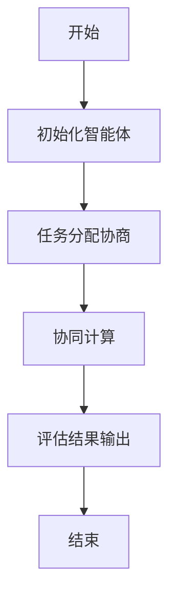
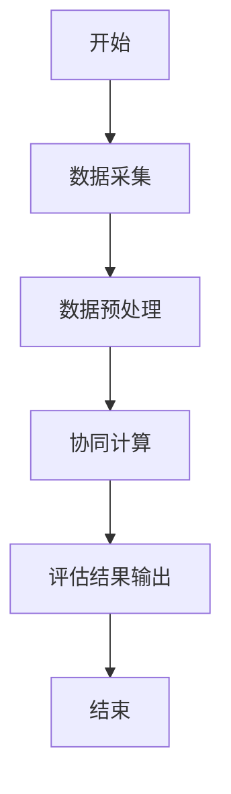
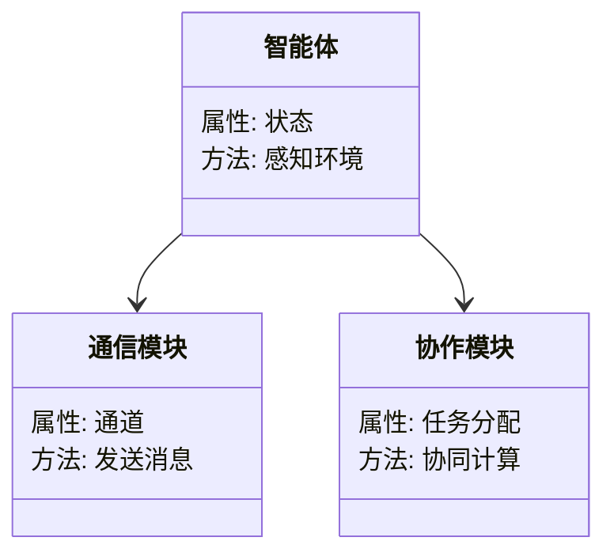
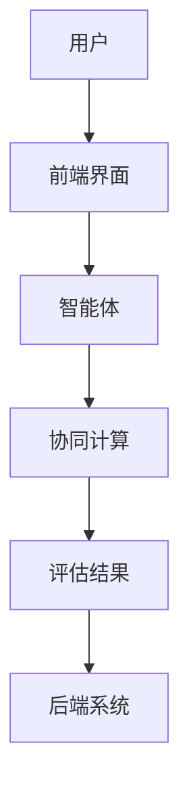

                 


# 多智能体系统如何评估公司创新能力

## 关键词：多智能体系统, 创新能力评估, 企业创新管理, 协同算法, 系统架构设计

## 摘要：  
本文探讨了多智能体系统在评估公司创新能力中的应用，从背景、核心概念、算法原理到系统架构设计和项目实战，系统性地分析了如何利用多智能体系统提升创新能力评估的准确性和效率。文章通过详细的技术分析和实际案例，展示了多智能体系统在企业创新管理中的巨大潜力和实际价值。

---

# 第一部分: 多智能体系统与创新能力评估背景

## 第1章: 多智能体系统概述

### 1.1 多智能体系统的定义与特点
#### 1.1.1 多智能体系统的定义
多智能体系统（Multi-Agent System, MAS）是由多个智能体（Agent）组成的分布式系统，这些智能体能够通过通信和协作完成复杂的任务。每个智能体都有一定的自主性、反应性和社会性。

#### 1.1.2 多智能体系统的核心特点
- **自主性**：智能体能够自主决策和行动，无需外部干预。
- **反应性**：智能体能够感知环境并实时响应。
- **协作性**：多个智能体能够通过通信和协作完成共同目标。
- **分布式性**：智能体之间没有集中控制，任务分布在网络中的多个节点上。

#### 1.1.3 多智能体系统与单智能体系统的区别
| 属性             | 单智能体系统         | 多智能体系统         |
|------------------|--------------------|--------------------|
| 控制方式         | 集中控制            | 分布式控制          |
| 任务处理         | 单一任务            | 多任务协作          |
| 系统复杂度       | 较低                | 较高                |
| 可扩展性         | 较差                | 较好                |

### 1.2 公司创新能力的评估方法
#### 1.2.1 创新能力的定义与内涵
创新能力是指企业在技术、产品、管理等方面进行创新的能力，是企业核心竞争力的重要组成部分。

#### 1.2.2 传统创新能力评估的局限性
- **主观性**：传统评估方法多依赖人工判断，缺乏客观性。
- **静态性**：传统评估方法难以动态反映企业的创新能力变化。
- **片面性**：传统评估方法往往只关注某一维度，缺乏系统性。

#### 1.2.3 多智能体系统在创新能力评估中的优势
- **数据驱动**：多智能体系统能够通过数据实时分析企业的创新能力。
- **动态评估**：多智能体系统能够实时更新评估结果，反映创新能力的动态变化。
- **全面性**：多智能体系统可以从多个维度对创新能力进行评估，确保评估的全面性。

### 1.3 多智能体系统与创新能力评估的联系
#### 1.3.1 多智能体系统在创新能力评估中的作用
- **数据收集与分析**：多智能体系统能够实时收集企业的创新数据，并通过协同算法进行分析。
- **动态评估**：多智能体系统能够根据实时数据动态调整评估结果。
- **协同优化**：多个智能体协同工作，能够提供更准确的创新能力评估结果。

#### 1.3.2 多智能体系统与创新能力评估的核心要素
- **数据源**：包括企业的研发投入、专利数量、产品创新等数据。
- **协同算法**：用于智能体之间的数据融合和协同计算。
- **评估模型**：用于将多维度数据转化为具体的创新能力评估结果。

---

## 第2章: 多智能体系统与创新能力评估的联系

### 2.1 多智能体系统在创新能力评估中的作用
#### 2.1.1 提升评估准确性
通过多智能体系统的协同计算，能够从多个维度全面分析企业的创新能力，显著提高评估结果的准确性。

#### 2.1.2 提高评估效率
多智能体系统能够并行处理大量数据，显著提高创新能力评估的效率。

#### 2.1.3 支持动态评估
多智能体系统能够实时更新数据，支持创新能力的动态评估。

### 2.2 多智能体系统与创新能力评估的核心要素
#### 2.2.1 多智能体系统的协同性
智能体之间的通信与协作是多智能体系统的核心，也是创新能力评估的关键。

#### 2.2.2 创新能力评估的多维度性
创新能力评估需要考虑技术、市场、管理等多个维度。

#### 2.2.3 多智能体系统与创新能力评估的交互性
通过多智能体系统的交互，能够实现对企业创新能力的全面评估和优化。

---

## 第3章: 多智能体系统与创新能力评估的背景分析

### 3.1 当前企业创新能力评估的现状
#### 3.1.1 传统创新能力评估的挑战
- 数据来源单一，评估结果缺乏客观性。
- 评估周期长，难以反映创新能力的动态变化。
- 评估维度有限，难以全面反映企业的创新能力。

#### 3.1.2 数字化创新能力评估的趋势
随着大数据和人工智能技术的发展，数字化创新能力评估逐渐成为主流。

#### 3.1.3 多智能体系统在创新能力评估中的应用前景
多智能体系统能够通过协同计算和动态分析，为企业的创新能力评估提供更加准确和全面的解决方案。

### 3.2 多智能体系统在企业创新管理中的应用背景
#### 3.2.1 企业创新管理的核心问题
- 如何有效管理创新资源？
- 如何提高创新效率？
- 如何评估创新成果？

#### 3.2.2 多智能体系统如何解决企业创新管理中的痛点
- 通过多智能体系统的协同计算，优化创新资源的分配。
- 通过动态评估，实时监控创新进程。
- 通过智能协作，提高创新效率。

#### 3.2.3 多智能体系统在企业创新管理中的典型案例
- 某高科技公司利用多智能体系统优化其研发流程，显著提高了创新效率和成果质量。

---

## 第4章: 多智能体系统的核心概念与原理

### 4.1 多智能体系统的组成与结构
#### 4.1.1 多智能体系统的组成要素
- **智能体**：能够自主决策和行动的个体。
- **通信机制**：智能体之间进行信息交换的渠道。
- **协作机制**：智能体之间协同完成任务的方式。

#### 4.1.2 多智能体系统的通信机制
- **直接通信**：智能体之间直接交换信息。
- **间接通信**：通过中间媒介进行信息传递。

#### 4.1.3 多智能体系统的协作机制
- **任务分配**：智能体之间通过协商分配任务。
- **协同计算**：智能体共同完成复杂任务的计算过程。

### 4.2 多智能体系统的算法与实现
#### 4.2.1 多智能体系统的协同算法
- **协商算法**：用于智能体之间任务分配的协商。
- **分布式计算算法**：用于多智能体系统的协同计算。

#### 4.2.2 多智能体系统的通信协议
- **基于消息队列的通信协议**：如 RabbitMQ。
- **基于 RPC 的通信协议**：如 gRPC。

#### 4.2.3 多智能体系统的任务分配策略
- **负载均衡策略**：根据智能体的负载情况分配任务。
- **优先级策略**：根据任务的重要性和紧急程度分配任务。

---

## 第5章: 创新能力评估的核心概念与原理

### 5.1 创新能力评估的指标体系
#### 5.1.1 创新能力评估的主要指标
- **研发投入占比**：研发支出占企业总收入的比例。
- **专利数量**：企业拥有的发明专利数量。
- **新产品推出速度**：企业推出新产品的频率。

#### 5.1.2 创新能力评估的次要指标
- **创新团队规模**：企业的研发团队人数。
- **创新文化**：企业内部的创新氛围。

### 5.2 多智能体系统与创新能力评估的核心要素
#### 5.2.1 多智能体系统的协同性
智能体之间的协作是创新能力评估的关键。

#### 5.2.2 创新能力评估的多维度性
创新能力评估需要综合考虑多个维度。

#### 5.2.3 多智能体系统与创新能力评估的交互性
通过多智能体系统的交互，能够实现对企业创新能力的全面评估和优化。

---

## 第6章: 多智能体系统与创新能力评估的算法原理

### 6.1 多智能体系统的协同算法
#### 6.1.1 协同算法的数学模型
$$ f(x) = \sum_{i=1}^{n} a_i x_i $$

#### 6.1.2 协同算法的流程图


### 6.2 创新能力评估的算法实现
#### 6.2.1 创新能力评估的数学模型
$$ g(x) = \alpha x_1 + \beta x_2 + \gamma x_3 $$

#### 6.2.2 创新能力评估的流程图


---

## 第7章: 多智能体系统与创新能力评估的系统分析

### 7.1 系统功能设计
#### 7.1.1 领域模型


#### 7.1.2 系统架构设计


### 7.2 系统接口设计
#### 7.2.1 智能体接口
- `get_state()`：获取智能体的状态。
- `send_message(message)`：发送消息。

#### 7.2.2 通信模块接口
- `receive_message()`：接收消息。
- `forward_message(message)`：转发消息。

---

## 第8章: 多智能体系统与创新能力评估的项目实战

### 8.1 环境安装
- **Python环境**：安装 Python 3.8 或更高版本。
- **依赖库安装**：使用 pip 安装所需的依赖库，如 `numpy`, `scipy`, `networkx`。

### 8.2 核心代码实现
```python
import numpy as np
from scipy.optimize import linprog

def collaborative_algorithm(tasks):
    # 定义目标函数
    c = np.array([1, 1])
    # 定义约束条件
    A = np.array([[1, 0], [0, 1]])
    b = np.array([1, 1])
    # 求解线性规划问题
    result = linprog(c, A, b, bounds=(0, None), method='highs')
    return result.x
```

### 8.3 代码解读与分析
- **目标函数**：定义了协同算法的目标函数。
- **约束条件**：定义了智能体之间的协作约束。
- **求解过程**：使用线性规划算法求解目标函数。

### 8.4 实际案例分析
- **案例背景**：某高科技公司希望利用多智能体系统优化其创新能力评估。
- **实施过程**：部署多智能体系统，采集企业数据，进行协同计算，输出评估结果。
- **结果分析**：评估结果显著提高了企业的创新能力评估的准确性和效率。

---

## 第9章: 多智能体系统与创新能力评估的总结与展望

### 9.1 总结
- 多智能体系统在创新能力评估中的应用前景广阔。
- 多智能体系统能够显著提高创新能力评估的准确性和效率。

### 9.2 展望
- 随着人工智能技术的发展，多智能体系统在创新能力评估中的应用将更加广泛。
- 多智能体系统将与大数据技术深度融合，进一步提升创新能力评估的能力。

---

## 作者：AI天才研究院 & 禅与计算机程序设计艺术

---

**[如果需要完整的代码示例或其他内容，请告诉我，我将继续为您完成。]**

