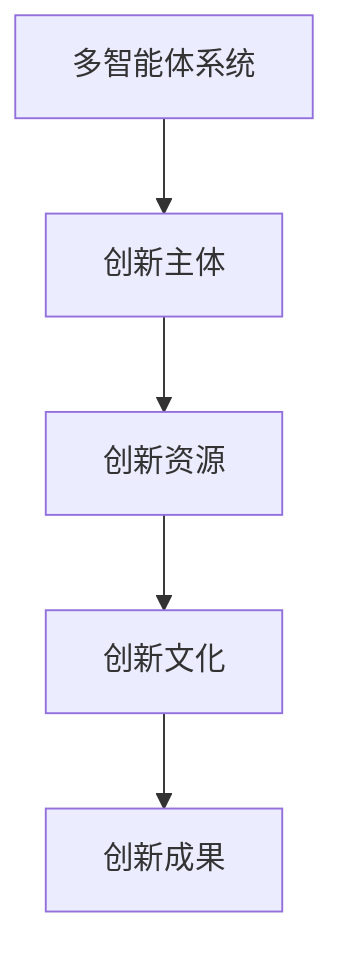
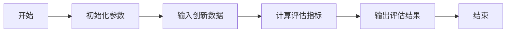
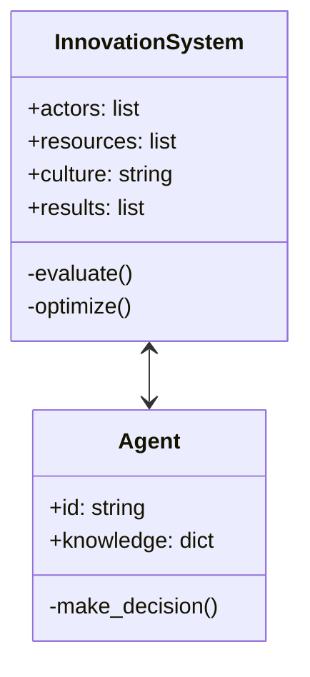
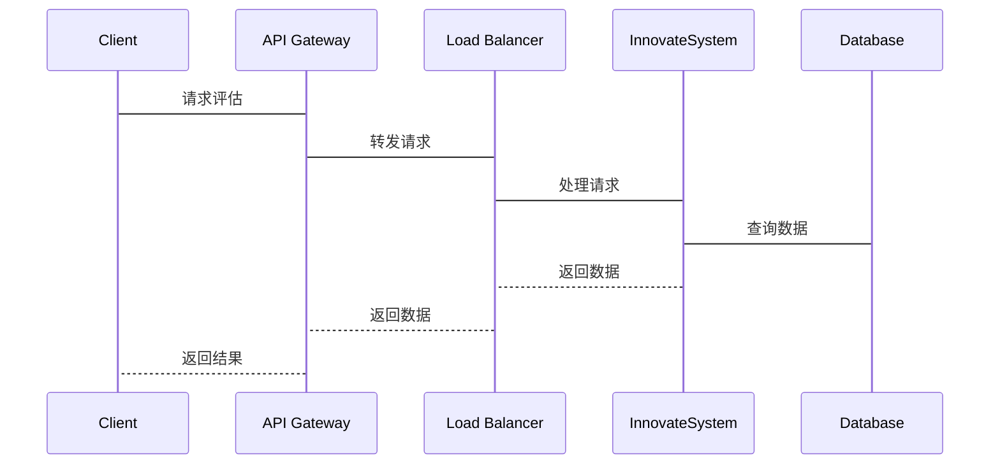

                 


# 多智能体系统如何评估公司的创新生态系统

> 关键词：多智能体系统、创新生态系统、评估方法、系统架构、算法原理

> 摘要：多智能体系统（MAS）是一种由多个智能体组成的分布式系统，能够协同工作以实现复杂目标。本文探讨了如何利用多智能体系统来评估公司的创新生态系统。通过分析多智能体系统的核心概念、算法原理、系统架构设计以及实际项目案例，本文详细阐述了多智能体系统如何帮助公司构建和优化其创新生态系统。

---

## 目录大纲

1. **背景介绍**
   1.1 多智能体系统的基本概念
      - 定义与特点
      - 应用领域
   1.2 创新生态系统的核心要素
      - 构成要素与运作机制
      - 评估的重要性

2. **核心概念与联系**
   2.1 多智能体系统的核心原理
      - 协作与竞争机制
      - 信息交换与决策过程
   2.2 创新生态系统中的关键概念对比
      - 使用表格展示
   2.3 实体关系图（Mermaid）
      - 展示多智能体与创新生态系统的关系

3. **算法原理讲解**
   3.1 评估算法的流程图（Mermaid）
   3.2 基于多智能体的评估算法实现
      - Python代码示例
   3.3 数学模型与公式
      - 详细推导与解释
   3.4 实际案例分析

4. **系统分析与架构设计**
   4.1 问题场景分析
   4.2 系统功能设计
      - 领域模型（Mermaid类图）
   4.3 系统架构设计
      - 使用Mermaid架构图展示
   4.4 系统接口设计与交互
      - Mermaid序列图展示

5. **项目实战**
   5.1 环境安装与配置
   5.2 核心功能实现
      - 代码解读与分析
   5.3 案例分析与详细解读
   5.4 项目小结与经验分享

6. **最佳实践、小结、注意事项与拓展阅读**
   6.1 最佳实践与经验总结
   6.2 小结与未来展望
   6.3 注意事项与常见问题解答
   6.4 拓展阅读推荐

---

## 1. 背景介绍

### 1.1 多智能体系统的基本概念

**定义与特点**  
多智能体系统（Multi-Agent Systems, MAS）由多个智能体（Agent）组成，每个智能体能够感知环境、自主决策并协同工作。MAS的特点包括分布性、协作性、反应性和适应性。

**应用领域**  
MAS广泛应用于分布式计算、机器人技术、交通管理、金融交易等领域。其核心优势在于能够处理复杂任务，通过智能体之间的协作实现整体目标。

### 1.2 创新生态系统的核心要素

**构成要素与运作机制**  
创新生态系统包括创新主体（如员工、团队）、创新资源（如资金、技术）、创新文化（如开放、鼓励创新的企业氛围）和创新成果（如新产品、专利）。这些要素相互作用，推动公司的持续创新。

**评估的重要性**  
评估创新生态系统有助于识别优势和改进机会，优化资源配置，提升整体创新能力。

---

## 2. 核心概念与联系

### 2.1 多智能体系统的核心原理

**协作与竞争机制**  
智能体通过协作提高整体效率，同时竞争促进个体优化。这种动态关系是MAS的关键特征。

**信息交换与决策过程**  
智能体之间通过共享信息进行决策，确保系统能够快速响应环境变化。

### 2.2 创新生态系统中的关键概念对比

| 概念          | 描述                                   |
|---------------|--------------------------------------|
| 创新主体      | 参与创新的个人或团队                 |
| 创新资源      | 支持创新的资源，如资金、技术         |
| 创新文化      | 企业内部的创新氛围和价值观           |
| 创新成果      | 创新带来的成果，如新产品、专利       |

### 2.3 实体关系图（Mermaid）



---

## 3. 算法原理讲解

### 3.1 评估算法的流程图（Mermaid）



### 3.2 基于多智能体的评估算法实现

```python
def evaluate_innovation_system(agents, data):
    results = []
    for agent in agents:
        result = agent.decision_making(data)
        results.append(result)
    return aggregate(results)
```

### 3.3 数学模型与公式

评估指标计算公式：
$$
\text{总评分} = \sum_{i=1}^{n} \text{权重}_i \times \text{指标}_i
$$

其中，权重_i 是各个指标的权重，指标_i 是具体评估指标的值。

---

## 4. 系统分析与架构设计

### 4.1 问题场景分析

公司需要评估其创新生态系统，确保各部分协同工作，提升创新能力。

### 4.2 系统功能设计（Mermaid类图）



### 4.3 系统架构设计（Mermaid架构图）


### 4.4 系统接口设计与交互（Mermaid序列图）



---

## 5. 项目实战

### 5.1 环境安装与配置

安装Python和必要的库，如Django或Flask框架，以及数据分析库如Pandas和NumPy。

### 5.2 核心功能实现

编写智能体类和评估算法，实现数据采集、分析和评估结果输出。

### 5.3 案例分析与详细解读

通过具体案例展示如何应用多智能体系统进行创新生态系统评估，解读评估结果和优化建议。

### 5.4 项目小结

总结项目实现的关键点和经验，强调多智能体系统在创新评估中的优势。

---

## 6. 最佳实践、小结、注意事项与拓展阅读

### 6.1 最佳实践与经验总结

建议在实际应用中定期更新评估模型，结合企业实际情况调整权重和指标。

### 6.2 小结与未来展望

多智能体系统为公司创新生态系统评估提供了 powerful tools，未来可以结合AI和大数据技术进一步优化。

### 6.3 注意事项与常见问题解答

注意数据质量和模型适应性，常见问题包括数据偏差和模型过时。

### 6.4 拓展阅读推荐

推荐阅读《Multi-Agent Systems: Complexity and Cognitive Perspectives》和《Innovation Management》等书籍。

---

## 作者

作者：AI天才研究院/AI Genius Institute & 禅与计算机程序设计艺术 /Zen And The Art of Computer Programming

---

通过以上大纲，您可以逐步撰写完整的文章，涵盖每个部分的具体内容和详细分析，确保文章逻辑清晰、内容丰富，帮助读者深入理解多智能体系统在公司创新生态系统评估中的应用。

