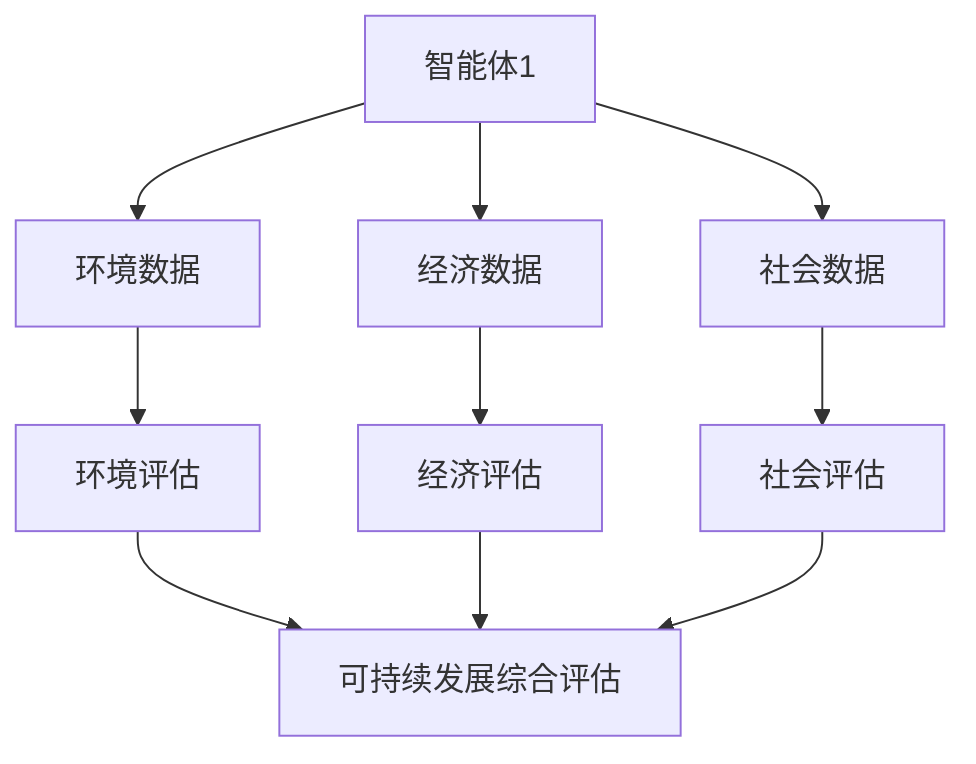
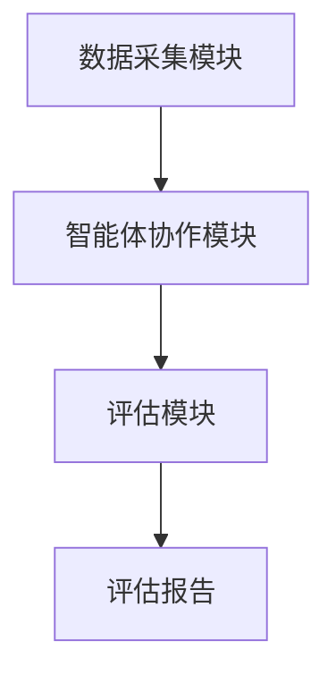
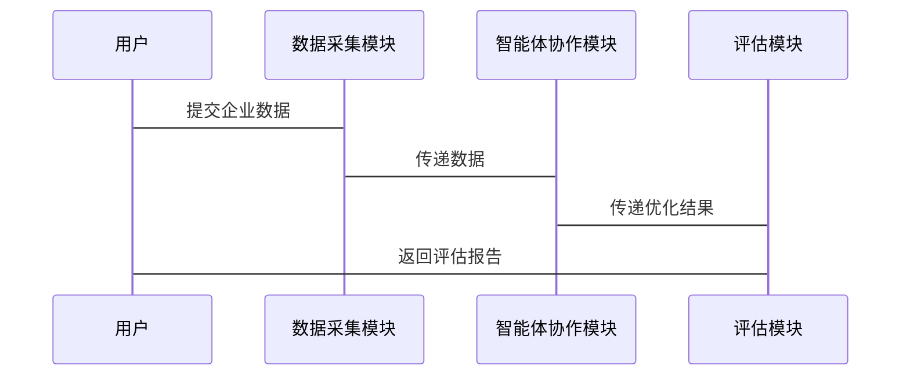

                 


# 多智能体系统如何评估公司的可持续发展能力

> 关键词：多智能体系统、可持续发展、企业评估、算法原理、系统架构

> 摘要：多智能体系统（Multi-Agent Systems, MAS）作为一种分布式人工智能技术，能够通过多个智能体的协同工作，为企业提供动态、全面的可持续发展评估。本文从理论基础到实际应用，详细阐述了多智能体系统在可持续发展评估中的核心概念、算法原理、系统架构设计以及项目实战，为企业的可持续发展能力评估提供了全新的技术视角和解决方案。

---

# 第1章: 多智能体系统与可持续发展评估概述

## 1.1 多智能体系统的基本概念

### 1.1.1 多智能体系统的定义
多智能体系统（MAS）是指由多个智能体（Agent）组成的分布式系统，每个智能体都是具有独立性、自主性和协作性的实体，能够通过信息交换和协同完成复杂的任务。MAS的核心在于智能体之间的通信与协作，而非单一智能体的独立运行。

### 1.1.2 多智能体系统的特征与优势
- **独立性**：每个智能体都具有独立的目标和决策能力。
- **自主性**：智能体能够自主感知环境并采取行动。
- **协作性**：通过通信和协作，智能体能够共同完成复杂任务。
- **分布式性**：智能体分布在网络中，能够实现资源的高效利用。

### 1.1.3 多智能体系统在企业中的应用前景
MAS在企业中的应用前景广阔，尤其是在需要多部门协作、多目标优化的场景中，如供应链管理、资源分配、风险评估等。通过MAS，企业可以实现跨部门的高效协作，提高决策的准确性和及时性。

## 1.2 可持续发展评估的背景与意义

### 1.2.1 可持续发展的定义与内涵
可持续发展是指在满足当前需求的同时，不损害后代人满足其需求的能力。在企业层面，可持续发展包括环境、经济和社会三个维度的平衡。

### 1.2.2 企业可持续发展评估的必要性
随着全球对可持续发展的关注增加，企业需要通过评估自身的可持续发展能力，优化资源配置，降低环境和社会风险，提升企业的社会形象和竞争力。

### 1.2.3 多智能体系统在可持续发展评估中的作用
MAS能够通过多智能体的协作，从多个维度对企业进行实时监控和评估，提供动态、全面的评估结果，帮助企业更好地实现可持续发展目标。

## 1.3 多智能体系统与可持续发展评估的结合

### 1.3.1 多智能体系统在企业评估中的应用场景
- **环境评估**：通过MAS实时监控企业的能源消耗、碳排放等环境指标。
- **经济评估**：评估企业的财务健康状况、成本控制能力等。
- **社会评估**：评估企业在社会责任、员工福利等方面的绩效。

### 1.3.2 可持续发展评估的核心指标与维度
- **环境维度**：碳排放、能源消耗、资源利用效率等。
- **经济维度**：利润、成本、投资回报率等。
- **社会维度**：员工满意度、社会责任履行情况等。

### 1.3.3 多智能体系统如何支持可持续发展目标
通过MAS，企业可以实现多维度数据的实时采集、分析和优化，帮助企业在可持续发展方面做出科学决策。

---

# 第2章: 多智能体系统的核心概念与联系

## 2.1 多智能体系统的核心原理

### 2.1.1 多智能体系统的组成要素
- **智能体**：具有独立性、自主性和协作能力的实体。
- **通信机制**：智能体之间通过消息传递实现信息共享。
- **协作协议**：定义智能体之间的协作规则和任务分配。

### 2.1.2 智能体的定义与分类
- **智能体**：能够感知环境并采取行动的实体。
- **分类**：根据智能体的智能水平，可以分为反应式智能体、认知式智能体等。

### 2.1.3 多智能体系统的通信与协作机制
- **通信机制**：智能体之间通过消息传递实现信息共享。
- **协作机制**：通过协商和任务分配，实现多智能体的协同工作。

## 2.2 可持续发展评估的核心要素

### 2.2.1 环境维度的评估指标
- **碳排放**：企业生产过程中产生的二氧化碳等温室气体。
- **能源消耗**：企业使用的电力、燃气等能源的总量。

### 2.2.2 经济维度的评估指标
- **利润**：企业的净利润情况。
- **成本**：企业的生产成本、运营成本等。

### 2.2.3 社会维度的评估指标
- **员工满意度**：员工对工作环境、薪酬福利的满意度。
- **社会责任**：企业在公益事业、社会责任方面的投入。

## 2.3 多智能体系统与可持续发展评估的实体关系图



---

# 第3章: 多智能体系统评估模型的算法原理

## 3.1 多智能体协同优化算法

### 3.1.1 算法的基本原理
多智能体协同优化算法通过多个智能体的协作，优化企业可持续发展评估中的多个目标。每个智能体负责不同的优化任务，通过通信和协作实现整体优化。

### 3.1.2 算法的实现步骤
1. 初始化多个智能体，分配不同的优化任务。
2. 每个智能体根据任务目标进行优化计算。
3. 智能体之间通过通信机制共享优化结果。
4. 根据共享结果，调整优化策略，实现整体优化。

### 3.1.3 算法的优缺点分析
- **优点**：能够实现多目标优化，提高评估的全面性。
- **缺点**：需要复杂的通信和协作机制，实现难度较高。

## 3.2 可持续发展评估的数学模型

### 3.2.1 数学模型的构建
可持续发展评估的数学模型可以通过多目标优化模型来构建，如下所示：

$$
\min_{x} \quad f_1(x) + f_2(x) + f_3(x)
$$

其中，$f_1(x)$ 表示环境维度的评估指标，$f_2(x)$ 表示经济维度的评估指标，$f_3(x)$ 表示社会维度的评估指标。

### 3.2.2 数学模型的求解方法
通过多智能体协同优化算法，对上述数学模型进行求解，得到最优解。

### 3.2.3 数学模型的应用案例
以某制造企业为例，构建多目标优化模型，评估企业在环境、经济和社会三个维度的综合表现。

## 3.3 算法实现的代码示例

### 3.3.1 环境安装与配置
```bash
pip install numpy
pip install matplotlib
```

### 3.3.2 核心代码实现
```python
import numpy as np
import matplotlib.pyplot as plt

# 初始化多个智能体
agents = [1, 2, 3]

# 多智能体协同优化算法
def multi_agent_optimization(agents):
    for agent in agents:
        # 每个智能体进行优化计算
        pass
    return optimal_result

# 绘制优化结果
def plot_results(optimal_result):
    plt.plot(optimal_result)
    plt.xlabel('Iteration')
    plt.ylabel('Optimal Result')
    plt.show()

# 调用算法并绘制结果
result = multi_agent_optimization(agents)
plot_results(result)
```

---

# 第4章: 多智能体系统评估模型的系统架构设计

## 4.1 系统功能设计

### 4.1.1 系统的功能模块划分
- **数据采集模块**：采集企业相关的环境、经济和社会数据。
- **智能体协作模块**：实现多个智能体的通信和协作。
- **评估模块**：根据优化结果，生成可持续发展评估报告。

### 4.1.2 模块之间的交互关系
- 数据采集模块将数据传递给智能体协作模块。
- 智能体协作模块通过协作优化算法生成优化结果。
- 评估模块根据优化结果生成评估报告。

## 4.2 系统架构设计

### 4.2.1 系统架构的总体设计


### 4.2.2 模块之间的通信机制
- 数据采集模块通过API向智能体协作模块传递数据。
- 智能体协作模块通过消息队列实现智能体之间的通信。

### 4.2.3 系统的可扩展性设计
通过模块化设计，系统可以方便地扩展新的功能模块，如增加新的评估维度或优化算法。

## 4.3 系统接口设计

### 4.3.1 系统接口的定义
- 数据采集模块提供REST接口，接收外部数据。
- 智能体协作模块提供WebSocket接口，实现智能体之间的实时通信。

### 4.3.2 接口的实现方式
- 数据采集模块：使用Flask框架实现REST接口。
- 智能体协作模块：使用WebSocket协议实现智能体之间的实时通信。

### 4.3.3 接口的调用流程
1. 数据采集模块接收外部数据。
2. 数据采集模块通过REST接口将数据传递给智能体协作模块。
3. 智能体协作模块通过WebSocket接口实现智能体之间的通信和协作。
4. 智能体协作模块将优化结果传递给评估模块。
5. 评估模块生成评估报告并返回给用户。

## 4.4 系统交互流程设计

### 4.4.1 交互流程的描述
- 用户输入企业数据，数据采集模块接收数据。
- 数据采集模块通过REST接口将数据传递给智能体协作模块。
- 智能体协作模块通过WebSocket接口实现智能体之间的通信和协作。
- 智能体协作模块将优化结果传递给评估模块。
- 评估模块生成评估报告并返回给用户。

### 4.4.2 交互流程的优化
通过优化接口设计和通信机制，减少系统的响应时间，提高系统的效率。

### 4.4.3 交互流程的实现


---

# 第5章: 多智能体系统评估模型的项目实战

## 5.1 项目背景与目标

### 5.1.1 项目背景介绍
某制造企业希望优化自身的可持续发展能力，希望通过多智能体系统实现环境、经济和社会三个维度的优化。

### 5.1.2 项目目标设定
- 实现企业环境、经济和社会三个维度的动态评估。
- 提供优化建议，帮助企业实现可持续发展目标。

## 5.2 项目核心实现

### 5.2.1 核心算法的实现
通过多智能体协同优化算法，实现企业环境、经济和社会三个维度的优化。

### 5.2.2 系统架构的搭建
搭建多智能体协作系统，实现数据采集、智能体协作和评估报告生成。

### 5.2.3 接口的开发与测试
开发REST和WebSocket接口，实现系统模块之间的通信和协作。

## 5.3 项目案例

### 5.3.1 案例分析
以某制造企业为例，通过多智能体系统实现环境、经济和社会三个维度的动态评估。

### 5.3.2 项目小结
通过该项目，验证了多智能体系统在企业可持续发展评估中的应用价值，为企业的可持续发展提供了新的技术手段。

---

# 作者：AI天才研究院/AI Genius Institute & 禅与计算机程序设计艺术 /Zen And The Art of Computer Programming

---

以上是文章的完整目录大纲和部分章节的具体内容，您可以根据需要进一步扩展和完善每个部分的内容。

