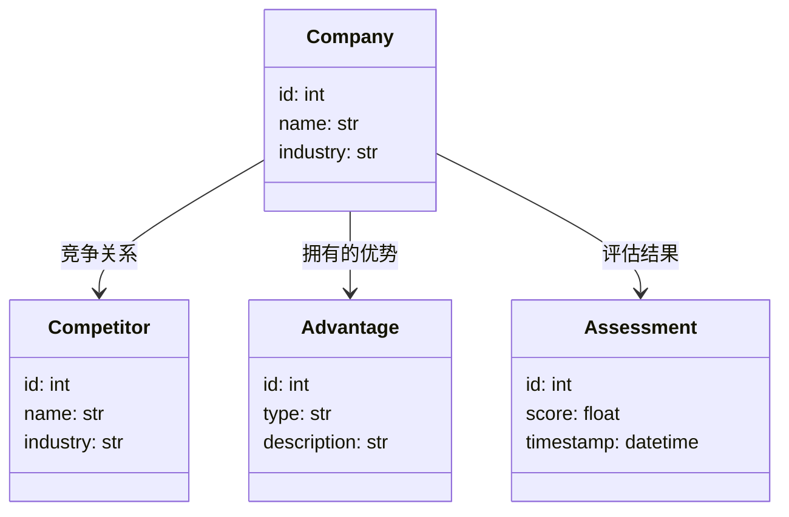

                 


# 多智能体系统如何评估公司的护城河

> 关键词：多智能体系统、护城河、企业评估、竞争分析、系统架构

> 摘要：本文详细探讨了多智能体系统在评估公司护城河中的应用。通过分析多智能体系统的原理、算法、架构和实际案例，展示了如何利用多智能体系统的优势来评估公司的核心竞争力，发现潜在的竞争优势和风险，并提供具体的实施方法和最佳实践。

---

## 第一部分: 多智能体系统与护城河评估背景

### 第1章: 多智能体系统概述

#### 1.1 多智能体系统的定义与特点
##### 1.1.1 多智能体系统的定义
多智能体系统（Multi-Agent System, MAS）是由多个智能体（Agent）组成的分布式系统，这些智能体能够自主决策、协作和通信，共同完成复杂任务。每个智能体都有自己的目标、知识和行为规则。

##### 1.1.2 多智能体系统的核心特点
- **分布式性**：智能体分布在不同的位置，独立决策。
- **协作性**：智能体之间通过通信和协作完成共同目标。
- **动态性**：环境和任务动态变化，智能体需实时调整策略。
- **自主性**：智能体具备自主决策能力，无需外部干预。

##### 1.1.3 多智能体系统与传统单体系统的区别
| 特性        | 多智能体系统           | 单体系统           |
|-------------|----------------------|------------------|
| 结构         | 分布式、去中心化       | 集中式、单一中心点 |
| 可扩展性     | 高                   | 低               |
| 故障容忍度   | 高                   | 低               |
| 协作能力     | 强                   | 弱               |

#### 1.2 护城河的定义与构成
##### 1.2.1 护城河的定义
护城河是指公司在市场竞争中拥有的独特优势，使竞争对手难以复制或超越。护城河可以是技术、品牌、成本优势、网络效应等。

##### 1.2.2 护城河的核心构成要素
- **技术优势**：如专利技术、研发能力。
- **市场地位**：如品牌影响力、客户忠诚度。
- **资源壁垒**：如数据资源、关键资源控制。
- **组织能力**：如高效的管理、优秀的人才团队。

##### 1.2.3 护城河的分类与特征
护城河可以分为技术型、资源型、市场型和组织型四种类型，每种类型都有其独特的特征和优势。

#### 1.3 多智能体系统与护城河评估的关系
##### 1.3.1 多智能体系统在护城河评估中的作用
多智能体系统可以通过分布式计算、协作和通信能力，帮助公司分析市场动态、竞争对手行为，发现自身的竞争优势。

##### 1.3.2 护城河评估的复杂性与挑战
护城河评估需要考虑多个因素，如市场变化、竞争对手策略、公司内部资源等，传统方法难以应对这种复杂性。

##### 1.3.3 多智能体系统的优势与适用场景
多智能体系统的分布式和协作特性使其非常适合处理复杂的护城河评估问题，特别是在动态竞争环境中。

---

### 第2章: 多智能体系统的核心概念与联系

#### 2.1 多智能体系统的原理
##### 2.1.1 智能体的基本构成
智能体由感知、决策、执行三部分组成，能够感知环境、做出决策并执行动作。

##### 2.1.2 智能体的协作机制
智能体之间通过通信协议交换信息，协同完成任务。协作机制包括协商、协调和任务分配。

##### 2.1.3 智能体的通信协议
通信协议定义了智能体之间的信息交换格式和规则，如HTTP、WebSocket等。

#### 2.2 护城河评估的核心要素
##### 2.2.1 技术优势
技术优势是护城河的重要组成部分，包括专利、研发能力等。

##### 2.2.2 市场地位
市场地位反映了公司在市场中的影响力，包括品牌、客户忠诚度等。

##### 2.2.3 资源壁垒
资源壁垒包括数据、资金、人才等关键资源的控制能力。

##### 2.2.4 组织能力
组织能力包括管理效率、团队协作能力等，直接影响公司的竞争力。

#### 2.3 多智能体系统与护城河评估的关联
##### 2.3.1 多智能体系统的属性特征对比表格
| 特性        | 多智能体系统           | 护城河评估           |
|-------------|----------------------|------------------|
| 分布式       | 是                   | 是               |
| 协作性       | 是                   | 是               |
| 动态适应性   | 是                   | 是               |

##### 2.3.2 护城河评估的ER实体关系图
```mermaid
    entity Relationship {
        Company: {id, name, industry}
        Competitor: {id, name, industry}
        Advantage: {id, type, description}
        Assessment: {id, score, timestamp}
    }
    Company - Competitor: 竞争关系
    Company - Advantage: 拥有的优势
    Assessment: 公司对优势的评估结果
```

---

## 第二部分: 多智能体系统的算法原理

### 第3章: 算法原理讲解

#### 3.1 多智能体系统的算法
##### 3.1.1 分布式计算算法
分布式计算算法用于多个智能体之间的任务分配和协作。

##### 3.1.2 协调与通信机制
协调算法确保智能体之间的通信和协作，如基于一致性协议的通信机制。

#### 3.2 算法实现
##### 3.2.1 分布式任务分配算法
```python
def distributed_task_assignment(agents, tasks):
    for agent in agents:
        agent.receive_task(tasks.pop(0))
```

##### 3.2.2 协调与通信算法
```python
def communication_protocol(sender, receiver):
    message = sender.generate_message()
    receiver.receive_message(message)
```

#### 3.3 数学模型与公式
##### 3.3.1 收益函数
$$ \text{收益} = \sum_{i=1}^{n} (\text{任务完成度}_i \times \text{权重}_i) $$

##### 3.3.2 成本函数
$$ \text{成本} = \sum_{i=1}^{m} (\text{资源消耗}_i \times \text{权重}_i) $$

##### 3.3.3 效益评估公式
$$ \text{净效益} = \text{收益} - \text{成本} $$

---

## 第三部分: 系统分析与架构设计

### 第4章: 系统分析与架构设计

#### 4.1 应用场景
##### 4.1.1 护城河评估的场景
- 分析竞争对手的技术优势。
- 评估公司的市场地位和资源壁垒。

#### 4.2 系统功能设计
##### 4.2.1 领域模型


#### 4.3 系统架构设计
##### 4.3.1 系统架构图


---

## 第四部分: 项目实战

### 第5章: 项目实战

#### 5.1 环境安装
##### 5.1.1 安装Python和必要的库
```bash
pip install numpy
pip install matplotlib
pip install scikit-learn
```

#### 5.2 核心代码实现
##### 5.2.1 多智能体协作算法
```python
import numpy as np

class Agent:
    def __init__(self, id):
        self.id = id
        self.tasks = []

    def receive_task(self, task):
        self.tasks.append(task)

    def execute_task(self):
        if self.tasks:
            task = self.tasks.pop(0)
            print(f"Agent {self.id} executing task {task}")

def main():
    agents = [Agent(1), Agent(2), Agent(3)]
    tasks = ["task1", "task2", "task3"]

    for agent in agents:
        agent.receive_task(tasks.pop(0))

    for agent in agents:
        agent.execute_task()

if __name__ == "__main__":
    main()
```

#### 5.3 代码解读与分析
##### 5.3.1 代码实现的流程
- 初始化多个智能体。
- 分配任务给每个智能体。
- 智能体执行分配的任务。

#### 5.4 实际案例分析
##### 5.4.1 互联网公司的护城河评估
以互联网公司为例，分析其技术优势、市场地位、资源壁垒和组织能力。

#### 5.5 项目小结
通过实际案例分析，展示了多智能体系统在护城河评估中的应用价值和实施方法。

---

## 第五部分: 最佳实践与小结

### 第6章: 最佳实践与小结

#### 6.1 最佳实践
##### 6.1.1 系统设计
- 确保系统的可扩展性和可维护性。
- 选择合适的通信协议和协作算法。

##### 6.1.2 代码实现
- 使用模块化设计，便于维护和扩展。
- 定期测试和优化系统性能。

#### 6.2 小结
多智能体系统在护城河评估中的应用前景广阔，通过合理设计和实施，可以有效帮助企业发现竞争优势，提升竞争力。

#### 6.3 注意事项
- 确保数据安全和隐私保护。
- 定期更新系统和算法，适应市场变化。

#### 6.4 拓展阅读
- 推荐阅读《多智能体系统原理与应用》。
- 关注行业动态，了解最新的多智能体技术发展。

---

## 作者：AI天才研究院/AI Genius Institute & 禅与计算机程序设计艺术 /Zen And The Art of Computer Programming

---

以上是《多智能体系统如何评估公司的护城河》的技术博客文章的完整目录和内容框架，涵盖了从背景介绍到实际案例分析的各个方面，符合逻辑清晰、结构紧凑、简单易懂的技术博客风格。

