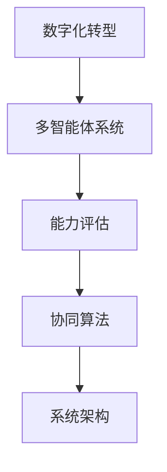

                 

# 多智能体系统如何评估公司的数字化转型能力

> 关键词：多智能体系统，数字化转型，能力评估，协同算法，系统架构

> 摘要：本文将探讨多智能体系统在评估公司数字化转型能力中的应用。通过分析多智能体系统的原理和数字化转型的核心要素，结合实际案例，详细讲解如何利用多智能体系统来构建高效的数字化转型评估模型。

---

## 第1章 数字化转型的背景与意义

### 1.1 数字化转型的定义与内涵
- 数字化转型不仅仅是技术的升级，更是企业商业模式和业务流程的深刻变革。
- 数字化转型的核心在于利用新兴技术（如人工智能、大数据、物联网等）提升企业的竞争力和创新能力。

### 1.2 多智能体系统的定义与特点
- 多智能体系统是由多个智能体组成的分布式系统，每个智能体能够独立决策并协同工作。
- 多智能体系统的特点包括自主性、反应性、协作性和分布性。

### 1.3 数字化转型与多智能体系统的联系
- 多智能体系统能够通过协同合作，帮助企业实现数字化转型中的复杂任务。
- 数字化转型为多智能体系统提供了丰富的应用场景，如智能制造、智能物流等。

---

## 第2章 多智能体系统的核心概念与联系

### 2.1 多智能体系统的原理
- 多智能体系统的组成：智能体、通信机制、协作机制。
- 智能体的类型：简单反射智能体、基于模型智能体、实用推理智能体。

### 2.2 多智能体系统与数字化转型能力的关系
- 数字化转型能力评估的维度：技术能力、组织能力、业务能力。
- 多智能体系统在评估中的作用：通过协同智能体的决策，提供实时反馈和优化建议。

### 2.3 核心概念之间的联系
- 通过Mermaid图展示数字化转型能力评估的核心概念及其相互关系。

---

## 第3章 多智能体系统评估数字化转型能力的核心算法

### 3.1 多智能体协同算法
- 多智能体协同的基本原理：通过通信机制共享信息，实现协同决策。
- 实现方法：基于状态机的协同算法、基于规则的协同算法。

### 3.2 数字化转型能力评估算法
- 指标体系：技术成熟度、数据驱动能力、组织敏捷性。
- 数学模型：构建评估模型，使用加权评分法进行计算。

### 3.3 算法实现步骤
- 数据采集：收集企业的技术、组织、业务数据。
- 数据预处理：清洗和标准化数据。
- 算法实现：基于协同算法进行评估计算。

---

## 第4章 多智能体系统评估数字化转型能力的系统架构

### 4.1 系统功能模块设计
- 数据采集模块：负责采集企业的各项数据。
- 数据处理模块：对数据进行清洗和转换。
- 智能体协同模块：实现多智能体的协同决策。
- 结果输出模块：生成评估报告。

### 4.2 系统架构设计
- 整体架构图：展示各模块之间的关系和交互。
- 模块交互关系：详细描述各模块之间的数据流和控制流。

### 4.3 系统接口设计
- API接口：定义智能体之间的通信接口。
- 数据接口：定义数据采集和输出的接口。

---

## 第5章 多智能体系统评估数字化转型能力的项目实战

### 5.1 项目背景与目标
- 项目背景：某制造企业希望通过数字化转型提升竞争力。
- 项目目标：构建一个多智能体系统，评估企业的数字化转型能力。

### 5.2 项目实施步骤
- 环境搭建：安装必要的软件和工具。
- 数据采集：收集企业的技术、组织、业务数据。
- 算法实现：基于协同算法进行评估计算。
- 系统测试：验证系统的稳定性和准确性。

### 5.3 项目成果与案例分析
- 成果展示：生成评估报告，展示企业的数字化转型能力。
- 成功案例：分析某企业的成功转型经验。

---

## 第6章 最佳实践与总结

### 6.1 小结
- 多智能体系统在数字化转型能力评估中的优势：高效协同、实时反馈。

### 6.2 注意事项
- 数据质量：确保数据的准确性和完整性。
- 系统维护：定期更新和优化系统。

### 6.3 拓展阅读
- 推荐相关书籍和论文，供读者深入学习。

---

作者：AI天才研究院 & 禅与计算机程序设计艺术

