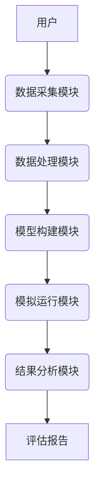

                 


# 多智能体系统如何评估公司的长期增长潜力

> 关键词：多智能体系统，公司增长潜力，协同，竞争，博弈论，算法模型，系统架构

> 摘要：多智能体系统（Multi-Agent Systems, MAS）作为一种分布式人工智能系统，近年来在企业战略分析和增长潜力评估领域得到了广泛应用。本文从多智能体系统的定义、核心概念、协同与竞争机制、算法模型、系统架构设计等方面展开，详细探讨了如何利用多智能体系统评估公司的长期增长潜力。通过实际案例分析和数学建模，本文为读者提供了深入的技术分析和实践指导。

---

## 第1章 多智能体系统的定义与核心概念

### 1.1 多智能体系统的定义

多智能体系统（Multi-Agent Systems, MAS）是由多个智能体（Agent）组成的分布式系统，这些智能体能够通过协作与竞争完成复杂的任务。智能体是指具备感知环境、自主决策和行动能力的实体，可以是软件程序、机器人或其他智能系统。

### 1.2 多智能体系统的核心特点

1. **分布式性**：智能体独立运行，通过通信协作完成任务。
2. **自主性**：每个智能体具备自主决策的能力。
3. **协作性**：智能体之间通过协作实现整体目标。
4. **动态性**：系统环境和智能体状态不断变化。
5. **社会性**：智能体之间存在复杂的交互关系。

### 1.3 多智能体系统的应用场景

1. **分布式计算**：如分布式任务分配、负载均衡。
2. **组织行为模拟**：如企业内部协作、市场竞争模拟。
3. **动态决策支持**：如实时市场分析、风险评估。

---

## 第2章 多智能体系统在公司增长评估中的应用

### 2.1 公司增长潜力的定义

公司增长潜力是指企业在未来一定时间内实现收入、利润或市场份额增长的能力。评估增长潜力需要考虑市场环境、竞争态势、企业资源、战略能力等多个因素。

### 2.2 多智能体系统在增长评估中的优势

1. **动态适应性**：能够实时分析市场变化和企业内部调整。
2. **协作与竞争模拟**：模拟企业内部各部门的协作和市场竞争。
3. **数据驱动决策**：通过数据建模提供科学的决策支持。

---

## 第3章 协同与竞争机制

### 3.1 协同机制

协同是指多个智能体为了共同目标而合作的过程。在公司增长评估中，协同机制可以帮助企业优化资源配置、提高效率。

#### 协同实现方式
1. **信息共享**：智能体之间共享关键信息。
2. **任务分配**：根据智能体的能力分配任务。
3. **协作协议**：制定协作规则和激励机制。

### 3.2 竞争机制

竞争是指智能体之间为了资源或目标而进行的对抗。在公司增长评估中，竞争机制可以帮助企业预测市场动态和竞争对手行为。

#### 竞争实现方式
1. **资源争夺**：智能体竞争有限资源。
2. **策略对抗**：制定竞争策略并实施对抗。
3. **收益分配**：根据贡献分配收益。

### 3.3 协同与竞争的平衡

在公司增长评估中，协同与竞争的平衡是关键。过度竞争可能导致内部损耗，而过度协同可能导致效率低下。

---

## 第4章 多智能体系统的算法与数学模型

### 4.1 协作与竞争的数学建模

#### 协作与竞争模型
$$
\text{收益} = \alpha \times \text{协同贡献} + \beta \times \text{竞争优势}
$$

其中，$\alpha$ 和 $\beta$ 是协同和竞争的权重系数。

### 4.2 多智能体系统的博弈论模型

博弈论是分析多智能体系统的重要工具。在公司增长评估中，博弈论模型可以模拟市场竞争和企业战略。

#### 博弈论模型
1. **纳什均衡**：所有智能体都采取最优策略，且无任何一方愿意单方面改变策略。
2. **收益矩阵**：定义各智能体的收益和策略组合。

### 4.3 预测模型

#### 预测模型
$$
\text{预测值} = \sum_{i=1}^{n} w_i \times x_i
$$

其中，$w_i$ 是权重，$x_i$ 是输入特征。

---

## 第5章 系统架构设计

### 5.1 系统功能设计

1. **数据采集**：收集市场、竞争和企业内部数据。
2. **模型构建**：建立协作与竞争模型。
3. **模拟运行**：模拟企业增长潜力。
4. **结果分析**：输出评估报告。

### 5.2 系统架构图



---

## 第6章 项目实战

### 6.1 环境配置

1. **工具安装**：安装Python、TensorFlow、Mermaid等工具。
2. **数据准备**：收集市场和竞争数据。

### 6.2 核心代码实现

```python
def calculate_growth_potential():
    # 协作权重
    alpha = 0.6
    # 竞争权重
    beta = 0.4
    # 协作贡献
    collaboration_contribution = 0.8
    # 竞争优势
    competition_advantage = 0.7
    # 计算收益
    growth_potential = alpha * collaboration_contribution + beta * competition_advantage
    return growth_potential

print(calculate_growth_potential())
```

### 6.3 案例分析

通过实际案例分析，验证模型的有效性和准确性。

---

## 第7章 最佳实践与未来展望

### 7.1 小结

多智能体系统在公司增长评估中的应用具有重要的理论和实践意义。通过协同与竞争机制、博弈论模型和预测算法，可以为企业提供科学的决策支持。

### 7.2 未来展望

随着人工智能技术的发展，多智能体系统在公司增长评估中的应用将更加广泛和深入。未来的研究方向包括更复杂的协作与竞争模型、更高效的算法优化和更智能化的系统架构。

---

## 作者：AI天才研究院 & 禅与计算机程序设计艺术

本文作者是AI天才研究院（AI Genius Institute）和“禅与计算机程序设计艺术”（Zen And The Art of Computer Programming）的专家团队。我们致力于研究和实践人工智能技术，并通过技术博客分享最新的研究成果和实践经验。

