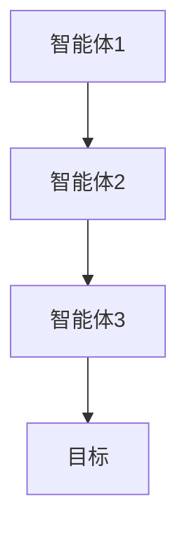
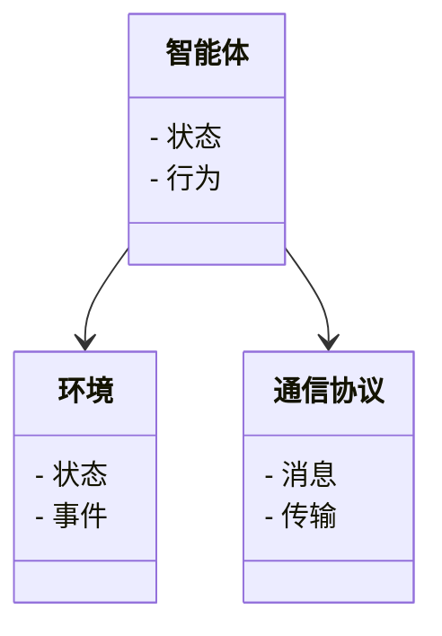

                 


# 多智能体系统如何评估公司的长期竞争优势

> 关键词：多智能体系统、竞争优势、商业决策、协作、适应性

> 摘要：本文探讨了多智能体系统（MAS）在评估公司长期竞争优势中的应用。通过分析MAS的核心概念、算法原理、系统架构，结合实际案例，展示了如何利用MAS提升企业的竞争力。

---

# 第一部分: 多智能体系统与长期竞争优势概述

## 第1章: 多智能体系统核心概念与背景介绍

### 1.1 多智能体系统的基本概念

#### 1.1.1 多智能体系统的定义与特点

多智能体系统（Multi-Agent Systems, MAS）由多个智能体组成，每个智能体能够独立决策并协作完成任务。MAS的特点包括分布式、协作性、适应性和反应性。

**特点对比表**

| 属性 | MAS | 单智能体系统 |
|------|------|------------|
| 结构 | 分布式 | 集中式     |
| 决策 | 分权 | 中央控制   |
| 适应性 | 高 | 低         |

#### 1.1.2 多智能体系统的核心要素与组成

MAS由智能体、环境、通信协议和任务目标组成。智能体通过通信协议协作，适应环境变化，完成任务。

#### 1.1.3 多智能体系统与传统单智能体系统的区别

传统系统依赖中央控制，而MAS通过分布式协作实现目标，更具灵活性和适应性。

### 1.2 多智能体系统在商业竞争中的应用背景

#### 1.2.1 当前商业竞争环境的复杂化

现代商业环境日益复杂，企业需要应对多变的市场和客户需求，MAS提供了协作和适应性解决方案。

#### 1.2.2 多智能体系统在商业决策中的优势

MAS通过协作与竞争平衡、知识共享和信息对称，提升决策效率和准确性。

#### 1.2.3 多智能体系统的应用场景与边界

MAS适用于供应链管理、金融市场交易、智慧城市等领域，但需注意系统复杂性和通信延迟的挑战。

---

## 第2章: 多智能体系统的竞争优势分析

### 2.1 多智能体系统的竞争优势来源

#### 2.1.1 协作与竞争的平衡

智能体间的协作与竞争优化资源分配，提升整体效率。

#### 2.1.2 知识共享与信息对称

MAS促进信息共享，消除信息不对称，提升决策质量。

#### 2.1.3 灵活性与适应性

MAS能够快速适应环境变化，增强企业的应变能力。

### 2.2 多智能体系统竞争力模型

#### 2.2.1 竞争力模型的构建

竞争力模型通过协作效率、信息共享和决策准确率等指标评估企业竞争优势。

#### 2.2.2 竞争力模型的属性与特征对比

| 属性 | 高协作性 | 高信息共享 | 高决策准确率 |
|------|----------|------------|-------------|
| 优势 | 资源优化 | 信息透明   | 高效决策    |
| 劣势 | 协调成本高 | 信息泄露风险 | 决策复杂性 |

#### 2.2.3 竞争力模型的优劣势分析

高协作性和信息共享提升竞争力，但协调成本和信息泄露风险也需考虑。

### 2.3 竞争优势评估指标与方法

#### 2.3.1 评估指标的选择

关键指标包括协作效率、信息共享程度和决策准确率。

#### 2.3.2 评估方法的比较

对比不同方法的优劣势，选择最适合企业情况的评估策略。

#### 2.3.3 实际案例分析

通过具体案例，展示MAS如何帮助某企业优化供应链管理，提升竞争优势。

---

## 第3章: 多智能体系统的算法与数学模型

### 3.1 多智能体系统的核心算法

#### 3.1.1 协作式搜索算法

协作式搜索通过智能体协作找到最优解，适用于复杂问题。

**协作式搜索流程图**



#### 3.1.2 分布式计算与协调算法

分布式计算通过并行处理提高效率，协调算法确保智能体间同步。

#### 3.1.3 自适应优化算法

自适应算法根据环境变化调整策略，增强系统的灵活性。

### 3.2 算法原理的数学模型

#### 3.2.1 协作式搜索的数学模型

$$f(x) = \sum_{i=1}^{n} (x_i - x_{i-1})^2$$

#### 3.2.2 分布式计算的数学模型

$$f(x) = \frac{1}{n}\sum_{i=1}^{n} f_i(x_i)$$

#### 3.2.3 自适应优化的数学模型

$$x_{k+1} = x_k + \alpha_k d_k$$

### 3.3 算法实现与优化

#### 3.3.1 算法实现步骤

详细步骤包括初始化、协作、计算和优化。

#### 3.3.2 算法优化策略

通过参数调整和并行计算提升效率。

#### 3.3.3 算法性能评估

评估算法的效率和准确性，确保其适用于实际场景。

---

## 第4章: 系统架构与功能设计

### 4.1 系统架构设计

#### 4.1.1 分层架构设计

分层架构包括感知层、协作层和决策层，各层协同工作。

**分层架构类图**



#### 4.1.2 分布式架构设计

分布式架构通过节点间协作实现全局目标。

#### 4.1.3 模块化架构设计

模块化架构便于维护和扩展。

### 4.2 系统功能设计

#### 4.2.1 竞争优势评估模块

评估模块通过分析协作效率和信息共享度，评估竞争优势。

#### 4.2.2 多智能体协作模块

协作模块实现智能体间的通信和协作，优化决策。

#### 4.2.3 数据分析与可视化模块

可视化模块提供直观的数据展示，辅助决策。

### 4.3 系统接口设计

#### 4.3.1 外部接口设计

定义与外部系统的接口，确保数据交互顺畅。

#### 4.3.2 内部接口设计

规范智能体间的通信接口，确保协作顺利。

#### 4.3.3 接口交互流程

详细描述接口调用流程，确保系统协调工作。

---

## 第5章: 项目实战与案例分析

### 5.1 项目背景与目标

#### 5.1.1 项目背景介绍

以智能供应链优化为例，展示MAS的应用场景。

#### 5.1.2 项目目标设定

通过MAS优化供应链管理，提升效率和降低成本。

### 5.2 项目核心实现

#### 5.2.1 环境安装与配置

安装必要的软件和库，配置开发环境。

#### 5.2.2 核心代码实现

实现协作式搜索算法，优化供应链流程。

**核心代码示例**

```python
def multi_agent_search(n_agents, target):
    agents = [Agent() for _ in range(n_agents)]
    for agent in agents:
        agent.search(target)
    return agents
```

#### 5.2.3 代码解读与分析

解释代码逻辑，分析其在供应链优化中的应用。

#### 5.2.4 实际案例分析

通过具体案例分析MAS如何优化供应链，提升企业竞争优势。

---

## 第六部分: 总结与展望

### 6.1 总结

MAS通过协作、适应性和信息共享，为企业提供竞争优势。实际案例展示了其在供应链优化中的成功应用。

### 6.2 未来展望

未来，MAS将在分布式计算和自我优化方面进一步发展，为企业创造更多价值。

### 6.3 最佳实践 tips

- 选择合适的MAS架构和算法
- 确保数据质量和通信效率
- 持续优化系统和模型

---

**作者：AI天才研究院 & 禅与计算机程序设计艺术**

---

这篇博客详细探讨了多智能体系统在评估公司长期竞争优势中的应用，通过理论分析和实际案例，展示了如何利用MAS提升企业的竞争力。希望对读者有所帮助！

