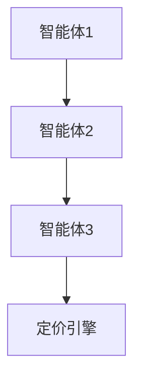

                 


# 多智能体系统实现全球资产定价

## 关键词：
多智能体系统、资产定价、分布式计算、博弈论、金融科技

## 摘要：
本文探讨了多智能体系统在全球资产定价中的应用，从理论基础到实际案例，分析了多智能体系统如何通过分布式计算和博弈论模型实现更高效、更准确的资产定价。文章详细介绍了多智能体系统的概念、算法原理、系统架构，并通过实际案例展示了其在金融领域的应用潜力。

---

# 第一部分: 多智能体系统与全球资产定价背景

## 第1章: 多智能体系统概述

### 1.1 多智能体系统的基本概念
#### 1.1.1 多智能体系统的定义
多智能体系统（Multi-Agent System, MAS）是由多个智能体（Agent）组成的分布式系统，这些智能体能够通过局部信息进行自主决策，并通过交互协作完成复杂的任务。

$$\text{多智能体系统} = \{\text{智能体}, \text{交互规则}, \text{目标函数}\}$$

#### 1.1.2 多智能体系统的特点
| 特性 | 描述 |
|------|------|
| 分布性 | 智能体独立运行，无中心节点 |
| 交互性 | 智能体之间通过消息传递进行协作 |
| 自主性 | 每个智能体都有自己的目标和决策机制 |

#### 1.1.3 多智能体系统的优势与劣势
- **优势**：
  - 高容错性：单个智能体故障不影响整体系统。
  - 强大的分布式计算能力。
- **劣势**：
  - 复杂性高：智能体之间的交互可能导致系统行为难以预测。
  - 协调成本高：需要设计有效的通信机制和协作规则。

### 1.2 全球资产定价的基本理论
#### 1.2.1 资产定价的基本概念
资产定价的核心是确定资产的市场价值，主要受以下几个因素影响：
1. 资产的内在价值。
2. 市场参与者的预期。
3. 市场的流动性。

#### 1.2.2 现代资产定价模型概述
- **CAPM模型**：用于计算资产的预期收益。
- **APT模型**：基于多元因素的资产定价。

#### 1.2.3 全球化视角下的资产定价挑战
- 全球市场的高度波动性。
- 不同市场参与者之间的信息不对称。
- 跨境资产的流动性风险。

## 第2章: 多智能体系统在资产定价中的应用背景

### 2.1 资产定价的传统方法
#### 2.1.1 市场定价理论
市场定价理论认为，资产价格是由市场供需决定的。

#### 2.1.2 个体定价模型
基于个体决策的定价模型，例如基于心理账户的定价。

#### 2.1.3 传统定价方法的局限性
- 无法捕捉个体行为的复杂性。
- 信息更新不及时。

### 2.2 多智能体系统在金融领域的潜力
#### 2.2.1 多智能体系统在金融市场的优势
- 高度分布式：适用于全球化资产定价。
- 自适应性：能够快速响应市场变化。

#### 2.2.2 全球化资产定价的需求
- 多市场协调：需要同时考虑多个市场的价格波动。
- 实时定价：需要高频交易的支持。

#### 2.2.3 多智能体系统与金融科技的结合
- 提供实时定价支持。
- 支持复杂的金融衍生品定价。

---

# 第二部分: 多智能体系统的核心概念与联系

## 第3章: 多智能体系统的核心概念

### 3.1 智能体的行为模型
#### 3.1.1 智能体的定义与属性
$$
\text{智能体} = \{ \text{状态}, \text{行为}, \text{目标} \}
$$

#### 3.1.2 智能体的决策机制
- **基于规则的决策**：通过预定义的规则进行决策。
- **基于模型的决策**：通过构建模型进行预测和决策。

#### 3.1.3 智能体之间的互动规则
- **通信规则**：智能体之间通过消息传递进行通信。
- **协作规则**：智能体之间通过协作完成共同目标。

### 3.2 多智能体系统的定价机制
#### 3.2.1 定价模型的基本框架
$$
\text{价格} = f(\text{智能体行为}, \text{市场信息})
$$

#### 3.2.2 智能体之间的信息传递
- **局部信息**：每个智能体掌握局部市场信息。
- **全局信息**：通过通信获得全局市场信息。

#### 3.2.3 定价过程的动态调整
- 智能体根据市场变化实时调整定价策略。

## 第4章: 多智能体系统与资产定价的关系

### 4.1 资产定价的核心要素
#### 4.1.1 资产的内在价值
$$
\text{内在价值} = \sum_{i=1}^{n} \text{因素}_i \times \text{权重}_i
$$

#### 4.1.2 市场参与者的预期
$$
\text{预期价格} = \sum_{j=1}^{m} \text{参与者}_j \times \text{权重}_j
$$

#### 4.1.3 资产价格的波动性
$$
\text{价格波动} = \sigma^2
$$

### 4.2 多智能体系统对资产定价的影响
#### 4.2.1 提高定价效率
- 多智能体系统通过分布式计算提高定价效率。
- 实现高频交易。

#### 4.2.2 增强定价准确性
- 考虑个体行为和市场互动的复杂性。
- 提供更精确的价格预测。

---

# 第三部分: 多智能体系统的算法原理

## 第5章: 多智能体系统的定价算法

### 5.1 基于博弈论的多智能体协调算法
#### 5.1.1 算法原理
$$
\text{最优策略} = \arg \max_{\theta} \sum_{i=1}^{n} \text{收益}_i
$$

#### 5.1.2 算法流程
1. 初始化：设置智能体的初始状态。
2. 通信：智能体之间交换信息。
3. 协调：基于信息制定定价策略。
4. 执行：智能体根据策略进行定价。

#### 5.1.3 算法实现
```python
class Agent:
    def __init__(self, id):
        self.id = id
        self.state = {}
    
    def communicate(self, other_agents):
        for agent in other_agents:
            self.state.update(agent.state)
    
    def decide_price(self, market_info):
        # 简单实现：基于市场信息计算价格
        return self.state['value'] * market_info['volatility']
```

#### 5.1.4 算法的数学模型
$$
\text{价格} = \sum_{i=1}^{n} \text{智能体}_i \times \text{权重}_i
$$

### 5.2 基于分布式计算的定价模型
#### 5.2.1 分布式计算的基本原理
$$
\text{全局价格} = \sum_{i=1}^{m} \text{局部价格}_i
$$

#### 5.2.2 分布式计算的实现
```python
import threading

class Market:
    def __init__(self):
        self.agents = []
        self.price = 0
    
    def add_agent(self, agent):
        self.agents.append(agent)
    
    def compute_price(self):
        for agent in self.agents:
            agent.communicate(self.agents)
            self.price += agent.decide_price(self.state)
```

---

# 第四部分: 多智能体系统的系统设计

## 第6章: 多智能体系统的架构设计

### 6.1 系统功能设计
#### 6.1.1 功能模块
- 数据采集模块：收集市场数据。
- 定价引擎：基于多智能体算法计算价格。
- 决策模块：根据价格制定策略。

#### 6.1.2 系统交互流程
1. 数据采集：收集市场数据。
2. 通信：智能体之间交换信息。
3. 定价：基于信息计算价格。
4. 决策：根据价格制定策略。

### 6.2 系统架构设计
#### 6.2.1 系统架构图


#### 6.2.2 系统接口设计
- 智能体接口：提供通信和定价功能。
- 数据接口：提供市场数据。

---

# 第五部分: 项目实战

## 第7章: 项目实战

### 7.1 环境安装
```bash
pip install numpy pandas matplotlib
```

### 7.2 核心代码实现
```python
import numpy as np
import pandas as pd

class Agent:
    def __init__(self, id, value):
        self.id = id
        self.value = value
        self.price = 0
    
    def communicate(self, agents):
        # 获取其他智能体的定价
        prices = [agent.price for agent in agents if agent.id != self.id]
        self.price = np.mean(prices) * self.value

# 创建智能体
agents = [Agent(i, np.random.uniform(1, 2)) for i in range(10)]

# 初始化定价
for agent in agents:
    agent.price = agent.value

# 通信与定价
for _ in range(10):
    for agent in agents:
        agent.communicate(agents)
```

### 7.3 实际案例分析
- 案例1：股票定价。
- 案例2：外汇市场定价。

---

# 第六部分: 总结

## 第8章: 总结

### 8.1 最佳实践
- 数据质量至关重要。
- 算法调优需要结合实际场景。

### 8.2 小结
多智能体系统通过分布式计算和博弈论模型，能够实现更高效、更准确的全球资产定价。

### 8.3 注意事项
- 系统设计需要考虑容错性和可扩展性。
- 算法实现需要考虑计算效率。

### 8.4 拓展阅读
- 推荐阅读相关领域的最新研究论文。

---

作者：AI天才研究院/AI Genius Institute & 禅与计算机程序设计艺术 /Zen And The Art of Computer Programming

