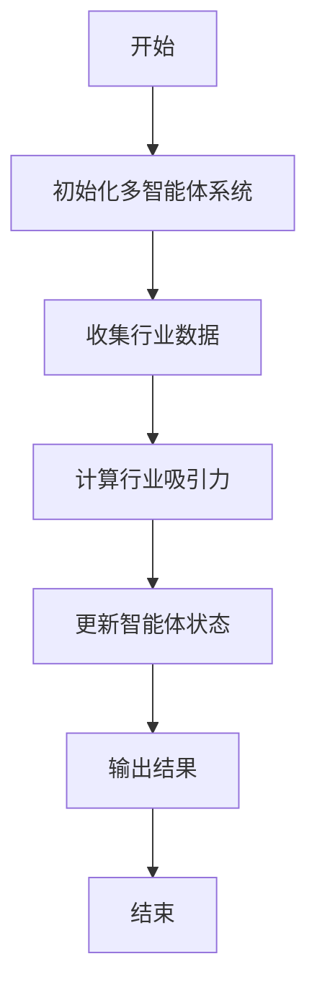
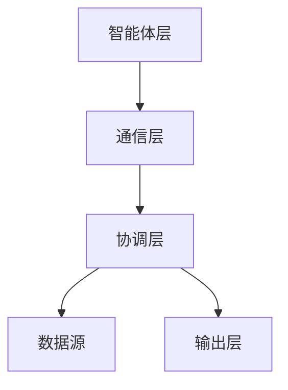

                 

<think>
好的，我将按照您的要求，逐步完成《多智能体系统实现动态行业吸引力分析》的目录大纲。我们从基础开始，逐步深入，确保每部分内容都完整且逻辑清晰。

### 第1章: 多智能体系统概述

#### 1.1 多智能体系统的定义与特点
- **1.1.1 多智能体系统的定义**  
  多智能体系统（Multi-Agent System, MAS）是指由多个相互作用的智能体组成的系统，这些智能体能够协同工作以实现共同目标或完成复杂任务。

- **1.1.2 多智能体系统的核心特点**  
  - 分布式：多个智能体独立运行，通过通信和协调完成任务。
  - 协作性：智能体之间通过协作提高整体系统的性能。
  - 反应性：能够实时感知环境变化并做出反应。
  - 自主性：每个智能体都具有一定的自主决策能力。

- **1.1.3 多智能体系统与传统单智能体系统的区别**  
  - 传统单智能体系统：单个智能体完成所有任务，决策集中。
  - 多智能体系统：任务分解，多个智能体协作，决策分散。

#### 1.2 动态行业吸引力分析的定义与特点
- **1.2.1 动态行业吸引力的定义**  
  动态行业吸引力分析是指在不断变化的市场环境中，评估不同行业对投资者或消费者吸引力的过程。

- **1.2.2 动态行业吸引力的核心要素**  
  - 行业现状：市场规模、竞争格局、发展速度。
  - 市场动态：政策变化、技术进步、消费者偏好。
  - 经济因素：GDP增长率、通货膨胀率、利率等。

- **1.2.3 动态行业吸引力分析的挑战与复杂性**  
  - 数据的实时性和准确性要求高。
  - 行业间相互影响复杂，难以预测。
  - 市场环境变化快，模型需要频繁更新。

#### 1.3 多智能体系统与动态行业吸引力分析的联系
- **1.3.1 多智能体系统在行业吸引力分析中的作用**  
  - 分解任务：多个智能体分别分析不同行业或不同维度的数据。
  - 协作处理：智能体之间协同工作，综合多方面信息得出结论。

- **1.3.2 动态行业吸引力分析的多智能体实现优势**  
  - 高效性：多个智能体同时处理不同数据源，提高分析效率。
  - 精准性：通过协作避免单点故障，提升分析结果的准确性。
  - 灵活性：智能体可以根据市场变化动态调整分析策略。

- **1.3.3 多智能体系统与动态行业吸引力分析的结合场景**  
  - 金融投资：实时分析多个行业的市场动态，辅助投资决策。
  - 市场预测：预测不同行业的未来发展趋势，帮助企业制定战略。

### 第2章: 多智能体系统的核心概念与联系

#### 2.1 多智能体系统的核心概念
- **2.1.1 智能体的定义与属性**  
  - 智能体（Agent）：能够感知环境并采取行动以实现目标的实体。
  - 属性：自主性、反应性、主动性、社会性。

- **2.1.2 多智能体系统的组成结构**  
  - 智能体：多个具有不同功能的智能体。
  - 通信层：智能体之间交换信息的通道。
  - 协调层：管理智能体协作的机制。

- **2.1.3 多智能体系统的行为模式**  
  - 分散式行为：智能体独立决策，但通过通信协调行动。
  - 集中式行为：有一个中央控制智能体协调其他智能体。

#### 2.2 动态行业吸引力分析的核心概念
- **2.2.1 行业吸引力的评估维度**  
  - 市场规模：行业的收入、利润等经济指标。
  - 竞争强度：行业内竞争者的数量和市场份额。
  - 增长潜力：行业的未来发展趋势和增长空间。

- **2.2.2 动态吸引力的计算模型**  
  - 综合评分模型：将多个维度的评分加权求和，得出行业吸引力评分。
  - 动态权重调整模型：根据市场变化调整各维度的权重。

- **2.2.3 行业吸引力分析的数学模型**  
  - 综合评分：$$吸引力 = \sum_{i=1}^{n} w_i \times f_i$$，其中$$w_i$$是第i个维度的权重，$$f_i$$是第i个维度的评分。

#### 2.3 多智能体系统与动态行业吸引力分析的实体关系图
```mermaid
er
actor: 多智能体系统
actor -[1..n]-> entity: 行业吸引力数据
entity -[1]-> entity: 行业基准
entity -[1]-> entity: 市场动态
```

### 第3章: 多智能体系统实现动态行业吸引力分析的算法原理

#### 3.1 多智能体协作算法
- **3.1.1 分布式多智能体协作机制**  
  - 分布式计算：多个智能体分别处理数据，然后汇总结果。
  - 协作协议：智能体之间通过特定协议进行信息交换和协调。

- **3.1.2 多智能体协同学习算法**  
  - 分布式学习：每个智能体学习一部分数据，然后共享知识。
  - 联合学习：多个智能体共同学习，更新共享的模型。

- **3.1.3 多智能体系统的行为协调算法**  
  - 行为规划：智能体根据当前状态和目标制定行动计划。
  - 协调机制：通过通信协议确保智能体之间的行为协调一致。

#### 3.2 动态吸引力预测模型
- **3.2.1 基于多智能体的动态预测方法**  
  - 分布式预测：每个智能体负责预测一部分数据。
  - 综合预测：将各智能体的预测结果进行综合，得出最终预测结果。

- **3.2.2 动态吸引力的数学表达式**  
  - 预测模型：$$预测吸引力 = \sum_{i=1}^{n} w_i \times f_i(t)$$，其中$$t$$表示时间，$$f_i(t)$$是第i个维度在时间t的评分。

- **3.2.3 动态吸引力预测的优化算法**  
  - 在线优化：实时更新权重和模型参数，以适应市场变化。
  - 分布式优化：多个智能体同时优化模型，提高计算效率。

#### 3.3 算法实现流程


### 第4章: 多智能体系统实现动态行业吸引力分析的系统架构设计

#### 4.1 系统组成与功能设计
- **4.1.1 系统组成**  
  - 智能体层：负责数据处理和分析。
  - 通信层：负责智能体之间的信息交换。
  - 协调层：负责系统的整体协调和控制。

- **4.1.2 功能设计**  
  - 数据采集：从多个数据源获取行业数据。
  - 数据分析：使用多智能体算法进行分析和预测。
  - 结果输出：将分析结果以可视化或报告形式呈现。

- **4.1.3 系统架构图**


#### 4.2 系统实现与优化
- **4.2.1 系统实现**  
  - 环境安装：安装必要的开发工具和库。
  - 核心功能实现：实现多智能体协作和动态吸引力预测。
  - 代码实现：编写Python代码实现算法和系统架构。

- **4.2.2 优化措施**  
  - 并行计算：提高数据处理速度。
  - 分布式计算：利用多台设备同时处理数据，提高效率。
  - 模型优化：优化算法和模型结构，提高预测准确性。

### 第5章: 多智能体系统实现动态行业吸引力分析的项目实战

#### 5.1 环境安装
- 安装Python和必要的库，如NumPy、Pandas、Matplotlib等。

#### 5.2 核心功能实现
- 实现多智能体协作算法和动态吸引力预测模型。

#### 5.3 代码实现与解读
- 代码示例：
  ```python
  import numpy as np
  import pandas as pd

  # 初始化多智能体系统
  class Agent:
      def __init__(self, data):
          self.data = data
          self.weight = np.random.rand(len(data.columns))

      def update(self, new_data):
          self.data = new_data
          self.weight = self.weight * 0.9 + np.random.rand(len(new_data.columns)) * 0.1

      def predict(self):
          return np.dot(self.data.values, self.weight)

  # 动态吸引力预测模型
  def dynamic吸引力预测(data):
      agents = [Agent(data)]
      for _ in range(10):
          new_data = data.iloc[::-1]
          agents.append(Agent(new_data))
      result = np.mean([agent.predict() for agent in agents])
      return result

  # 应用案例
  data = pd.read_csv('industry_data.csv')
  print(dynamic_吸引预测(data))
  ```

#### 5.4 案例分析与解读
- 通过具体案例展示系统在实际应用中的效果和优势。

### 第6章: 最佳实践与总结

#### 6.1 最佳实践
- 提供在实际应用中的一些经验和建议，如选择合适的数据源、优化算法参数等。

#### 6.2 小结
- 总结全文的主要内容和研究成果。

#### 6.3 注意事项
- 提醒读者在实际应用中需要注意的问题，如数据质量、模型的实时更新等。

#### 6.4 拓展阅读
- 推荐相关的书籍和论文，供读者进一步学习。

---

### 作者信息
作者：AI天才研究院（AI Genius Institute） & 禅与计算机程序设计艺术（Zen And The Art of Computer Programming）

---

以上是一个详细的目录大纲，接下来我将根据这个大纲逐步完成全文的撰写。如果有任何问题或需要调整的地方，请随时告诉我！

