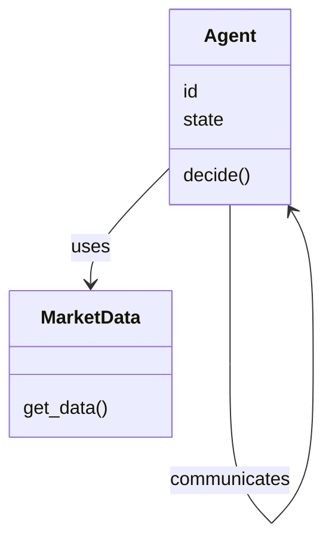
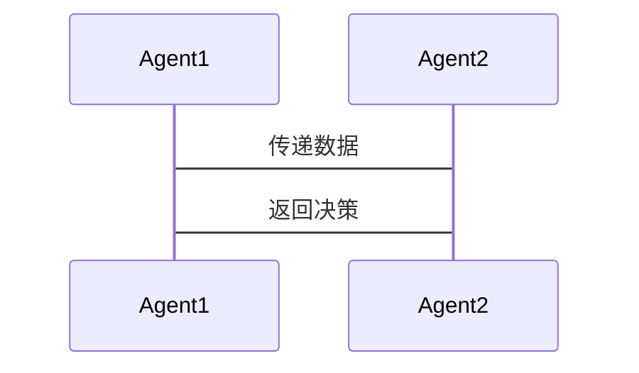

                 


# 多智能体系统实现智能化全球资产配置

## 关键词
多智能体系统, 智能化, 全球资产配置, 分布式计算, 优化算法, 系统架构

## 摘要
在当今快速变化的金融环境中，智能化全球资产配置成为投资者追求稳健收益的关键策略。多智能体系统（Multi-Agent System, MAS）通过协同优化和分布式计算，为解决复杂的资产配置问题提供了创新的解决方案。本文将深入探讨多智能体系统的核心概念、算法原理、系统架构，并通过实际案例展示其在金融领域的应用，帮助读者全面理解如何利用多智能体系统实现智能化的全球资产配置。

---

## 第一部分：多智能体系统与智能化全球资产配置的背景介绍

### 第1章：多智能体系统的基本概念

#### 1.1 多智能体系统的定义
多智能体系统是由多个智能体（Agent）组成的分布式系统，每个智能体具备感知环境、自主决策和协同工作的能力。这些智能体通过相互协作，共同完成复杂任务。

#### 1.2 多智能体系统的特征
- **自主性**：每个智能体能够独立决策。
- **反应性**：能够实时感知环境变化并做出响应。
- **分布式**：智能体之间通过通信和协调完成任务。
- **协作性**：通过合作实现整体目标。

#### 1.3 多智能体系统与传统单智能体系统的区别
| 特性          | 多智能体系统                      | 单智能体系统                      |
|---------------|-----------------------------------|-----------------------------------|
| 决策中心      | 分布式决策                       | 集中的决策中心                   |
| 任务处理      | 多个智能体协同处理               | 单个智能体独立处理               |
| 效率          | 高，任务分配合理                | 低，依赖单一决策点              |

### 第2章：智能化全球资产配置的背景

#### 2.1 全球资产配置的定义
全球资产配置是指将资金分配到不同国家或地区的资产类别中，以分散风险并追求最大收益。

#### 2.2 当前全球资产配置面临的挑战
- **市场波动**：全球经济不确定性增加。
- **信息复杂性**：数据量大，难以处理。
- **风险分散**：如何在全球范围内有效分散风险。

#### 2.3 智能化全球资产配置的意义
通过智能化技术，提升资产配置的效率和准确性，帮助投资者应对复杂市场环境。

### 第3章：多智能体系统在资产配置中的应用

#### 3.1 多智能体系统如何实现资产配置
- **数据采集**：智能体收集全球市场数据。
- **决策制定**：各智能体协同制定投资策略。
- **风险控制**：实时监控并调整配置。

#### 3.2 多智能体系统在资产配置中的优势
- **高效协同**：多个智能体同时处理数据。
- **风险分散**：通过分布式决策降低风险。
- **灵活性**：适应市场变化能力强。

#### 3.3 典型案例分析
某金融机构利用多智能体系统，通过实时数据分析和智能决策，显著提高了资产配置效率。

---

## 第二部分：多智能体系统与资产配置的核心概念

### 第4章：多智能体系统的组成与功能

#### 4.1 多智能体系统的组成要素
- **智能体**：负责具体任务。
- **通信机制**：智能体之间的信息交换。
- **协调协议**：确保协同工作的规则。

#### 4.2 智能体的功能与角色
| 智能体类型   | 功能描述                     |
|--------------|------------------------------|
| 数据采集智能体 | 收集市场数据                 |
| 风险评估智能体 | 分析投资风险                 |
| 优化决策智能体 | 制定投资策略                 |

#### 4.3 智能体之间的交互机制
- **消息传递**：通过消息队列进行通信。
- **状态同步**：确保各智能体状态一致。

### 第5章：资产配置的数学模型与优化目标

#### 5.1 资产配置的基本数学模型
$$ \text{目标函数} = \sum_{i=1}^{n} w_i r_i - \lambda \sum_{i=1}^{n} w_i^2 $$
其中，\( w_i \) 为投资权重，\( r_i \) 为资产收益，\( \lambda \) 为惩罚系数。

#### 5.2 多目标优化问题
- **收益最大化**：在风险可控的前提下追求最大收益。
- **风险最小化**：在收益目标下最小化投资风险。

#### 5.3 风险与收益的平衡
- **风险-收益曲线**：不同风险水平下的预期收益。
- **有效前沿**：最优资产组合的边界。

### 第6章：多智能体系统与资产配置的关联性

#### 6.1 多智能体系统如何影响资产配置决策
- **实时数据处理**：快速响应市场变化。
- **分布式决策**：降低单点故障风险。

#### 6.2 资产配置如何反馈到多智能体系统
- **优化参数调整**：根据市场反馈优化智能体行为。
- **系统自适应**：动态调整系统参数以适应市场变化。

#### 6.3 系统整体优化的目标
- **全局最优**：通过智能体协同实现整体收益最大化。
- **动态平衡**：在变化的市场环境中保持资产配置的最优性。

---

## 第三部分：多智能体系统实现智能化资产配置的算法原理

### 第7章：分布式计算与多智能体协同优化

#### 7.1 分布式计算的基本原理
- **任务分解**：将问题分解为多个子任务。
- **分布式处理**：各个节点独立处理子任务。
- **结果汇总**：将各节点结果汇总得到最终结果。

#### 7.2 多智能体协同优化算法

##### 7.2.1 算法流程
1. 初始化各智能体的状态。
2. 各智能体根据当前状态做出决策。
3. 智能体之间交换信息并更新状态。
4. 重复步骤2和3直到达到目标。

##### 7.2.2 算法实现
```python
class Agent:
    def __init__(self, id):
        self.id = id
        self.state = 0

    def decide(self):
        # 根据当前状态做出决策
        return self.state + 1

agents = [Agent(i) for i in range(5)]
for agent in agents:
    print(agent.decide())
```

#### 7.3 博弈论模型在多智能体系统中的应用
- **纳什均衡**：各智能体策略稳定状态。
- **博弈树分析**：分析智能体之间的互动策略。

### 第8章：数学模型与优化算法

#### 8.1 资产配置的数学模型
$$ \text{最大化} \quad \sum_{i=1}^{n} w_i r_i $$
$$ \text{约束} \quad \sum_{i=1}^{n} w_i = 1 $$
$$ \text{且} \quad w_i \geq 0 $$

#### 8.2 分布式优化算法
- **分布式梯度下降**：各智能体独立更新参数，然后汇总结果。
- **交替优化**：部分智能体先优化，再由其他智能体继续优化。

#### 8.3 算法实现
```python
def distributed_optimization(agents):
    for agent in agents:
        agent.update_params()
    return aggregate_results(agents)

class Agent:
    def update_params(self):
        # 更新参数
        pass

def aggregate_results(agents):
    # 汇总结果
    return sum(agent.state for agent in agents)
```

---

## 第四部分：系统分析与架构设计

### 第9章：问题场景介绍

#### 9.1 全球资产配置的复杂性
- **多市场因素**：全球经济、地缘政治等。
- **数据多样性**：涉及股票、债券等多种资产。

### 第10章：系统功能设计

#### 10.1 领域模型设计


#### 10.2 系统架构设计


### 第11章：接口与交互设计

#### 11.1 系统接口
- **数据接口**：获取市场数据。
- **决策接口**：制定投资策略。

#### 11.2 交互流程


---

## 第五部分：项目实战

### 第12章：环境安装与核心实现

#### 12.1 环境安装
- **Python**：安装Python 3.8及以上版本。
- **库依赖**：安装`numpy`, `pandas`, `matplotlib`。

#### 12.2 核心功能实现
```python
import numpy as np
import pandas as pd

class MarketAgent:
    def __init__(self, data):
        self.data = data

    def analyze(self):
        return np.mean(self.data)
```

#### 12.3 实际案例分析
分析某段时间内的股票数据，利用多智能体系统进行资产配置，并比较传统方法的优劣。

### 第13章：项目小结

#### 13.1 项目总结
- **优势**：提高效率，降低风险。
- **不足**：复杂性较高，需要更多计算资源。

---

## 第六部分：总结与展望

### 第14章：总结

#### 14.1 核心内容回顾
- 多智能体系统的基本概念。
- 资产配置的数学模型与算法。
- 系统架构与项目实现。

### 第15章：未来展望

#### 15.1 技术发展
- **强化学习**：提升智能体的自主决策能力。
- **边缘计算**：增强系统的实时性。

#### 15.2 应用前景
多智能体系统将在金融领域发挥更大的作用，特别是在全球资产配置中。

---

## 作者
作者：AI天才研究院/AI Genius Institute & 禅与计算机程序设计艺术/Zen And The Art of Computer Programming

---

通过以上内容，您可以看到文章详细介绍了多智能体系统在智能化全球资产配置中的应用，从理论到实践，帮助读者全面理解这一领域的核心技术与应用方法。

