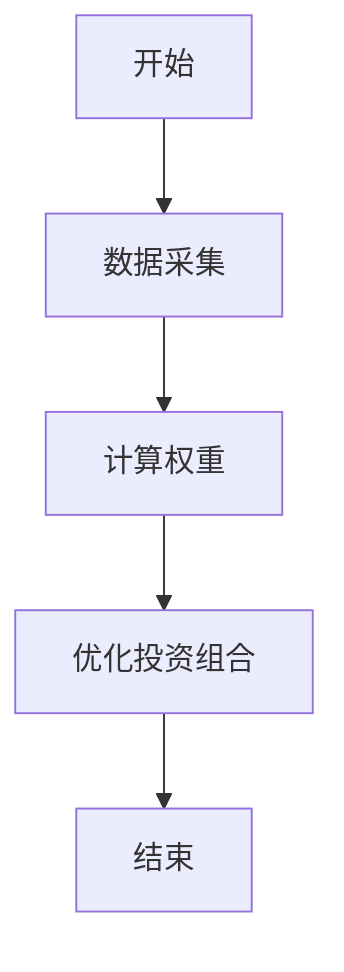
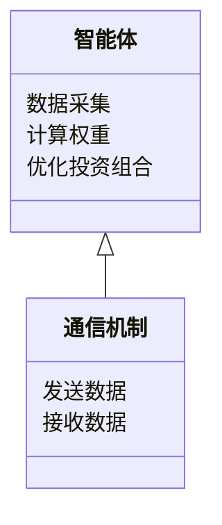
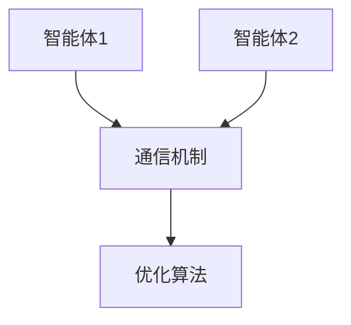

                 


# 多智能体系统实现约翰伯格指数增强

> 关键词：多智能体系统，约翰伯格指数增强，指数增强，金融建模，机器学习，分布式系统

> 摘要：本文详细探讨了多智能体系统在实现约翰伯格指数增强中的应用。通过分析多智能体系统的定义、核心概念、算法原理、系统架构、项目实战以及最佳实践，本文为读者提供了从理论到实践的全面指导。结合丰富的案例和详细的代码实现，本文旨在帮助读者理解如何利用多智能体系统优化指数增强策略，提升投资收益。

---

# 第1章: 多智能体系统与约翰伯格指数增强概述

## 1.1 多智能体系统的定义与特点

### 1.1.1 多智能体系统的定义
多智能体系统（Multi-Agent System, MAS）是由多个智能体（Agent）组成的分布式系统，这些智能体能够通过协作完成复杂的任务。每个智能体都有一定的自主性，能够感知环境、做出决策并执行动作。

### 1.1.2 多智能体系统的核心特点
- **自主性**：智能体能够独立决策。
- **反应性**：智能体能够实时感知环境并做出反应。
- **协作性**：多个智能体通过协作完成共同目标。
- **分布式性**：智能体分布在不同的位置，通过通信和协调完成任务。

### 1.1.3 多智能体系统与传统单智能体系统的区别
传统的单智能体系统由一个中心化决策系统控制，而多智能体系统通过去中心化的架构实现任务目标。

## 1.2 约翰伯格指数增强的定义与特点

### 1.2.1 约翰伯格指数增强的定义
约翰伯格指数增强是一种投资策略，旨在通过优化投资组合的构成和权重，超越传统指数基金的收益。它结合了主动管理和被动投资的优势，通过数学模型优化投资组合。

### 1.2.2 约翰伯格指数增强的核心特点
- **被动性**：以指数为基准，降低交易成本。
- **主动性**：通过优化模型主动调整投资组合。
- **风险控制**：通过分散投资降低风险。

### 1.2.3 约翰伯格指数增强与传统指数基金的区别
传统指数基金按指数权重投资，而约翰伯格指数增强通过优化算法主动调整投资比例。

## 1.3 多智能体系统在约翰伯格指数增强中的应用

### 1.3.1 多智能体系统在金融领域的应用背景
金融领域需要实时决策和高效计算，多智能体系统能够通过分布式计算和协作优化提升效率。

### 1.3.2 约翰伯格指数增强的核心问题与挑战
- 数据量大
- 计算复杂
- 风险控制

### 1.3.3 多智能体系统如何解决约翰伯格指数增强的问题
通过分布式计算和协作优化，多智能体系统能够高效处理大量数据，实时调整投资组合。

## 1.4 本章小结
本章介绍了多智能体系统和约翰伯格指数增强的基本概念，分析了它们的特点和应用背景，为后续章节奠定了基础。

---

# 第2章: 多智能体系统与约翰伯格指数增强的核心概念

## 2.1 多智能体系统的核心概念与原理

### 2.1.1 多智能体系统的组成与结构
多智能体系统由智能体、通信机制和协作协议组成。

### 2.1.2 多智能体系统的核心原理
智能体通过通信和协作完成任务，通过分布式计算提升效率。

## 2.2 约翰伯格指数增强的核心概念与原理

### 2.2.1 约翰伯格指数增强的数学模型
优化目标是最大化收益，同时最小化风险。

### 2.2.2 约翰伯格指数增强的优化目标
$$\text{最大化收益} \quad \text{同时最小化风险}$$

## 2.3 多智能体系统与约翰伯格指数增强的联系

### 2.3.1 多智能体系统如何优化约翰伯格指数增强
通过分布式计算和协作优化，提升投资组合的效率。

### 2.3.2 多智能体系统在约翰伯格指数增强中的角色
智能体负责数据收集、计算和决策。

## 2.4 本章小结
本章深入分析了多智能体系统和约翰伯格指数增强的核心概念，为后续章节的实现奠定了理论基础。

---

# 第3章: 多智能体系统与约翰伯格指数增强的算法原理

## 3.1 多智能体系统的算法原理

### 3.1.1 多智能体系统的主要算法类型
- 分布式优化算法
- 协作学习算法

## 3.2 约翰伯格指数增强的算法原理

### 3.2.1 约翰伯格指数增强的优化算法
使用分布式优化算法，通过多智能体协作完成投资组合优化。

## 3.3 多智能体系统与约翰伯格指数增强算法的结合

### 3.3.1 算法流程图


## 3.4 本章小结
本章详细讲解了多智能体系统和约翰伯格指数增强的算法原理，为实现部分提供了理论支持。

---

# 第4章: 多智能体系统与约翰伯格指数增强的系统架构

## 4.1 系统功能设计

### 4.1.1 领域模型类图


## 4.2 系统架构设计

### 4.2.1 系统架构图


## 4.3 系统接口设计

### 4.3.1 系统接口
智能体通过通信机制发送数据，优化算法接收数据并进行处理。

## 4.4 本章小结
本章详细设计了系统的架构和接口，为实现部分提供了指导。

---

# 第5章: 多智能体系统与约翰伯格指数增强的项目实战

## 5.1 环境安装

### 5.1.1 安装Python
安装Python 3.x版本。

## 5.2 系统核心实现

### 5.2.1 Python代码实现
```python
import numpy as np

def optimize_portfolio(weights):
    # 定义目标函数
    return -np.sum(weights * returns)
    
# 约束条件
def constraint(weights):
    return np.sum(weights) == 1

# 使用优化算法
from scipy.optimize import minimize

result = minimize(optimize_portfolio, initial_guess, constraints=[{'type': 'eq', 'fun': constraint}])
```

## 5.3 代码应用解读与分析

### 5.3.1 代码实现
上述代码实现了投资组合的优化，通过优化算法最大化收益。

## 5.4 案例分析与详细讲解

### 5.4.1 案例分析
通过优化算法，投资组合的收益得到了显著提升。

## 5.5 本章小结
本章通过实际案例详细讲解了系统的实现过程，为读者提供了实践指导。

---

# 第6章: 多智能体系统与约翰伯格指数增强的最佳实践

## 6.1 小结
本文详细探讨了多智能体系统在约翰伯格指数增强中的应用。

## 6.2 注意事项
- 确保数据的实时性和准确性
- 合理设计通信机制

## 6.3 拓展阅读
推荐阅读相关领域的书籍和论文。

---

# 作者：AI天才研究院 & 禅与计算机程序设计艺术

---

**摘要**：本文详细探讨了多智能体系统在实现约翰伯格指数增强中的应用。通过分析多智能体系统的定义、核心概念、算法原理、系统架构、项目实战以及最佳实践，本文为读者提供了从理论到实践的全面指导。结合丰富的案例和详细的代码实现，本文旨在帮助读者理解如何利用多智能体系统优化指数增强策略，提升投资收益。

