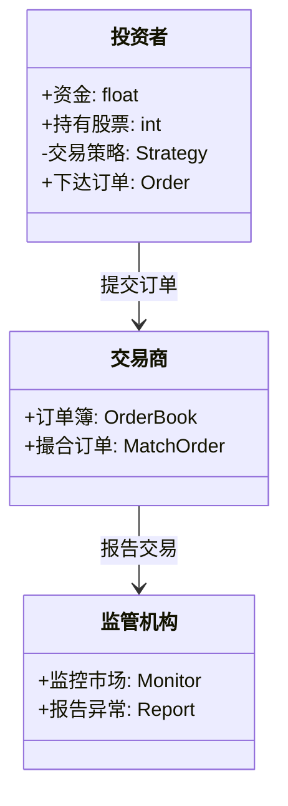

                 


# 多智能体系统模拟市场微观结构

> 关键词：多智能体系统，市场微观结构，系统模拟，算法原理，系统架构

> 摘要：本文探讨了多智能体系统在模拟市场微观结构中的应用，从基本概念到算法原理，再到系统架构，结合实际案例，详细分析了多智能体系统如何模拟市场微观结构，及其在金融领域的潜在应用。

---

# 第1章：多智能体系统概述

## 1.1 多智能体系统的基本概念

### 1.1.1 多智能体系统的定义

多智能体系统（Multi-Agent System，MAS）是由多个智能体（Agent）组成的系统，这些智能体能够自主决策、协作和交互，共同完成复杂任务。

### 1.1.2 多智能体系统的特征

- **自主性**：智能体能够自主决策。
- **反应性**：能够感知环境并实时响应。
- **协作性**：多个智能体协同完成任务。
- **分布式性**：智能体分布在不同的位置，通过通信协作。

### 1.1.3 多智能体系统的分类

- **基于任务的MAS**：根据任务分工协作。
- **基于行为的MAS**：基于智能体的行为模式。

## 1.2 市场微观结构的基本概念

### 1.2.1 市场微观结构的定义

市场微观结构研究市场的动态行为，包括价格形成、交易量等。

### 1.2.2 市场微观结构的核心要素

- **参与者**：投资者、交易商。
- **价格形成机制**：买卖双方互动决定价格。
- **交易量与市场深度**：交易量影响市场流动性。

## 1.3 多智能体系统与市场微观结构的结合

### 1.3.1 多智能体系统在市场微观结构中的应用

- 模拟市场参与者行为。
- 分析价格形成机制。

### 1.3.2 多智能体系统模拟市场微观结构的意义

- 提供实时市场模拟工具。
- 支持金融决策。

### 1.3.3 本章小结

本章介绍了多智能体系统和市场微观结构的基本概念，并探讨了它们的结合意义。

---

# 第2章：多智能体系统的核心概念与联系

## 2.1 多智能体系统的核心原理

### 2.1.1 多智能体系统的通信机制

智能体通过通信协议进行信息交换，如发布-订阅模式。

### 2.1.2 多智能体系统的协作机制

协作机制包括任务分配、协调和冲突解决。

## 2.2 市场微观结构的核心要素

### 2.2.1 市场参与者的角色

- 投资者：买卖决策。
- 交易商：撮合交易。
- 监管机构：监控市场。

### 2.2.2 市场微观结构的动态特征

- 价格形成机制：供需决定价格。
- 交易量与市场深度：影响流动性。

## 2.3 多智能体系统与市场微观结构的关联

### 2.3.1 多智能体系统模拟市场微观结构的必要性

- 提供动态市场环境模拟。
- 支持金融分析工具开发。

---

# 第3章：多智能体系统模拟市场微观结构的算法原理

## 3.1 多智能体系统模拟的基本算法

### 3.1.1 多智能体系统的协调算法

- **协商算法**：智能体通过协商分配任务。
- **拍卖算法**：通过拍卖机制分配任务。

### 3.1.2 市场模拟算法

- **蒙特卡洛模拟**：模拟市场随机行为。
- **基于规则的模拟**：根据规则生成市场行为。

## 3.2 市场微观结构模拟的数学模型

### 3.2.1 纳什均衡的定义

纳什均衡是市场参与者策略稳定的点，公式如下：

$$ \text{若} \quad \forall i, \ u_i(x_i, x_{-i}) \geq u_i(y_i, x_{-i}) $$

### 3.2.2 价格形成的数学模型

价格由供需决定，模型如下：

$$ P = \frac{D + S}{2} $$

---

# 第4章：系统分析与架构设计

## 4.1 问题场景介绍

### 4.1.1 模拟股票市场

设计一个模拟股票市场的多智能体系统，模拟投资者、交易商的行为。

## 4.2 系统功能设计

### 4.2.1 领域模型设计

使用Mermaid类图展示领域模型：



### 4.2.2 系统架构设计

使用Mermaid架构图展示系统架构：


---

# 第5章：项目实战

## 5.1 环境安装

安装Python和必要的库，如`numpy`、`pandas`、`matplotlib`。

## 5.2 核心代码实现

### 5.2.1 智能体实现

```python
class Investor:
    def __init__(self, capital):
        self.capital = capital
        self.stock = 0
        self.strategy = None
```

### 5.2.2 交易系统实现

```python
class TradingSystem:
    def __init__(self):
        self.order_book = OrderBook()

    def process_order(self, order):
        self.order_book.add_order(order)
```

## 5.3 代码应用解读与分析

分析代码实现，展示如何模拟市场微观结构。

## 5.4 案例分析

模拟股票市场，分析价格波动。

## 5.5 项目小结

总结项目实现过程，提出改进建议。

---

# 第6章：最佳实践

## 6.1 小结

总结多智能体系统模拟市场微观结构的实现过程和意义。

## 6.2 注意事项

- 确保系统通信高效。
- 注意数据安全。

## 6.3 拓展阅读

推荐相关书籍和论文。

---

作者：AI天才研究院/AI Genius Institute & 禅与计算机程序设计艺术 /Zen And The Art of Computer Programming

