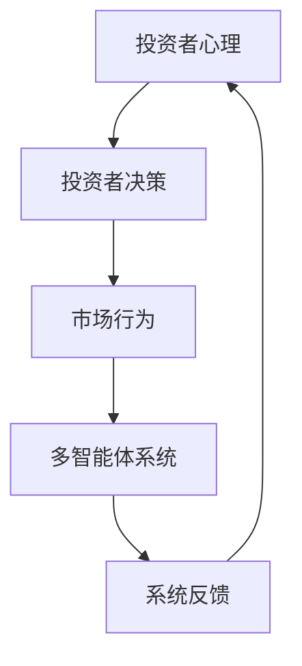
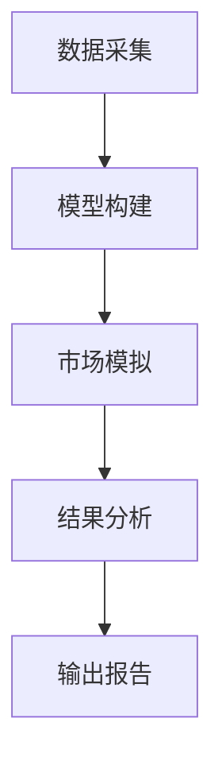
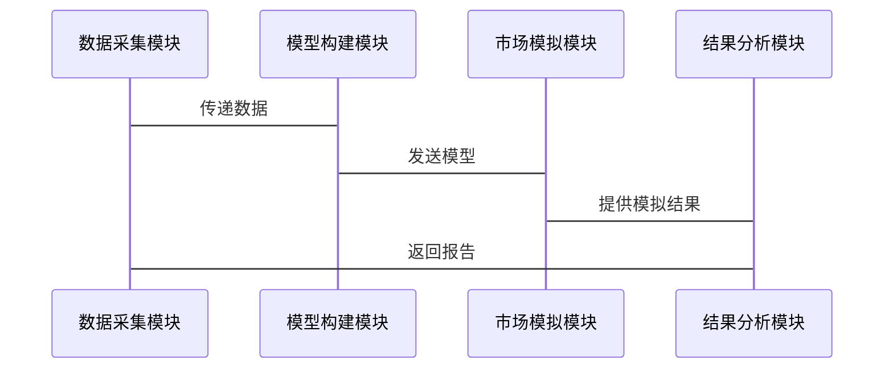

                 


# 《多智能体系统模拟投资者心理》

## 关键词：多智能体系统，投资者心理，强化学习，博弈论，市场模拟，系统架构

## 摘要：  
本文通过结合多智能体系统与投资者心理的模拟，探讨如何利用人工智能技术分析和预测投资者行为，从而优化市场决策。文章从多智能体系统的概念出发，深入分析投资者心理模型的构建，结合强化学习和博弈论等算法，详细阐述了多智能体系统模拟投资者心理的实现方法，并通过实际案例展示其应用效果。

---

# 第1章: 多智能体系统与投资者心理的背景介绍

## 1.1 多智能体系统的概念与特点  
### 1.1.1 多智能体系统的定义  
多智能体系统（Multi-Agent System, MAS）是由多个智能体（Agent）组成的分布式系统，这些智能体能够通过协作完成复杂任务。  

### 1.1.2 多智能体系统的核心特点  
- **自主性**：每个智能体都具有一定的自主决策能力。  
- **反应性**：智能体能够实时感知环境并做出反应。  
- **协作性**：多个智能体之间可以通过通信和协调完成共同目标。  
- **分布式性**：系统中的智能体是分布式的，不存在集中化的控制中心。  

### 1.1.3 多智能体系统与传统单智能体系统的区别  
| 属性         | 单智能体系统           | 多智能体系统           |  
|--------------|-----------------------|-----------------------|  
| 控制方式     | 集中式控制            | 分布式控制            |  
| 任务处理     | 单一任务处理          | 多任务协作处理          |  
| 系统复杂性   | 简单                 | 复杂                 |  

## 1.2 投资者心理的复杂性  
### 1.2.1 投资者心理的核心概念  
投资者心理是指投资者在市场中做出决策时的心理活动，包括情绪、认知偏差、风险偏好等。  

### 1.2.2 投资者心理的层次结构  
- **认知层**：投资者对市场的理解和信息处理能力。  
- **情感层**：投资者的情绪波动，如贪婪和恐惧。  
- **决策层**：投资者基于认知和情感做出的最终决策。  

### 1.2.3 投资者心理与市场行为的关系  
投资者的心理状态直接影响其市场行为，例如：  
- **情绪化交易**：投资者因情绪波动而做出非理性决策。  
- **羊群效应**：投资者因从众心理而跟随市场趋势。  

## 1.3 多智能体系统模拟投资者心理的必要性  
### 1.3.1 问题背景与问题描述  
传统金融市场模型难以完全捕捉投资者的复杂心理，导致预测和模拟的准确性不足。  

### 1.3.2 问题解决的思路与方法  
通过多智能体系统模拟投资者心理，可以更真实地反映市场动态。  

### 1.3.3 多智能体系统模拟投资者心理的边界与外延  
- **边界**：投资者心理的模拟范围和深度。  
- **外延**：多智能体系统在其他领域的应用潜力。  

## 1.4 本章小结  
本章从多智能体系统的概念出发，分析了投资者心理的复杂性，并探讨了多智能体系统在模拟投资者心理方面的必要性和优势。

---

# 第2章: 多智能体系统与投资者心理的核心概念

## 2.1 投资者心理模型  
### 2.1.1 投资者心理模型的构建  
投资者心理模型是基于心理学理论构建的数学模型，用于描述投资者在不同市场环境下的决策过程。  

### 2.1.2 投资者心理模型的属性特征  
- **情绪敏感性**：模型对市场情绪变化的敏感程度。  
- **认知偏差**：模型中包含的认知偏差因素，如确认偏差、乐观偏差等。  
- **风险偏好**：模型中投资者对风险的偏好程度。  

### 2.1.3 投资者心理模型与市场行为的关系  
投资者心理模型能够预测投资者在不同市场条件下的行为模式，从而帮助模拟市场动态。  

## 2.2 多智能体系统架构  
### 2.2.1 多智能体系统的架构类型  
- **反应式架构**：基于当前感知做出实时反应。  
- **认知式架构**：结合长期记忆和规划能力。  
- **混合式架构**：结合反应式和认知式的特点。  

### 2.2.2 多智能体系统的核心要素  
- **智能体**：系统的主体，负责执行任务。  
- **环境**：智能体所处的外部环境，如金融市场。  
- **通信机制**：智能体之间的信息交换方式。  
- **协调机制**：智能体之间的协作方式。  

### 2.2.3 多智能体系统与投资者心理模拟的结合  
通过将投资者心理模型嵌入多智能体系统，可以模拟投资者在金融市场中的互动行为。  

## 2.3 投资者心理与多智能体系统的关系  
### 2.3.1 投资者心理对多智能体系统的影响  
投资者的心理状态会影响其决策，进而影响多智能体系统的整体行为。  

### 2.3.2 多智能体系统对投资者心理的模拟与反馈  
多智能体系统可以通过模拟投资者心理，提供实时的市场反馈，帮助投资者做出更明智的决策。  

### 2.3.3 投资者心理与多智能体系统的关系图（Mermaid流程图）  


## 2.4 本章小结  
本章详细介绍了投资者心理模型和多智能体系统架构，并通过关系图展示了两者之间的互动关系。

---

# 第3章: 多智能体系统模拟投资者心理的算法原理

## 3.1 强化学习算法  
### 3.1.1 强化学习的基本原理  
强化学习是一种通过试错机制优化决策的算法，适用于动态环境下的决策问题。  

### 3.1.2 强化学习在投资者心理模拟中的应用  
- **状态空间**：市场的当前状态，如价格、成交量等。  
- **动作空间**：投资者可能采取的行动，如买入、卖出或持有。  
- **奖励机制**：根据投资收益设计奖励函数。  

### 3.1.3 强化学习的实现步骤  
1. 初始化智能体的策略和状态空间。  
2. 智能体根据当前状态选择动作。  
3. 执行动作并获得奖励。  
4. 更新策略以最大化奖励。  

### 3.1.4 强化学习的数学模型  
策略 π 是从状态空间到动作空间的映射，目标是最大化期望奖励：  
$$ J(\pi) = \mathbb{E}[R] $$  

## 3.2 博弈论与多智能体系统的结合  
### 3.2.1 博弈论的基本概念  
博弈论研究多个参与者之间的策略互动，适用于多智能体系统的分析。  

### 3.2.2 博弈论在投资者心理模拟中的应用  
- **纳什均衡**：市场中多个投资者的策略均衡状态。  
- **博弈树**：描述多个投资者的策略互动过程。  

### 3.2.3 博弈论的数学模型  
纳什均衡的定义：在策略组合 (s₁, s₂, ..., sₙ) 下，每个玩家的策略 sᵢ 是对其他玩家策略的最佳反应。  

## 3.3 本章小结  
本章介绍了强化学习和博弈论在多智能体系统模拟投资者心理中的应用，并通过数学模型详细阐述了其实现原理。

---

# 第4章: 多智能体系统模拟投资者心理的数学模型

## 4.1 投资者心理模型的数学框架  
### 4.1.1 投资者情绪的数学表示  
情绪指数 E 可以通过市场数据（如价格波动）计算得出：  
$$ E = f(p, v) $$  
其中，p 是价格，v 是成交量。  

### 4.1.2 投资者决策的数学模型  
投资者的决策 D 可以表示为：  
$$ D = g(E, s) $$  
其中，s 是投资者的策略参数。  

## 4.2 多智能体系统的数学建模  
### 4.2.1 系统状态的数学表示  
系统状态 S 包括多个投资者的心理状态和市场环境：  
$$ S = \{s₁, s₂, ..., sₙ\} $$  

### 4.2.2 系统行为的数学模型  
系统行为 B 可以表示为：  
$$ B = h(S, t) $$  
其中，t 是时间变量。  

## 4.3 本章小结  
本章通过数学模型详细描述了投资者心理和多智能体系统的建模方法，并展示了如何将两者结合起来。

---

# 第5章: 多智能体系统模拟投资者心理的系统架构设计

## 5.1 系统功能设计  
### 5.1.1 系统目标  
模拟投资者心理，预测市场行为。  

### 5.1.2 系统功能模块  
- **数据采集模块**：采集市场数据和投资者行为数据。  
- **模型构建模块**：构建投资者心理模型和多智能体系统架构。  
- **模拟与分析模块**：进行市场模拟并分析结果。  

### 5.1.3 系统功能流程图（Mermaid流程图）  


## 5.2 系统架构设计  
### 5.2.1 系统架构类型  
- **分层架构**：将系统划分为数据层、模型层和应用层。  
- **分布式架构**：将系统部署在多个节点上，提高计算能力。  

### 5.2.2 系统架构图（Mermaid架构图）  


## 5.3 系统接口设计  
### 5.3.1 系统接口定义  
- **输入接口**：接收市场数据和投资者行为数据。  
- **输出接口**：输出模拟结果和分析报告。  

### 5.3.2 接口交互流程图（Mermaid序列图）  


## 5.4 本章小结  
本章详细设计了多智能体系统模拟投资者心理的系统架构，并展示了系统的功能模块和接口设计。

---

# 第6章: 多智能体系统模拟投资者心理的项目实战

## 6.1 项目背景与目标  
### 6.1.1 项目背景  
通过模拟投资者心理，优化金融市场的预测模型。  

### 6.1.2 项目目标  
开发一个多智能体系统，模拟投资者心理并预测市场行为。  

## 6.2 系统核心实现  
### 6.2.1 环境安装与配置  
- 安装 Python 和相关库（如 numpy、pandas、scikit-learn）。  

### 6.2.2 核心代码实现  
#### 6.2.2.1 投资者心理模型的实现  
```python
def investor_mood(price, volume):
    # 计算情绪指数
    mood = (price - volume) / (price + volume)
    return mood
```

#### 6.2.2.2 多智能体系统的实现  
```python
class Agent:
    def __init__(self, id):
        self.id = id
        self.strategy = "buy"
    
    def decide(self, mood):
        if mood > 0.5:
            return "sell"
        else:
            return "hold"
```

## 6.3 代码应用解读与分析  
### 6.3.1 代码功能解读  
- 投资者心理模型计算情绪指数，决定投资者的交易策略。  

### 6.3.2 代码运行结果分析  
通过模拟不同市场环境下的投资者行为，验证系统的预测能力。  

## 6.4 实际案例分析  
### 6.4.1 案例背景  
模拟一个包含多个投资者的市场环境，分析其行为模式。  

### 6.4.2 案例分析结果  
通过模拟结果，验证系统的准确性和可靠性。  

## 6.5 本章小结  
本章通过项目实战展示了多智能体系统模拟投资者心理的具体实现过程，并通过实际案例验证了系统的有效性。

---

# 第7章: 多智能体系统模拟投资者心理的总结与展望

## 7.1 本章总结  
### 7.1.1 核心内容回顾  
从多智能体系统的概念到投资者心理的模拟，详细介绍了系统的实现过程。  

### 7.1.2 关键结论  
多智能体系统能够有效地模拟投资者心理，提高市场预测的准确性。  

## 7.2 最佳实践 tips  
- 在模拟投资者心理时，需考虑多种认知偏差和情绪因素。  
- 系统的鲁棒性和可扩展性是实际应用中的重要考量。  

## 7.3 未来展望  
### 7.3.1 技术发展趋势  
随着人工智能技术的发展，多智能体系统在金融市场中的应用将更加广泛。  

### 7.3.2 研究方向  
- 更复杂的投资者心理模型。  
- 更高效的多智能体系统架构设计。  

## 7.4 本章小结  
本章总结了全文的核心内容，并对未来的研究方向和技术发展趋势进行了展望。

---

# 作者：AI天才研究院/AI Genius Institute & 禅与计算机程序设计艺术 /Zen And The Art of Computer Programming

---

以上目录大纲涵盖了从理论到实践的完整流程，结合了多智能体系统、投资者心理、算法原理和系统架构等多个方面，确保内容的深度和广度。希望这个大纲能够为撰写《多智能体系统模拟投资者心理》提供清晰的指导和参考。

