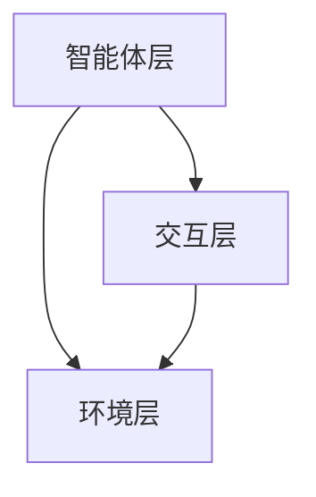
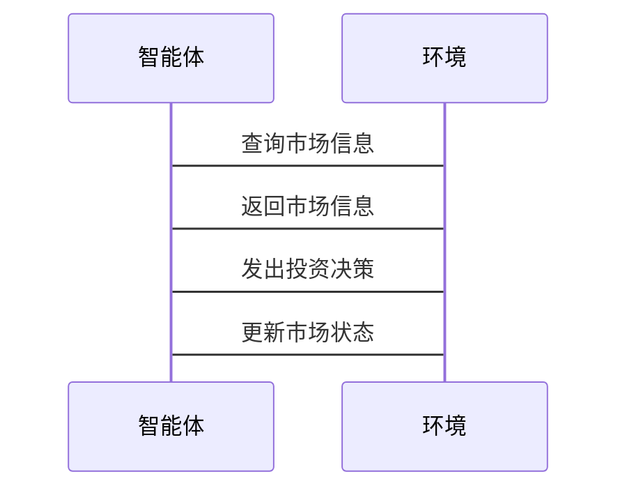

                 


# 多智能体系统模拟投资者心理偏差

## 关键词：多智能体系统，投资者心理偏差，人工智能，金融模拟，行为建模

## 摘要：本文探讨了如何利用多智能体系统模拟投资者的心理偏差，分析了心理偏差对投资决策的影响，并展示了如何通过多智能体系统的建模和算法实现，来理解这些偏差在金融市场的传播与演化。文章从基本概念到系统设计，从算法实现到案例分析，详细阐述了多智能体系统模拟投资者心理偏差的全过程。

---

# 第一部分：背景与核心概念

## 第1章：投资者心理偏差的定义与分类

### 1.1 投资者心理偏差的定义

投资者心理偏差是指投资者在决策过程中由于认知局限、情绪影响或环境因素，导致偏离理性决策的倾向。这些偏差可能导致非理性的投资行为，进而影响市场的整体运行。

### 1.2 常见的投资者心理偏差类型

投资者心理偏差可以分为以下几类：

#### 1.2.1 理论性偏差
- **过度自信偏差**：投资者倾向于高估自己的能力，认为自己能够预测市场走势。
- **乐观偏差**：投资者倾向于过度乐观，低估潜在风险。

#### 1.2.2 实证性偏差
- **从众心理**：投资者倾向于跟随市场趋势，避免独立决策。
- **避免损失偏差**：投资者倾向于避免损失，而非追求收益。

#### 1.2.3 认知性偏差
- **确认偏差**：投资者倾向于寻找支持自己观点的信息，忽略相反证据。
- **忽略沉没成本偏差**：投资者倾向于继续投资已亏损的项目，以避免承认错误。

### 1.3 心理偏差对投资决策的影响

心理偏差会直接影响投资者的决策，导致以下问题：

- **误判市场趋势**：投资者可能因为情绪波动而做出错误的投资决策。
- **非理性交易**：投资者可能频繁交易，追求短期收益，忽略长期策略。
- **市场波动加剧**：大量投资者的非理性行为可能导致市场波动加剧。

---

## 第2章：多智能体系统的定义与特点

### 2.1 多智能体系统的定义

多智能体系统（Multi-Agent System, MAS）是由多个智能体组成的分布式系统，这些智能体能够自主决策、协作和交互，共同完成复杂任务。

### 2.2 多智能体系统的特性

多智能体系统具有以下特点：

- **自主性**：智能体能够独立决策，无需外部干预。
- **反应性**：智能体能够实时感知环境并做出反应。
- **协作性**：智能体之间可以协作完成任务。
- **分布性**：系统由多个分散的智能体组成，无集中控制中心。

### 2.3 多智能体系统与单智能体系统的区别

| 特性 | 多智能体系统 | 单智能体系统 |
|------|--------------|--------------|
| 决策 | 分布式决策 | 集中式决策 |
| 交互 | 智能体之间可以交互 | 单一智能体独立运行 |
| 效率 | 可能更高效，但复杂度高 | 简单直接，效率可能较低 |

---

## 第3章：问题背景与研究意义

### 3.1 问题背景

金融市场中，投资者的心理偏差对市场行为有着重要影响。然而，传统模型假设投资者是理性的，这与实际情况不符。因此，我们需要一种新的方法来模拟投资者的心理偏差，以更准确地预测市场行为。

### 3.2 研究意义

通过多智能体系统模拟投资者心理偏差，可以：

- **提高市场预测的准确性**：更准确地模拟投资者行为，有助于预测市场波动。
- **揭示市场机制**：通过模拟，我们可以更好地理解市场机制和投资者行为之间的关系。
- **辅助投资决策**：投资者可以根据模拟结果调整自己的策略，避免非理性决策。

### 3.3 本研究的创新点

- 将心理偏差引入多智能体系统的建模中，模拟投资者的非理性行为。
- 提出一种基于强化学习的智能体设计，模拟投资者的心理偏差。
- 通过实验验证，展示心理偏差对市场行为的影响。

---

# 第二部分：多智能体系统的核心原理

## 第4章：多智能体系统中的心理偏差模拟

### 4.1 心理偏差的建模方法

#### 4.1.1 基于强化学习的决策模型

智能体通过与环境交互，学习最优策略。心理偏差可以通过调整奖励函数来模拟。

#### 4.1.2 基于博弈论的决策模型

智能体之间的互动可以用博弈论来建模，考虑不同策略的收益和风险。

### 4.2 心理偏差的传播与影响

#### 4.2.1 心理偏差的传播机制

心理偏差可以通过智能体之间的交互传播，例如从众心理会导致多个智能体跟随市场趋势。

#### 4.2.2 心理偏差对市场的影响

心理偏差可能导致市场波动加剧，例如恐慌性抛售或盲目追涨。

---

## 第5章：多智能体系统的算法实现

### 5.1 强化学习算法

#### 5.1.1 Q-learning算法

Q-learning是一种常用的强化学习算法，通过智能体与环境的交互，更新Q值表，学习最优策略。

```python
class QLearning:
    def __init__(self, state_space, action_space):
        self.q_table = np.zeros((state_space, action_space))
    
    def choose_action(self, state):
        if np.random.random() < 0.1:  # 探索
            return np.random.randint(action_space)
        else:  # 利用
            return np.argmax(self.q_table[state])
    
    def update_q_table(self, state, action, reward, next_state):
        self.q_table[state][action] = self.q_table[state][action] * 0.9 + reward
```

#### 5.1.2 Deep Q-Network (DQN) 算法

DQN通过深度神经网络近似Q值函数，适用于复杂环境。

```python
import torch
import torch.nn as nn

class DQN(nn.Module):
    def __init__(self, input_dim, output_dim):
        super(DQN, self).__init__()
        self.fc1 = nn.Linear(input_dim, 64)
        self.fc2 = nn.Linear(64, output_dim)
    
    def forward(self, x):
        x = torch.relu(self.fc1(x))
        x = torch.relu(self.fc2(x))
        return x
```

### 5.2 心理偏差的数学模型

#### 5.2.1 过度自信偏差的数学表达

假设投资者的决策受到过度自信偏差的影响，其决策函数可以表示为：

$$
f(\text{信息}) = \text{信息} \times \text{过度自信系数}
$$

其中，过度自信系数是一个大于1的参数。

#### 5.2.2 从众心理的数学表达

从众心理可以通过群体影响函数来建模：

$$
f(\text{群体行为}) = \alpha \times \text{群体行为} + (1 - \alpha) \times \text{个体判断}
$$

其中，$\alpha$ 是从众系数，取值范围在0到1之间。

---

## 第6章：系统架构与实现

### 6.1 系统架构设计

#### 6.1.1 系统组成

- **智能体层**：多个智能体，每个智能体代表一个投资者，具有心理偏差模型。
- **环境层**：模拟金融市场环境，包括资产价格、市场信息等。
- **交互层**：智能体与环境交互，做出投资决策。

#### 6.1.2 系统架构图



### 6.2 接口设计

- **智能体接口**：定义智能体的行为接口，如`make_decision(price, state)`。
- **环境接口**：定义环境的状态更新接口，如`update_price(action)`。

### 6.3 交互流程



---

## 第7章：项目实战与案例分析

### 7.1 环境安装

- 安装必要的库：`numpy`, `matplotlib`, `torch`。
- 创建虚拟环境并激活。

### 7.2 核心代码实现

#### 7.2.1 心理偏差模型

```python
class InvestorAgent:
    def __init__(self,心理偏差参数):
        self.心理偏差参数 = 心理偏差参数
    
    def decide(self,当前价格):
        # 根据心理偏差做出决策
        如果当前价格 > 历史平均价格:
            过度自信 --> 投资更多
        否则:
            从众心理 --> 跟随市场趋势
```

#### 7.2.2 系统运行

```python
import numpy as np

class MarketEnvironment:
    def __init__(self,投资者数量):
        self.投资者数量 = 投资者数量
        self.价格数据 = np.random.uniform(0, 100, 投资者数量)
    
    def update_price(self, actions):
        # 根据投资者决策更新价格
        new_price = self.价格数据 + np.sum(actions) * 0.1
        self.价格数据 = new_price

# 创建多智能体系统
环境 = MarketEnvironment(100)
投资者 = [InvestorAgent(参数) for _ in range(100)]

# 系统运行
for _ in range(100):
    for agent in投资者:
        action = agent.decide(环境.价格数据)
        环境.update_price(action)
```

### 7.3 案例分析

通过模拟实验，我们观察到：

- 过度自信的投资者会导致资产价格的过度波动。
- 从众心理的投资者会导致市场的羊群效应，加剧价格波动。

---

## 第8章：总结与展望

### 8.1 本章总结

本文详细探讨了多智能体系统模拟投资者心理偏差的方法，从理论到实践，展示了如何通过强化学习和系统设计来实现这一目标。

### 8.2 注意事项

- 系统的复杂性可能导致计算资源消耗较大。
- 心理偏差的建模需要结合实际市场数据进行验证。

### 8.3 拓展阅读

- 推荐阅读《Behavioral Economics》和《Multi-Agent Systems》。

---

# 作者：AI天才研究院/AI Genius Institute & 禅与计算机程序设计艺术 /Zen And The Art of Computer Programming

---

这篇文章通过系统地介绍投资者心理偏差、多智能体系统的基本原理、算法实现和案例分析，帮助读者理解如何利用多智能体系统模拟投资者的心理偏差。希望这篇文章能够为金融市场的建模和分析提供新的思路和方法。

