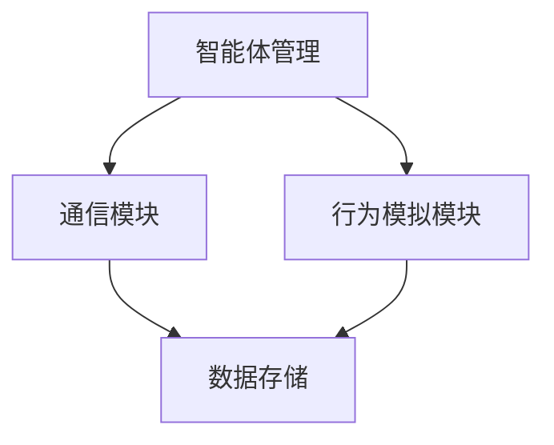
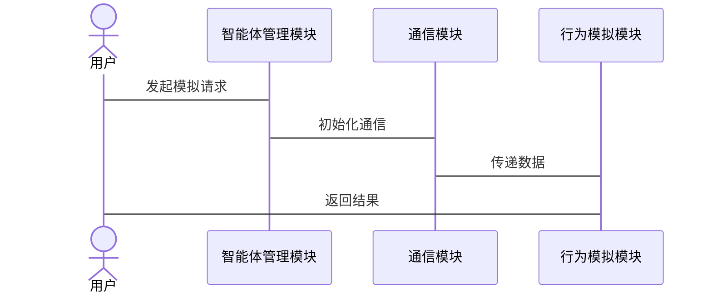

                 


# 多智能体系统模拟机构投资行为

## 关键词
- 多智能体系统
- 机构投资行为
- 行为建模
- 分布式计算
- 金融市场模拟

## 摘要
本文探讨了如何利用多智能体系统（MAS）模拟机构投资者在金融市场中的行为。通过分析机构投资者的决策过程和行为特征，结合MAS的分布式计算和协作能力，提出了一种基于MAS的机构投资行为建模方法。文章详细介绍了MAS的结构、通信机制、机构投资行为建模方法、核心算法实现，以及系统的架构设计与实战案例。最后，总结了MAS在模拟机构投资行为中的优势，并展望了未来的研究方向。

---

# 第1章: 多智能体系统与机构投资行为概述

## 1.1 多智能体系统的定义与特点
### 1.1.1 多智能体系统的定义
多智能体系统（Multi-Agent System, MAS）是由多个智能体组成的分布式系统，每个智能体具备自主性、反应性、社会性和协作性。智能体之间通过通信和协作完成复杂任务。

### 1.1.2 多智能体系统的核心特点
- **自主性**：智能体能够自主决策。
- **反应性**：智能体能够感知环境并实时响应。
- **社会性**：智能体之间能够协作与竞争。
- **分布式性**：系统中的智能体分布于不同的位置，通过通信完成任务。

### 1.1.3 多智能体系统与传统单智能体系统的区别
- 单智能体系统：单个智能体完成任务，决策集中。
- 多智能体系统：多个智能体协作，决策分散。

## 1.2 机构投资行为的复杂性
### 1.2.1 机构投资者的决策机制
机构投资者的决策受市场环境、内部策略、团队决策等多种因素影响。

### 1.2.2 机构投资行为的特征
- **理性与非理性行为**：投资者可能基于理性分析或情绪化决策。
- **多样性**：不同机构有不同的投资策略。
- **动态性**：市场变化会影响投资行为。

## 1.3 多智能体系统模拟机构投资行为的意义
### 1.3.1 模拟机构投资行为的必要性
- 通过模拟可以更好地理解机构投资者的行为。
- 模拟有助于预测市场趋势。

### 1.3.2 多智能体系统在模拟中的优势
- 分布式计算能力。
- 智能体之间的协作与竞争模拟。

### 1.3.3 模拟机构投资行为的应用前景
- 金融市场的模拟与预测。
- 投资策略优化。

---

## 1.4 本章小结
本章介绍了多智能体系统的定义、特点以及机构投资行为的复杂性，阐述了利用MAS模拟机构投资行为的意义和应用前景。

---

# 第2章: 多智能体系统的结构与通信机制

## 2.1 多智能体系统的组成结构
### 2.1.1 智能体的定义与分类
- **智能体**：具备自主性、反应性的实体。
- **分类**：基于功能、智能水平等。

### 2.1.2 多智能体系统的层次结构
- **物理层**：智能体的物理实现。
- **逻辑层**：智能体的行为逻辑。
- **通信层**：智能体之间的通信机制。

### 2.1.3 智能体之间的关系与协作
- **协作**：智能体之间协同完成任务。
- **竞争**：智能体之间存在竞争关系。

## 2.2 多智能体系统的通信机制
### 2.2.1 智能体之间的通信方式
- **直接通信**：智能体之间直接交换信息。
- **间接通信**：通过中间媒介传递信息。

### 2.2.2 通信协议的设计与实现
- **协议设计**：定义信息格式和通信规则。
- **协议实现**：具体实现通信过程。

### 2.2.3 通信中的信息处理与安全性
- **信息处理**：对通信信息进行解析和处理。
- **安全性**：确保通信过程中的数据安全。

## 2.3 多智能体系统的协调与同步机制
### 2.3.1 协调机制的定义与实现
- **协调机制**：智能体之间协调行为的规则。
- **实现方法**：基于协商或预定义规则。

### 2.3.2 同步机制的设计与优化
- **同步机制**：确保智能体行为的同步。
- **优化方法**：减少同步延迟，提高效率。

### 2.3.3 协调与同步中的挑战与解决方案
- **挑战**：协调与同步可能导致冲突或延迟。
- **解决方案**：采用分布式协调算法和优化策略。

## 2.4 本章小结
本章详细介绍了多智能体系统的结构和通信机制，分析了协调与同步的实现方法及其挑战。

---

# 第3章: 机构投资者行为的建模与分析

## 3.1 机构投资者行为的复杂性分析
### 3.1.1 机构投资者的决策过程
- **信息收集**：收集市场数据和内部信息。
- **决策制定**：基于信息制定投资策略。
- **执行与调整**：根据市场反馈调整策略。

### 3.1.2 机构投资者的理性与非理性行为
- **理性行为**：基于理性分析的决策。
- **非理性行为**：受情绪影响的决策。

### 3.1.3 机构投资者行为的影响因素
- **市场环境**：如价格波动、市场趋势。
- **内部策略**：如投资目标、风险偏好。

## 3.2 机构投资者行为的建模方法
### 3.2.1 基于博弈论的建模方法
- **博弈论模型**：模拟智能体之间的博弈过程。

### 3.2.2 基于行为金融学的建模方法
- **行为金融模型**：结合心理学理论进行建模。

### 3.2.3 基于多智能体系统的建模方法
- **MAS模型**：将机构投资者建模为智能体，模拟其行为。

## 3.3 机构投资者行为的模拟与验证
### 3.3.1 模拟环境的构建
- **模拟平台**：选择适合的模拟环境。

### 3.3.2 模拟过程的实现
- **算法实现**：基于MAS的模拟算法。

### 3.3.3 模拟结果的分析
- **结果分析**：验证模型的准确性和有效性。

---

## 3.4 本章小结
本章分析了机构投资者行为的复杂性，介绍了基于MAS的建模方法，并详细说明了模拟过程和结果分析。

---

# 第4章: 多智能体系统的算法实现

## 4.1 分布式计算算法
### 4.1.1 分布式计算的基本原理
- **分布式系统**：任务分布在多个节点上完成。

### 4.1.2 分布式计算在MAS中的应用
- **任务分配**：智能体之间协作完成任务。

## 4.2 协商与协作算法
### 4.2.1 协商算法的实现
- **协商过程**：智能体之间通过协商达成一致。

### 4.2.2 协作算法的设计
- **协作策略**：智能体之间协作完成任务。

## 4.3 多智能体系统的核心算法
### 4.3.1 协作与协商算法
- **算法流程**：智能体之间协作与协商的过程。

### 4.3.2 分布式决策算法
- **决策过程**：智能体基于分布式信息做出决策。

---

## 4.4 本章小结
本章介绍了多智能体系统中的分布式计算算法、协商与协作算法，以及核心算法的实现方法。

---

# 第5章: 系统架构设计与实现

## 5.1 系统架构设计
### 5.1.1 问题场景介绍
- **场景描述**：机构投资者在金融市场中的行为模拟。

### 5.1.2 系统功能设计
- **功能模块**：包括数据采集、智能体行为模拟、结果分析等。

### 5.1.3 系统架构图


### 5.1.4 系统接口设计
- **接口定义**：智能体之间的通信接口。

### 5.1.5 系统交互流程


## 5.2 本章小结
本章设计了系统的架构，并通过Mermaid图展示了系统交互流程。

---

# 第6章: 项目实战与案例分析

## 6.1 项目实战
### 6.1.1 环境安装
- **工具安装**：安装必要的开发工具和依赖库。

### 6.1.2 核心代码实现
- **代码示例**：
```python
class Agent:
    def __init__(self, id):
        self.id = id
        self.state = 'idle'

    def act(self, environment):
        # 智能体行为逻辑
        pass

# 初始化智能体
agents = [Agent(i) for i in range(10)]

# 模拟过程
for step in range(100):
    for agent in agents:
        agent.act(environment)
```

### 6.1.3 案例分析
- **案例描述**：模拟机构投资者在股票市场中的行为。

## 6.2 案例分析与解读
### 6.2.1 案例背景
- **背景介绍**：模拟股票市场中的机构投资者行为。

### 6.2.2 模拟过程
- **算法实现**：基于MAS的模拟过程。

### 6.2.3 结果分析
- **结果解读**：分析模拟结果，验证模型的有效性。

## 6.3 本章小结
本章通过实际项目展示了MAS在模拟机构投资行为中的应用，并通过案例分析验证了模型的有效性。

---

# 第7章: 总结与展望

## 7.1 总结
- **MAS的优势**：分布式计算和协作能力。
- **机构投资行为模拟的意义**：帮助理解市场行为。

## 7.2 展望
- **未来研究方向**：MAS在金融领域的进一步应用。
- **技术发展趋势**：MAS与其他技术的结合。

## 7.3 最佳实践 Tips
- **设计建议**：在设计MAS时，需考虑智能体之间的通信与协作。
- **注意事项**：确保系统的安全性和稳定性。

---

# 作者

作者：AI天才研究院/AI Genius Institute & 禅与计算机程序设计艺术 /Zen And The Art of Computer Programming

