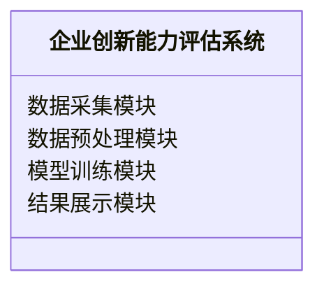
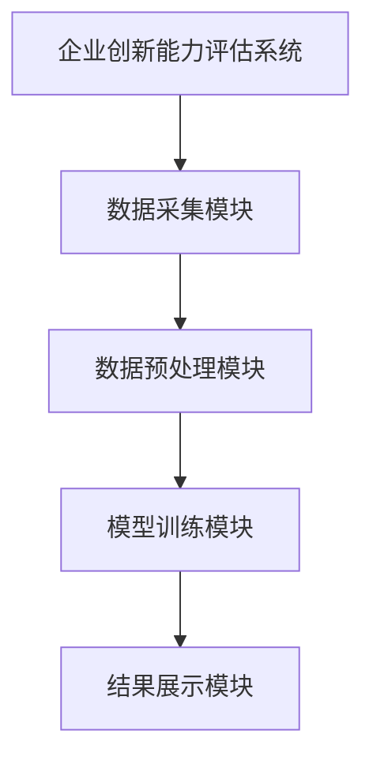
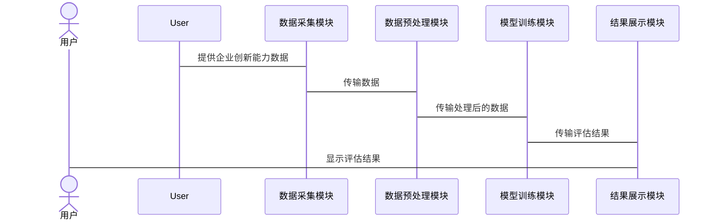

                 


# 多智能体系统评估公司创新能力：价值投资的新维度

> 关键词：多智能体系统、创新能力评估、价值投资、企业创新、系统设计、投资策略

> 摘要：本文探讨了多智能体系统在评估公司创新能力中的应用，提出了基于多智能体协同的创新能力评估模型，详细分析了算法原理和系统架构设计，结合实际案例展示了如何将多智能体系统应用于价值投资的新维度。

---

## 第1章: 多智能体系统与创新能力评估背景

### 1.1 多智能体系统的定义与特点

#### 1.1.1 多智能体系统的定义
多智能体系统（Multi-Agent System, 简称MAS）是由多个相互作用的智能体组成的系统，这些智能体能够通过协同完成复杂的任务。每个智能体都有一定的自主性、反应性和社会性，能够感知环境并做出决策。

#### 1.1.2 多智能体系统的特征
- **自主性**：智能体能够自主决策。
- **反应性**：能够感知环境并实时调整行为。
- **社会性**：智能体之间能够通信和协作。
- **分布性**：系统由多个分散的智能体组成。

#### 1.1.3 多智能体系统与传统单智能体系统的区别
- **单智能体系统**：单一决策中心，决策过程集中。
- **多智能体系统**：分布式决策，多个智能体协作完成任务。

### 1.2 创新能力评估的定义与维度

#### 1.2.1 创新能力的定义
创新能力是指企业在技术、产品、商业模式等方面的创新程度，是企业持续发展的核心竞争力。

#### 1.2.2 创新能力评估的核心维度
- **技术创新**：技术的先进性和独特性。
- **产品创新**：产品的独特性和市场竞争力。
- **商业模式创新**：商业模式的创新性和可持续性。
- **管理创新**：管理方法和流程的创新性。

#### 1.2.3 创新能力评估的挑战与意义
- **挑战**：数据复杂性高，评估维度多，难以量化。
- **意义**：创新能力是企业价值的重要组成部分，是投资者评估企业潜力的关键指标。

---

## 第2章: 多智能体系统在价值投资中的应用背景

### 2.1 价值投资的核心理念

#### 2.1.1 价值投资的基本原理
价值投资是通过分析企业的基本面，寻找被市场低估的企业进行投资。核心在于发现企业的内在价值。

#### 2.1.2 传统价值投资的局限性
- 数据分析维度有限，难以全面评估企业创新能力。
- 人工分析效率低，难以处理大量数据。

#### 2.1.3 创新能力在价值投资中的重要性
创新能力是企业持续发展的核心动力，也是企业价值的重要组成部分。

### 2.2 多智能体系统在金融领域的应用现状

#### 2.2.1 多智能体系统在金融分析中的应用
- **金融数据处理**：多智能体系统能够高效处理和分析大量金融数据。
- **风险评估**：通过多智能体协同，提高风险评估的准确性和效率。

#### 2.2.2 多智能体系统在投资决策中的优势
- **分布式计算**：能够同时处理多个维度的数据。
- **协同决策**：多个智能体协同工作，提供更全面的分析结果。

#### 2.2.3 当前应用中的问题与挑战
- **数据隐私**：多智能体系统需要处理大量敏感数据，隐私保护是难点。
- **系统复杂性**：多智能体系统的复杂性可能导致维护成本高。

---

## 第3章: 多智能体系统的协同机制

### 3.1 多智能体系统中的协同原理

#### 3.1.1 协同的定义与分类
协同是指多个智能体通过合作完成任务的过程。分类包括任务协同和信息协同。

#### 3.1.2 协同机制的核心要素
- **通信机制**：智能体之间进行信息交换。
- **协调机制**：智能体之间协同完成任务。
- **冲突解决机制**：解决智能体之间的冲突。

#### 3.1.3 协同过程中的信息传递与决策
- **信息传递**：智能体通过通信模块传递信息。
- **决策过程**：智能体根据信息做出决策。

### 3.2 多智能体系统中的角色分配与任务分解

#### 3.2.1 角色分配的基本原则
- **能力匹配**：根据智能体的能力分配角色。
- **任务分解**：将整体任务分解为子任务，分配给不同的智能体。

#### 3.2.2 任务分解的方法与工具
- **层次分解法**：将任务分解为层次结构。
- **矩阵分解法**：将任务分解为矩阵形式。

#### 3.2.3 角色与任务的动态调整
- **动态调整**：根据环境变化动态调整角色和任务。

---

## 第4章: 多智能体协同评估模型

### 4.1 多智能体协同评估模型的构建

#### 4.1.1 模型的基本架构
- **输入层**：企业创新能力数据。
- **协同层**：多智能体协同处理数据。
- **输出层**：评估结果。

#### 4.1.2 模型的输入与输出
- **输入**：企业技术创新、产品创新、商业模式创新等数据。
- **输出**：企业创新能力评估结果。

#### 4.1.3 模型的核心算法
- **协同算法**：基于多智能体的协同算法。

### 4.2 基于多智能体的创新能力评估算法

#### 4.2.1 算法的数学模型
$$ C = \sum_{i=1}^{n} w_i x_i $$
其中，$C$ 是创新能力评估结果，$w_i$ 是指标权重，$x_i$ 是指标得分。

#### 4.2.2 算法的实现步骤
1. **数据采集**：采集企业创新能力相关数据。
2. **权重分配**：根据指标重要性分配权重。
3. **计算评估结果**：根据公式计算创新能力评估结果。

#### 4.2.3 算法的优化与改进
- **动态调整权重**：根据实际情况动态调整权重。
- **引入机器学习**：利用机器学习算法提高评估精度。

---

## 第5章: 系统架构与实现

### 5.1 系统功能模块划分

#### 5.1.1 数据采集模块
- **功能**：采集企业创新能力相关数据。
- **输入**：企业技术创新、产品创新、商业模式创新等数据。

#### 5.1.2 数据预处理模块
- **功能**：对采集的数据进行清洗和预处理。
- **输出**：干净的数据集。

#### 5.1.3 模型训练模块
- **功能**：基于预处理后的数据训练评估模型。
- **输出**：训练好的评估模型。

#### 5.1.4 结果展示模块
- **功能**：展示评估结果。
- **输出**：可视化展示评估结果。

### 5.2 系统架构设计

#### 5.2.1 系统功能设计
- **领域模型**：企业创新能力评估的领域模型。



#### 5.2.2 系统架构设计
- **系统架构图**：展示系统整体架构。



### 5.3 系统交互设计

#### 5.3.1 系统交互流程
- **交互流程图**：展示系统交互流程。



---

## 第6章: 项目实战

### 6.1 环境安装

#### 6.1.1 系统环境
- **操作系统**：Linux/Windows/MacOS
- **编程语言**：Python
- **开发工具**：PyCharm/Jupyter Notebook
- **依赖库**：numpy, pandas, matplotlib

#### 6.1.2 安装依赖
```bash
pip install numpy pandas matplotlib
```

### 6.2 系统核心实现源代码

#### 6.2.1 数据采集模块

```python
import pandas as pd

def collect_data():
    # 采集企业创新能力数据
    data = pd.read_csv('entreprise.csv')
    return data
```

#### 6.2.2 数据预处理模块

```python
import pandas as pd

def preprocess_data(data):
    # 数据清洗和预处理
    data.dropna(inplace=True)
    data['score'] = data['score'].astype(int)
    return data
```

#### 6.2.3 模型训练模块

```python
import numpy as np
from sklearn.linear_model import LinearRegression

def train_model(data):
    # 训练评估模型
    X = data[['技术创新', '产品创新', '商业模式创新']]
    y = data['创新能力评分']
    model = LinearRegression()
    model.fit(X, y)
    return model
```

#### 6.2.4 结果展示模块

```python
import matplotlib.pyplot as plt

def display_results(model, data):
    # 可视化展示评估结果
    plt.scatter(data['技术创新'], data['创新能力评分'])
    plt.title('技术创新与创新能力评分')
    plt.xlabel('技术创新')
    plt.ylabel('创新能力评分')
    plt.show()
```

### 6.3 实际案例分析

#### 6.3.1 案例背景
假设我们有一个企业数据集，包含技术创新、产品创新、商业模式创新等指标。

#### 6.3.2 数据分析与处理
使用上述代码进行数据处理和模型训练，得到创新能力评分。

#### 6.3.3 模型评估
通过可视化展示模型的预测结果，评估模型的准确性。

---

## 第7章: 总结与展望

### 7.1 总结
本文提出了基于多智能体系统的创新能力评估模型，详细分析了算法原理和系统架构设计，并通过实际案例展示了模型的应用。多智能体系统在价值投资中的应用，为投资者提供了新的视角。

### 7.2 展望
未来的研究可以进一步优化模型，引入更多智能体协同机制，提高评估精度。同时，可以探索多智能体系统在其他领域的应用，如风险控制、投资组合优化等。

---

## 作者信息

作者：AI天才研究院/AI Genius Institute & 禅与计算机程序设计艺术/Zen And The Art of Computer Programming

