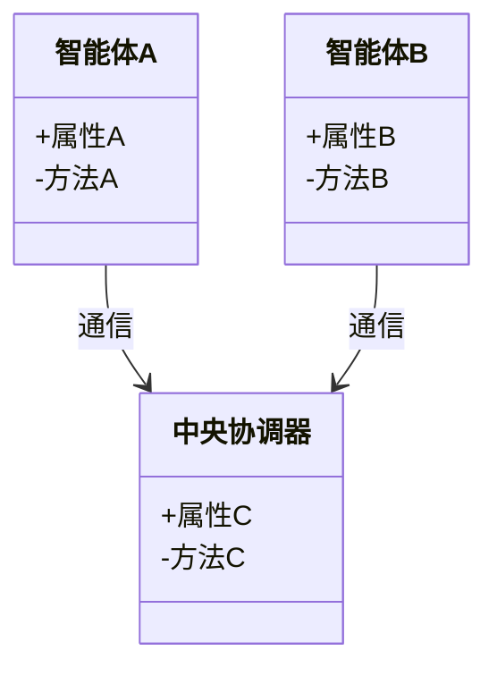
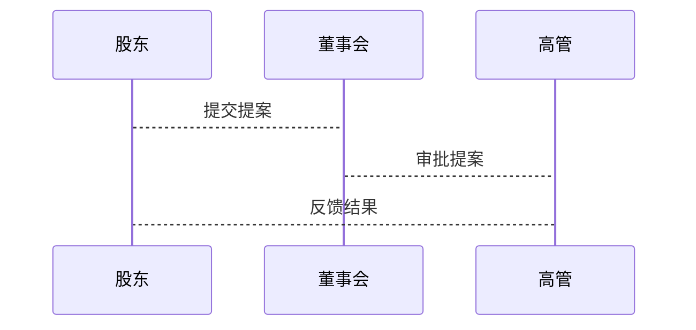

                 


# 多智能体系统辅助公司治理分析：提升价值投资质量

## 关键词
多智能体系统, 公司治理, 价值投资, 人工智能, 系统架构, 投资决策

## 摘要
本文探讨了多智能体系统在公司治理中的应用，特别是如何通过多智能体系统提升价值投资的质量。文章首先介绍了多智能体系统的基本概念和公司治理的复杂性，然后详细分析了多智能体系统在公司治理中的核心要素和算法原理。接着，通过系统架构设计和实际案例，展示了多智能体系统在公司治理中的实际应用。最后，总结了应用中的最佳实践和未来发展方向。

---

# 第1章：多智能体系统与公司治理概述

## 1.1 多智能体系统的基本概念

### 1.1.1 多智能体系统的定义与特点
多智能体系统（Multi-Agent System, MAS）是由多个智能体（Agent）组成的系统，这些智能体能够自主决策、协作并解决问题。与单智能体系统相比，MAS具有以下特点：
- **自主性**：智能体能够自主决策。
- **反应性**：智能体能够根据环境变化做出反应。
- **协作性**：多个智能体可以协作完成复杂任务。
- **分布式性**：智能体分布在不同的位置，通过通信和协调完成任务。

### 1.1.2 多智能体系统与传统单智能体系统的区别
| 特性 | 单智能体系统 | 多智能体系统 |
|------|--------------|--------------|
| 决策 | 单一决策中心 | 分布式决策 |
| 协作 | 无协作 | 多智能体协作 |
| 灵活性 | 低 | 高 |

## 1.2 公司治理的复杂性

### 1.2.1 公司治理的核心要素
公司治理涉及多个利益相关者，包括股东、董事会、高管、员工、客户和监管机构。核心要素包括：
- **股权结构**：股东的权益分配。
- **董事会结构**：董事会的组成和职责。
- **高管责任**：高管的职责和权力。
- **透明度**：公司运营的透明度。

### 1.2.2 传统公司治理的挑战与局限性
- **信息不对称**：利益相关者之间信息不透明。
- **决策效率**：复杂决策过程可能导致效率低下。
- **利益冲突**：不同利益相关者的目标可能不一致。

## 1.3 价值投资的挑战

### 1.3.1 价值投资的基本概念
价值投资是一种投资策略，通过分析公司的基本面，寻找被市场低估的股票。核心在于识别具有长期增长潜力的公司。

### 1.3.2 传统价值投资中的问题与改进空间
- **数据复杂性**：需要处理大量非结构化数据。
- **决策延迟**：传统方法依赖人工分析，效率较低。
- **模型局限性**：传统模型可能无法捕捉复杂市场动态。

## 1.4 多智能体系统在公司治理中的应用前景

### 1.4.1 多智能体系统如何解决公司治理问题
- **信息整合**：智能体可以实时整合多个来源的数据。
- **决策优化**：通过协作优化决策过程。
- **风险分散**：多个智能体分担风险，提高系统的鲁棒性。

### 1.4.2 多智能体系统在价值投资中的潜在应用
- **数据处理**：智能体可以高效处理和分析大量数据。
- **实时监控**：实时监控市场变化，快速做出反应。
- **协作决策**：多个智能体协作，提高决策的准确性。

---

# 第2章：多智能体系统与公司治理的核心要素

## 2.1 多智能体系统的原理

### 2.1.1 智能体的定义与属性
智能体是一种能够感知环境并采取行动以实现目标的实体。属性包括：
- **感知**：通过传感器或其他方式获取环境信息。
- **决策**：基于感知信息做出决策。
- **行动**：执行决策以影响环境。

### 2.1.2 多智能体系统中的协作机制
协作机制包括：
- **通信**：智能体之间通过通信共享信息。
- **协商**：智能体通过协商达成一致。
- **协调**：智能体协调行动以实现共同目标。

## 2.2 公司治理的结构与利益相关者

### 2.2.1 公司治理的主要参与者
- **股东**：拥有公司股份的个人或机构。
- **董事会**：负责制定公司战略和监督高管。
- **高管**：负责日常运营和管理。
- **员工**：执行具体任务的人员。
- **客户**：购买公司产品或服务的个人或机构。
- **监管机构**：政府或行业监管机构。

### 2.2.2 利益相关者的角色与互动
利益相关者通过股东大会、董事会会议和日常沟通进行互动，共同影响公司决策。

## 2.3 多智能体系统与公司治理的结合

### 2.3.1 多智能体系统如何优化公司治理流程
- **信息共享**：智能体可以实时共享信息，提高透明度。
- **决策优化**：通过协作优化决策过程，提高效率。
- **风险管理**：智能体可以实时监控风险，提前预警。

### 2.3.2 多智能体系统在决策中的作用
- **分布式决策**：多个智能体分担决策责任，提高系统的容错性。
- **动态调整**：智能体可以根据环境变化动态调整决策，提高系统的适应性。

---

# 第3章：多智能体系统的算法基础

## 3.1 分布式计算与协作算法

### 3.1.1 分布式计算的基本原理
分布式计算是一种将计算任务分布在多个计算节点上的技术，通过协作完成复杂任务。

### 3.1.2 协作算法的实现
协作算法包括：
- **分布式一致性**：通过协议确保分布式系统中数据的一致性。
- **分布式共识**：通过共识算法达成一致意见。
- **分布式协调**：通过协调机制确保智能体之间的协作。

---

# 第4章：系统架构设计

## 4.1 系统功能设计

### 4.1.1 领域模型
领域模型展示了系统的各个模块及其之间的关系。



### 4.1.2 系统架构
系统架构展示了系统的分层结构。


### 4.1.3 接口设计
接口设计展示了系统之间的交互。



---

# 第5章：项目实战

## 5.1 环境安装

### 5.1.1 安装Python
```bash
python --version
pip install --upgrade pip
```

### 5.1.2 安装依赖
```bash
pip install numpy pandas scikit-learn
```

## 5.2 核心代码实现

### 5.2.1 数据预处理
```python
import pandas as pd
data = pd.read_csv('data.csv')
data_clean = data.dropna()
```

### 5.2.2 模型训练
```python
from sklearn.tree import DecisionTreeClassifier
model = DecisionTreeClassifier()
model.fit(X_train, y_train)
```

### 5.2.3 结果输出
```python
import numpy as np
predictions = model.predict(X_test)
print(predictions)
```

## 5.3 案例分析

### 5.3.1 案例背景
分析一家公司的财务数据，预测其股票价值。

### 5.3.2 数据分析
```python
import pandas as pd
data = pd.read_csv('financial_data.csv')
data['value'] = data['revenue'] / data['cost']
print(data['value'].mean())
```

### 5.3.3 结果解读
通过模型分析，发现该公司的股票价值被低估，建议买入。

---

# 第6章：总结与展望

## 6.1 最佳实践
- 数据隐私保护：确保数据的安全性和隐私性。
- 模型维护：定期更新模型，确保其准确性。
- 团队协作：多智能体系统需要良好的团队协作。

## 6.2 小结
多智能体系统通过协作和分布式计算，显著提升了公司治理和价值投资的效率和准确性。

## 6.3 注意事项
- 数据质量：确保数据的准确性和完整性。
- 模型选择：根据具体需求选择合适的模型。
- 系统维护：定期维护系统，确保其稳定运行。

## 6.4 拓展阅读
- 推荐阅读《多智能体系统入门》和《人工智能在金融中的应用》。

---

# 作者

作者：AI天才研究院/AI Genius Institute & 禅与计算机程序设计艺术/Zen And The Art of Computer Programming

