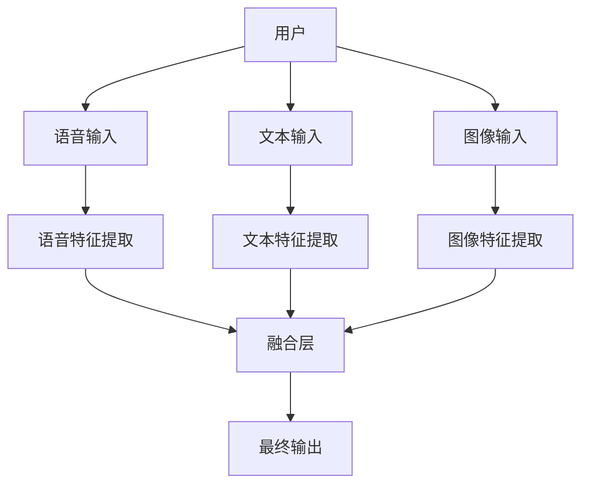
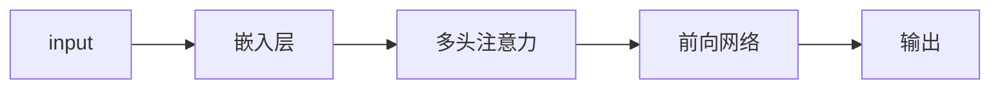
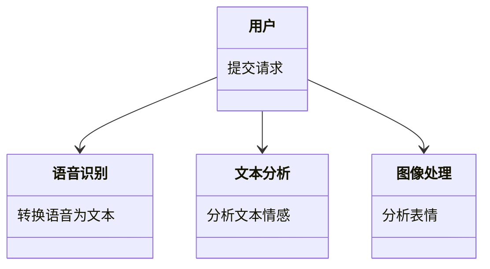
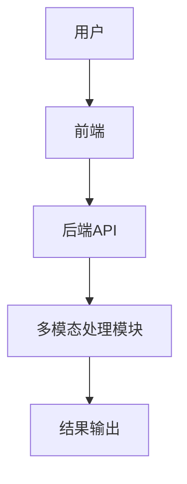

                 


# 多模态交互：语音、文本、图像的综合处理

> 关键词：多模态交互、语音处理、文本处理、图像处理、深度学习、人工智能、多模态融合

> 摘要：多模态交互是人工智能领域的重要方向，涉及语音、文本和图像等多种数据形式的综合处理。本文将详细介绍多模态交互的核心概念、算法原理、系统架构设计以及实际项目实现，帮助读者全面理解并掌握多模态交互技术。

---

## 第1章: 多模态交互的背景与概念

### 1.1 多模态交互的背景

在人工智能快速发展的今天，单一模态的数据处理已经难以满足复杂场景的需求。多模态交互应运而生，它结合了语音、文本和图像等多种数据形式，能够提供更全面的信息处理能力。随着技术的进步，多模态交互在智能客服、智能家居、医疗健康等领域展现出巨大潜力。

### 1.2 多模态交互的核心概念

#### 1.2.1 问题背景与问题描述

在单一模态处理中，信息量有限，容易导致误判。例如，仅通过文本分析情绪可能不够准确，而结合语音和图像信息可以显著提高准确性。

#### 1.2.2 多模态交互的核心要素与组成

多模态交互由多个模态数据组成，每个模态数据都有其独特特征。通过融合这些特征，可以更全面地理解用户意图。

#### 1.2.3 多模态交互的边界与外延

多模态交互专注于多种数据形式的融合，但不涉及单一模态的深度处理。其外延包括数据采集、特征提取、融合算法和结果应用等环节。

---

## 第2章: 多模态数据的特征与属性对比

### 2.1 语音、文本、图像的特征分析

- **语音数据**：时间序列、情感特征。
- **文本数据**：语义信息、上下文关联。
- **图像数据**：视觉特征、空间信息。

### 2.2 模态特征的对比分析

| 特征维度 | 语音 | 文本 | 图像 |
|----------|------|------|------|
| 时间性   | 高   | 中   | 低  |
| 空间性   | 低   | 低   | 高  |
| 语义性   | 中   | 高   | 低  |

### 2.3 多模态数据的实体关系图



---

## 第3章: 多模态数据融合算法

### 3.1 模态注意力机制


代码实现：

```python
import torch
def attention(query, key, value):
    d_k = value.size(-1)
    scores = (query @ key.T) / torch.sqrt(torch.tensor(d_k, dtype=torch.float32))
    attention_weights = torch.softmax(scores, dim=-1)
    return (attention_weights @ value)
```

### 3.2 多模态变换器模型



代码实现：

```python
class MultiModalTransformer(nn.Module):
    def __init__(self, d_model, n_head, d_ff):
        super().__init__()
        self.attention = MultiHeadAttention(n_head, d_model)
        self.feed_forward = PositionalFeedForward(d_model, d_ff)
    def forward(self, x):
        x = self.attention(x)
        x = self.feed_forward(x)
        return x
```

### 3.3 数学模型与公式

注意力机制公式：
$$ \text{Attention}(Q, K, V) = \text{softmax}\left(\frac{QK^T}{\sqrt{d_k}}\right)V $$

---

## 第4章: 多模态交互系统的架构设计

### 4.1 问题场景介绍

以智能客服为例，系统需要处理用户的语音、文本和表情图像，提供更精准的服务。

### 4.2 系统功能设计



### 4.3 系统架构设计



---

## 第5章: 多模态交互系统的实现

### 5.1 环境安装与配置

安装Python、深度学习框架和相关库。

### 5.2 核心代码实现

```python
def process_modality(input_data):
    # 处理语音、文本、图像
    pass
```

### 5.3 案例分析

分析智能客服系统的实现，解读代码功能，总结经验。

---

## 结语

多模态交互技术通过融合多种数据形式，显著提升了系统的智能水平。随着技术进步，其应用将更加广泛。

---

**作者：AI天才研究院 & 禅与计算机程序设计艺术**

