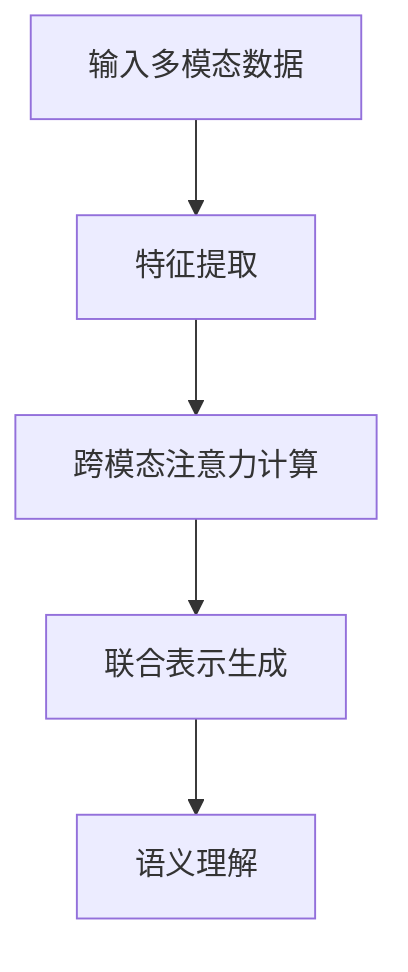
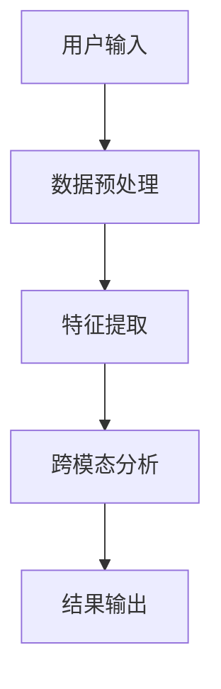

                 


# 多模态内容理解AI Agent：整合LLM与多媒体分析

> **关键词**：多模态内容理解，LLM，多媒体分析，AI代理，深度学习

> **摘要**：随着人工智能技术的快速发展，多模态内容理解成为了一个新兴的研究热点。本文旨在探讨如何将大语言模型（LLM）与多媒体分析技术相结合，构建高效的多模态AI代理。通过分析LLM与多媒体分析的协同工作原理，结合实际案例，深入探讨整合方法、算法原理及系统设计，为读者提供全面的技术指导。

---

## 第1章：多模态内容理解概述

### 1.1 多模态内容理解的背景

#### 1.1.1 数字化内容的多模态特性
在当今数字化时代，内容的形式日益多样化，包括文本、图像、视频、音频等多种模态。单一模态的数据难以全面捕捉信息，而多模态数据能够提供更丰富的语义信息。

#### 1.1.2 多模态数据的挑战与机遇
多模态数据的处理面临数据异构性、特征多样性和计算复杂性的挑战，同时也带来了更高的信息理解和表达能力的机遇。

### 1.2 问题背景与描述

#### 1.2.1 当前内容理解的局限性
传统单模态处理方法在信息提取和语义理解上存在局限性，难以应对复杂场景下的内容理解需求。

#### 1.2.2 多模态数据处理的需求
随着应用场景的扩展，对多模态数据的理解需求日益增长，特别是在智能客服、自动驾驶等领域。

### 1.3 问题解决与应用前景

#### 1.3.1 多模态AI代理的优势
通过整合LLM和多媒体分析技术，多模态AI代理能够实现更高效的内容理解，提升用户体验。

#### 1.3.2 应用场景分析
多模态AI代理在智能客服、内容审核、多媒体检索等领域具有广阔的应用前景。

### 1.4 概念结构与核心要素

#### 1.4.1 核心概念的定义
多模态内容理解是指对多种数据形式进行协同分析，以提取深层次语义信息的过程。

#### 1.4.2 核心要素的组成与关系
核心要素包括输入数据、处理算法、输出结果，三者相互关联，共同实现内容理解。

---

## 第2章：大语言模型（LLM）原理

### 2.1 LLM的基本原理

#### 2.1.1 概率语言模型的数学表达
$$ P(\text{words}| \text{context}) = \text{Product}_{i=1}^n P(\text{word}_i | \text{word}_{i-1}, \dots) $$

#### 2.1.2 注意力机制的实现
通过计算输入序列中每个词的注意力权重，实现对重要信息的聚焦。

### 2.2 LLM的特点与优势

#### 2.2.1 大规模参数的优势
大规模参数训练使LLM能够捕捉复杂的语言模式，提升语义理解能力。

#### 2.2.2 自然语言处理的提升
LLM在文本生成、问答系统等任务中表现出色，为多模态应用奠定了基础。

---

## 第3章：多媒体分析技术

### 3.1 多媒体数据的处理流程

#### 3.1.1 图像处理的关键步骤
图像预处理、特征提取、目标检测等步骤，为后续分析提供基础。

#### 3.1.2 视频分析的流程
视频流处理、关键帧提取、动作识别等，实现视频内容的理解。

#### 3.1.3 音频处理的技术
语音识别、声纹分析等技术，提取音频信息。

### 3.2 多媒体分析方法

#### 3.2.1 基于特征的分析方法
通过提取特征向量，进行分类或聚类分析。

#### 3.2.2 基于深度学习的分析方法
利用CNN、RNN等模型，实现对多媒体数据的深度分析。

---

## 第4章：LLM与多媒体分析的协同

### 4.1 多模态数据的整合方法

#### 4.1.1 联合表示的构建
通过将文本和图像等模态的特征向量进行融合，构建统一的表示。

#### 4.1.2 跨模态交互机制
设计跨模态注意力机制，实现模态间的协同推理。

### 4.2 LLM在多媒体分析中的应用

#### 4.2.1 文本与图像的协同理解
通过LLM对图像描述的生成和理解，提升图像语义理解能力。

---

## 第5章：多模态AI代理的算法原理

### 5.1 算法流程图



### 5.2 数学模型

$$ y = f(x_1, x_2, \dots, x_n) $$

其中，$x_i$表示不同模态的特征，$y$表示最终的语义表示。

---

## 第6章：系统设计与实现

### 6.1 系统架构设计



### 6.2 接口设计

定义API接口，实现数据输入、处理和结果输出。

---

## 第7章：项目实战

### 7.1 环境安装

安装必要的库，如TensorFlow、OpenCV等。

### 7.2 核心实现代码

```python
import tensorflow as tf
from tensorflow.keras import layers

class MultiModalAgent:
    def __init__(self):
        self.model = self.build_model()

    def build_model(self):
        # 文本分支
        text_input = layers.Input(shape=(100,))
        text_emb = layers.Embedding(1000, 32)(text_input)
        
        # 图像分支
        image_input = layers.Input(shape=(224,224,3))
        image_emb = layers.Conv2D(32, (3,3), activation='relu')(image_input)
        
        # 联合表示
        merged = layers.concatenate([text_emb, image_emb])
        dense = layers.Dense(64, activation='relu')(merged)
        output = layers.Dense(1, activation='sigmoid')(dense)
        
        return tf.keras.Model(inputs=[text_input, image_input], outputs=output)
```

---

## 第8章：总结与展望

### 8.1 小结
整合LLM与多媒体分析技术，构建多模态AI代理，能够提升内容理解的效率和准确性。

### 8.2 注意事项
数据预处理、模型调优和实际应用中的鲁棒性是需要重点关注的问题。

### 8.3 拓展阅读
推荐阅读相关领域的最新论文和技术报告，深入了解前沿技术。

---

**作者：AI天才研究院 & 禅与计算机程序设计艺术**

---

通过以上章节的详细阐述，本文系统地探讨了多模态内容理解AI Agent的构建方法，为读者提供了从理论到实践的全面指导。

