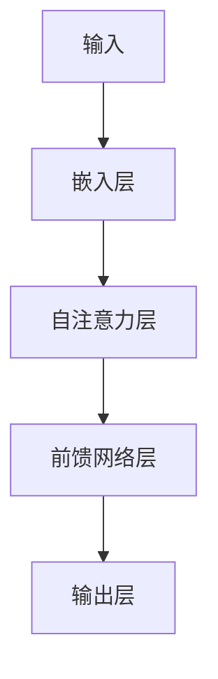
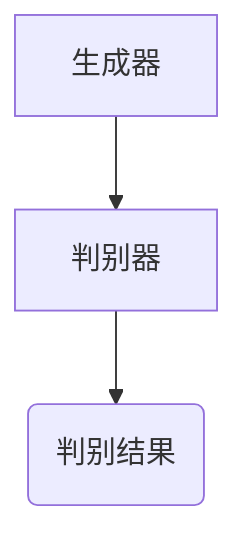
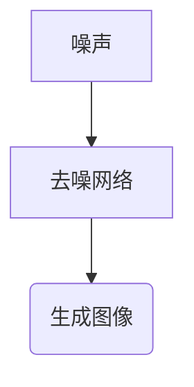
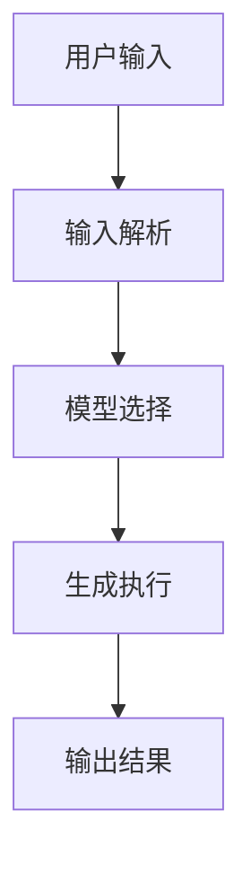
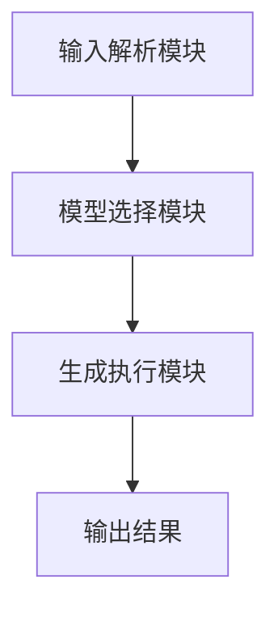

                 


# 多模态内容生成 AI Agent：整合 LLM 与图像生成

> 关键词：多模态生成，LLM，图像生成，AI Agent，文本生成，协同生成，深度学习

> 摘要：本文详细探讨了多模态内容生成 AI Agent 的设计与实现，重点分析了如何整合大语言模型（LLM）与图像生成技术。通过背景介绍、核心概念、算法原理、系统架构和项目实战等部分，系统阐述了多模态生成的原理、技术细节和实际应用场景，帮助读者全面理解并掌握多模态内容生成 AI Agent 的设计方法。

---

## 第一部分: 多模态内容生成 AI Agent 背景与概述

### 第1章: 多模态内容生成的背景与问题

#### 1.1 多模态内容生成的背景

多模态内容生成是指利用多种数据形式（如文本、图像、音频等）进行内容生成的技术。随着人工智能技术的快速发展，多模态生成逐渐成为研究热点。LLM（Large Language Model）和图像生成模型（如GAN、Diffusion模型）的结合为多模态生成提供了强大的技术支持。AI Agent作为一种智能化的代理，能够协调多种生成模型，实现复杂任务的自动化处理。

**问题背景**：
- 当前单模态生成技术（如仅文本生成或仅图像生成）难以满足复杂场景的需求。
- 如何高效整合 LLM 与图像生成技术，实现多模态协同生成，是当前研究的热点问题。

**技术趋势**：
- 多模态生成技术在内容创作、虚拟人、教育、医疗等领域具有广泛的应用前景。
- AI Agent 的引入使得多模态生成更加智能化和自动化。

#### 1.2 AI Agent 的定义与作用

**AI Agent 的定义**：
- AI Agent 是一种能够感知环境、执行任务并做出决策的智能体。
- 在多模态生成中，AI Agent 负责协调 LLM 和图像生成模型，完成复杂任务。

**AI Agent 的作用**：
- 作为桥梁，连接 LLM 和图像生成模型，实现多模态数据的协同生成。
- 根据输入需求，智能选择合适的生成模型，并优化生成结果。

---

### 第2章: 多模态内容生成的典型应用场景

#### 2.1 多模态生成的典型场景

**文本与图像联合生成**：
- 输入一段文本描述，生成对应的图像或图像描述。
- 应用于图像生成、视觉内容创作等领域。

**视频与文本生成**：
- 生成与文本描述匹配的视频内容。
- 应用于短视频创作、广告生成等领域。

**虚拟人与对话生成**：
- 生成虚拟人形象和对话内容。
- 应用于虚拟助手、虚拟主播等领域。

#### 2.2 多模态生成的挑战与机遇

**技术挑战**：
- 多模态数据的融合与协同生成难度较大。
- 如何保证生成内容的多样性和准确性。

**应用机遇**：
- 提供更丰富、更个性化的用户体验。
- 在教育、医疗、娱乐等领域具有广阔的应用前景。

---

## 第二部分: 多模态内容生成的核心概念与联系

### 第3章: 多模态生成模型的核心原理

#### 3.1 大语言模型（LLM）的生成原理

**LLM 的基本工作原理**：
- LLM 通过大规模预训练，掌握了丰富的语言知识。
- 在生成阶段，解码器通过解码输入的 token，逐步生成输出内容。

**解码器架构**：
- 常见的解码器架构包括 Transformer 解码器和 LSTM 解码器。
- 解码器通过自注意力机制捕捉输入中的语义信息。

**损失函数优化**：
- 交叉熵损失函数（Cross-Entropy Loss）用于衡量生成结果与真实值的差距。
- 使用梯度下降方法优化模型参数。

#### 3.2 图像生成模型的核心原理

**生成对抗网络（GAN）**：
- GAN 由生成器和判别器组成。
- 生成器通过对抗训练生成逼真的图像，判别器用于区分生成图像和真实图像。

**扩散模型（Diffusion Model）**：
- 扩散模型通过逐步添加噪声并进行去噪，生成高质量图像。
- 去噪过程通常通过自回归模型实现。

**图像生成的评价指标**：
- 常见的评价指标包括 PSNR、SSIM、FID 等。
- 不同模型在生成质量、生成速度等方面具有不同的优势。

#### 3.3 多模态生成模型的协同机制

**文本与图像的联合生成**：
- 输入文本描述，生成对应的图像。
- 协同机制需要同时优化文本和图像生成模型的输出。

**联合训练策略**：
- 使用多模态数据联合训练模型，使得模型能够同时理解文本和图像信息。
- 联合训练可以通过共享特征或联合损失函数实现。

---

### 第4章: AI Agent 的多模态生成机制

#### 4.1 AI Agent 的多模态生成框架

**框架概述**：
- AI Agent 负责接收输入需求，协调 LLM 和图像生成模型完成生成任务。
- 输出结果为多模态数据（如文本和图像）。

**模块划分**：
- 输入解析模块：解析用户输入的需求。
- 模型选择模块：根据需求选择合适的生成模型。
- 生成执行模块：执行生成任务并输出结果。

#### 4.2 多模态生成的协同优化

**协同优化目标**：
- 提高生成内容的质量和相关性。
- 减少生成过程中的计算开销。

**优化策略**：
- 使用强化学习优化生成结果。
- 引入元学习方法，提高模型的泛化能力。

---

## 第三部分: 多模态内容生成的算法原理

### 第5章: LLM 的算法实现

#### 5.1 LLM 的解码器架构

**解码器架构示意图**：


**解码过程**：
- 输入经过嵌入层转换为向量。
- 自注意力层捕捉输入中的语义信息。
- 前馈网络层生成输出 token。

**数学公式**：
- 嵌入层：$x = W_e \cdot \text{input}$
- 自注意力机制：$\text{Attention}(Q, K, V) = \text{softmax}(\frac{QK^T}{\sqrt{d}})V$
- 前馈网络：$f(x) = \text{ReLU}(W_1 x + b_1) + W_2 x + b_2$

### 第6章: 图像生成模型的算法实现

#### 6.1 GAN 的图像生成算法

**GAN 的生成器与判别器**：


**生成过程**：
- 生成器通过输入噪声生成图像。
- 判别器判断生成图像是否为真实图像。

**数学公式**：
- 生成器损失：$\mathcal{L}_G = -\mathbb{E}_{z \sim p(z)} [\log(1 - D(G(z)))]$
- 判别器损失：$\mathcal{L}_D = -\mathbb{E}_{x \sim p(x)} [\log(D(x))] - \mathbb{E}_{z \sim p(z)} [\log(1 - D(G(z)))]$

#### 6.2 Diffusion 模型的图像生成算法

**Diffusion 模型的去噪过程**：


**数学公式**：
- 去噪网络：$x_{t-1} = \mu_\theta(x_t, t) + \sigma_\theta(x_t, t) \cdot \epsilon$
- 噪声添加过程：$x_t = x_{t-1} + \sigma_t \cdot \epsilon$

---

## 第四部分: 系统分析与架构设计

### 第7章: 多模态生成 AI Agent 的系统架构

#### 7.1 系统功能设计

**功能模块划分**：
- 输入解析模块：解析用户的输入需求。
- 模型选择模块：选择合适的生成模型。
- 生成执行模块：执行生成任务并输出结果。

**功能流程图**：


#### 7.2 系统架构设计

**系统架构图**：


---

## 第五部分: 项目实战

### 第8章: 多模态生成 AI Agent 的实现

#### 8.1 环境安装

**主要依赖**：
- Python 3.8+
- PyTorch 1.9+
- Transformers库
- Diffusion库

#### 8.2 核心代码实现

**输入解析模块**：
```python
def parse_input(input_text):
    # 解析输入文本，提取生成需求
    return parsed_demand
```

**模型选择模块**：
```python
def select_model(parsed_demand):
    # 根据需求选择合适的生成模型
    return selected_model
```

**生成执行模块**：
```python
def generate_output(selected_model):
    # 执行生成任务并返回结果
    return generated_output
```

#### 8.3 实际案例分析

**案例描述**：
- 用户输入一段文本描述，生成对应的图像。

**生成结果**：
- 文本描述：一只站在森林中的独角兽。
- 生成图像：一张独角兽站在森林中的图像。

---

## 第六部分: 总结与展望

### 第9章: 总结与展望

#### 9.1 小结

- 本文详细探讨了多模态内容生成 AI Agent 的设计与实现。
- 通过整合 LLM 和图像生成模型，实现了多模态数据的协同生成。

#### 9.2 最佳实践 tips

- 在实际应用中，建议根据具体需求选择合适的生成模型。
- 定期更新模型参数，保持生成结果的多样性和准确性。

#### 9.3 未来展望

- 多模态生成技术将进一步优化，生成质量更高。
- AI Agent 的智能化水平将不断提升，能够处理更复杂的生成任务。

---

## 作者：AI天才研究院 & 禅与计算机程序设计艺术

--- 

以上是《多模态内容生成 AI Agent：整合 LLM 与图像生成》的技术博客文章。通过详细阐述多模态生成的背景、核心概念、算法原理、系统架构和项目实战，本文为读者提供了一个全面了解多模态内容生成技术的视角。希望本文能够为相关领域的研究和应用提供有价值的参考和启发。

