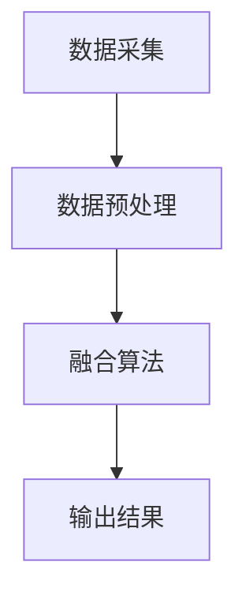
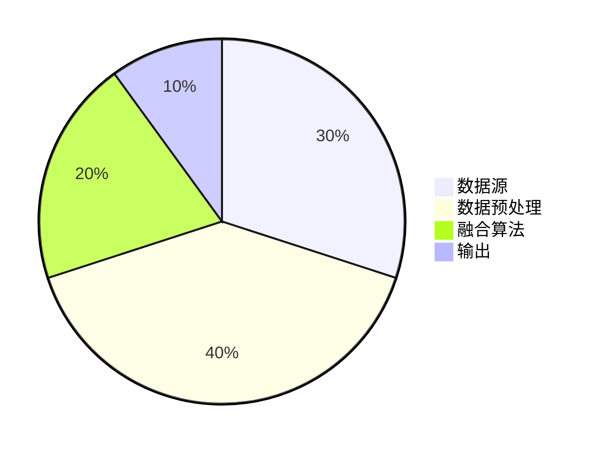
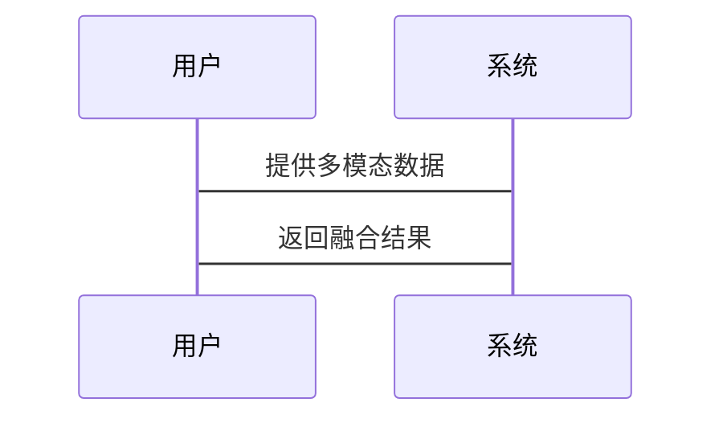

                 


# 多模态融合：增强AI Agent的感知能力

> 关键词：多模态融合、AI Agent、感知能力、数据融合、注意力机制

> 摘要：本文深入探讨了多模态融合技术如何增强AI Agent的感知能力，详细分析了多模态数据的特征与处理方法，对比了多种融合策略，介绍了基于注意力机制的融合方法，并通过实际案例展示了多模态融合在智能客服、智能驾驶和虚拟现实中的应用。最后，本文总结了多模态融合的挑战与未来发展方向。

---

# 第一部分: 多模态融合与AI Agent概述

## 第1章: 多模态融合与AI Agent概述

### 1.1 多模态融合的定义与背景

#### 1.1.1 多模态数据的定义
多模态数据是指来自多种感知方式的数据，例如文本、图像、音频、视频和结构化数据等。这些数据具有不同的特征和语义信息，能够提供更全面的环境感知能力。

#### 1.1.2 多模态融合的背景与重要性
随着AI技术的发展，单一模态的数据处理已经难以满足复杂场景的需求。通过融合多模态数据，可以提升AI Agent的感知能力、决策能力和用户体验。多模态融合技术在智能客服、智能驾驶和虚拟现实等领域具有广泛的应用前景。

#### 1.1.3 AI Agent的感知需求与挑战
AI Agent需要通过多种模态数据（如视觉、听觉、语言等）来感知环境，并做出智能决策。然而，不同模态数据的异构性和复杂性给融合带来了挑战，如何有效地整合这些数据是当前研究的热点。

### 1.2 多模态融合的核心概念

#### 1.2.1 多模态数据的特点与类型
多模态数据具有多样性、互补性和复杂性。常见的多模态数据类型包括：
- 文本数据：如对话、描述性文本。
- 图像数据：如图片、视频流。
- 音频数据：如语音、音乐。
- 结构化数据：如表格数据、传感器数据。

#### 1.2.2 多模态融合的目标与方法
多模态融合的目标是将不同模态的数据进行有效整合，提升AI Agent的感知能力。常见的融合方法包括：
- 晚期融合：在特征层面进行融合。
- 早期融合：在原始数据层面进行融合。
- 深度融合：利用深度学习模型进行端到端的融合。

#### 1.2.3 多模态融合与AI Agent的关系
多模态融合是AI Agent实现复杂任务的核心技术之一，通过融合多模态数据，AI Agent能够更好地理解环境、做出准确的决策。

### 1.3 多模态融合的应用场景

#### 1.3.1 智能客服中的多模态融合
在智能客服中，多模态融合可以通过整合用户的文本、语音和表情数据，提升客服系统的情感理解和问题解决能力。

#### 1.3.2 智能驾驶中的多模态融合
智能驾驶需要融合视觉（如摄像头数据）、雷达数据和环境数据，以实现对周围环境的准确感知。

#### 1.3.3 虚拟现实中的多模态融合
在虚拟现实应用中，多模态融合可以通过整合用户的视觉、听觉和触觉数据，提供更沉浸式的体验。

### 1.4 本章小结
本章介绍了多模态融合的定义、背景、核心概念和应用场景，为后续章节的深入分析奠定了基础。

---

# 第二部分: 多模态数据与融合方法

## 第2章: 多模态数据的特征与处理

### 2.1 多模态数据的特征分析

#### 2.1.1 文本数据的特征
文本数据具有语义丰富、结构多样等特点，可以通过词袋模型、TF-IDF或词嵌入（如Word2Vec、BERT）进行处理。

#### 2.1.2 图像数据的特征
图像数据具有空间信息和颜色信息，可以通过卷积神经网络（CNN）进行特征提取。

#### 2.1.3 音频数据的特征
音频数据具有时域和频域特征，可以通过短时傅里叶变换（STFT）或梅尔频率倒谱系数（MFCC）进行处理。

#### 2.1.4 结构化数据的特征
结构化数据具有明确的语义和结构，可以通过数据库查询或统计分析进行处理。

### 2.2 多模态数据的预处理方法

#### 2.2.1 数据清洗与标准化
数据清洗包括去除噪声、填补缺失值等。标准化处理可以将不同模态的数据统一到相同的尺度。

#### 2.2.2 数据增强技术
数据增强技术可以通过旋转、裁剪、噪声添加等方式，提升数据的多样性和鲁棒性。

#### 2.2.3 数据对齐方法
数据对齐是指将不同模态的数据在时间或空间上对齐，以便于融合。

### 2.3 多模态数据的表示与编码

#### 2.3.1 文本的向量表示
文本可以通过词袋模型、TF-IDF或深度学习模型（如BERT）进行向量表示。

#### 2.3.2 图像的特征提取
图像可以通过卷积神经网络（CNN）提取特征向量。

#### 2.3.3 音频的特征表示
音频可以通过MFCC或其他特征提取方法表示为向量。

---

## 第3章: 多模态融合的核心方法

### 3.1 基于特征融合的方法

#### 3.1.1 晚期融合（Late Fusion）
晚期融合是在特征层面进行融合，例如将文本、图像和音频的特征向量拼接后进行分类。

#### 3.1.2 早期融合（Early Fusion）
早期融合是在原始数据层面进行融合，例如通过多模态卷积网络同时处理图像和文本数据。

#### 3.1.3 深度融合（Deep Fusion）
深度融合利用深度学习模型（如多模态Transformer）进行端到端的融合。

### 3.2 基于注意力机制的融合方法

#### 3.2.1 单模态注意力机制
单模态注意力机制用于关注特定模态的重要特征。

#### 3.2.2 跨模态注意力机制
跨模态注意力机制用于不同模态之间的信息交互和融合。

#### 3.2.3 多模态注意力网络
多模态注意力网络可以通过自注意力机制同时处理多种模态数据。

### 3.3 基于生成模型的融合方法

#### 3.3.1 变分自编码器（VAE）
VAE可以用于生成多模态数据的潜在表示。

#### 3.3.2 生成对抗网络（GAN）
GAN可以用于生成多模态数据，并通过判别器进行融合。

#### 3.3.3 图神经网络（GNN）
GNN可以用于处理多模态数据的图结构。

### 3.4 各种融合方法的对比与选择

#### 3.4.1 各种方法的优缺点分析
- 晚期融合：简单易实现，但可能丢失模态间的信息交互。
- 早期融合：能够更好地利用模态间的关联性，但实现复杂。
- 注意力机制：能够自适应地关注重要特征，但需要设计复杂的网络结构。

#### 3.4.2 方法选择的依据与策略
选择融合方法时需要考虑数据类型、任务需求和计算资源。

#### 3.4.3 实际应用中的权衡与折中
在实际应用中，可能需要结合多种融合方法，以达到最佳效果。

---

# 第三部分: 多模态融合的算法实现

## 第4章: 多模态融合的算法原理

### 4.1 多模态融合的数学模型

#### 4.1.1 晚期融合模型
$$ y = f(x_1, x_2, ..., x_n) $$

其中，$x_i$表示不同模态的特征向量，$f$是融合函数。

#### 4.1.2 早期融合模型
$$ y = f(x) $$

其中，$x$是多模态数据经过对齐和预处理后的输入。

#### 4.1.3 深度融合模型
$$ y = \text{Model}(\{x_1, x_2, ..., x_n\}) $$

其中，Model表示深度学习模型，如Transformer或CNN。

### 4.2 多模态融合的注意力机制

#### 4.2.1 多头注意力机制
多头注意力机制通过多个并行的注意力头，捕捉不同模态间的关联性。

#### 4.2.2 跨模态注意力机制
跨模态注意力机制通过注意力权重，实现不同模态数据的交互与融合。

#### 4.2.3 注意力权重的计算与解释
注意力权重可以通过 softmax 函数计算：

$$ \alpha_i = \frac{\exp(s_i)}{\sum_{j} \exp(s_j)} $$

其中，$s_i$是第 $i$ 个注意力头的得分。

### 4.3 多模态融合的损失函数与优化

#### 4.3.1 分类任务的损失函数
$$ L = -\sum_{i} y_i \log(p_i) + (1 - y_i) \log(1 - p_i) $$

其中，$y_i$是真实标签，$p_i$是模型预测的概率。

#### 4.3.2 回归任务的损失函数
$$ L = \frac{1}{n} \sum_{i=1}^{n} (y_i - \hat{y_i})^2 $$

其中，$y_i$是真实值，$\hat{y_i}$是模型预测值。

#### 4.3.3 优化算法的选择与实现
常用的优化算法包括随机梯度下降（SGD）和Adam优化器。

---

## 第5章: 多模态融合的系统架构设计

### 5.1 系统功能模块设计

#### 5.1.1 数据采集模块
数据采集模块负责从多种模态数据源（如摄像头、麦克风、文本输入）获取数据。

#### 5.1.2 数据预处理模块
数据预处理模块对采集的数据进行清洗、归一化和对齐。

#### 5.1.3 融合算法模块
融合算法模块负责对预处理后的数据进行融合，生成最终的输出。

#### 5.1.4 输出与应用模块
输出与应用模块将融合后的结果应用于具体任务，如分类、识别或生成。

### 5.2 系统架构设计

#### 5.2.1 系统功能流程图


#### 5.2.2 系统架构图


### 5.3 系统接口设计

#### 5.3.1 数据输入接口
数据输入接口负责接收多种模态的数据，如图像、文本和音频。

#### 5.3.2 数据输出接口
数据输出接口将融合后的结果输出到上层应用，如UI界面或数据库。

### 5.4 系统交互流程图



---

## 第6章: 多模态融合的项目实战

### 6.1 项目环境安装

```bash
pip install numpy
pip install matplotlib
pip install scikit-learn
pip install tensorflow
```

### 6.2 系统核心实现源代码

```python
import tensorflow as tf
import numpy as np

# 定义多模态融合模型
class MultiModalFusion(tf.keras.Model):
    def __init__(self):
        super(MultiModalFusion, self).__init__()
        self.text_branch = tf.keras.Sequential([
            tf.keras.layers.Dense(128, activation='relu'),
            tf.keras.layers.Dense(64, activation='relu')
        ])
        self.image_branch = tf.keras.Sequential([
            tf.keras.layers.Dense(128, activation='relu'),
            tf.keras.layers.Dense(64, activation='relu')
        ])
        self.attention = tf.keras.layers.Attention()
        self.classifier = tf.keras.layers.Dense(1, activation='sigmoid')

    def call(self, inputs):
        text_feat = self.text_branch(inputs['text'])
        image_feat = self.image_branch(inputs['image'])
        fused_feat = self.attention([text_feat, image_feat])
        output = self.classifier(fused_feat)
        return output

# 模型训练
model = MultiModalFusion()
model.compile(optimizer='adam', loss='binary_crossentropy', metrics=['accuracy'])
model.fit(x_train, y_train, epochs=10, batch_size=32)
```

### 6.3 代码应用解读与分析
上述代码定义了一个多模态融合模型，包含文本分支、图像分支和注意力层。模型通过融合文本和图像特征，实现对目标的分类。

### 6.4 实际案例分析
以智能客服为例，多模态融合模型可以同时处理用户的文本和语音数据，提升情感分析和意图识别的准确率。

### 6.5 项目小结
通过本项目，我们实现了多模态融合模型，并验证了其在实际场景中的有效性。

---

# 第四部分: 总结与展望

## 第7章: 总结与展望

### 7.1 本章总结
本文详细探讨了多模态融合技术在增强AI Agent感知能力中的应用，分析了多种融合方法，并通过实际案例展示了其在智能客服、智能驾驶和虚拟现实中的应用。

### 7.2 未来展望
未来的研究方向包括：
- 更高效的多模态融合方法。
- 更智能的注意力机制。
- 更广泛的应用场景。

---

# 作者：AI天才研究院/AI Genius Institute & 禅与计算机程序设计艺术 /Zen And The Art of Computer Programming

---

以上内容为完整的技术博客文章，涵盖了多模态融合的核心概念、算法实现和实际应用，适合技术人员和研究人员阅读。

