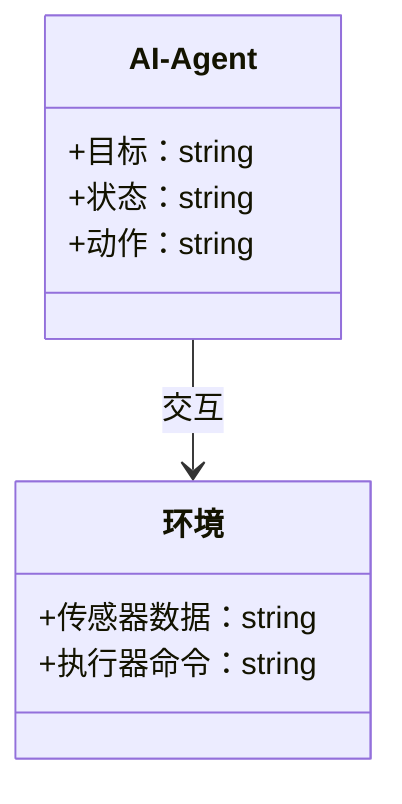
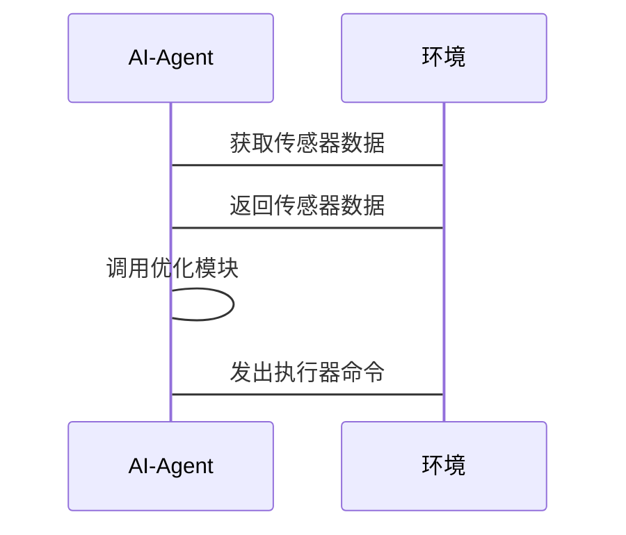

                 


# 多目标优化在AI Agent训练中的应用

> 关键词：多目标优化，AI Agent，机器学习，算法，系统设计

> 摘要：本文详细探讨了多目标优化在AI Agent训练中的应用，从基础概念到算法原理，再到系统设计和实际案例，全面解析了多目标优化在提升AI Agent性能和决策能力中的关键作用。

---

## 第一章: 多目标优化概述

### 1.1 多目标优化的基本概念

#### 1.1.1 多目标优化的定义
多目标优化（Multi-Objective Optimization，简称MOO）是指在多个相互冲突的目标下寻找最优解的过程。与单目标优化不同，多目标优化需要同时优化多个目标函数，这些目标函数通常存在相互矛盾的关系。

#### 1.1.2 多目标优化的核心特点
- **多个目标函数**：通常涉及多个目标函数，这些目标函数可能相互冲突。
- **帕累托最优解**：在多目标优化中，最优解是无法在不恶化一个目标的情况下改善另一个目标的解。
- **非支配性**：一个解如果在所有目标上都不劣于另一个解，则称其支配另一个解。

#### 1.1.3 多目标优化与单目标优化的对比
| 对比维度         | 单目标优化                     | 多目标优化                     |
|------------------|-------------------------------|-------------------------------|
| 目标数量         | 单个目标                       | 多个目标                       |
| 最优解           | 唯一最优解                     | 帕累托最优解集合               |
| 复杂度           | 较低                           | 较高                           |

### 1.2 AI Agent的基本概念

#### 1.2.1 AI Agent的定义
AI Agent（人工智能代理）是指在计算机系统中能够感知环境并采取行动以实现目标的实体。AI Agent可以是软件程序、机器人或其他智能系统。

#### 1.2.2 AI Agent的分类
- **简单反射式Agent**：基于当前感知做出反应，没有内部状态。
- **基于模型的反射式Agent**：维护内部状态，并基于模型进行决策。
- **目标驱动的Agent**：基于目标进行规划和行动。
- **效用驱动的Agent**：基于效用函数进行决策。

#### 1.2.3 AI Agent的核心功能与特点
- **自主性**：能够自主决策和行动。
- **反应性**：能够感知环境并实时调整行为。
- **目标导向性**：基于目标进行决策和行动。
- **学习能力**：能够通过经验改进性能。

---

## 第二章: 多目标优化在AI Agent中的应用背景

### 2.1 AI Agent训练中的挑战

#### 2.1.1 多目标优化的必要性
在AI Agent训练中，通常需要在多个目标之间进行权衡。例如，在自动驾驶中，既要考虑安全，又要考虑行驶效率，这两个目标往往是相互冲突的。

#### 2.1.2 多目标优化在AI Agent中的应用场景
- **任务分配**：在多智能体系统中，需要优化任务分配以最大化整体效率。
- **路径规划**：在机器人导航中，需要在路径长度、安全性和到达时间之间进行优化。
- **资源分配**：在分布式系统中，需要优化资源分配以提高性能。

#### 2.1.3 多目标优化与AI Agent训练的关系
多目标优化是AI Agent训练的核心技术，它能够帮助AI Agent在多个目标之间找到平衡点，从而实现更优的决策和行动。

### 2.2 多目标优化的数学模型

#### 2.2.1 多目标优化的数学表达式
$$ \text{minimize } f_1(x), f_2(x), \ldots, f_k(x) $$
$$ \text{subject to } g_1(x) \leq 0, \ldots, g_m(x) \leq 0 $$

其中，$f_i(x)$ 是目标函数，$g_j(x)$ 是约束条件。

#### 2.2.2 目标函数的定义与分析
目标函数通常用于衡量AI Agent的性能。例如，在自动驾驶中，目标函数可以包括安全性和行驶效率。

#### 2.2.3 约束条件的处理方法
约束条件可以通过引入惩罚项或使用拉格朗日乘数法来处理。

---

## 第三章: 多目标优化的核心概念与联系

### 3.1 多目标优化的核心原理

#### 3.1.1 帕累托最优解的概念
帕累托最优解是指在不改善一个目标的情况下，无法改善另一个目标的解。

#### 3.1.2 帕累托前沿的定义与特点
帕累托前沿是指所有帕累托最优解的集合，通常在目标空间中表现为一条曲线。

#### 3.1.3 多目标优化算法的选择与比较
常用的多目标优化算法包括NSGA、MOEA和基于分解的算法。

### 3.2 多目标优化与AI Agent的关系

#### 3.2.1 多目标优化在AI Agent决策中的作用
多目标优化能够帮助AI Agent在多个目标之间找到平衡点，从而做出更优的决策。

#### 3.2.2 多目标优化如何提升AI Agent的性能
通过优化多个目标，AI Agent可以在性能、效率和安全性之间找到最佳平衡。

#### 3.2.3 多目标优化与AI Agent训练目标的结合
在AI Agent训练中，多目标优化通常用于优化多个性能指标，例如准确率、召回率和训练时间。

---

## 第四章: 多目标优化算法原理

### 4.1 常见的多目标优化算法

#### 4.1.1 NSGA算法
NSGA（Non-dominated Sorting Genetic Algorithm）是一种基于种群的多目标优化算法，通过非支配排序和拥挤度计算来选择最优解。

#### 4.1.2 MOEA算法
MOEA（Multi-Objective Evolutionary Algorithm）是另一种基于种群的多目标优化算法，通过变异和选择操作来优化多个目标。

#### 4.1.3 基于分解的多目标优化算法
基于分解的算法将多目标优化问题分解为多个单目标子问题，通过优化每个子问题来找到全局最优解。

### 4.2 多目标优化算法的优缺点对比

#### 4.2.1 各种算法的优缺点分析
| 算法类型         | 优点                           | 缺点                           |
|------------------|--------------------------------|--------------------------------|
| NSGA             | 实现简单，性能稳定             | 收敛速度较慢                   |
| MOEA             | 收敛速度快                   | 实现复杂                     |
| 基于分解的算法   | 可扩展性强                   | 可能无法找到全局最优解         |

#### 4.2.2 算法选择的依据与策略
选择算法时需要考虑问题的规模、目标数量和约束条件。对于大规模问题，通常选择基于分解的算法；对于小规模问题，选择NSGA或MOEA。

#### 4.2.3 算法性能的评估指标
常用的评估指标包括帕累托前沿的覆盖范围、解的分布均匀性等。

---

## 第五章: 多目标优化算法的数学模型与公式

### 5.1 帕累托最优解的数学定义
$$ x \text{ 是帕累托最优解当且仅当不存在 } y \text{ 使得对于所有 } i, f_i(y) \geq f_i(x) \text{ 且存在 } j \text{ 使得 } f_j(y) > f_j(x) $$

### 5.2 多目标优化问题的数学建模

#### 5.2.1 多目标优化问题的标准形式
$$ \text{minimize } f_1(x), f_2(x), \ldots, f_k(x) $$
$$ \text{subject to } g_1(x) \leq 0, \ldots, g_m(x) \leq 0 $$

#### 5.2.2 目标函数的权重分配
目标函数的权重可以通过线性组合或非线性函数来分配。

#### 5.2.3 约束条件的处理方法
约束条件可以通过引入惩罚项或使用拉格朗日乘数法来处理。

### 5.3 常见多目标优化算法的数学推导

#### 5.3.1 NSGA算法的数学步骤
1. 初始化种群。
2. 计算每个个体的适应度值。
3. 根据适应度值进行非支配排序。
4. 计算拥挤度。
5. 选择父代个体。
6. 进行交叉和变异操作。
7. 生成子代个体。
8. 合并父代和子代个体，形成新的种群。
9. 重复步骤2-8，直到达到终止条件。

#### 5.3.2 MOEA算法的数学模型
$$ f(x) = \sum_{i=1}^k w_i f_i(x) $$
其中，$w_i$ 是目标函数的权重。

---

## 第六章: 系统分析与架构设计方案

### 6.1 问题场景介绍
在自动驾驶系统中，AI Agent需要在安全性和行驶效率之间进行权衡。

### 6.2 系统功能设计

#### 6.2.1 领域模型（Mermaid类图）


### 6.3 系统架构设计

#### 6.3.1 系统架构（Mermaid架构图）
```mermaid
container 多目标优化系统 {
    算法选择模块
    目标函数模块
    约束条件模块
    优化模块
}
```

### 6.4 系统接口设计
系统接口包括传感器数据输入接口、执行器命令输出接口和优化模块接口。

### 6.5 系统交互设计

#### 6.5.1 系统交互（Mermaid序列图）


---

## 第七章: 项目实战

### 7.1 环境安装
需要安装Python、NumPy、Scipy和相关优化库。

### 7.2 系统核心实现源代码

#### 7.2.1 多目标优化算法实现
```python
import numpy as np

def nsga_algorithm(population, fitness_functions, constraints):
    # 初始化种群
    current_population = population.copy()
    while not termination_condition():
        # 计算适应度
        fitness = [fitness_functions[i](individual) for i in range(len(fitness_functions))]
        # 非支配排序
        non_dominated = []
        for i in range(len(current_population)):
            dominated = False
            for j in range(len(current_population)):
                if i != j and all(fitness[i][k] >= fitness[j][k] for k in range(len(fitness[i]))):
                    dominated = True
                    break
            if not dominated:
                non_dominated.append(current_population[i])
        # 计算拥挤度
        # （此处省略具体实现）
        # 选择父代
        parents = select_parents(non_dominated)
        # 交叉和变异
        offspring = mutate(cross(parents))
        # 合并种群
        current_population = parents + offspring
    return non_dominated
```

#### 7.2.2 应用案例分析
在自动驾驶系统中，使用NSGA算法优化安全性和行驶效率。

---

## 第八章: 总结与展望

### 8.1 总结
多目标优化是AI Agent训练中的核心技术，能够帮助AI Agent在多个目标之间找到平衡点，从而实现更优的决策和行动。

### 8.2 未来展望
未来的研究方向包括开发更高效的多目标优化算法、研究多目标优化在分布式系统中的应用，以及探索多目标优化与强化学习的结合。

---

## 作者信息
作者：AI天才研究院 & 禅与计算机程序设计艺术

---

以上是《多目标优化在AI Agent训练中的应用》的技术博客文章的完整内容，涵盖了从基础概念到算法实现，再到系统设计和项目实战的各个方面，希望对读者有所帮助。

