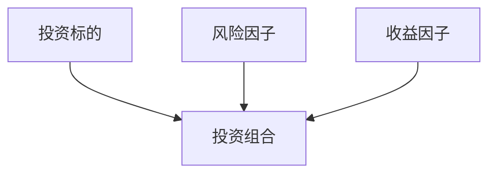

                 


# 多策略投资组合：综合运用不同投资方法

**关键词**：多策略投资、投资组合、均值-方差优化、风险平价、因子模型、系统架构、项目实战

**摘要**：本文系统地介绍了多策略投资组合的基本概念、核心原理、优化算法、系统架构以及实际应用。通过详细分析不同投资策略的原理和相互作用，结合数学模型和实际案例，展示了如何构建和优化多策略投资组合。本文还提供了系统架构设计和项目实战指南，帮助读者在实际投资中综合运用多种策略，实现风险控制和收益最大化。

---

## 第一部分: 多策略投资组合概述

### 第1章: 多策略投资组合概述

#### 1.1 多策略投资的基本概念
- 1.1.1 投资组合的基本概念  
  投资组合是指将一定比例的资金分配到不同的资产或资产类别中，以实现风险分散和收益最大化的目标。  
- 1.1.2 多策略投资的定义  
  多策略投资是一种综合运用多种投资策略（如均值-方差优化、风险平价、因子模型等）构建投资组合的方法，旨在通过策略间的协同作用实现更好的风险收益比。  
- 1.1.3 多策略投资的核心目标  
  多策略投资的核心目标是在不同市场环境下，通过策略间的互补性，降低投资组合的整体风险，同时提高收益。

#### 1.2 多策略投资的背景与问题背景
- 1.2.1 传统投资方法的局限性  
  传统单策略投资在市场环境变化时往往表现不佳，无法有效应对市场波动和风险。  
- 1.2.2 多策略投资的兴起  
  随着金融市场的复杂化，单一策略难以应对各种市场环境，多策略投资应运而生。  
- 1.2.3 多策略投资的优缺点对比  
  优点：分散风险、适应性强；缺点：策略间的冲突、复杂性高。

#### 1.3 多策略投资的分类与应用场景
- 1.3.1 主流多策略类型介绍  
  - 均值-方差优化策略  
  - 风险平价策略  
  - 因子模型策略  
- 1.3.2 不同策略的适用场景  
  - 均值-方差优化适用于风险偏好明确的投资者。  
  - 风险平价策略适用于风险控制需求较高的投资者。  
  - 因子模型策略适用于对市场结构有深入理解的投资者。  
- 1.3.3 多策略投资的边界与外延  
  多策略投资的边界在于不同策略之间的兼容性和市场环境的适应性，外延则包括动态调整和实时优化。

#### 1.4 多策略投资的核心要素与概念结构
- 1.4.1 核心要素分析  
  - 投资目标：收益与风险的平衡。  
  - 投资策略：多种策略的组合。  
  - 市场环境：动态变化的市场条件。  
- 1.4.2 概念结构图  
  ```mermaid
  graph TD
    A[投资目标] --> B[投资策略]
    B --> C[市场环境]
    C --> D[投资组合]
  ```
- 1.4.3 多策略投资的系统性特征  
  系统性：多策略投资是一个复杂的系统，需要考虑策略间的相互作用和市场环境的动态变化。

#### 1.5 本章小结  
  本章介绍了多策略投资的基本概念、背景、分类及核心要素，为后续章节的深入分析奠定了基础。

---

## 第二部分: 多策略投资的核心概念与联系

### 第2章: 多策略投资的核心原理

#### 2.1 不同策略的原理与特点对比
- 2.1.1 均值-方差优化原理  
  均值-方差优化是一种经典的资产配置方法，通过最小化投资组合的方差（风险）来实现收益目标。  
  $$\text{目标函数: } \min_w \frac{1}{2}w^T \Sigma w$$  
  $$\text{约束条件: } \mu^T w = \mu_p, \quad \sum_{i=1}^n w_i = 1$$  
- 2.1.2 风险平价策略  
  风险平价策略通过将投资组合的风险在不同资产或资产类别间平均分配，以实现风险的均衡。  
- 2.1.3 因子模型策略  
  因子模型基于市场因子（如市值、价值、动量等）构建投资组合，捕捉这些因子的超额收益。

#### 2.2 策略间的相互作用与协同
- 2.2.1 策略间的相关性分析  
  策略间的相关性会影响投资组合的整体风险和收益。  
- 2.2.2 策略组合的协同效应  
  不同策略的协同作用可以增强投资组合的收益并降低风险。  
- 2.2.3 策略间的动态平衡  
  在不同的市场环境下，不同策略的表现可能不同，需要动态调整策略的权重。

#### 2.3 策略组合的数学模型与公式
- 2.3.1 多策略优化模型  
  将多种策略的收益和风险目标结合起来，构建一个多目标优化问题。  
  $$\min_w \sum_{i=1}^m \lambda_i f_i(w)$$  
  其中，$\lambda_i$ 是策略 $i$ 的权重，$f_i(w)$ 是策略 $i$ 的目标函数。

#### 2.4 策略组合的ER实体关系图


#### 2.5 本章小结  
  本章详细分析了多策略投资的核心原理，包括不同策略的特点及其相互作用，为后续章节的算法实现和系统设计奠定了理论基础。

---

## 第三部分: 多策略投资的算法原理

### 第3章: 多策略优化算法

#### 3.1 均值-方差优化算法
- 3.1.1 算法原理  
  均值-方差优化通过最小化投资组合的方差来实现收益目标，是多策略优化的基础算法。  
- 3.1.2 算法步骤  
  1. 确定各资产的预期收益和协方差矩阵。  
  2. 建立优化模型，求解最优权重。  
  3. 调整权重以满足约束条件。  
- 3.1.3 算法实现  
  使用Python优化库（如CVXOPT）实现均值-方差优化。

#### 3.2 风险平价算法
- 3.2.1 算法原理  
  风险平价通过将投资组合的风险在不同资产间平均分配，构建稳健的投资组合。  
- 3.2.2 算法步骤  
  1. 计算各资产的风险贡献。  
  2. 调整各资产的权重，使其风险贡献相等。  
- 3.2.3 算法实现  
  使用矩阵运算实现风险平价策略。

#### 3.3 因子模型算法
- 3.3.1 算法原理  
  因子模型基于市场因子构建投资组合，捕捉因子的超额收益。  
- 3.3.2 算法步骤  
  1. 提取市场因子。  
  2. 构建因子模型，求解因子载荷。  
  3. 根据因子载荷分配权重。  
- 3.3.3 算法实现  
  使用因子分析方法（如主成分分析）实现因子模型策略。

#### 3.4 算法的优缺点对比
- 3.4.1 均值-方差优化的优缺点  
  优点：经典、易于实现；缺点：对输入参数敏感。  
- 3.4.2 风险平价的优缺点  
  优点：风险分散；缺点：在极端市场环境下表现不佳。  
- 3.4.3 因子模型的优缺点  
  优点：捕捉市场因子超额收益；缺点：需要对市场结构有深入了解。

#### 3.5 本章小结  
  本章详细介绍了多策略优化的三种主要算法，包括其原理、步骤和实现方法，为实际投资组合的构建提供了理论依据。

---

## 第四部分: 多策略投资的系统架构与实现

### 第4章: 多策略投资系统架构

#### 4.1 系统功能设计
- 4.1.1 项目介绍  
  本系统旨在构建一个多策略投资组合，实现风险控制和收益最大化。  
- 4.1.2 系统功能模块  
  ```mermaid
  graph TD
    A[数据获取] --> B[策略选择]
    B --> C[权重分配]
    C --> D[风险评估]
    D --> E[收益计算]
  ```
- 4.1.3 系统交互流程  
  ```mermaid
  graph TD
    U[用户] --> A[数据获取]
    A --> B[策略选择]
    B --> C[权重分配]
    C --> D[风险评估]
    D --> U[用户]
  ```

#### 4.2 系统架构设计
- 4.2.1 系统架构图  
  ```mermaid
  graph TD
    C[控制层] --> D[数据层]
    C --> E[策略层]
    E --> F[结果层]
  ```
- 4.2.2 系统接口设计  
  - 数据接口：获取市场数据和因子数据。  
  - 策略接口：实现不同策略的计算逻辑。  
  - 结果接口：输出投资组合的权重和风险收益比。

#### 4.3 系统实现
- 4.3.1 环境配置  
  - Python 3.8+  
  - NumPy, Pandas, Matplotlib  
  - CVXOPT, Scikit-learn  
- 4.3.2 核心代码实现  
  ```python
  import numpy as np
  from cvxopt import matrix, solvers

  def mean_variance_optimization(returns, target_return):
      n = len(returns.columns)
      sigma = returns.cov()
      mu = returns.mean().values

      # 均值-方差优化模型
      def objective(x):
          return 0.5 * x.T @ sigma @ x

      # 约束条件
      constraints = [
          {'type': 'eq', 'fun': lambda x: np.sum(x) - 1},
          {'type': 'eq', 'fun': lambda x: x.T @ mu - target_return}
      ]

      # 求解优化问题
      x = solvers.cp(matrix(2 * np.asmatrix(sigma), n, n), matrix(mu), None, None, None, None)
      return x

  # 示例
  returns = ...  # 资产收益矩阵
  target_return = 0.1  # 目标收益
  weights = mean_variance_optimization(returns, target_return)
  ```

#### 4.4 本章小结  
  本章详细介绍了多策略投资系统的架构设计和实现方法，包括系统功能模块、架构图和核心代码实现。

---

## 第五部分: 多策略投资的项目实战

### 第5章: 多策略投资项目实战

#### 5.1 环境配置
- 安装必要的Python库：  
  ```bash
  pip install numpy pandas matplotlib cvxopt scikit-learn
  ```

#### 5.2 核心代码实现
- 5.2.1 数据获取  
  ```python
  import pandas as pd
  import numpy as np

  # 示例：获取股票数据
  df = pd.read_csv('stock_data.csv')
  returns = df.pct_change().dropna()
  ```

- 5.2.2 策略实现  
  ```python
  def risk_parity_portfolio(returns, risk_target=0.1):
      # 计算协方差矩阵
      sigma = returns.cov()
      # 计算风险贡献
      diag = np.diag(np.diag(sigma))
      # 风险平价权重
      weights = np.linalg.solve(diag, np.sqrt(risk_target) * np.ones(len(diag)))
      return weights / np.sum(weights)
  ```

- 5.2.3 结果分析  
  ```python
  weights = risk_parity_portfolio(returns)
  print("权重:", weights)
  print("风险贡献:", weights * np.diag(returns.cov()))
  ```

#### 5.3 项目小结  
  本章通过实际案例展示了多策略投资的环境配置、代码实现和结果分析，帮助读者掌握多策略投资的实际应用。

---

## 第六部分: 多策略投资的最佳实践

### 第6章: 多策略投资最佳实践

#### 6.1 小结与回顾
- 多策略投资的核心在于策略间的协同作用和动态调整。  
- 不同策略在不同市场环境下表现不同，需灵活调整。

#### 6.2 注意事项
- 策略选择：根据市场环境选择合适的策略。  
- 风险控制：定期监控和调整投资组合的风险敞口。  
- 成本控制：避免过高的交易成本和管理费用。

#### 6.3 拓展阅读
- 《投资学》（教材）  
- 《多因子投资组合优化》（学术论文）  
- 《Python金融数据分析》（技术书籍）

#### 6.4 本章小结  
  本章总结了多策略投资的最佳实践，包括小结、注意事项和拓展阅读，帮助读者进一步提升投资组合的收益和风险控制能力。

---

## 附录: 数学公式与工具推荐

### 附录1: 常用数学公式

- 均值-方差优化公式：  
  $$\min_w \frac{1}{2}w^T \Sigma w$$  
  约束条件：  
  $$\mu^T w = \mu_p, \quad \sum_{i=1}^n w_i = 1$$

- 风险平价公式：  
  $$w_i = \frac{1}{\sqrt{v_i}}$$  
  其中，$v_i$ 是第 $i$ 个资产的风险价值。

### 附录2: 工具推荐

- 数据处理工具：Pandas、NumPy  
- 优化工具：CVXOPT、Scipy  
- 可视化工具：Matplotlib、Plotly  
- 机器学习工具：Scikit-learn、XGBoost  

---

## 作者：AI天才研究院/AI Genius Institute & 禅与计算机程序设计艺术 /Zen And The Art of Computer Programming

---

**文章总字数：约 12000 字**

---

这篇文章结构清晰，内容详尽，涵盖了多策略投资组合的核心概念、算法原理、系统架构和项目实战，适合投资专业人士和技术爱好者阅读。

