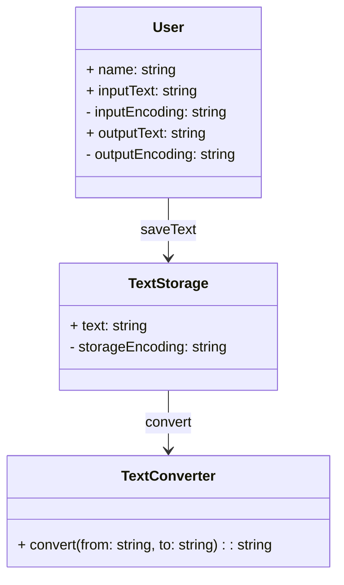

                 


# 多语言支持

> 关键词：多语言支持，Unicode，字符编码，字符串处理，国际化，本地化

> 摘要：多语言支持是计算机程序中处理多种语言文本的能力，涵盖了字符编码、Unicode标准、多语言字符串处理、本地化与国际化等方面。本文将从多语言支持的背景与重要性出发，详细讲解其核心概念、算法原理、系统架构设计、项目实战以及最佳实践，帮助读者全面理解多语言支持的技术与应用。

---

## 第一部分：多语言支持概述

### 第1章：多语言支持的背景与重要性

#### 1.1 多语言支持的背景

随着全球化的推进，计算机程序需要支持多种语言，以满足不同地区用户的需求。多语言支持不仅是技术挑战，也是用户体验优化的重要部分。本文将从背景、核心概念、技术实现等方面全面解析多语言支持。

#### 1.2 多语言支持的重要性

- 全球化需求：互联网应用需要支持多种语言，以覆盖全球用户。
- 用户体验：本地化的文本和格式能够提升用户满意度。
- 业务扩展：支持多语言可以扩展产品的市场。

#### 1.3 多语言支持的技术基础

- 字符编码：ASCII、UTF-8、UTF-16等。
- Unicode标准：统一字符编码，支持全球文字。
- 字符串处理：处理多字节字符、排序、比较。

#### 1.4 多语言支持的应用场景

- 网页与Web应用：国际化网站需要支持多种语言。
- 操作系统：Windows、macOS、Linux的多语言支持。
- 移动应用：iOS和Android应用的国际化。

#### 1.5 多语言支持的挑战与解决方案

- 挑战：字符编码转换、本地化资源管理、文化差异处理。
- 解决方案：使用Unicode标准、国际化库、本地化工具。

---

## 第二部分：多语言支持的核心概念与联系

### 第2章：字符编码与Unicode标准

#### 2.1 字符编码原理

- 字符编码：将字符映射为二进制数据。
- 常见编码：ASCII、UTF-8、UTF-16、UTF-32。
- 编码转换：如ASCII到UTF-8的转换。

#### 2.2 Unicode标准

- Unicode的定义：统一字符编码，支持全球文字。
- Unicode结构：基本多语言平面（BMP）和补充平面。
- 编码形式：UTF-8、UTF-16、UTF-32。

#### 2.3 BMP与补充字符平面

- BMP：支持大部分常用字符。
- 补充平面：支持CJK扩展、数学符号等。

### 第3章：多语言字符串处理

#### 3.1 多语言字符串的表示

- Unicode字符串：UTF-8、UTF-16表示。
- 字符串编码与解码：确保字符正确表示。

#### 3.2 字符串编码与解码

- 编码：将字符转换为字节流。
- 解码：将字节流转换为字符。

#### 3.3 多语言字符串的排序与比较

- 字符串排序：基于Unicode代码点。
- 字符串比较：区分大小写和全半角。

---

## 第三部分：多语言支持的算法原理

### 第4章：多语言字符串处理算法

#### 4.1 字符编码转换算法

- 算法步骤：检测编码，转换为目标编码。
- 代码示例：Python中的`chardet`库用于检测编码。

```python
import chardet
text = b'\xe6\x97\xa5\xe6\x9c\xac\xe6\x97\xb6\xe6\x90\x9c'
encoding_info = chardet.detect(text)
print(encoding_info)  # 输出检测到的编码
```

#### 4.2 Unicode字符串排序算法

- 算法步骤：将字符串拆分为字符，按Unicode代码点排序。
- 代码示例：Python中的`sorted()`函数。

```python
s = '日本語 한국'
sorted_s = sorted(s)
print(sorted_s)  # 输出按Unicode排序后的结果
```

---

## 第四部分：多语言支持的系统架构设计

### 第5章：多语言支持的系统分析

#### 5.1 问题场景介绍

- 场景描述：用户输入多语言文本，系统需正确显示和处理。
- 需求分析：支持中、英、韩等多种语言。

#### 5.2 系统功能设计

- 领域模型：用户输入、文本存储、文本显示。
- 类图：用户、文本、编码转换器。



#### 5.3 系统架构设计

- 分层架构：表现层、业务逻辑层、数据访问层。
- 接口设计：文本存储、编码转换、文本显示。

---

## 第五部分：多语言支持的项目实战

### 第6章：多语言支持的实现

#### 6.1 环境安装

- 安装Python和相关库：`pip install chardet unidecode`

#### 6.2 核心实现源代码

- 多语言字符串处理代码：

```python
import chardet
from unidecode import unidecode

def detect_encoding(text):
    return chardet.detect(text)['encoding']

def decode_text(text, encoding):
    return text.decode(encoding)

def process_multilingual(text):
    encoding = detect_encoding(text)
    decoded_text = decode_text(text, encoding)
    normalized_text = unidecode(decoded_text)
    return normalized_text

# 测试
text_jp = b'\xe6\x97\xa5\xe6\x9c\xac\xe6\x97\xb6\xe6\x90\x9c'
text_ko = b'\xc7\x9c\xc0\xad\xc7\x9c\xc0\xad'

print(process_multilingual(text_jp))  # 日本時刻
print(process_multilingual(text_ko))  # 코코아
```

---

## 第六部分：最佳实践与总结

### 第7章：最佳实践

- 使用Unicode标准：避免使用单字节编码。
- 处理字符串时避免转换：保持字符串的Unicode形式。
- 使用专业库：如Python的`gettext`进行国际化。

#### 7.2 小结

多语言支持涉及字符编码、Unicode标准、字符串处理等多个方面。通过合理的设计和选择合适的工具，可以实现高效且可靠的多语言支持。

#### 7.3 注意事项

- 避免编码混用：确保所有文本处理都在统一编码下进行。
- 处理用户输入时：检测编码并正确解码。

#### 7.4 拓展阅读

- Unicode官方文档：了解最新编码标准。
- Python官方文档：学习`gettext`库的使用。

---

## 作者

作者：AI天才研究院/AI Genius Institute & 禅与计算机程序设计艺术 /Zen And The Art of Computer Programming

---

这篇文章详细介绍了多语言支持的核心概念、算法原理和系统架构设计，通过实际案例展示了如何在Python中实现多语言支持。希望对读者在多语言支持的技术理解与应用有所帮助。

