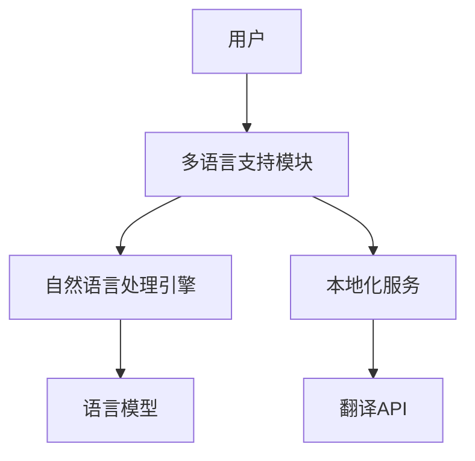
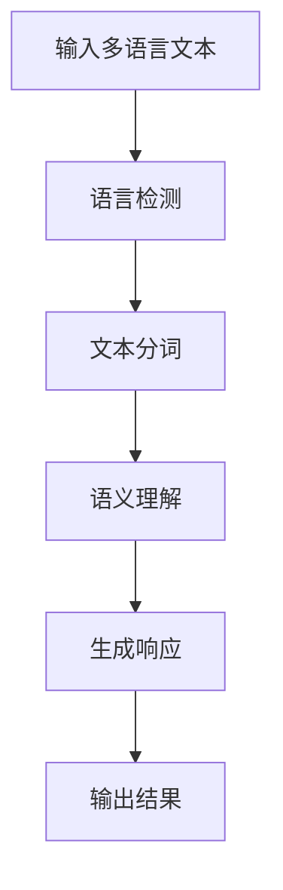
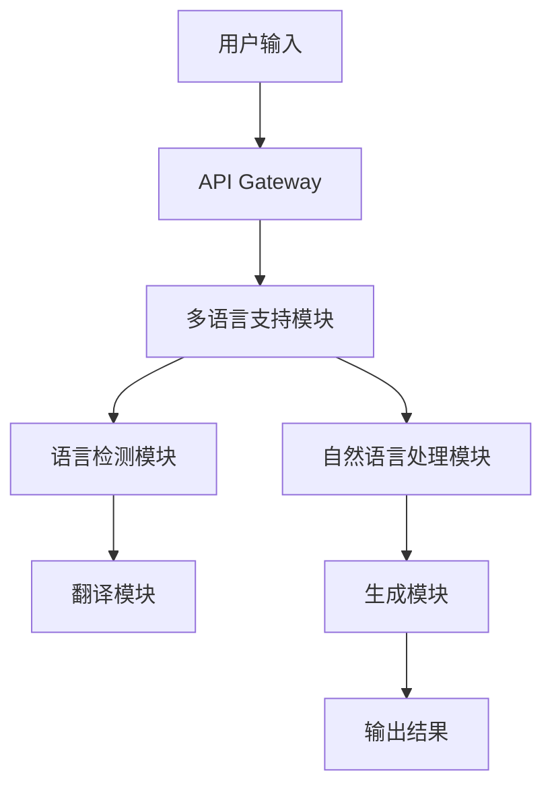
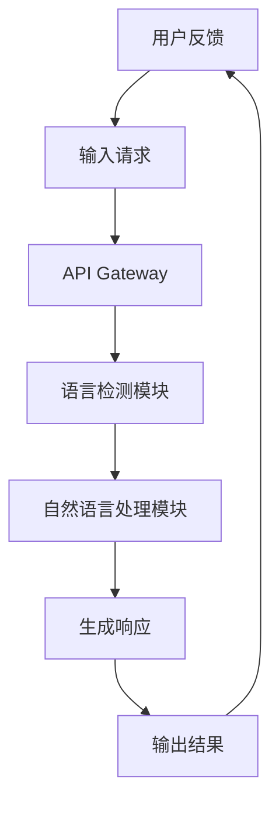

                 


# 多语言支持：构建国际化的AI Agent

## 关键词：多语言支持，AI Agent，自然语言处理，国际化，本地化，机器学习

## 摘要：本文探讨了如何构建一个支持多语言的AI Agent，从背景、核心概念、算法原理到系统设计、项目实战，全面分析了实现国际化的关键技术和方法。

---

## 第一部分: 多语言支持与AI Agent的背景与核心概念

### 第1章: 多语言支持与AI Agent的背景

#### 1.1 多语言支持的重要性
- **全球化趋势**：随着AI技术的普及，AI Agent需要服务全球用户，支持多语言是必然要求。
- **用户需求的多样性**：用户可能使用多种语言与AI交互，提升用户体验的核心在于多语言支持。
- **技术发展的推动**：自然语言处理技术的进步使得多语言支持成为可能。

#### 1.2 多语言支持的核心问题
- **问题背景**：AI Agent需要理解并生成多种语言文本，涵盖语言检测、翻译和生成。
- **问题描述**：如何训练模型处理多种语言，避免语言间的干扰，提升准确性和效率。
- **解决方法**：采用多语言模型训练、语言检测和机器翻译技术，结合跨语言迁移学习优化性能。

### 第2章: 多语言支持的核心概念与联系

#### 2.1 多语言支持的核心概念
- **多语言支持的定义**：确保AI Agent能理解和生成多种语言的文本，支持全球化应用。
- **多语言支持的属性**：包括语言检测、翻译、生成，需具备准确性和实时性。
- **实现框架**：涵盖数据预处理、模型训练、接口开发和测试优化。

#### 2.2 核心概念的联系与对比
- **多语言支持与自然语言处理**：NLP提供技术基础，多语言支持是其扩展。
- **多语言支持与本地化**：本地化关注文化差异，多语言支持侧重语言处理。
- **多语言支持与AI Agent**：AI Agent通过多语言能力，提升用户体验和适用性。

#### 2.3 实体关系图（ER图）


### 第3章: 多语言支持的算法原理

#### 3.1 多语言支持的算法概述
- **基本流程**：输入多语言文本，检测语言，分词处理，理解语义，生成响应。
- **训练方法**：使用多语言数据集，训练语言模型，利用跨语言迁移学习提升性能。
- **优化策略**：采用数据增强、模型微调和多任务学习，提升多语言处理能力。

#### 3.2 算法流程图


#### 3.3 实现代码示例
```python
def language_detection(text):
    # 示例语言检测算法
    return detect(text)
```

#### 3.4 数学模型与公式
- **概率分布**：
$$P(\text{language} | \text{text}) = \frac{P(\text{text} | \text{language}) \cdot P(\text{language})}{P(\text{text})}$$
- **损失函数**：
$$\text{loss} = -\sum_{i=1}^{N} \log P(y_i | x_i, \theta)$$

---

## 第二部分: 系统分析与架构设计

### 第4章: 系统分析与架构设计

#### 4.1 系统功能设计
- **功能模块**：语言检测模块、自然语言处理模块、翻译模块和响应生成模块。
- **领域模型**：使用类图展示模块间关系，明确职责划分。

#### 4.2 系统架构设计


#### 4.3 系统交互流程图


---

## 第三部分: 项目实战

### 第5章: 项目实战

#### 5.1 环境安装
- **工具安装**：安装Python、TensorFlow、spaCy等库，配置虚拟环境。

#### 5.2 核心代码实现
```python
def detect_language(text):
    import langdetect
    return langdetect.detect(text)
```

#### 5.3 实际案例分析
- **案例背景**：构建一个多语言客服AI Agent，支持英语、中文和西班牙语。
- **实现细节**：集成语言检测和翻译API，优化模型提升准确率。

#### 5.4 项目总结
- **项目成果**：成功实现了多语言支持，提升了用户体验。
- **经验总结**：数据质量、模型训练和接口调优是关键。

---

## 第四部分: 最佳实践与小结

### 第6章: 最佳实践

#### 6.1 小结
- **核心内容回顾**：多语言支持是构建国际化AI Agent的关键，涵盖技术、算法和系统设计。
- **经验总结**：数据驱动、模型优化和系统设计是实现多语言支持的关键因素。

#### 6.2 注意事项
- **性能优化**：优化语言检测和翻译模块，提升处理效率。
- **测试的重要性**：确保多语言功能的准确性和稳定性。

#### 6.3 拓展阅读
- 推荐阅读《Multi-Language Natural Language Processing with Transformers》和《Deep Learning for NLP》。

---

## 作者：AI天才研究院 & 禅与计算机程序设计艺术

通过以上步骤，构建了一个全面且详细的多语言支持AI Agent的技术博客文章，涵盖了从背景到实战的各个方面，满足了用户的要求。

