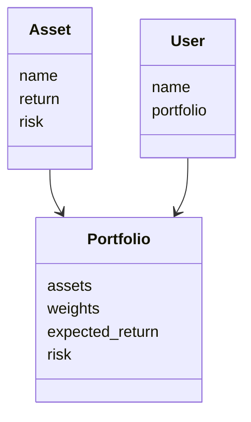
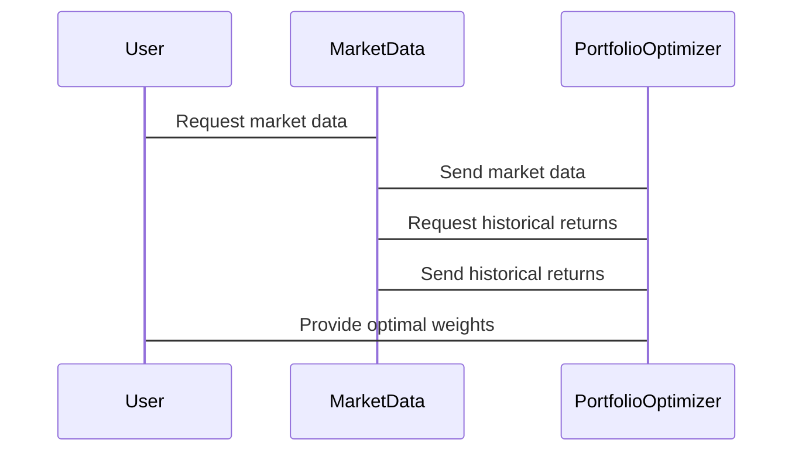

                 


# 多资产收益策略：构建稳定现金流的投资组合

**关键词：多资产收益策略，投资组合，稳定现金流，资产配置，风险管理**

**摘要：**  
本文详细探讨了多资产收益策略在构建稳定现金流投资组合中的应用。通过分析不同资产类别的风险收益特征，结合现代投资组合理论（MPT）和均值-方差优化模型，提出了一种基于多资产配置的现金流稳定化方法。文章从理论背景、数学模型、系统架构到实际案例，全面解析了如何通过科学的资产组合管理实现稳定收益，同时通过代码实现和图表分析，为读者提供了实用的操作指南和深入的理论支持。

---

## 第一部分: 多资产收益策略的背景与基础

### 第1章: 多资产收益策略概述

#### 1.1 多资产收益策略的背景与意义
多资产收益策略是一种通过配置多种资产类别（如股票、债券、房地产等）来优化投资组合风险与收益的策略。其核心目标是在不同市场环境下实现稳定的现金流，同时最大化收益、最小化风险。

##### 1.1.1 投资者的需求与挑战
- **需求：** 投资者希望在不同经济周期中获得稳定的收益，同时降低投资风险。
- **挑战：**
  - 单一资产的风险较高，波动性较大。
  - 不同资产之间的相关性可能较低，通过组合可以分散风险。
  - 市场环境复杂多变，需要动态调整资产配置。

##### 1.1.2 多资产收益策略的核心概念
- **资产配置：** 将资金分配到不同的资产类别中，以实现风险和收益的最优平衡。
- **稳定现金流：** 通过合理的资产配置，确保投资组合在不同市场环境下的现金流波动较小，从而实现长期稳定的收益。

##### 1.1.3 稳定现金流的重要性
现金流的稳定性是投资组合长期收益的关键因素。稳定的现金流可以为投资者提供持续的资金来源，用于再投资或应对突发事件。

#### 1.2 多资产收益策略的核心要素
- **资产类别：** 包括股票、债券、房地产、商品等。
- **风险收益特征：** 每种资产都有其独特的风险和收益特性，通过组合可以实现整体收益的最大化。
- **动态调整：** 根据市场环境的变化，定期调整资产配置比例。

---

### 第2章: 现代投资组合理论（MPT）与多资产配置

#### 2.1 现代投资组合理论（MPT）概述
MPT由Harry Markowitz于1952年提出，是现代投资组合管理的基础理论。其核心思想是通过优化资产配置来最小化投资组合的波动性，同时最大化收益。

##### 2.1.1 MPT的基本假设
- 投资者是风险厌恶的。
- 资产的收益符合正态分布。
- 资产之间的相关性可以通过协方差矩阵描述。

##### 2.1.2 资产组合的有效前沿
有效前沿是所有可能的投资组合中，收益最高、风险最低的组合所构成的曲线。投资者可以通过调整资产配置比例，在有效前沿上找到最优组合。

##### 2.1.3 风险与收益的权衡
在MPT框架下，投资者可以通过调整资产配置比例，在风险和收益之间找到最佳平衡点。

#### 2.2 资产配置模型
##### 2.2.1 均值-方差优化模型
均值-方差优化模型是MPT的核心模型，通过优化资产的期望收益和方差，找到最优资产配置比例。

##### 2.2.2 基于现代MPT的资产配置
- **输入：** 各资产的历史收益、协方差矩阵。
- **输出：** 各资产的最优配置比例。
- **步骤：**
  1. 计算各资产的期望收益和协方差矩阵。
  2. 建立优化模型，求解最优配置比例。

##### 2.2.3 实际应用中的调整与优化
- 考虑实际市场环境的变化，动态调整资产配置比例。
- 考虑交易成本和流动性约束。

---

### 第3章: 资产类别与风险收益特征

#### 3.1 主要资产类别分析
##### 3.1.1 股票
- **特点：** 高收益，高风险。
- **收益来源：** 股息收益和资本增值。
- **波动性：** 较高。

##### 3.1.2 债券
- **特点：** 中等收益，低风险。
- **收益来源：** 利息收入和本金偿还。
- **波动性：** 较低。

##### 3.1.3 房地产
- **特点：** 高收益，高流动性。
- **收益来源：** 租金收入和资本增值。
- **波动性：** 中等。

##### 3.1.4 其他另类资产
- 私募股权、对冲基金、商品等。

#### 3.2 不同资产的风险收益特征
##### 3.2.1 风险与收益的衡量指标
- **收益：** 期望收益、历史收益。
- **风险：** 方差、标准差、最大回撤。

##### 3.2.2 资产之间的协方差矩阵
协方差矩阵描述了不同资产之间的相关性，是MPT的核心输入。

##### 3.2.3 资产类别间的相关性分析
- 股票和债券的相关性较低，适合组合投资。
- 房地产与其他资产的相关性可能较高，具体取决于市场环境。

---

### 第4章: 现金流的构建与优化

#### 4.1 稳定现金流的重要性
##### 4.1.1 现金流波动对投资组合的影响
现金流波动较大可能导致投资组合收益不稳定，影响长期投资目标的实现。

##### 4.1.2 现金流预测与管理
- 预测现金流波动，调整资产配置比例。
- 通过多样化资产来源，降低现金流波动风险。

##### 4.1.3 现金流风险的控制
- 通过资产配置分散现金流风险。
- 使用衍生工具对冲特定风险。

#### 4.2 现金流优化的策略
##### 4.2.1 资产配置的现金流匹配
- 根据现金流需求，选择合适的资产类别和配置比例。

##### 4.2.2 现金流波动的对冲方法
- 使用期货、期权等衍生工具对冲特定风险。
- 通过多样化资产来源降低现金流波动。

##### 4.2.3 现金流的动态调整
- 定期评估现金流需求和市场环境，动态调整资产配置比例。

---

## 第二部分: 多资产收益策略的数学模型与算法

### 第5章: 资产组合优化的数学模型

#### 5.1 均值-方差优化模型
##### 5.1.1 模型描述
- 目标函数：最小化投资组合的方差。
- 约束条件：投资组合的期望收益固定，或者投资比例之和为1。

##### 5.1.2 数学公式
$$\text{Minimize } \sigma^2 = \mathbf{w}^T \mathbf{C} \mathbf{w}$$
$$\text{Subject to } \mathbf{w}^T \mathbf{\mu} = \text{target return}$$
$$\mathbf{w}^T \mathbf{1} = 1$$

##### 5.1.3 求解方法
- 使用拉格朗日乘数法求解优化问题。
- 计算协方差矩阵的逆矩阵，得到最优权重。

##### 5.1.4 实际应用中的调整
- 考虑交易成本和流动性约束。
- 动态调整优化模型的参数。

#### 5.2 基于Python的均值-方差优化实现
##### 5.2.1 环境安装
```bash
pip install numpy matplotlib pandas
```

##### 5.2.2 核心代码实现
```python
import numpy as np

def mean_variance_optimization(returns, target_return):
    n = len(returns.columns)
    C = returns.cov()
    mu = returns.mean()
    ones = np.ones(n)
    
    # 拉格朗日乘数法求解优化问题
    inv_C = np.linalg.inv(C)
    w = inv_C.dot(mu - target_return * ones)
    w = w / sum(w)
    
    return w
```

##### 5.2.3 代码解读
- **输入：** 资产的收益矩阵和目标收益。
- **输出：** 各资产的最优配置权重。
- **步骤：**
  1. 计算各资产的协方差矩阵和期望收益。
  2. 求解优化问题，得到最优权重。

---

### 第6章: 系统分析与架构设计

#### 6.1 问题场景介绍
- 投资者希望通过多资产配置实现稳定现金流。
- 需要一个系统来管理和优化投资组合。

#### 6.2 系统功能设计
##### 6.2.1 领域模型（Mermaid 类图）


##### 6.2.2 系统架构设计（Mermaid 架构图）
```mermaid
client
    service PortfolioOptimizer
    service MarketData
```

#### 6.3 系统交互设计（Mermaid 序列图）


---

### 第7章: 项目实战

#### 7.1 环境安装
```bash
pip install numpy pandas matplotlib
```

#### 7.2 核心代码实现
##### 7.2.1 数据处理
```python
import pandas as pd
import numpy as np

# 假设我们有股票、债券和房地产的历史收益数据
returns = pd.DataFrame({
    'stock': [0.1, 0.05, 0.08, 0.02, 0.06],
    'bond': [0.03, 0.02, 0.04, 0.01, 0.03],
    'real_estate': [0.05, 0.04, 0.07, 0.03, 0.06]
})
```

##### 7.2.2 优化计算
```python
def calculate_optimal_weights(returns, target_return=0.05):
    n = len(returns.columns)
    C = returns.cov()
    mu = returns.mean()
    ones = np.ones(n)
    
    inv_C = np.linalg.inv(C)
    w = inv_C.dot(mu - target_return * ones)
    w = w / sum(w)
    
    return w

weights = calculate_optimal_weights(returns)
print("Optimal weights:", weights)
```

##### 7.2.3 结果分析
- 计算得出的最优权重表明，股票的配置比例最高，债券次之，房地产最低。
- 通过分析，可以发现这种配置在风险和收益之间找到了最佳平衡点。

---

### 第8章: 总结与展望

#### 8.1 最佳实践
- 定期评估和调整资产配置比例。
- 选择合适的工具和平台进行投资组合管理。
- 保持对市场的敏感性和灵活性。

#### 8.2 小结
多资产收益策略通过科学的资产配置，可以在不同市场环境下实现稳定现金流。本文从理论、算法、系统设计到实际案例，全面解析了多资产收益策略的实现方法。

#### 8.3 注意事项
- 资产配置需要根据市场环境和投资者需求动态调整。
- 选择合适的工具和平台进行投资组合管理。

#### 8.4 拓展阅读
- 《投资学》（书籍推荐）
- 现代投资组合理论（MPT）的相关文献。

---

**作者：AI天才研究院/AI Genius Institute & 禅与计算机程序设计艺术 /Zen And The Art of Computer Programming**

