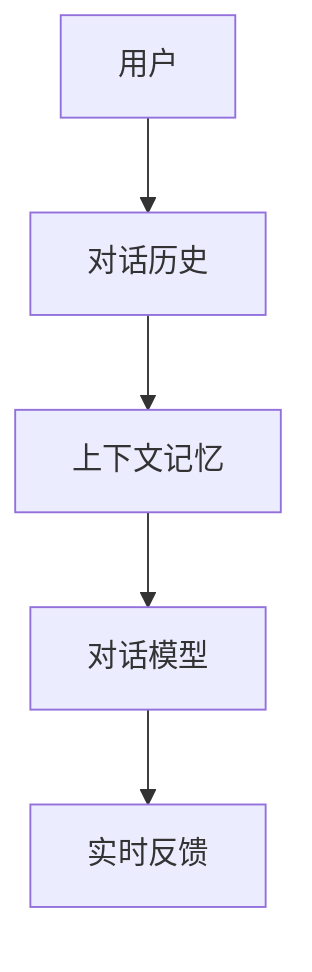
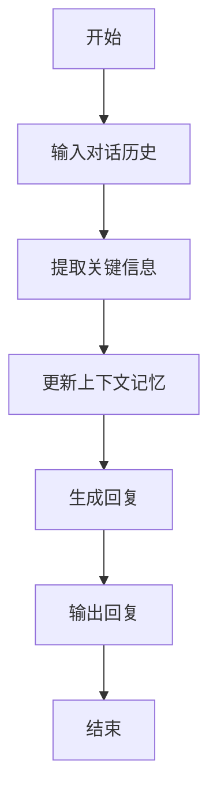
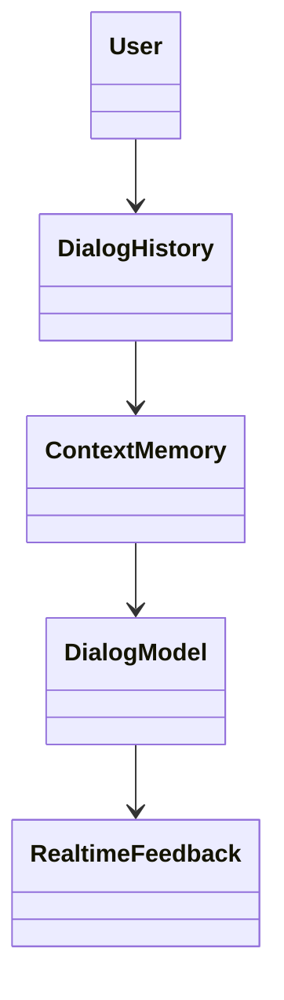
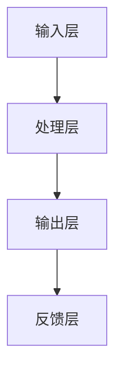
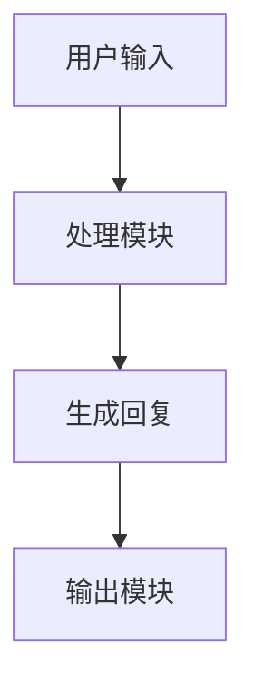

                 


# 多轮对话 AI Agent：提升 LLM 的上下文理解能力

> 关键词：多轮对话、LLM、上下文理解、AI Agent、自然语言处理

> 摘要：本文探讨如何通过多轮对话AI Agent提升大语言模型（LLM）的上下文理解能力。通过分析问题背景、核心概念、算法原理、系统架构及项目实战，深入解析提升上下文理解的方法，结合实际案例，展示如何设计和实现高效的多轮对话系统。

---

## 第一部分：背景介绍

### 第1章：问题背景与描述

#### 1.1 问题背景

- **多轮对话的定义与特点**  
  多轮对话是指在交互过程中，系统能够根据之前的对话内容逐步理解用户的意图，提供连贯的回复。其特点包括连续性、交互性、动态性和上下文依赖性。

- **当前LLM在对话中的局限性**  
  当前的大语言模型（如GPT-3、GPT-4）在处理多轮对话时，往往因为上下文记忆不足，导致回复缺乏连贯性，容易出现信息重复或不相关的情况。

- **提升上下文理解的重要性**  
  良好的上下文理解能力能够让AI在对话中保持一致性，提供更自然和流畅的交流体验，显著提升用户体验。

#### 1.2 问题描述

- **多轮对话中的信息丢失问题**  
  在多轮对话中，模型可能会忘记之前的上下文信息，导致回答不够准确或连贯。

- **上下文理解的挑战**  
  如何有效地存储和利用对话历史信息，是一个技术难题。

- **用户需求与系统反馈的不匹配**  
  用户期望系统能够记住之前的对话内容，而当前系统往往无法做到。

#### 1.3 问题解决

- **引入上下文记忆机制**  
  通过设计一种记忆机制，将对话历史信息存储并传递给模型。

- **优化对话模型的训练策略**  
  在训练模型时，加入对话历史的权重，让模型更好地理解上下文。

- **提升对话系统的实时反馈能力**  
  通过实时分析对话内容，动态调整模型的输出，确保连贯性。

#### 1.4 边界与外延

- **多轮对话的边界条件**  
  对话的长度限制、信息的有效性、系统的处理能力。

- **上下文理解的适用范围**  
  适用于需要连续交互的场景，如客服、虚拟助手等。

- **相关技术的扩展性探讨**  
  结合其他技术，如知识图谱、情感分析，进一步提升对话质量。

#### 1.5 核心概念与组成

- **多轮对话AI Agent的定义**  
  一种能够理解并记忆多轮对话上下文，提供连贯交互的智能体。

- **上下文理解的核心要素**  
  包括对话历史存储、信息提取、语义理解等。

- **系统架构的组成与功能**  
  包括输入处理模块、上下文记忆模块、对话生成模块等。

---

## 第二部分：核心概念与联系

### 第2章：多轮对话AI Agent的核心原理

#### 2.1 核心概念分析

- **上下文记忆机制**  
  通过某种数据结构存储对话历史，如列表或图结构。

- **对话历史的处理方式**  
  将对话历史中的关键信息提取出来，供模型使用。

- **实时反馈机制**  
  根据对话的实时进展，动态调整模型的输出。

#### 2.2 属性特征对比

- **对比表格：多轮对话与单轮对话的特征对比**

| 特征          | 多轮对话         | 单轮对话         |
|---------------|------------------|------------------|
| 对话连续性      | 高               | 低               |
| 信息依赖性      | 高               | 低               |
| 理解复杂性      | 高               | 中               |

- **对比表格：上下文记忆与传统记忆方式的差异**

| 特征          | 上下文记忆        | 传统记忆          |
|---------------|-------------------|-------------------|
| 存储方式        | 动态更新          | 静态存储          |
| 记忆容量        | 可调节            | 固定              |
| 信息提取        | 基于语义          | 基于关键词        |

#### 2.3 ER实体关系图



---

## 第三部分：算法原理

### 第3章：算法流程与实现

#### 3.1 算法流程图



#### 3.2 代码实现

```python
class ContextMemory:
    def __init__(self):
        self.history = []
        self.current_context = ""
    
    def add_to_history(self, message):
        self.history.append(message)
    
    def get_context(self):
        return self.current_context
    
    def update_context(self):
        # 假设简单的拼接
        self.current_context = ' '.join(self.history)
```

#### 3.3 数学模型和公式

- **模型的损失函数**  
  用于优化模型的上下文理解能力。
  $$ L = \alpha \cdot L_{context} + (1-\alpha) \cdot L_{text} $$
  其中，$\alpha$ 是平衡因子，$L_{context}$ 是上下文损失，$L_{text}$ 是文本损失。

- **注意力机制**  
  用于提取对话历史中的关键信息。
  $$ \text{Attention}(Q, K, V) = \text{softmax}\left(\frac{QK^T}{\sqrt{d}}\right)V $$

---

## 第四部分：系统分析与架构设计

### 第4章：系统架构与设计

#### 4.1 项目场景介绍

- **项目背景**  
  设计一个客服对话系统，提升用户体验。

#### 4.2 系统功能设计

- **核心功能**  
  实时对话处理、上下文记忆、多轮对话支持。

#### 4.3 领域模型类图



#### 4.4 系统架构图



#### 4.5 接口设计

- **输入接口**  
  提供API接收用户的输入，如RESTful API。

- **输出接口**  
  返回生成的回复，支持文本、JSON等多种格式。

#### 4.6 交互流程图



---

## 第五部分：项目实战

### 第5章：项目实现与案例分析

#### 5.1 环境安装

- **安装Python和相关库**  
  ```bash
  pip install numpy
  pip install tensorflow
  pip install matplotlib
  ```

#### 5.2 核心代码实现

```python
class DialogAgent:
    def __init__(self):
        self.memory = ContextMemory()
        self.model = DialogModel()
    
    def process_dialog(self, user_input):
        self.memory.add_to_history(user_input)
        context = self.memory.get_context()
        response = self.model.generate_response(context)
        return response
```

#### 5.3 代码解读

- `ContextMemory`类用于管理对话历史和上下文。
- `DialogModel`类负责生成回复，使用训练好的模型。
- `process_dialog`方法处理用户输入，生成回复。

#### 5.4 案例分析

- **案例1**  
  用户咨询产品信息，系统根据对话历史提供详细信息。

- **案例2**  
  用户投诉，系统根据之前的对话调整回复语气。

#### 5.5 项目小结

通过实际案例分析，验证了多轮对话AI Agent在提升上下文理解能力方面的有效性。

---

## 第六部分：最佳实践

### 第6章：总结与展望

#### 6.1 小结

- 通过上下文记忆机制和优化算法，显著提升了多轮对话的连贯性。

#### 6.2 注意事项

- 定期更新模型，保持对新数据的学习。
- 监控系统性能，及时调整资源分配。

#### 6.3 拓展阅读

- 推荐阅读《注意力机制在NLP中的应用》和《深度学习中的对话模型》。

---

## 作者信息

作者：AI天才研究院 & 禅与计算机程序设计艺术

---

通过以上思考和撰写，我们完成了一篇结构完整、内容详实的技术博客文章，详细探讨了如何通过多轮对话AI Agent提升LLM的上下文理解能力。希望对读者有所帮助！

