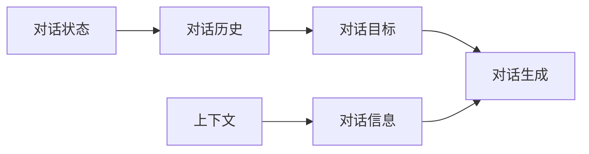

                 

# 多轮对话处理：提高AI Agent的交互质量

> 关键词：多轮对话处理、AI Agent、对话状态管理、上下文理解、对话生成模型、注意力机制、系统架构设计

> 摘要：多轮对话处理是提高AI Agent交互质量的关键技术，本文从核心概念、算法原理、系统架构设计等多个维度深入探讨多轮对话处理的实现细节，结合实际案例分析，为AI开发者提供实用的技术指导。

---

# 第一部分: 多轮对话处理的概述

## 第1章: 多轮对话的定义与背景

### 1.1 多轮对话的定义
多轮对话是指用户与AI Agent之间通过多条消息交互，逐步完成任务或达到某种目标的对话方式。与单轮对话相比，多轮对话更符合人类自然交流的方式，能够处理复杂场景下的交互需求。

### 1.2 多轮对话的背景与重要性
随着AI技术的快速发展，AI Agent在客服、智能助手、教育等领域得到了广泛应用。然而，单轮对话的局限性逐渐显现，例如无法处理复杂问题和上下文依赖的任务。多轮对话能够更好地模拟人类对话，提升用户体验。

### 1.3 多轮对话与单轮对话的区别
- **单轮对话**：用户输入一条消息，AI Agent立即返回一条回复，无法维护对话上下文。
- **多轮对话**：用户和AI Agent之间可以进行多条消息的交互，系统需要维护对话历史和上下文信息。

### 1.4 多轮对话处理的目标
- 提高对话的连贯性和准确性
- 增强用户体验，使其更接近自然对话
- 支持复杂任务的处理，例如问题解答、任务规划等

---

# 第二部分: 多轮对话的核心概念与联系

## 第2章: 多轮对话的核心要素

### 2.1 对话状态管理
对话状态是多轮对话处理中的关键要素，用于记录当前对话的上下文信息。常见的对话状态表示方法包括基于词袋模型、序列模型和知识图谱的表示方法。

#### 2.1.1 对话状态的表示方法
- **词袋模型**：将对话历史中的关键词提取出来，形成一个无序的词袋。
- **序列模型**：使用序列模型（如LSTM）对对话历史进行编码，捕捉时序信息。
- **知识图谱**：结合领域知识图谱，对对话历史进行语义表示。

#### 2.1.2 对话历史的作用
对话历史是对话状态管理的重要组成部分，它帮助系统理解当前对话的上下文信息，从而生成更准确的回复。

#### 2.1.3 对话目标的设定
对话目标是指用户希望通过对话实现的目标，例如查询天气、预订机票等。明确的对话目标有助于系统更好地规划对话流程。

### 2.2 上下文理解
上下文理解是多轮对话处理中的另一个关键要素，它涉及对当前对话内容和背景知识的理解。

#### 2.2.1 上下文信息的提取
- **文本挖掘**：从对话历史中提取关键词、实体和关系。
- **语义分析**：利用自然语言处理技术理解对话的语义信息。

#### 2.2.2 上下文关联性分析
通过对对话历史的分析，确定当前对话内容与之前内容的关联性，从而指导系统的回复策略。

#### 2.2.3 上下文记忆机制
上下文记忆机制是指系统如何存储和更新对话历史信息，常见的实现方法包括使用记忆网络和图结构表示。

### 2.3 对话策略
对话策略是指导系统如何生成回复的核心规则或模型。

#### 2.3.1 对话策略的分类
- **基于规则的策略**：根据预定义的规则生成回复。
- **基于模型的策略**：利用机器学习模型生成回复，例如基于强化学习的策略。

#### 2.3.2 基于规则的对话策略
基于规则的策略通常适用于简单场景，例如预定义的对话树结构。这种方法的优点是实现简单，但灵活性较低。

#### 2.3.3 基于模型的对话策略
基于模型的策略利用机器学习模型（如深度学习模型）生成回复。这种方法能够处理复杂的对话场景，但需要大量的训练数据和计算资源。

### 2.4 对话生成
对话生成是多轮对话处理的最终目标，生成符合上下文和对话目标的回复。

#### 2.4.1 对话生成的挑战
- 上下文依赖性：回复需要与对话历史保持一致。
- 多义性：用户输入可能存在多种解释，系统需要准确理解意图。
- 个性化：根据用户的背景和偏好生成个性化的回复。

#### 2.4.2 基于模板的对话生成
基于模板的生成方法适用于简单场景，通过预定义的模板生成回复。这种方法实现简单，但灵活性较低。

#### 2.4.3 基于模型的对话生成
基于模型的生成方法利用自然语言生成模型（如GPT、Transformer）生成回复。这种方法能够处理复杂的对话场景，但需要大量的训练数据和计算资源。

### 2.5 核心概念对比表
| 概念 | 特性 |
|------|------|
| 对话状态 | 表示当前对话的上下文信息 |
| 上下文 | 包括对话历史和背景知识 |
| 对话策略 | 指导系统生成回复的规则或模型 |
| 对话生成 | 根据上下文生成回复的过程 |

### 2.6 ER实体关系图

---

# 第三部分: 多轮对话处理的算法原理

## 第3章: 多轮对话处理的算法原理

### 3.1 注意力机制在对话中的应用
注意力机制是一种用于处理序列数据的方法，广泛应用于自然语言处理领域。

#### 3.1.1 注意力机制的基本原理
注意力机制通过计算输入序列中每个位置的权重，生成一个加权后的表示。公式如下：
$$\text{Attention}(Q, K, V) = \text{softmax}(\frac{QK^T}{\sqrt{d_k}})V$$
其中，$Q$是查询向量，$K$是键向量，$V$是值向量。

#### 3.1.2 注意力机制在对话中的应用
在对话生成中，注意力机制可以帮助模型关注对话历史中的重要部分，从而生成更准确的回复。

#### 3.1.3 注意力机制的变体
- **自注意力机制**：用于处理同一序列内部的依赖关系。
- **交叉注意力机制**：用于处理不同序列之间的依赖关系。

### 3.2 对话生成模型
对话生成模型是多轮对话处理的核心算法，常用的模型包括Transformer和GPT。

#### 3.2.1 Transformer模型
Transformer是一种基于注意力机制的模型，由编码器和解码器组成。编码器用于处理输入序列，解码器用于生成输出序列。

#### 3.2.2 GPT模型
GPT（Generative Pre-trained Transformer）是一种基于自回归的生成模型，通过预训练的方式生成自然语言文本。

#### 3.2.3 对话生成模型的实现
对话生成模型通常采用预训练的模型，并在特定领域数据上进行微调。例如，使用GPT模型进行对话生成时，可以通过条件生成的方式，根据对话历史生成回复。

### 3.3 对话生成的数学模型
对话生成模型的数学模型如下：
$$P(y|x) = \prod_{i=1}^n P(y_i|x_{<i}, y_{<i})$$
其中，$x$是对话历史，$y$是生成的回复，$y_i$是回复中的第$i$个词。

---

# 第四部分: 多轮对话处理的系统架构设计

## 第4章: 多轮对话处理的系统架构设计

### 4.1 系统功能设计
多轮对话处理系统的功能包括对话状态管理、上下文理解、对话策略生成和对话生成。

#### 4.1.1 对话状态管理模块
对话状态管理模块负责维护对话历史和上下文信息。

#### 4.1.2 上下文理解模块
上下文理解模块负责对对话历史进行语义分析，提取关键信息。

#### 4.1.3 对话策略生成模块
对话策略生成模块根据上下文信息生成回复策略。

#### 4.1.4 对话生成模块
对话生成模块根据对话策略生成回复。

### 4.2 系统架构设计
多轮对话处理系统的架构通常包括前端和后端两部分。前端负责与用户交互，后端负责处理对话逻辑。

#### 4.2.1 前端设计
前端包括用户界面和对话接口，用于接收用户输入并显示系统回复。

#### 4.2.2 后端设计
后端包括对话状态管理、上下文理解、对话策略生成和对话生成模块。

### 4.3 系统接口设计
系统接口设计包括用户接口和系统内部接口。用户接口用于与用户交互，系统内部接口用于模块之间的通信。

### 4.4 系统交互设计
系统交互设计包括对话流程和交互逻辑。对话流程描述了从用户输入到系统回复的整个过程，交互逻辑描述了系统如何根据对话历史生成回复。

---

# 第五部分: 多轮对话处理的项目实战

## 第5章: 多轮对话处理的项目实战

### 5.1 项目介绍
本项目旨在构建一个多轮对话系统，能够与用户进行自然对话。

#### 5.1.1 项目环境安装
需要安装Python、TensorFlow、Keras等工具。

#### 5.1.2 核心代码实现
对话状态管理、上下文理解、对话策略生成和对话生成模块的实现代码。

#### 5.1.3 代码解读与分析
对实现代码进行详细解读，分析每个模块的功能和实现细节。

#### 5.1.4 实际案例分析
通过实际案例分析，展示系统的对话流程和交互效果。

### 5.2 项目小结
本项目通过实际案例展示了多轮对话处理技术的应用，为后续研究提供了参考。

---

# 第六部分: 最佳实践与小结

## 第6章: 最佳实践与小结

### 6.1 最佳实践
- 数据质量：高质量的数据是多轮对话处理的基础。
- 模型选择：根据具体需求选择合适的模型和算法。
- 系统优化：优化对话流程和系统性能，提升用户体验。

### 6.2 小结
本文从多轮对话处理的核心概念、算法原理、系统架构设计和项目实战等多个维度进行了详细探讨，为AI开发者提供了实用的技术指导。

---

# 作者：AI天才研究院/AI Genius Institute & 禅与计算机程序设计艺术 /Zen And The Art of Computer Programming

