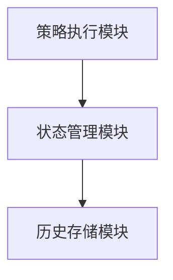
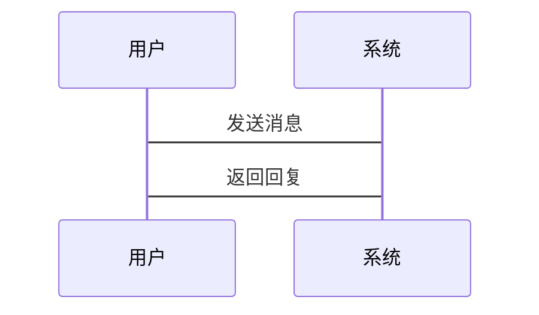

                 


# 多轮对话管理：提升AI Agent的交互体验

> 关键词：多轮对话管理，AI Agent，交互体验，对话状态，上下文理解，对话策略，系统架构

> 摘要：本文详细探讨了多轮对话管理的核心原理、算法实现、系统架构设计及项目实战，旨在提升AI Agent的交互体验。通过分析对话状态管理、对话历史与上下文的关系、对话策略的优化等关键问题，结合实际案例和代码示例，帮助读者全面理解和掌握多轮对话管理的技术要点。

---

# 第一部分: 多轮对话管理基础

## 第1章: 多轮对话管理概述

### 1.1 多轮对话管理的背景与问题背景

#### 1.1.1 多轮对话的定义与特点
多轮对话是指在人与AI Agent之间的交互过程中，用户通过多条消息与系统进行交流，系统根据用户的输入生成相应的回复，逐步完成任务的过程。与单轮对话相比，多轮对话具有以下特点：
- **连续性**：对话过程跨越多条消息，用户和系统之间的信息交互是连续的。
- **上下文依赖**：每条消息的理解依赖于前文的上下文信息。
- **任务导向**：对话的目标是完成特定任务，如预订机票、购物推荐等。

#### 1.1.2 多轮对话管理的核心问题
在实现多轮对话管理时，主要面临以下核心问题：
- **对话状态管理**：如何准确表示和更新对话中的当前状态。
- **对话历史与上下文的理解**：如何有效利用历史信息和上下文信息，提高对话的准确性和连贯性。
- **对话策略的优化**：如何制定和执行有效的对话策略，以实现对话目标。

#### 1.1.3 多轮对话管理的边界与外延
多轮对话管理的边界主要集中在对话过程中的信息处理和状态管理，不涉及具体任务的执行逻辑。其外延则包括与对话相关的技术，如自然语言处理（NLP）、对话生成模型等。

### 1.2 多轮对话管理的核心概念与联系

#### 1.2.1 对话状态管理的原理
对话状态管理是多轮对话管理的核心部分，主要包括以下步骤：
1. **状态表示**：将对话中的信息转化为某种形式的表示，如状态向量或关键词集合。
2. **状态更新**：根据用户的输入更新当前对话状态。
3. **状态预测**：基于当前状态和历史信息，预测下一步的对话状态。

#### 1.2.2 对话历史与上下文的关系
对话历史是指对话过程中所有已发生的交互信息，而上下文是当前对话中相关的重要信息片段。两者的关系如下：
- **对话历史**：存储所有过去的对话信息，用于长期记忆。
- **上下文**：提取对话历史中的关键信息，用于当前对话的理解和生成。

#### 1.2.3 对话策略与目标的关联
对话策略是指系统在对话过程中采取的行动规则，其目标是实现对话的最终目的。两者的关系如下：
- **对话策略**：决定系统如何响应用户输入。
- **对话目标**：对话策略的最终导向，如完成任务或提供信息。

#### 1.2.4 核心概念属性特征对比表格
| 概念       | 属性特征                   |
|------------|---------------------------|
| 对话状态     | 当前对话的语义信息         |
| 对话历史     | 所有历史交互记录           |
| 上下文       | 当前对话的相关信息片段       |
| 对话策略     | 为实现目标而采取的行动规则   |

---

## 第2章: 多轮对话管理的核心原理

### 2.1 对话状态管理的算法原理

#### 2.1.1 对话状态表示方法
对话状态的表示方法多种多样，常见的包括：
- **关键词表示法**：提取对话中的关键词作为状态表示。
- **向量表示法**：将对话内容转化为向量形式，如词嵌入。
- **规则表示法**：基于预定义的规则生成状态表示。

#### 2.1.2 基于规则的状态更新机制
基于规则的状态更新机制是一种简单有效的状态管理方法，适用于规则明确的场景。例如：
- 当用户输入“取消订单”，系统更新状态为“取消订单状态”。

#### 2.1.3 基于模型的状态预测流程
基于模型的状态预测流程通常采用机器学习或深度学习模型。例如：
1. 输入对话历史和当前输入。
2. 通过模型预测下一步的状态。
3. 更新当前状态。

### 2.2 对话历史与上下文的关联

#### 2.2.1 对话历史的存储与检索
对话历史的存储可以采用数据库或缓存技术，检索时根据对话ID或时间戳进行查询。

#### 2.2.2 上下文信息的提取与应用
上下文信息的提取通常采用NLP技术，如实体识别和语义理解。例如：
- 从用户输入中提取“日期”和“地点”作为上下文信息。

#### 2.2.3 对话历史与当前对话的关系
对话历史为当前对话提供了背景信息，帮助系统更好地理解用户的意图。

### 2.3 对话策略与目标的实现

#### 2.3.1 对话目标的设定与优化
对话目标的设定需要明确任务的具体要求，例如：
- 在客服对话中，目标是解决问题。
- 在购物场景中，目标是完成订单。

#### 2.3.2 对话策略的选择与执行
对话策略的选择基于当前状态和历史信息，例如：
- 根据当前状态选择合适的回复模板。

#### 2.3.3 对话结果的评估与反馈
对话结果的评估通常基于用户满意度和任务完成度。反馈信息用于优化对话策略。

---

## 第3章: 多轮对话管理的算法实现

### 3.1 对话状态管理的算法流程

#### 3.1.1 状态表示的数学模型
对话状态可以表示为一个向量，例如：
$$
S = [s_1, s_2, ..., s_n]
$$

#### 3.1.2 状态更新的数学公式
状态更新公式可以表示为：
$$
S_{new} = f(S_{old}, input)
$$

#### 3.1.3 状态预测的算法流程
状态预测流程如下：
1. 输入当前状态和历史信息。
2. 通过模型预测下一步状态。
3. 更新当前状态。

### 3.2 对话历史与上下文的关联算法

#### 3.2.1 对话历史的特征提取
对话历史的特征提取可以采用词袋模型或TF-IDF方法。

#### 3.2.2 上下文信息的关联计算
上下文信息的关联计算可以采用余弦相似度。

#### 3.2.3 对话历史与上下文的融合方法
融合方法可以采用加权平均或注意力机制。

### 3.3 对话策略的优化算法

#### 3.3.1 对话目标的数学表达
对话目标可以用一个优化目标函数表示：
$$
\text{minimize } L = \text{loss}(output, target)
$$

#### 3.3.2 对话策略的选择模型
对话策略的选择模型可以采用马尔可夫决策过程。

#### 3.3.3 对话结果的评估指标
常用的评估指标包括准确率、召回率和F1值。

---

## 第4章: 多轮对话管理的系统架构设计

### 4.1 系统功能设计

#### 4.1.1 对话状态管理模块
对话状态管理模块负责维护对话状态和历史信息。

#### 4.1.2 对话历史存储模块
对话历史存储模块负责存储和检索对话记录。

#### 4.1.3 对话策略执行模块
对话策略执行模块负责根据当前状态选择合适的回复策略。

### 4.2 系统架构设计

#### 4.2.1 系统模块划分
系统模块包括状态管理模块、历史存储模块和策略执行模块。

#### 4.2.2 模块间的交互关系
模块间的交互关系如下：
- 状态管理模块与历史存储模块交互。
- 策略执行模块与状态管理模块交互。

#### 4.2.3 系统架构的Mermaid图


### 4.3 接口设计与交互流程

#### 4.3.1 系统接口定义
系统接口包括：
- 获取对话状态接口。
- 更新对话状态接口。
- 获取历史信息接口。

#### 4.3.2 对话流程的Mermaid序列图


---

## 第5章: 多轮对话管理的实战

### 5.1 环境安装

#### 5.1.1 安装Python
安装Python 3.8及以上版本。

#### 5.1.2 安装依赖库
安装必要的库，如numpy、pandas、scikit-learn。

### 5.2 系统核心实现

#### 5.2.1 对话状态管理的代码实现
```python
class DialogStateManager:
    def __init__(self):
        self.state = {}
    
    def update_state(self, key, value):
        self.state[key] = value
    
    def get_state(self, key):
        return self.state.get(key, None)
```

#### 5.2.2 对话历史存储的代码实现
```python
import sqlite3

class DialogHistoryStorage:
    def __init__(self, db_path):
        self.conn = sqlite3.connect(db_path)
        self.conn.execute('''CREATE TABLE IF NOT EXISTS dialog_history
                          (id INTEGER PRIMARY KEY AUTOINCREMENT,
                           content TEXT,
                           timestamp DATETIME);''')
    
    def save_history(self, content):
        self.conn.execute("INSERT INTO dialog_history (content, timestamp) VALUES (?, ?)",
                          (content, datetime.now()))
        self.conn.commit()
```

### 5.3 案例分析与代码解读

#### 5.3.1 案例分析
以一个简单的客服对话为例，分析对话状态的更新和策略的执行。

#### 5.3.2 代码实现细节
详细解读上述代码的实现细节，包括类的定义和方法的实现。

### 5.4 项目小结

#### 5.4.1 实战总结
总结项目实现的关键点和经验教训。

#### 5.4.2 实战意义
说明实战项目对提升AI Agent交互体验的重要意义。

---

## 第6章: 多轮对话管理的最佳实践

### 6.1 小结与总结

#### 6.1.1 多轮对话管理的核心要点
总结多轮对话管理的关键技术点。

#### 6.1.2 项目实现的关键经验
分享项目实施中的关键经验。

### 6.2 注意事项与优化建议

#### 6.2.1 代码实现中的注意事项
注意事项包括代码的可维护性和性能优化。

#### 6.2.2 系统设计中的优化建议
优化建议包括模块的解耦和高效的接口设计。

### 6.3 拓展阅读与进阶学习

#### 6.3.1 相关技术领域
建议读者进一步学习自然语言处理和对话生成模型。

#### 6.3.2 未来研究方向
探讨多轮对话管理的未来研究方向，如多模态对话和自适应对话策略。

---

# 第七章: 总结

## 7.1 作者介绍
作者：AI天才研究院/AI Genius Institute & 禅与计算机程序设计艺术 /Zen And The Art of Computer Programming

---

以上是《多轮对话管理：提升AI Agent的交互体验》的技术博客文章的完整内容，涵盖了从基础概念到系统实现的各个方面，结合了理论分析和实践案例，旨在帮助读者全面理解和掌握多轮对话管理的技术要点。

