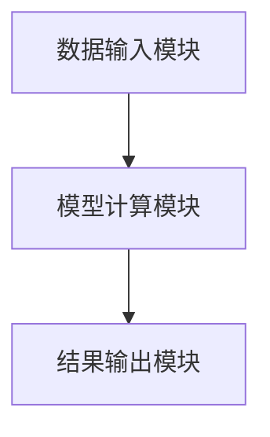

                 


# 大卫·德雷曼的反向定价：从目标价格倒推投资决策

> 关键词：反向定价、投资决策、目标价格、定价模型、大卫·德雷曼

> 摘要：本文详细介绍了大卫·德雷曼的反向定价方法，从目标价格倒推投资决策，探讨其理论基础、数学模型、算法实现及实际应用，提供系统设计和案例分析，最后总结最佳实践和未来方向。

---

## 第一部分: 反向定价的核心概念

### 第1章: 传统定价方法的局限性

#### 1.1.1 传统定价方法的局限性
传统的定价方法通常基于成本加成定价或需求导向定价。成本加成定价法以产品成本为基础，加上一定的利润率，但忽视了市场实际需求和竞争状况。需求导向定价法虽然考虑了需求弹性，但在复杂市场环境下难以实时调整。

#### 1.1.2 反向定价的定义与特点
反向定价是一种从目标价格出发，倒推出投资决策的方法。其特点在于从目标价格出发，考虑投资回报和市场因素，优化定价策略。德雷曼的反向定价强调从目标价格到投资决策的逆向思维。

---

## 第二部分: 反向定价的理论基础

### 第2章: 德雷曼的定价模型

#### 2.1.1 定价模型的构成要素
德雷曼的定价模型包括目标价格、投资成本、预期收益等要素。目标价格是模型的核心，决定了投资决策的方向。

#### 2.1.2 目标价格与投资决策的关系
目标价格与投资决策是相辅相成的。目标价格是投资决策的结果，而投资决策又受到目标价格的约束。

#### 2.1.3 德雷曼定价模型的数学表达式
德雷曼的定价模型可以表示为：
$$ P = C + R $$
其中，P为目标价格，C为投资成本，R为预期收益。

---

## 第三部分: 反向定价的算法实现

### 第3章: 反向定价算法的步骤

#### 3.1.1 确定目标价格
目标价格的确定基于市场调研和投资目标。例如，目标价格P设为100元。

#### 3.1.2 评估投资回报
通过计算投资成本C和预期收益R，确保$P = C + R$成立。

#### 3.1.3 调整定价策略
根据市场反馈，动态调整目标价格和投资决策。

### 第3章: 算法实现的Python代码

```python
def reverse_pricing(P):
    C = P - R
    return C

# 示例：P = 100，R = 20
P = 100
R = 20
C = reverse_pricing(P)
print(f"投资成本为：{C}")
```

---

## 第四部分: 反向定价的系统架构设计

### 第4章: 系统功能模块划分

#### 4.1.1 数据输入模块
负责接收目标价格和市场数据。

#### 4.1.2 模型计算模块
执行定价模型的计算，生成投资建议。

#### 4.1.3 结果输出模块
展示计算结果，输出投资决策报告。

### 第4章: 系统架构图



---

## 第五部分: 反向定价的案例分析

### 第5章: 案例背景介绍

#### 5.1.1 案例选择标准
选择一个典型行业，如科技公司，分析其定价策略。

#### 5.1.2 案例的具体情况
假设目标价格P=100，预期收益R=20，计算投资成本C=80。

### 第5章: 案例分析与解读

#### 5.2.1 应用反向定价的过程
计算投资成本，调整定价策略，确保达到目标价格。

#### 5.2.2 分析结果与策略调整
根据市场反馈，优化定价模型，动态调整目标价格。

---

## 第六部分: 反向定价的优化与扩展

### 第6章: 定价策略的优化方法

#### 6.1.1 动态调整目标价格
根据市场变化，实时更新目标价格和投资策略。

#### 6.1.2 结合市场反馈优化定价
利用实时数据，优化定价模型，提高投资回报。

### 第6章: 反向定价的未来

未来，反向定价将结合更多数据源和人工智能技术，进一步提升定价的准确性和效率。

---

## 总结

大卫·德雷曼的反向定价法通过从目标价格倒推投资决策，提供了一种创新的定价策略。结合数学模型、算法实现和系统设计，反向定价在实际应用中展现出强大的优势。未来，随着技术的进步，反向定价将更加智能化和个性化。

---

作者：AI天才研究院/AI Genius Institute & 禅与计算机程序设计艺术 /Zen And The Art of Computer Programming

