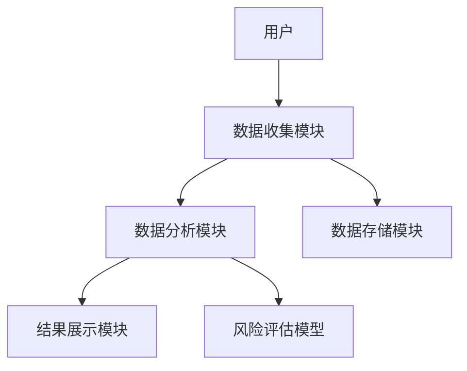
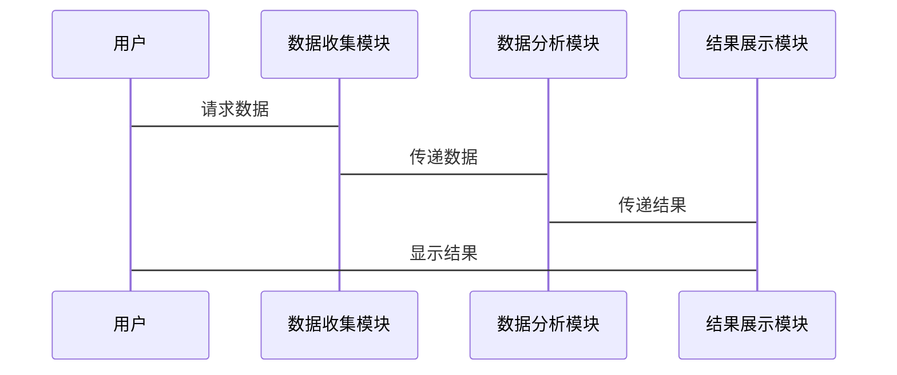

                 


# 《大卫·德雷曼的地缘政治因素投资分析》

---

## 关键词：
地缘政治投资分析、大卫·德雷曼、层次分析法、风险评估模型、地缘政治风险、投资策略优化

---

## 摘要：
地缘政治因素在投资分析中扮演着重要角色，尤其是在当前全球化和多极化的国际环境中。本文通过分析大卫·德雷曼的投资理念，探讨地缘政治因素如何影响市场波动、资产配置和投资决策。文章结合数学模型和算法，详细讲解了如何量化地缘政治风险，并通过实际案例展示了如何将这些理论应用于投资实战。本文旨在为投资者提供一套基于地缘政治因素的投资分析框架，帮助他们在复杂多变的国际环境中做出更明智的投资决策。

---

## 正文：

### 第一部分：地缘政治因素与投资分析的背景介绍

#### 第1章：地缘政治因素的定义与背景

##### 1.1 地缘政治的定义与核心概念
地缘政治（Geopolitical）一词最早由英国地理学家哈里森·梅里特（Harrison Meritt）在1919年提出，指的是国家间因地理位置、资源分布、文化差异等因素而产生的政治、经济和军事关系。地缘政治的核心要素包括：
- **国家**：主权国家的地理位置、资源和影响力。
- **资源**：能源、矿产等战略资源的分布与控制。
- **地理位置**：地理位置对国家间竞争、合作和冲突的影响。

地缘政治与经济、军事的关系密不可分。例如，能源资源丰富的国家往往在国际政治中具有更大的话语权，而地理位置的战略性（如海峡、运河）则可能引发军事冲突或贸易争端。

##### 1.2 投资分析中的地缘政治因素
投资分析的核心在于识别风险和机会，而地缘政治因素是影响市场波动的重要变量。地缘政治风险包括战争、贸易摩擦、资源短缺等，这些因素可能对特定行业或整个市场的表现产生重大影响。

##### 1.3 大卫·德雷曼的投资理念
大卫·德雷曼（David Dreyfus）是一位著名投资者，他将地缘政治因素融入投资分析中。他的核心理念是：地缘政治事件往往会导致市场的非理性波动，而这些波动为投资者提供了套利机会。德雷曼的投资策略包括：
- 关注地缘政治热点地区的经济数据。
- 分析地缘政治事件对行业和公司的影响。
- 在市场恐慌时寻找低估资产。

---

### 第二部分：地缘政治因素的核心概念与分析框架

#### 第2章：地缘政治因素的多维度分析

##### 2.1 地缘政治因素的分类
地缘政治因素可以分为以下几类：
- **能源资源的地缘政治**：能源价格波动、供应链中断等。
- **贸易关系的地缘政治**：贸易关税、贸易协定的变化。
- **军事冲突的地缘政治**：战争、制裁等。

##### 2.2 地缘政治与经济指标的关系
地缘政治事件通常会影响经济指标，例如：
- **GDP与地缘政治风险**：地缘政治冲突可能导致GDP下降。
- **通货膨胀与地缘政治因素**：能源价格上涨可能推高通货膨胀。
- **利率与地缘政治的影响**：地缘政治不确定性可能导致央行调整利率政策。

##### 2.3 地缘政治风险的量化模型
地缘政治风险的量化需要构建数学模型。层次分析法（AHP）是一种常用的风险评估方法，其步骤如下：
1. 确定影响地缘政治风险的因素（如能源、贸易、军事）。
2. 构建比较矩阵，计算各因素的权重。
3. 根据权重计算综合风险评分。

---

### 第三部分：地缘政治因素的数学模型与算法

#### 第3章：地缘政治风险评估的数学模型

##### 3.1 层次分析法（AHP）的应用
层次分析法是一种定性与定量相结合的决策分析方法。以下是其在地缘政治风险评估中的应用：

步骤：
1. 确定目标：评估地缘政治风险。
2. 构建层次结构：目标层（地缘政治风险）、准则层（能源、贸易、军事）、方案层（国家或地区）。
3. 填写比较矩阵：比较各准则的重要性和方案的优劣。
4. 计算权重：使用AHP方法计算各准则和方案的权重。
5. 计算综合评分：根据权重计算综合风险评分。

公式：
- 比较矩阵：$A = [a_{ij}]$，其中$a_{ij}$表示准则$i$相对于准则$j$的重要性。
- 权重计算：使用最大特征值法或几何平均法计算权重。
- 综合评分：$Score_i = \sum_{j=1}^{n} w_j \cdot s_{ij}$，其中$w_j$是准则$j$的权重，$s_{ij}$是方案$i$在准则$j$上的评分。

##### 3.2 地缘政治风险的回归分析
回归分析是一种统计方法，用于研究变量之间的关系。以下是一个简单的线性回归模型：

$$ y = \beta_0 + \beta_1x_1 + \beta_2x_2 + \epsilon $$

其中：
- $y$：地缘政治风险评分。
- $x_1$：能源价格指数。
- $x_2$：贸易摩擦指数。
- $\beta_0$、$\beta_1$、$\beta_2$：回归系数。
- $\epsilon$：误差项。

##### 3.3 风险预测的机器学习方法
机器学习算法（如决策树、随机森林）可以用于地缘政治风险的预测。以下是一个简单的决策树模型：

1. 数据准备：收集地缘政治风险相关的数据（如GDP、通货膨胀率、战争概率）。
2. 模型训练：使用训练数据训练决策树。
3. 模型预测：输入新的数据，预测地缘政治风险。

---

### 第四部分：地缘政治因素的系统分析与架构设计

#### 第4章：系统分析与架构设计方案

##### 4.1 系统功能设计
- 数据收集模块：收集地缘政治相关的数据（如新闻、经济指标）。
- 数据分析模块：使用层次分析法、回归分析等方法进行风险评估。
- 结果展示模块：将风险评估结果可视化（如地图、图表）。

##### 4.2 系统架构设计
以下是系统架构的Mermaid图：



##### 4.3 系统接口设计
- 数据接口：与新闻网站、经济数据库对接。
- 用户接口：Web界面或API。

##### 4.4 系统交互设计
以下是系统交互的Mermaid图：



---

### 第五部分：地缘政治因素的项目实战

#### 第5章：项目实战与案例分析

##### 5.1 项目背景
以俄乌冲突为例，分析地缘政治事件对能源市场的影响。

##### 5.2 核心实现
以下是风险评估模型的Python代码示例：

```python
import numpy as np
import pandas as pd

# 数据准备
data = pd.DataFrame({
    'Energy_Price': [100, 90, 80, 70],
    'Trade_Friction': [5, 10, 15, 20]
})

# 层次分析法计算权重
# 假设权重为Energy_Price: 0.6，Trade_Friction: 0.4
weights = np.array([0.6, 0.4])

# 计算综合评分
data['Score'] = data['Energy_Price'] * weights[0] + data['Trade_Friction'] * weights[1]

print(data)
```

##### 5.3 案例分析
通过上述代码，可以计算出每个国家的地缘政治风险评分。例如，俄乌冲突可能导致能源价格上升，从而提高地缘政治风险评分。

---

### 第六部分：总结与展望

#### 第6章：总结与展望

##### 6.1 总结
地缘政治因素是投资分析中不可忽视的重要变量。通过层次分析法、回归分析等方法，可以量化地缘政治风险，并为投资决策提供依据。

##### 6.2 展望
未来，随着地缘政治事件的增多，投资者需要更加关注地缘政治因素。机器学习算法的应用将进一步提高风险预测的准确性。

---

## 作者：
AI天才研究院/AI Genius Institute  
禅与计算机程序设计艺术/Zen And The Art of Computer Programming

