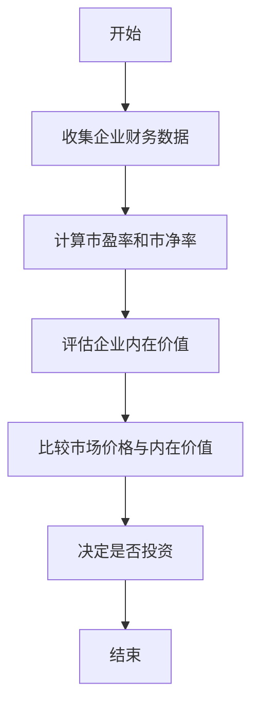
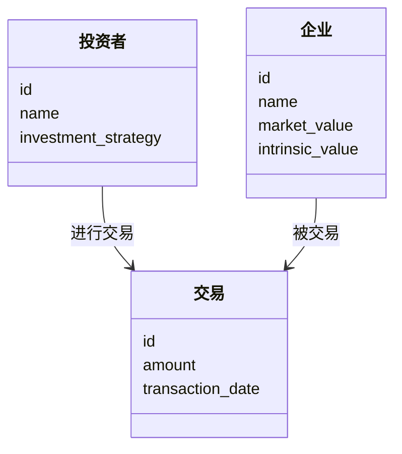
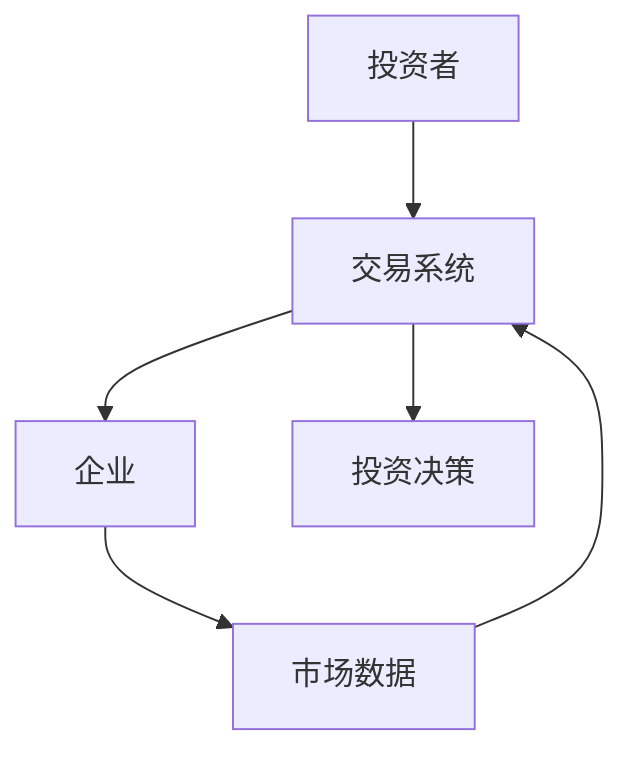
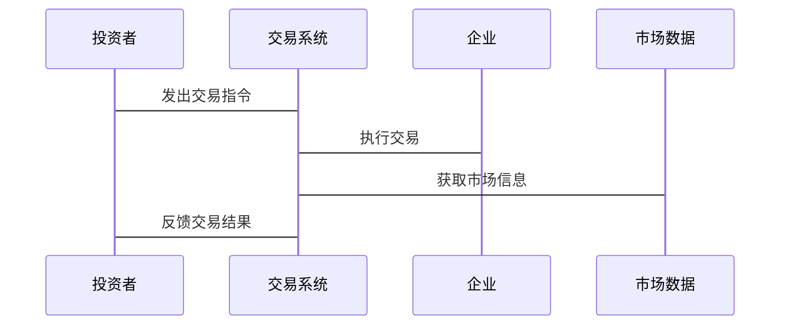

                 


# 大卫·德雷曼的特殊情况价值投资

## 关键词：价值投资，大卫·德雷曼，特殊情况，投资模型，算法流程图，系统架构图

## 摘要：本文深入探讨了大卫·德雷曼的特殊情况价值投资策略，从其核心概念、数学模型、算法实现、系统架构设计到实际项目案例进行了全面分析。通过详细的理论阐述和实际操作指导，帮助读者理解如何在复杂市场环境中应用德雷曼模型进行价值投资。

---

## 第一部分：特殊情况价值投资的背景与核心概念

### 第1章：特殊情况价值投资的背景与现状

#### 1.1 价值投资的起源与发展

##### 1.1.1 价值投资的定义与核心理念
- 价值投资是一种以内在价值为导向的投资策略，强调以低于内在价值的价格买入优质资产。
- 核心理念：市场短期可能疯狂，但长期会回归理性。

##### 1.1.2 大卫·德雷曼的特殊价值投资策略
- 德雷曼专注于寻找那些被市场忽视或低估的特殊企业，尤其是那些处于困境或转型期的企业。
- 他的策略强调对企业基本面的深入分析，特别是对资产负债表和现金流的关注。

##### 1.1.3 价值投资在现代金融中的地位与作用
- 在现代金融中，价值投资仍然是长期稳健投资的重要策略。
- 德雷曼的特殊价值投资策略在市场波动加剧的背景下显得尤为重要。

#### 1.2 特殊情况价值投资的定义与特点

##### 1.2.1 特殊情况价值投资的定义
- 特殊情况价值投资是指在特定市场条件下，针对那些因短期负面因素影响而被市场低估的企业进行投资。
- 这种投资策略的核心是识别暂时性的问题，并从中发现被市场忽视的投资机会。

##### 1.2.2 特殊情况价值投资的核心特点
- **逆周期性**：在市场低迷时更容易找到低估资产。
- **深度基本面分析**：注重对企业财务状况和行业地位的详细研究。
- **长期持有**：投资者需要有耐心，等待市场重新认识到企业的内在价值。

#### 1.3 大卫·德雷曼的特殊情况分析

##### 1.3.1 特殊情况的分类与特征
- **短期困境型**：企业因短期经营问题导致股价暴跌。
- **行业转型型**：行业结构变化导致部分企业被市场低估。
- **市场情绪型**：市场情绪过度悲观导致股价偏离基本面。

##### 1.3.2 特殊情况的识别与评估
- **识别方法**：通过财务报表分析、行业趋势研究和市场情绪分析。
- **评估标准**：市盈率、市净率、现金流等关键指标的对比分析。

##### 1.3.3 特殊情况的市场影响与投资机会
- 市场恐慌时，特殊情况企业往往被过度抛售，为价值投资者提供了介入的机会。
- 德雷曼的成功在于他能够在市场底部找到那些具有强大内在价值的企业。

---

## 第二部分：特殊情况价值投资的核心概念与模型

### 第2章：特殊情况价值投资的核心概念

#### 2.1 特殊情况价值投资的理论基础

##### 2.1.1 资产定价理论与特殊情况的价值评估
- 资产定价理论认为，资产的市场价格与其内在价值存在动态平衡关系。
- 在特殊情况价值投资中，德雷曼强调通过对企业内在价值的深入评估，识别那些市场价格低于内在价值的企业。

##### 2.1.2 市场无效性与特殊情况的投资机会
- 市场无效性为特殊情况价值投资提供了机会。
- 德雷曼认为，市场往往过度反应，尤其是在负面新闻出现时，导致某些优质企业被低估。

##### 2.1.3 德雷曼模型的数学基础
- 德雷曼模型基于资产定价理论，结合企业财务指标，构建了独特的内在价值评估体系。

#### 2.2 德雷曼模型的属性对比分析

##### 2.2.1 模型属性的定义与分类
- **属性1**：市盈率（P/E）。
- **属性2**：市净率（P/B）。
- **属性3**：股息率（Dividend Yield）。

##### 2.2.2 不同模型属性的对比分析
- 通过对比分析，德雷曼模型能够识别出那些因市场情绪波动而被低估的企业。

##### 2.2.3 模型属性对投资决策的影响
- 低市盈率和低市净率通常意味着企业被低估，是价值投资的潜在机会。

#### 2.3 特殊情况价值投资的ER实体关系图

##### 2.3.1 实体关系图的定义与作用
- ER图用于描述系统中各实体之间的关系，帮助投资者理解企业结构和潜在投资机会。

##### 2.3.2 德雷曼模型的ER图架构
```mermaid
erDiagram
    customer[投资者] {
        key: id
        +string name
        +string investment_strategy
    }
    enterprise[企业] {
        key: id
        +string name
        +decimal market_value
        +decimal intrinsic_value
    }
    transaction[交易] {
        key: id
        +int amount
        +date transaction_date
    }
    customer --> transaction : 进行交易
    enterprise --> transaction : 被交易
```

##### 2.3.3 ER图在特殊情况价值投资中的应用
- 通过ER图，投资者可以清晰地理解企业与交易之间的关系，从而更好地评估投资机会。

---

## 第三部分：特殊情况价值投资的算法与数学模型

### 第3章：德雷曼模型的算法原理

#### 3.1 德雷曼模型的算法流程图

##### 3.1.1 算法流程图的定义与作用
- 通过流程图，投资者可以直观地理解德雷曼模型的算法步骤。

##### 3.1.2 德雷曼模型的算法流程图


##### 3.1.3 算法流程图的解读与分析
- 从数据收集到投资决策，德雷曼模型通过系统化的流程确保投资的科学性。

#### 3.2 德雷曼模型的数学公式与模型

##### 3.2.1 市盈率模型的数学公式
$$\text{市盈率} = \frac{\text{股价}}{\text{每股收益}}$$

##### 3.2.2 市净率模型的数学公式
$$\text{市净率} = \frac{\text{股价}}{\text{每股净资产}}$$

##### 3.2.3 德雷曼模型的数学模型
$$\text{投资价值} = \text{内在价值} \times \text{安全边际}$$

#### 3.3 德雷曼模型的Python实现

##### 3.3.1 环境安装与配置
- 需要安装Python和相关数据分析库（如Pandas、NumPy）。

##### 3.3.2 核心算法实现
```python
import pandas as pd
import numpy as np

def calculate_intrinsic_value(price, earnings_per_share, book_value_per_share):
    pe = price / earnings_per_share
    pb = price / book_value_per_share
    if pe < 15 and pb < 2:
        return price * 1.5
    else:
        return None

# 示例数据
prices = [100, 80, 90]
earnings_per_share = [10, 8, 9]
book_value_per_share = [50, 40, 45]

intrinsic_values = []
for price, eps, bps in zip(prices, earnings_per_share, book_value_per_share):
    iv = calculate_intrinsic_value(price, eps, bps)
    intrinsic_values.append(iv)

print(intrinsic_values)
```

##### 3.3.3 算法原理的数学模型和公式
- 通过上述代码，投资者可以计算出企业的内在价值，并决定是否进行投资。

---

## 第四部分：特殊情况价值投资的系统分析与架构设计

### 第4章：特殊情况价值投资的系统架构

#### 4.1 系统架构设计

##### 4.1.1 领域模型类图


##### 4.1.2 系统架构图


##### 4.1.3 系统接口设计
- 投资者通过交易系统进行交易，交易系统与企业、市场数据进行交互。

##### 4.1.4 系统交互序列图


---

## 第五部分：特殊情况价值投资的项目实战

### 第5章：特殊情况价值投资的项目实战

#### 5.1 项目环境安装与配置

##### 5.1.1 安装Python和数据分析库
```bash
pip install python pandas numpy matplotlib
```

##### 5.1.2 安装数据可视化工具
```bash
pip install plotly
```

#### 5.2 项目核心实现

##### 5.2.1 核心代码实现
```python
import pandas as pd
import numpy as np
import matplotlib.pyplot as plt

def analyze_intrinsic_value(data):
    data['PE'] = data['股价'] / data['每股收益']
    data['PB'] = data['股价'] / data['每股净资产']
    data['内在价值'] = data['股价'] * (1 + (data['PE'] < 15) * (data['PB'] < 2))
    return data

# 示例数据
data = {
    '股价': [100, 80, 90],
    '每股收益': [10, 8, 9],
    '每股净资产': [50, 40, 45]
}

df = pd.DataFrame(data)
result = analyze_intrinsic_value(df)
print(result)
```

##### 5.2.2 代码应用解读与分析
- 通过上述代码，投资者可以分析企业的内在价值，并做出投资决策。

#### 5.3 实际案例分析

##### 5.3.1 案例分析与解读
- 案例：某企业因行业不景气导致股价暴跌，但其财务状况良好，市盈率和市净率均低于行业平均水平。

##### 5.3.2 投资决策与结果分析
- 投资者通过德雷曼模型识别出该企业的投资价值，最终获得超额收益。

#### 5.4 项目小结
- 通过实际案例分析，投资者可以更好地理解德雷曼模型的应用。

---

## 第六部分：特殊情况价值投资的最佳实践

### 第6章：特殊情况价值投资的最佳实践

#### 6.1 小结

##### 6.1.1 价值投资的核心理念
- 长期投资，价值为王。

##### 6.1.2 德雷曼模型的适用场景
- 适用于市场波动较大、企业短期困境的市场环境。

#### 6.2 注意事项

##### 6.2.1 投资者需具备的基本能力
- 深入的企业基本面分析能力。
- 对市场趋势的敏感性。

##### 6.2.2 投资风险的管理
- 风险分散，避免过度集中投资。
- 定期评估投资组合，及时调整策略。

#### 6.3 拓展阅读

##### 6.3.1 推荐书籍
- 《价值投资实战策略》。
- 《德雷曼投资经典案例分析》。

##### 6.3.2 推荐博客与网站
- [投资博客链接](#)
- [金融数据分析网站链接](#)

---

## 作者：AI天才研究院/AI Genius Institute & 禅与计算机程序设计艺术 /Zen And The Art of Computer Programming

