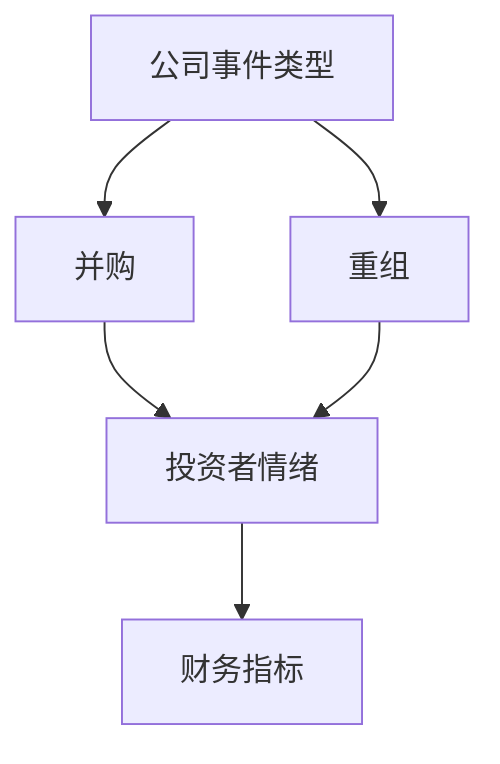

                 


# 大卫·德雷曼的特殊情况投资：从公司事件中获利

## 关键词：特殊情况投资，大卫·德雷曼，公司事件，市场反应，投资策略

## 摘要：本文详细探讨了大卫·德雷曼的特殊情况投资策略，重点分析了如何通过公司事件（如并购、重组等）获利。文章从公司事件的类型与影响、市场情绪与公司事件的关系、特殊情况投资的策略与方法等多方面展开，结合实际案例和数学模型，深入剖析了特殊情况投资的背景、核心概念与实现路径。

---

## 第一部分：特殊情况投资的背景与核心概念

### 第1章：特殊情况投资的定义与背景

#### 1.1 特殊情况投资的定义与特点

特殊情况投资是一种以公司特定事件为核心的投资策略，关注公司并购、重组、股权变动等事件对公司股价的影响。与传统投资策略不同，特殊情况投资更注重事件驱动和短期市场反应。

**特点：**
- **事件驱动**：依赖公司特定事件的市场反应。
- **短期获利**：通常在事件发生后短期内获利。
- **高风险高回报**：公司事件的不确定性带来高风险和高回报。

#### 1.2 特殊情况投资的背景

随着市场波动加剧，公司事件频发，投资者开始关注如何从这些事件中获利。大卫·德雷曼的研究为特殊情况投资提供了理论基础和实践方法。

**背景分析：**
- **并购潮**：近年来，公司并购活动频繁，为企业重组和价值提升提供了机会。
- **市场波动**：市场波动为投资者提供了短期套利机会。
- **信息不对称**：公司事件往往伴随着信息不对称，投资者需快速捕捉市场反应。

#### 1.3 特殊情况投资的核心要素

公司事件的类型、市场情绪和财务指标是特殊情况投资的核心要素。

**核心要素对比表：**

| 核心要素 | 属性 | 描述 |
|----------|------|------|
| 公司事件类型 | 并购 | 公司并购活动 |
|            | 重组 | 公司重组 |
| 市场情绪 | 投资者情绪 | 市场参与者情绪 |
| 财务指标 | 财务报表 | 公司财务数据 |

**Mermaid图表：**



---

### 第2章：公司事件的类型与影响

#### 2.1 公司并购与重组

**定义与类型：**
- **并购**：一家公司收购另一家公司。
- **重组**：公司内部结构调整，优化资源。

**影响：**
- **股价波动**：并购通常导致股价短期波动。
- **市场反应**：投资者情绪受并购影响。

**案例分析：**
- 某公司并购导致股价上涨，投资者获利。

#### 2.2 股权变动与管理层变动

**定义与类型：**
- **股权变动**：公司股权结构变化。
- **管理层变动**：公司高管变动。

**影响：**
- **投资者信心**：管理层变动可能影响投资者信心。
- **股价反应**：股权变动可能导致股价波动。

#### 2.3 重大财务事件

**定义与类型：**
- **财务造假**：公司财务数据虚假。
- **财务危机**：公司面临财务困境。

**影响：**
- **股价暴跌**：财务危机可能导致股价大幅下跌。
- **市场信任度下降**：财务造假会影响市场信任度。

---

### 第3章：市场情绪与公司事件的关系

#### 3.1 市场情绪的定义与测量

**定义：**
- 市场情绪：投资者对公司事件的反应程度。

**测量方法：**
- **情绪指标**：使用市场情绪指标（如VIX指数）测量市场情绪。

**市场情绪与股价波动的关系：**
- 市场情绪影响股价波动，公司事件进一步放大市场情绪。

#### 3.2 公司事件对市场情绪的影响

**影响机制：**
- 公司事件引发市场情绪波动。
- 市场情绪影响股价反应。

**案例分析：**
- 某公司并购引发市场情绪波动，导致股价上涨。

---

## 第二部分：特殊情况投资的策略与方法

### 第4章：特殊情况投资的策略

#### 4.1 事件驱动策略

**定义：**
- 事件驱动策略：基于公司事件进行投资。

**实现步骤：**
1. **识别公司事件**：发现公司并购、重组等事件。
2. **分析市场反应**：评估事件对股价的影响。
3. **制定投资策略**：根据分析结果制定投资策略。

**Python代码示例：**
```python
import pandas as pd
import numpy as np

# 示例数据：公司事件类型
events = pd.DataFrame({
    'Company': ['A', 'B', 'C'],
    'Event': ['Mergers', 'Acquisitions', 'Restructuring']
})

# 示例数据：股价数据
prices = pd.DataFrame({
    'Date': ['2023-01-01', '2023-01-02', '2023-01-03'],
    'Price': [100, 105, 110]
})

# 分析事件对公司股价的影响
merged_data = pd.merge(events, prices, on='Company')
print(merged_data)
```

**数学模型：**
$$ 股价变化率 = \frac{事件后的股价 - 事件前的股价}{事件前的股价} \times 100\% $$

---

### 第5章：特殊情况投资的风险管理

#### 5.1 风险管理策略

**核心思想：**
- 通过分散投资和风险对冲降低风险。

**风险管理方法：**
1. **分散投资**：投资不同类型的公司事件，降低风险。
2. **风险对冲**：利用衍生工具对冲市场风险。

**Python代码示例：**
```python
import numpy as np

# 示例数据：公司事件风险
risk_factors = np.array([0.8, 1.2, 1.0])

# 示例数据：投资组合
portfolio = np.array([100, 200, 300])

# 计算风险调整后的投资组合
adjusted_portfolio = portfolio * risk_factors
print(adjusted_portfolio)
```

---

## 第三部分：项目实战与案例分析

### 第6章：项目实战

#### 6.1 环境安装

**工具安装：**
- **Python**：安装Python和相关库（pandas, numpy）。

**代码实现：**
```python
import pandas as pd
import numpy as np

# 示例数据：公司事件类型
events = pd.DataFrame({
    'Company': ['A', 'B', 'C'],
    'Event': ['Mergers', 'Acquisitions', 'Restructuring']
})

# 示例数据：股价数据
prices = pd.DataFrame({
    'Date': ['2023-01-01', '2023-01-02', '2023-01-03'],
    'Price': [100, 105, 110]
})

# 数据合并与分析
merged_data = pd.merge(events, prices, on='Company')
print(merged_data)
```

---

## 第四部分：总结与展望

### 第7章：总结与展望

#### 7.1 小结

- 特殊情况投资通过公司事件获利。
- 事件驱动策略和风险管理是关键。

#### 7.2 注意事项

- 投资者需谨慎评估公司事件的市场反应。
- 风险管理是确保投资成功的重要因素。

#### 7.3 拓展阅读

- 推荐阅读大卫·德雷曼的《投资最重要的简单真理》。

---

## 作者

**作者：** AI天才研究院/AI Genius Institute & 禅与计算机程序设计艺术/Zen And The Art of Computer Programming

---

通过以上内容，我们深入探讨了大卫·德雷曼的特殊情况投资策略，结合实际案例和数学模型，剖析了如何从公司事件中获利。希望本文能为投资者提供有价值的见解和指导。

