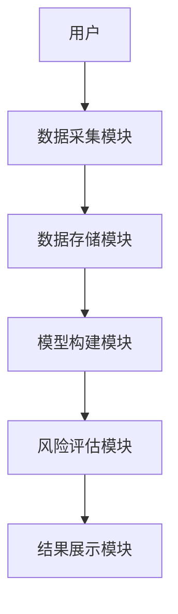

                 


# 《大卫·德雷曼的货币政策对投资的影响》

---

## 关键词：
货币政策、大卫·德雷曼、投资影响、行为金融学、资产定价、风险管理

---

## 摘要：
本文深入探讨了大卫·德雷曼的货币政策理论及其对投资行为和资产定价的影响。通过分析货币政策的传导机制、行为金融学的视角以及实际投资策略的应用，本文揭示了如何在复杂多变的经济环境中利用德雷曼的理论框架进行有效的投资决策。文章结合理论与实践，为投资者提供了实用的见解和策略建议。

---

## 第一部分：货币政策的基础与大卫·德雷曼的理论背景

### 第1章：货币政策的基本概念与作用

#### 1.1 货币政策的定义与目标

货币政策是中央银行通过调节货币供给量、利率和信贷政策来实现经济目标的一种工具。其主要目标包括：

- **价格稳定**：控制通货膨胀，保持货币购买力。
- **充分就业**：通过促进经济增长来降低失业率。
- **经济增长**：通过适宜的货币政策支持实体经济活动。
- **金融稳定**：维护金融市场秩序，防范系统性风险。

货币政策的核心工具包括 **公开市场操作**、**调整基准利率** 和 **存款准备金率**。

#### 1.2 货币政策的传导机制

货币政策通过多种渠道影响经济，主要包括：

- **利率渠道**：降低利率会刺激借贷和投资。
- **资产价格渠道**：货币政策影响资产价格，进而影响消费和投资。
- **信贷渠道**：银行信贷的扩张或收缩直接影响经济活动。

货币政策的传导机制复杂且存在不确定性，特别是当经济处于非正常状态（如金融危机）时，其效果可能大打折扣。

#### 1.3 大卫·德雷曼的学术背景与研究领域

大卫·德雷曼（David Dreman）是行为金融学领域的先驱，他的研究主要集中在投资者心理、市场行为和资产定价方面。德雷曼发现，投资者的行为往往偏离理性预期，导致市场定价出现偏差。他的研究为理解货币政策对投资的影响提供了新的视角。

---

## 第二部分：大卫·德雷曼的货币政策分析框架

### 第2章：德雷曼的货币政策分析理论

#### 2.1 德雷曼的货币政策理论体系

德雷曼认为，货币政策不仅影响经济基本面，还通过投资者心理影响市场情绪和资产价格。他的理论框架强调以下几点：

- **行为因素的重要性**：投资者的非理性行为会导致市场波动。
- **市场情绪的周期性**：市场情绪会随着经济周期波动，影响货币政策的效果。
- **资产定价的偏差**：投资者心理偏差会导致资产定价偏离 fundamentals。

德雷曼的理论与传统货币政策理论的对比如下：

| 对比维度       | 传统货币政策理论            | 德雷曼的货币政策理论            |
|----------------|-----------------------------|--------------------------------|
| 重点           | 经济基本面与价格稳定        | 投资者心理与市场情绪            |
| 工具           | 利率、货币供应量            | 行为矫正与市场情绪管理          |
| 目标           | 经济稳定                    | 市场稳定与投资收益最大化        |

#### 2.2 德雷曼对投资行为的影响分析

德雷曼的研究表明，投资者的心理偏差（如过度自信、从众心理）会影响其对货币政策的反应。例如：

- 在货币政策宽松周期，投资者可能过度乐观，导致资产价格泡沫。
- 在货币政策紧缩周期，投资者可能过于悲观，导致资产价格超跌。

德雷曼的投资策略强调：

1. **逆向思维**：在市场恐慌时寻找低估资产，在市场狂热时警惕风险。
2. **风险管理**：通过分散投资和对冲策略降低非系统性风险。

---

## 第三部分：货币政策对投资的具体影响分析

### 第3章：货币政策与资产价格波动

#### 3.1 货币政策对股票市场的影响

货币政策通过影响利率和市场情绪间接影响股市。例如：

- **低利率环境**：降低融资成本，刺激企业投资，股市上涨。
- **高利率环境**：增加企业融资成本，抑制投资，股市下跌。

德雷曼的研究发现，市场情绪在利率政策中的作用不容忽视。例如，当央行降息时，投资者可能过度乐观，导致股价短期上涨，但长期来看，基本面决定股价走势。

#### 3.2 货币政策对债券市场的影响

货币政策对债券市场的影响主要体现在利率变化上。当央行加息时，债券价格下跌，反之则上涨。德雷曼指出，债券市场的价格波动往往与市场情绪密切相关。

#### 3.3 货币政策对房地产市场的影响

房地产市场对货币政策的敏感性较高，主要体现在信贷政策和利率变化上。德雷曼的研究表明，房地产市场的周期性波动与货币政策密切相关，尤其是在信贷扩张周期，房地产泡沫容易形成。

---

### 第4章：货币政策的国际传导与投资策略

#### 4.1 全球化背景下的货币政策传导

在全球化背景下，货币政策的溢出效应和回流效应显著。例如，美联储的加息政策可能影响全球资本市场，尤其是新兴市场。

德雷曼认为，国际投资者应关注不同国家货币政策的差异及其对资产价格的影响。

#### 4.2 货币政策对国际投资的影响

国际投资者需要考虑汇率风险和政策风险。例如，当某国实施宽松货币政策时，本币可能贬值，导致国际投资者持有的该国资产贬值。

---

## 第四部分：货币政策对投资的实战应用

### 第5章：货币政策分析的系统架构

#### 5.1 系统功能设计

- **数据采集**：收集各国货币政策数据和市场数据。
- **模型构建**：建立货币政策与资产价格的关系模型。
- **风险评估**：评估不同货币政策对投资组合的影响。

#### 5.2 系统架构设计

以下是系统架构的 mermaid 图：



---

### 第6章：项目实战

#### 6.1 环境安装

需要安装 Python、Pandas、NumPy 和 Matplotlib 等工具。

#### 6.2 核心代码实现

以下是货币政策分析的核心代码：

```python
import pandas as pd
import numpy as np
import matplotlib.pyplot as plt

# 数据加载
data = pd.read_csv('market_data.csv')

# 计算货币政策对资产价格的影响
def policy_impact(data):
    # 假设 interest_rate 是货币政策变量
    interest_rate = data['interest_rate']
    stock_price = data['stock_price']
    # 计算相关性
    correlation = np.corrcoef(interest_rate, stock_price)[0, 1]
    return correlation

correlation = policy_impact(data)
print(f"货币政策与股票价格的相关性为：{correlation}")

# 可视化
plt.scatter(data['interest_rate'], data['stock_price'])
plt.xlabel('Interest Rate')
plt.ylabel('Stock Price')
plt.title('货币政策与股票价格关系')
plt.show()
```

---

## 第五部分：案例分析与总结

### 第7章：案例分析

#### 7.1 案例分析：2008年金融危机后的货币政策影响

2008年金融危机后，全球央行实施了大规模的量化宽松政策。德雷曼的研究表明，这些政策导致了市场的过度波动和资产泡沫。

---

## 第八部分：总结与展望

### 第8章：总结与展望

#### 8.1 总结

本文从理论和实践两个方面探讨了大卫·德雷曼的货币政策理论及其对投资的影响。通过分析货币政策的传导机制、行为金融学的视角以及实际投资策略的应用，本文为投资者提供了实用的见解和策略建议。

#### 8.2 展望

未来的研究可以进一步结合大数据和人工智能技术，深入分析货币政策对不同类型资产和市场的长期影响。

---

## 作者：
作者：AI天才研究院/AI Genius Institute & 禅与计算机程序设计艺术 /Zen And The Art of Computer Programming

