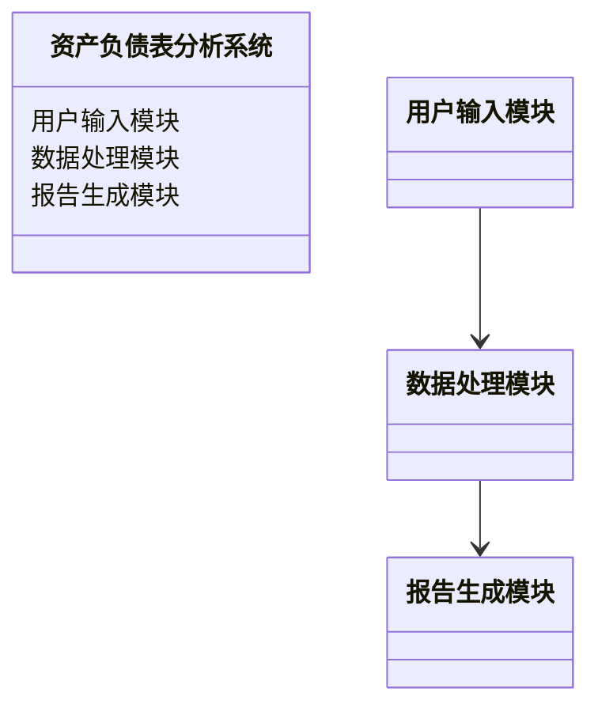
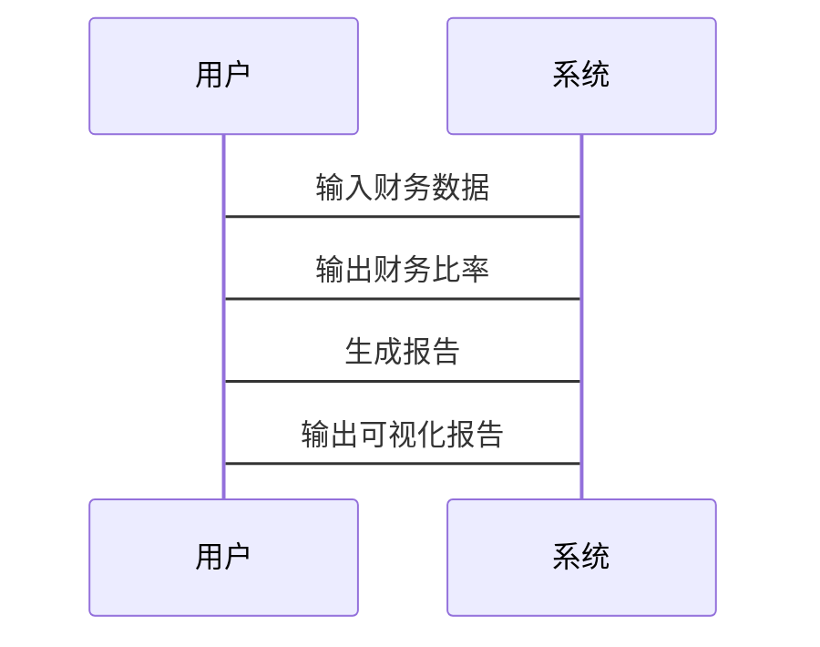

                 


# 大卫·德雷曼的资产负债表价值投资：深入分析财务状况

---

## 关键词：
大卫·德雷曼，资产负债表，价值投资，财务状况，财务指标，投资决策，风险管理

---

## 摘要：
本文深入探讨了大卫·德雷曼的资产负债表价值投资方法，分析了企业在财务报表中的表现，重点介绍了如何通过财务指标评估企业价值和风险。通过详细的分析和实例，本文帮助投资者掌握德雷曼的分析框架，并在实际投资中做出明智决策。

---

# 第一部分: 价值投资与资产负债表分析基础

## 第1章: 价值投资的起源与德雷曼方法

### 1.1 价值投资的起源
价值投资是一种长期投资策略，注重分析企业的内在价值，寻找被市场低估的投资机会。本文将介绍大卫·德雷曼的资产负债表分析方法，这种方法通过深入研究企业的财务报表，评估其财务健康状况和投资价值。

### 1.2 德雷曼的贡献与投资方法
大卫·德雷曼是价值投资领域的权威，他提出了通过资产负债表分析企业财务状况的方法。他的方法强调对企业资产、负债和所有者权益的深入分析，以识别潜在的投资机会和风险。

### 1.3 资产负债表分析的重要性
资产负债表是企业财务健康状况的核心报表，反映了企业在某一特定时期的资产、负债和所有者权益。通过分析资产负债表，投资者可以评估企业的偿债能力、财务杠杆和资本结构，从而做出更明智的投资决策。

---

# 第二部分: 资产负债表分析的核心概念与联系

## 第2章: 资产负债表的核心要素与联系

### 2.1 资产负债表的主要组成部分
资产负债表由资产、负债和所有者权益三部分组成，每一部分都反映了企业的不同财务方面。

#### 2.1.1 资产
资产是企业拥有的资源，包括流动资产和非流动资产。流动资产如现金、应收账款和存货，而非流动资产如固定资产和无形资产。

#### 2.1.2 负债
负债是企业欠他人的债务，包括流动负债和非流动负债。流动负债如应付账款和短期借款，而非流动负债如长期借款和债券。

#### 2.1.3 所有者权益
所有者权益是企业资产减去负债后的剩余部分，反映了股东对企业净资产的 claim。

### 2.2 资产负债表分析的关键指标
通过分析财务比率，投资者可以评估企业的财务健康状况和投资价值。

#### 2.2.1 流动比率与速动比率
流动比率（Current Ratio）= 流动资产 / 流动负债，衡量企业短期偿债能力。速动比率（Quick Ratio）= （流动资产 - 存货）/ 流动负债，进一步评估企业的流动性。

#### 2.2.2 负债率与资产负债率
负债率（Debt Ratio）= 负债总额 / 资产总额，衡量企业债务的总体水平。资产负债率（Debt-to-Equity Ratio）= 负债总额 / 所有者权益，评估企业的财务杠杆风险。

#### 2.2.3 存货周转率与应收账款周转率
存货周转率（Inventory Turnover）= 销售成本 / 平均存货，衡量存货管理效率。应收账款周转率（Accounts Receivable Turnover）= 销售收入 / 平均应收账款，评估企业收账效率。

### 2.3 资产负债表分析的对比表格
以下是几种关键财务比率的对比表格：

```markdown
| 指标名称     | 定义与计算公式                            | 重要性与用途                         |
|--------------|------------------------------------------|--------------------------------------|
| 流动比率     | 流动资产 / 流动负债                      | 衡量企业短期偿债能力                 |
| 速动比率     | （流动资产 - 存货） / 流动负债          | 更严格的流动性评估                   |
| 负债率       | 负债总额 / 资产总额                    | 评估企业总体债务水平                 |
| 资产负债率   | 负债总额 / 所有者权益                  | 衡量企业财务杠杆风险                 |
| 存货周转率   | 销售成本 / 平均存货                    | 评估存货管理效率                     |
| 应收账款周转率 | 销售收入 / 平均应收账款              | 评估企业收账效率                     |
```

### 2.4 本章小结
本章介绍了资产负债表的主要组成部分和关键财务指标，通过对比表格详细说明了各项指标的定义、计算方法和用途。这些指标是德雷曼分析方法的核心工具，帮助投资者评估企业的财务健康状况和投资价值。

---

# 第三部分: 算法与数学模型

## 第3章: 德雷曼分析方法的算法与数学模型

### 3.1 德雷曼分析方法概述
德雷曼的分析方法基于对企业财务报表的深入分析，特别是对资产负债表的详细解读。通过计算关键财务比率，评估企业的偿债能力、流动性和财务杠杆。

### 3.2 财务比率计算与风险评估模型
德雷曼提出了一种风险评估模型，通过综合分析企业的流动比率、速动比率、负债率和资产负债率，评估企业的财务风险和投资价值。

#### 3.2.1 算法步骤
1. 计算流动比率（Current Ratio）。
2. 计算速动比率（Quick Ratio）。
3. 计算负债率（Debt Ratio）。
4. 计算资产负债率（Debt-to-Equity Ratio）。
5. 综合分析各项指标，评估企业的财务风险和投资价值。

#### 3.2.2 风险评估模型
德雷曼的风险评估模型可以通过以下公式表示：

$$
\text{综合风险评分} = 0.3 \times \text{流动比率} + 0.3 \times \text{速动比率} + 0.2 \times \text{负债率} + 0.2 \times \text{资产负债率}
$$

---

### 3.3 算法实现与Python代码示例
以下是一个Python代码示例，用于计算企业的流动比率和速动比率：

```python
# 计算流动比率和速动比率
current_assets = 1000000  # 流动资产（美元）
current_liabilities = 500000   # 流动负债（美元）
inventory = 300000            # 存货（美元）

# 流动比率
current_ratio = current_assets / current_liabilities
print(f"流动比率：{current_ratio:.2f}")

# 速动比率
quick_assets = current_assets - inventory
quick_ratio = quick_assets / current_liabilities
print(f"速动比率：{quick_ratio:.2f}")
```

### 3.4 本章小结
本章通过算法和数学模型，详细解释了德雷曼分析方法的计算步骤和实现方式。通过Python代码示例，读者可以直观地理解如何计算关键财务比率，并评估企业的财务健康状况。

---

# 第四部分: 系统分析与架构设计

## 第4章: 资产负债表分析系统的架构与设计

### 4.1 系统功能设计
资产负债表分析系统旨在帮助投资者快速计算和评估企业的财务比率。系统功能包括：

1. 用户输入企业财务数据。
2. 自动计算各项财务比率。
3. 生成可视化报告，评估企业的财务健康状况。

#### 4.1.1 领域模型设计
以下是一个领域模型图，展示了系统的功能模块：



### 4.2 系统架构设计
系统的架构设计采用模块化结构，包括数据输入、处理和输出模块。

#### 4.2.1 系统架构图
```mermaid
container 资产负债表分析系统 {
    component 用户输入模块 {
        输入财务数据
    }
    component 数据处理模块 {
        计算财务比率
    }
    component 报告生成模块 {
        生成可视化报告
    }
}
```

### 4.3 系统接口设计
系统通过命令行或图形界面接收输入数据，并输出计算结果和可视化报告。

#### 4.3.1 系统接口设计


### 4.4 本章小结
本章详细设计了资产负债表分析系统的架构和接口，通过模块化设计和可视化报告生成，帮助投资者更高效地进行财务分析。

---

# 第五部分: 项目实战与最佳实践

## 第5章: 项目实战与最佳实践

### 5.1 项目实战: 使用德雷曼方法分析某企业财务状况

#### 5.1.1 实战环境安装
读者需要安装以下工具：
1. Python编程语言。
2. 数据分析库：Pandas、NumPy。
3. 可视化库：Matplotlib、Seaborn。

#### 5.1.2 核心代码实现
以下是一个Python代码示例，用于分析企业的财务状况：

```python
import pandas as pd
import numpy as np
import matplotlib.pyplot as plt

# 输入财务数据
data = {
    '流动资产': [1000000],
    '流动负债': [500000],
    '存货': [300000],
    '负债总额': [800000],
    '所有者权益': [600000]
}

df = pd.DataFrame(data)

# 计算流动比率
current_ratio = df['流动资产'] / df['流动负债']
print(f"流动比率：{current_ratio.values[0]:.2f}")

# 计算速动比率
quick_assets = df['流动资产'] - df['存货']
quick_ratio = quick_assets / df['流动负债']
print(f"速动比率：{quick_ratio.values[0]:.2f}")

# 计算负债率
debt_ratio = df['负债总额'] / (df['流动资产'] + df['负债总额'] + df['所有者权益'])
print(f"负债率：{debt_ratio.values[0]:.2f}")

# 计算资产负债率
debt_to_equity = df['负债总额'] / df['所有者权益']
print(f"资产负债率：{debt_to_equity.values[0]:.2f}")

# 可视化报告
plt.figure(figsize=(10, 6))
plt.bar(['流动比率', '速动比率', '负债率', '资产负债率'], [current_ratio.values[0], quick_ratio.values[0], debt_ratio.values[0], debt_to_equity.values[0]])
plt.title('财务比率分析')
plt.ylabel('比率值')
plt.show()
```

#### 5.1.3 实战案例分析
通过上述代码，我们可以分析某企业的财务状况，计算其流动比率、速动比率、负债率和资产负债率，评估其财务健康状况和投资价值。

### 5.2 最佳实践 tips
1. 在进行财务分析时，结合企业的行业背景和市场环境，综合评估企业的投资价值。
2. 定期更新财务数据，及时发现企业的财务风险。
3. 使用可视化工具，直观展示财务比率的变化趋势。

### 5.3 本章小结
本章通过实战案例，详细讲解了如何使用德雷曼方法分析企业的财务状况，并提供了Python代码实现和可视化报告生成。读者可以通过实际操作，掌握德雷曼分析方法的应用技巧。

---

# 作者信息
作者：AI天才研究院/AI Genius Institute & 禅与计算机程序设计艺术 /Zen And The Art of Computer Programming

---

通过以上文章，读者可以系统地学习大卫·德雷曼的资产负债表价值投资方法，掌握如何通过财务报表分析企业的财务状况，并做出明智的投资决策。

