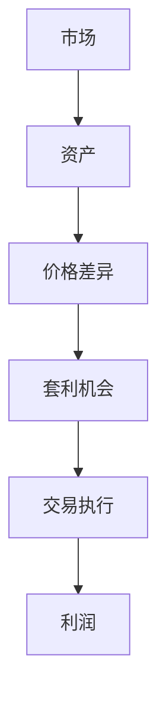
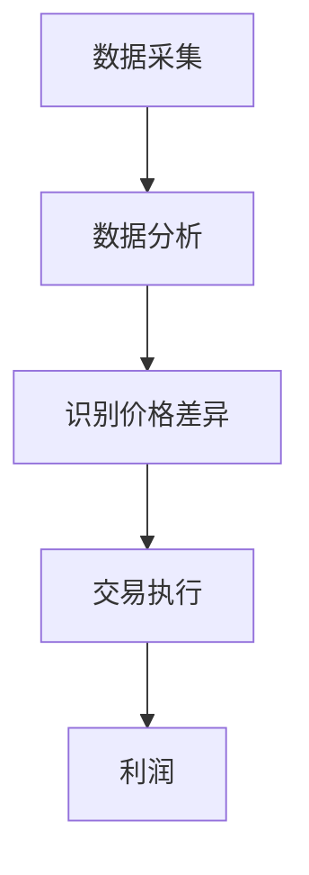
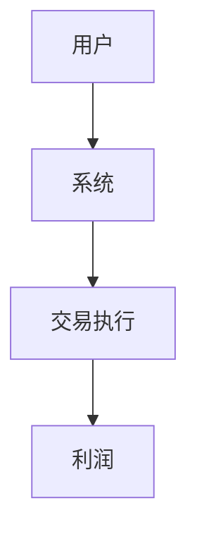

                 


# 大卫·德雷曼的资产负债表套利：利用会计差异创造价值

**关键词：** 资产负债表套利，会计差异，套利策略，数学模型，系统架构设计

**摘要：**  
本文深入探讨了大卫·德雷曼提出的资产负债表套利理论，重点分析了利用会计差异创造价值的核心原理与实践方法。通过详细讲解套利的数学模型、系统架构设计及实际案例，本文为读者提供了从理论到实践的全面指导。文章结构清晰，逻辑严谨，旨在帮助读者理解如何通过会计差异识别套利机会，并构建高效的套利系统。

---

# 第一部分：资产负债表套利的背景与核心概念

## 第1章：套利的基本概念与背景

### 1.1 套利的定义与分类

#### 1.1.1 套利的基本定义  
套利是指利用市场中某种资产或金融工具的价格差异，通过同时买入低价资产和卖出高价资产，从中获利的交易策略。套利的核心在于发现价格差异，并在市场中进行无风险或低风险的 arbitrage。  

#### 1.1.2 套利的分类与特点  
套利可以分为以下几类：  
1. **跨市场套利**：利用不同市场中同一资产的价格差异进行套利。  
2. **跨期套利**：利用同一资产在不同时间点的价格差异进行套利。  
3. **跨资产套利**：利用不同资产之间的价格差异进行套利。  

套利的特点包括：无风险性、低交易成本、依赖于价格差异的存在。

#### 1.1.3 资产负债表套利的特殊性  
资产负债表套利是一种特殊的套利形式，主要关注企业资产负债表中的会计差异。通过分析不同会计准则下的财务报表差异，套利者可以发现价格差异并进行套利交易。

---

## 第2章：资产负债表套利的定义与核心要素

### 2.1 资产负债表套利的定义  
资产负债表套利是指通过分析不同会计准则或企业内部会计处理方式下的资产负债表差异，发现价格差异并进行套利交易的过程。

### 2.2 核心概念与联系

#### 2.2.1 核心概念原理  
资产负债表套利的核心在于发现会计差异。会计差异主要来源于以下两个方面：  
1. **会计准则差异**：不同国家或地区采用的会计准则不同，导致同一资产在不同会计准则下的价值差异。  
2. **会计处理方式差异**：同一企业在不同会计期间或不同会计科目下的处理方式不同，导致资产负债表中的价值差异。  

#### 2.2.2 核心概念属性特征对比表格  
以下是一个对比表格，展示了会计准则差异和会计处理方式差异的核心特征：  

| 属性             | 会计准则差异      | 会计处理方式差异     |
|------------------|-------------------|----------------------|
| **来源**         | 不同地区的会计准则 | 企业内部的会计政策   |
| **影响**         | 资产负债表项目价值差异 | 同一项目在不同期间的价值差异 |
| **套利机会**     | 跨市场套利         | 跨期套利             |

#### 2.2.3 ER实体关系图架构的 Mermaid 流程图  
以下是套利系统的核心架构图：  



---

## 第3章：套利的数学模型与算法原理

### 3.1 套利的数学模型

#### 3.1.1 套利定价定理  
套利定价定理（Arbitrage Pricing Theorem, APT）是套利理论的重要组成部分，其基本公式如下：  

$$ E(r_i) = r_f + \beta_i (E(r_m) - r_f) $$  

其中：  
- \( E(r_i) \) 是资产 \( i \) 的预期回报率。  
- \( r_f \) 是无风险利率。  
- \( \beta_i \) 是资产 \( i \) 的贝塔系数。  
- \( E(r_m) \) 是市场预期回报率。  

#### 3.1.2 套利的数学公式  
套利的数学公式可以表示为：  

$$ \text{利润} = \text{卖出价格} - \text{买入价格} $$  

当卖出价格大于买入价格时，套利者可以从中获利。

#### 3.1.3 套利的数学模型示例  
以下是一个简单的套利模型示例：  

1. **买入低价资产**：价格为 \( P_1 \)。  
2. **卖出高价资产**：价格为 \( P_2 \)。  
3. **利润**：\( P_2 - P_1 \)。  

---

### 3.2 套利算法的原理

#### 3.2.1 套利算法的基本原理  
套利算法的基本原理是通过算法发现市场中的价格差异，并自动执行交易以实现套利。算法的核心步骤包括：  
1. 数据采集：从多个市场中采集同一资产的价格数据。  
2. 数据分析：识别价格差异。  
3. 交易执行：根据价格差异自动执行买入和卖出交易。  

#### 3.2.2 套利算法的流程图  
以下是套利算法的流程图：  



#### 3.2.3 套利算法的实现代码  
以下是一个简单的套利算法实现代码：  

```python
import pandas as pd

# 数据采集
prices = pd.DataFrame({
    '资产A': [100, 101, 102],
    '资产B': [105, 104, 103]
})

# 数据分析
spread = prices['资产A'] - prices['资产B']

# 识别价格差异
spread_threshold = spread.mean() - spread.std()

# 交易执行
if spread > spread_threshold:
    print("买入资产B，卖出资产A")
```

---

# 第二部分：资产负债表套利的策略与实践

## 第4章：套利策略的制定与实施

### 4.1 套利策略的制定

#### 4.1.1 确定套利机会  
套利机会的确定主要基于以下步骤：  
1. 识别价格差异。  
2. 评估套利风险。  
3. 确定套利可行性。  

#### 4.1.2 评估套利风险  
套利风险主要来自市场波动、交易成本和政策风险。  

#### 4.1.3 制定套利计划  
套利计划应包括：交易策略、资金分配、风险控制和退出机制。

---

### 4.2 套利策略的实施

#### 4.2.1 数据采集与处理  
套利实施的第一步是数据采集，包括从多个市场中采集同一资产的价格数据。  

#### 4.2.2 模型构建与验证  
模型构建需要基于历史数据，验证模型的准确性和稳定性。  

#### 4.2.3 交易执行与监控  
交易执行需要自动化系统支持，实时监控交易执行情况。

---

## 第5章：利用会计差异的套利策略

### 5.1 会计差异的识别

#### 5.1.1 历史成本计价差异  
历史成本计价差异是由于不同会计准则下同一资产的历史成本不同导致的。  

#### 5.1.2 公允价值计量差异  
公允价值计量差异是由于不同市场中同一资产的公允价值不同导致的。  

#### 5.1.3 财务报表项目差异  
财务报表项目差异是由于不同会计准则下同一资产在财务报表中的列报位置不同导致的。  

---

### 5.2 利用会计差异的套利方法

#### 5.2.1 跨市场套利  
跨市场套利是指在不同市场中利用同一资产的价格差异进行套利。  

#### 5.2.2 跨期套利  
跨期套利是指在同一市场中利用同一资产在不同时间点的价格差异进行套利。  

#### 5.2.3 跨资产套利  
跨资产套利是指利用不同资产之间的价格差异进行套利。  

---

## 第6章：套利系统的架构与设计

### 6.1 套利系统的架构

#### 6.1.1 系统功能模块划分  
套利系统的功能模块包括：数据采集模块、数据分析模块、交易执行模块和风险控制模块。

#### 6.1.2 系统架构设计  
以下是套利系统的架构图：  


#### 6.1.3 系统交互设计  
以下是套利系统的交互图：  



---

## 第7章：套利项目的实战与分析

### 7.1 项目环境安装

#### 7.1.1 数据采集工具安装  
需要安装的数据采集工具包括：  
- Python的pandas库。  
- REST API接口。  

#### 7.1.2 数据分析工具安装  
需要安装的数据分析工具包括：  
- Python的numpy库。  
- 数据可视化工具。  

---

### 7.2 系统核心实现源代码

#### 7.2.1 数据采集代码  
```python
import pandas as pd

# 数据采集
prices = pd.read_csv('market_prices.csv')
```

#### 7.2.2 数据分析代码  
```python
import pandas as pd

# 数据分析
spread = prices['资产A'] - prices['资产B']
spread_threshold = spread.mean() - spread.std()

# 识别价格差异
if spread > spread_threshold:
    print("买入资产B，卖出资产A")
```

#### 7.2.3 交易执行代码  
```python
import pandas as pd

# 交易执行
order = pd.DataFrame({
    '资产': ['资产B', '资产A'],
    '数量': [1, -1]
})
```

---

## 第8章：套利的注意事项与拓展阅读

### 8.1 注意事项

#### 8.1.1 风险控制  
套利者需要注意市场风险、流动性风险和政策风险。  

#### 8.1.2 法律合规  
套利者需要遵守相关法律法规，避免违法违规行为。

---

## 第9章：总结与展望

### 9.1 小结  
本文详细介绍了资产负债表套利的理论与实践，包括套利的基本概念、数学模型、系统架构设计和实际案例分析。  

### 9.2 展望  
未来，随着技术的进步和市场的发展，资产负债表套利将更加智能化和自动化，套利者需要不断学习和创新，以应对市场的变化。

---

**作者：AI天才研究院/AI Genius Institute & 禅与计算机程序设计艺术 /Zen And The Art of Computer Programming**

